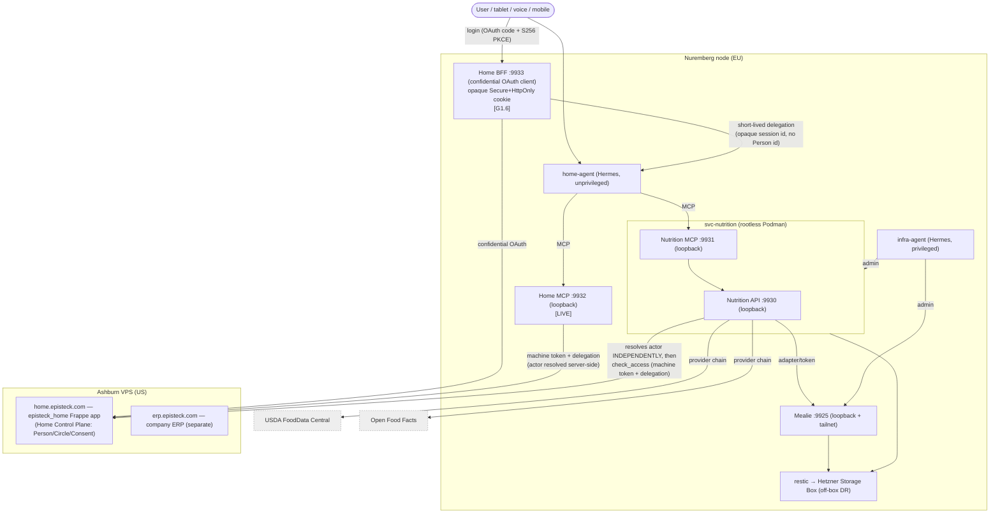

# Episteck Home — Architecture (canonical, current truth)

> **Read this first.** Before any architectural change, read this file and the
> relevant ADRs in `adr/`. Do not silently contradict accepted decisions. If the
> architecture changes: update this file, add/update an ADR, update `STATUS.md`,
> and commit the docs **with** the implementation change. Git documentation is the
> architecture source of truth. (See `ROADMAP.md` §Change Rule.)

**Status date:** 2026-09-16 · **Scope:** describes what EXISTS today plus clearly
labelled `[PLANNED]` / `[CONTRACT-ONLY]` items. No aspirational fiction.

## 1. What Episteck Home is

Episteck Home is a privacy-first personal/family operating system. A conversational
**Home Agent** helps a household coordinate nutrition, health, finance, documents,
tasks and (later) Mind — through **approved tools and APIs**, never through broad
data access. Authorization is explicit and consent-driven.

Planned physical-goods capabilities follow the same pattern: **Smart Shopping** helps
the family decide what to acquire and whether an offer is worth it; **Smart Possessions
/ Inventory** tracks what the family actually owns and its lifecycle (wardrobe, baby
goods, home/storage, use, maintenance, sell/donate/give-away/discard). They are sibling
domains, not extensions of the Home Control Plane. `[PLANNED]`

## 2. Planes and nodes

| Plane | Runs on | Role |
| --- | --- | --- |
| **Home Control Plane** — `episteck_home` Frappe app on **home.episteck.com** | Ashburn VPS | Canonical identity, family/care relationships, consent, coordination. `[LIVE]` |
| **Episteck company ERP** — `erp.episteck.com` | Ashburn VPS | Company-internal ERP. **Separate** from Home. Not part of this product. |
| **Domain services** | Nuremberg node | Independent specialized services (Nutrition, Mealie, future FHIR/Device Gateway/Mind/Knowledge/Shopping/Inventory) |
| **Agents** | Nuremberg node | Two independent Hermes instances: `infra-agent` (privileged ops) and `home-agent` (unprivileged, user-facing) |
| **Home BFF** — confidential OAuth client + session boundary | **Nuremberg node (EU)** | Holds the client secret and user tokens server-side; browser gets an opaque cookie. Mints short-lived delegations. `[G1.6]` |

Nodes are separate (US Ashburn / EU Nuremberg). Cross-node calls use **Tailscale**,
never public unauthenticated endpoints and **never cross-region DB connections**.

## 3. Current component map



### 3.1 Home business API and actor boundary `[G1.6 — trusted actor binding]`

**`actor_person_id` is never an input.** It is always a server-side derivation of
validated authentication context:

```
validated authentication -> Frappe User -> Person.linked_user -> actor
```

Neither `actor_person_id` nor `User.name` is ever a caller assertion. No Home business
method, MCP tool, or Nutrition route accepts an actor parameter, so actor substitution
is **unrepresentable** rather than merely rejected. `subject_person_id` remains a
parameter — the person legitimately asks about someone else — and is still gated by
`can_access`.

`get_person` checks discoverability from self, visible circle/care context, or
effective consent **before** loading the Person. Circle rosters require actor
membership, care queries are filtered to the actor, and effective-access queries can
inspect only that actor's access.

**Dual principal.** Every delegated sensitive request carries two independent
principals: `machine_caller` (proven by the service API key) and `human_actor`
(resolved from the delegated session). A service credential proves only "this service
may call this interface"; it never means "this service is Person X". Both identities
are retained in audit context. A machine credential alone yields `PermissionError`.

**Delegated context, not a trusted header.** A short-lived, single-audience,
replay-resistant token carries an **opaque session id** and never a Person id. A plain
`X-Actor-ID` header is forbidden. Frappe `auth_hooks` verifies it and maps the session
to a User via a `Home Delegated Session` record, so logout and revocation deny the very
next call. `Person.linked_user` is unique; ambiguity fails closed.

See `adr/0009-trusted-actor-binding.md`.

The Nuremberg Home MCP is a thin business adapter only. It owns no identity, consent,
or family data and exposes no consent mutation. It canonicalizes agent-supplied
domain/action display casing before the canonical Frappe policy validates the exact
values. A Home Agent deny/invalid/indeterminate result is terminal: it may not retry
with altered parameters or call the downstream domain tool. Frappe remains the
Control Plane.

### 3.2 Smart Shopping + Smart Possessions `[PLANNED]`

Two sibling bounded contexts handle physical-goods lifecycle without turning Frappe
into a universal inventory database:

- **`svc-shopping`** — ShoppingList/Need, WatchRule, AlertRule, normalized marketplace
  listings/snapshots, price observations, deterministic explainable DealEvaluation,
  PurchasePolicy and Purchase. Provider/mail/notification integrations are adapters.
- **`svc-inventory`** — OwnedItem, collections/locations, condition, usage,
  maintenance, disposition, InventoryGap, wardrobe/outfits and baby-item lifecycle.

They communicate through explicit contracts/events (e.g. `PurchaseCompleted`,
`InventoryGapDetected`, `ItemOutgrown`) and do not share tables. Shopping answers
"what should we acquire?"; Inventory answers "what do we own and what should happen to
it?".

The planned provider architecture is independent of Kleinanzeigen/Gmail. The first MVP
adapter is intentionally `Kleinanzeigen Saved Search -> email notification -> mail
adapter -> MarketplaceProvider -> normalized listing`; no direct scraping dependency is
required.

Wardrobe/style recommendations combine Inventory with contextual inputs such as Calendar,
Weather, personal preferences and fashion knowledge without copying those domains'
canonical data. The default behavior is **use what you own**; Shopping is proposed only
for a real functional/style gap or explicit user goal.

A hard product constraint is the **friction budget**: V1 must work without special
hardware using photo-first capture, natural language, grouped/bulk items and one-tap
usage/disposition feedback. QR/NFC (prefer containers/zones before every item), smart
wardrobe/laundry/RFID and Home Assistant integrations are later accelerators, not V1
requirements.

Planned consent domains are `SHOPPING` and `INVENTORY`, but they are not live policy
values until those services and their pre-retrieval authorization paths are implemented
and tested.

See `adr/0010-smart-shopping-and-possessions.md` and
`proposals/SMART_SHOPPING_AND_POSSESSIONS.md`.

## 4. Key decisions (see ADRs)

1. **home.episteck + episteck_home Frappe = the Home Control Plane** for Person,
   Circle, CircleMembership, CareRelationship, ConsentGrant, CareJourney. **No
   `svc-home-core`.** → `adr/0001-home-control-plane-is-frappe.md`
2. **Domain services stay independent** — each owns its truth; no universal DB. →
   `adr/0002-independent-domain-services.md`
3. **Two independent Hermes agents** — `infra-agent` (privileged) and `home-agent`
   (unprivileged). Separate identities/state/systemd scope. →
   `adr/0003-two-hermes-agents.md`
4. **svc-nutrition is the Nutrition source of truth** (profiles, targets, planned/
   actual intake, deterministic calc). → `adr/0004-svc-nutrition-source-of-truth.md`
5. **Mealie is a recipe/meal-plan/shopping provider only** — behind an Episteck
   adapter; Mealie tokens are provider credentials, not authorization. →
   `adr/0005-mealie-as-provider.md`
6. **Family/Care graph** — Person/Circle/CareRelationship; membership ≠
   authorization. → `adr/0006-family-care-graph.md`
7. **Knowledge architecture** — governance layer owning Scope/Episode/Claim with
   provenance; candidate tech (Mem0/Docling/pgvector) not installed. →
   `adr/0007-knowledge-architecture.md`
8. **Consent is centralized + fail-closed** (`can_access`). →
   `adr/0008-consent-fail-closed.md`
9. **Trusted actor binding** — actor is derived from an authenticated session, never
   supplied; confidential BFF on the EU node; dual principal; native OIDC deferred
   because Frappe cannot require PKCE. → `adr/0009-trusted-actor-binding.md`
10. **Smart Shopping + Smart Possessions are sibling domain services** — Shopping owns
    intent/deals/purchases; Inventory owns actual possessions/lifecycle; provider and
    hardware integrations remain adapters; low friction is a product invariant. →
    `adr/0010-smart-shopping-and-possessions.md`

## 5. Cross-cutting rules

- **Authorization before retrieval.** No sensitive data is fetched before
  `can_access` allows it. Membership/care relationship alone never authorizes.
- **Actor identity is derived, never asserted.** `[G1.6]` No caller — user, LLM, tool
  argument, client JSON, or header — may supply an actor. A machine credential is a
  service identity and never a human one.
- **Provenance everywhere.** Nutrition facts, targets, intake, Knowledge claims and
  future Shopping/Inventory observations/inferences carry source/provenance. AI output
  is a proposal/hypothesis until user-confirmed when confirmation matters.
- **Secrets never in Git, never to home-agent, never in MCP output or logs.**
- **Deterministic domain math.** LLMs explain; they never fabricate nutrient numbers,
  prices, safety facts, deal arithmetic or other authoritative values.
- **Low-friction by design.** Future household inventory features must tolerate
  incomplete coverage and minimize manual upkeep; hardware automation is optional.

See `DATA_OWNERSHIP.md`, `SECURITY_AND_CONSENT.md`, `KNOWLEDGE.md`, `AGENTS.md`,
`DEPLOYMENT.md`, `ROADMAP.md`, `STATUS.md`, and `G1_5_VALIDATION.md`.
