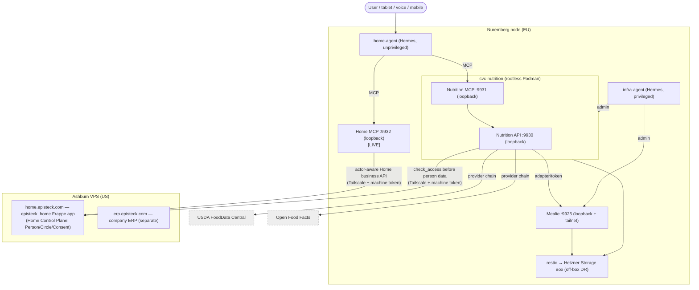

# Episteck Home — Architecture (canonical, current truth)

> **Read this first.** Before any architectural change, read this file and the
> relevant ADRs in `adr/`. Do not silently contradict accepted decisions. If the
> architecture changes: update this file, add/update an ADR, update `STATUS.md`,
> and commit the docs **with** the implementation change. Git documentation is the
> architecture source of truth. (See `ROADMAP.md` §Change Rule.)

**Status date:** 2026-09-15 · **Scope:** describes what EXISTS today plus clearly
labelled `[PLANNED]` / `[CONTRACT-ONLY]` items. No aspirational fiction.

## 1. What Episteck Home is

Episteck Home is a privacy-first personal/family operating system. A conversational
**Home Agent** helps a household coordinate nutrition, health, finance, documents,
tasks and (later) Mind — through **approved tools and APIs**, never through broad
data access. Authorization is explicit and consent-driven.

## 2. Planes and nodes

| Plane | Runs on | Role |
| --- | --- | --- |
| **Home Control Plane** — `episteck_home` Frappe app on **home.episteck.com** | Ashburn VPS | Canonical identity, family/care relationships, consent, coordination. `[LIVE]` |
| **Episteck company ERP** — `erp.episteck.com` | Ashburn VPS | Company-internal ERP. **Separate** from Home. Not part of this product. |
| **Domain services** | Nuremberg node | Independent specialized services (Nutrition, Mealie, future FHIR/Device Gateway/Mind/Knowledge) |
| **Agents** | Nuremberg node | Two independent Hermes instances: `infra-agent` (privileged ops) and `home-agent` (unprivileged, user-facing) |

Nodes are separate (US Ashburn / EU Nuremberg). Cross-node calls use **Tailscale**,
never public unauthenticated endpoints and **never cross-region DB connections**.

## 3. Current component map

### 3.1 Home business API and actor boundary

The Home Core API enforces actor context inside the Frappe application, not only in
MCP. A linked human User may act only as its linked Person. An unlinked machine User
must be explicitly allowlisted and must supply an actor; it has no DocType mutation
permissions. `get_person` checks discoverability from self, visible circle/care
context, or effective consent **before** loading the Person. Circle rosters require
actor membership, care queries are filtered to the actor, and effective-access
queries can inspect only that actor's access.

Explicit actor ids are a **synthetic G1.5 bridge**, not authentication. Before any
real data or G2, an authenticated user/session must be authoritatively bound to its
allowed Person identity; a future Home Agent may not establish identity by merely
supplying `actor_person_id`.

The Nuremberg Home MCP is a thin business adapter only. It owns no identity, consent,
or family data and exposes no consent mutation. It canonicalizes agent-supplied
domain/action display casing before the canonical Frappe policy validates the exact
values. A Home Agent deny/invalid/indeterminate result is terminal: it may not retry
with altered parameters or call the downstream domain tool. Frappe remains the
Control Plane.

## 4. Key decisions (see ADRs)

1. **home.episteck + episteck_home Frappe = the Home Control Plane** for Person,
   Circle, CircleMembership, CareRelationship, ConsentGrant, CareJourney. **No
   `svc-home-core`.** → `adr/0001-home-control-plane-is-frappe.md`
2. **Domain services stay independent** — each owns its truth; no universal DB. →
   `adr/0002-independent-domain-services.md`
3. **Two independent Hermes agents** — `infra-agent` (privileged) and `home-agent`
   (unprivileged). Separate identities/state/systemd scope. →
   `adr/0003-two-hermes-agents.md`
4. **svc-nutrition is the Nutrition source of truth** (profiles, targets, planned/
   actual intake, deterministic calc). → `adr/0004-svc-nutrition-source-of-truth.md`
5. **Mealie is a recipe/meal-plan/shopping provider only** — behind an Episteck
   adapter; Mealie tokens are provider credentials, not authorization. →
   `adr/0005-mealie-as-provider.md`
6. **Family/Care graph** — Person/Circle/CareRelationship; membership ≠
   authorization. → `adr/0006-family-care-graph.md`
7. **Knowledge architecture** — governance layer owning Scope/Episode/Claim with
   provenance; candidate tech (Mem0/Docling/pgvector) not installed. →
   `adr/0007-knowledge-architecture.md`
8. **Consent is centralized + fail-closed** (`can_access`). →
   `adr/0008-consent-fail-closed.md`

## 5. Cross-cutting rules

- **Authorization before retrieval.** No sensitive data is fetched before
  `can_access` allows it. Membership/care relationship alone never authorizes.
- **Actor binding before G2.** Explicit synthetic actor ids are not valid identity
  proof for real data.
- **Provenance everywhere.** Nutrition facts, targets, intake, and Knowledge claims
  all carry a source. AI output is a proposal/hypothesis until user-confirmed.
- **Secrets never in Git, never to home-agent, never in MCP output or logs.**
- **Deterministic domain math.** LLMs explain; they never fabricate nutrient
  numbers or authoritative values.

See `DATA_OWNERSHIP.md`, `SECURITY_AND_CONSENT.md`, `KNOWLEDGE.md`, `AGENTS.md`,
`DEPLOYMENT.md`, `ROADMAP.md`, `STATUS.md`, and `G1_5_VALIDATION.md`.
