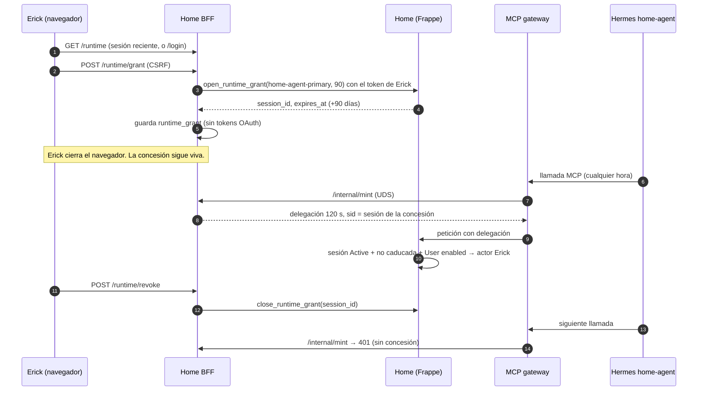

# H5: concesión de runtime del agente (90 días)

**Estado:** diseño para revisión. No autoriza implementación ni despliegue.
**Fecha:** 2026-10-10 · **Base:** `origin/main` `4e8c45d`.
**Origen:** `OLIN_FINANCE_V1.md` §1.6 y §7.3 (H5). El dueño eligió una duración de 90 días (P4).
**Cambia el modelo de identidad:** requiere revisión del Board antes de implementarse (Architecture Change Rule).

## 1. Problema

Hoy Hermes solo puede actuar mientras exista una **sesión de navegador** del operador en el BFF:

1. Cada login en `bff.home.episteck.com/login` crea una `bff_session` de 12 h y una `Home Delegated Session` de 12 h (`identity/session.py` `SESSION_TTL_SECONDS`). Si `home-agent-primary` está libre, el login la reclama automáticamente (`app.py` `callback` → `create_session_and_claim_runtime`).
2. El gateway pide un mint para cada petición MCP. `/internal/mint` resuelve la vinculación (`store.resolve_runtime`) y firma una delegación de 120 s con el `home_session_id` de esa sesión.
3. Pasadas 12 h, o al hacer logout, la vinculación desaparece y todas las llamadas de Hermes devuelven 401.

Consecuencia: para usar Olin por Telegram hay que iniciar sesión cada día, y el cron de pendientes deja de funcionar de noche. Eso son unas 30 intervenciones al mes y contradice el criterio principal de Olin Finance.

## 2. Objetivo y no-objetivos

**Objetivo.** Que el dueño conceda de forma explícita a `home-agent-primary` permiso para actuar en su nombre durante **un máximo de 90 días**, revocable en cualquier momento e independiente de la sesión del navegador.

**Se mantienen todas las garantías de G1.6:**
- La delegación sigue siendo de 120 s y de un solo uso.
- No lleva Person id.
- El actor lo resuelve Home.
- La revocación deniega la siguiente llamada.

**No-objetivos:**
- Identidad por usuario en el chat (que Ana o familiares hablen con Olin). Eso es H6.
- Permisos de dominio. Siguen siendo los `ConsentGrant` y `can_access` actuales.
- Clientes OAuth públicos o nativos (siguen prohibidos, ADR-0009).

## 3. Diseño

### 3.1 Home Control Plane (Frappe)

Se reutiliza la `Home Delegated Session` **sin cambio de esquema**. Una concesión es una sesión con `client = "agent-runtime:<runtime_id>"` y caducidad larga.

| Método nuevo (`identity/session.py`) | Contrato |
| --- | --- |
| `open_runtime_grant(runtime_id, ttl_days)` | Autoservicio, como `open_session`: sin parámetro de usuario. El usuario es el titular del token OAuth humano. `runtime_id` debe estar en `home_runtime_ids` (site config, por defecto `["home-agent-primary"]`). `ttl_days` debe estar entre 1 y `home_runtime_grant_max_days` (site config, por defecto 90). Exige una Person vinculada única. **Revoca** cualquier concesión activa previa del mismo usuario y runtime (rotación). Devuelve `session_id` y `expires_at` |
| `close_runtime_grant(session_id)` | Igual que `close_session`: solo su dueño; la misma respuesta para "no es tuya" y "no existe" |
| `get_runtime_grant_status()` | Llamado **con la delegación** del propio runtime. Devuelve `{expires_at, days_left}` de la sesión que está en uso. No devuelve ningún identificador. Sirve para los recordatorios |

Sin cambios en `auth_hook._user_for_session`: ya exige `status = Active`, `expires_at` futuro y `User.enabled`. **Una máquina no puede crear una concesión**, porque el método exige un usuario humano autenticado por OAuth, igual que `open_session`.

*Alternativa considerada:* campos nuevos `kind`, `runtime_id` y `allowed_audiences` en el DocType. Es más explícita, pero exige `bench migrate` manual (home no tiene *post-deploy hook*). Se puede hacer más adelante sin cambiar el contrato.

### 3.2 Home BFF

| Cambio | Detalle |
| --- | --- |
| Tabla `runtime_grant` | `runtime_id` (PK), `home_session_id`, `allowed_audiences`, `granted_at`, `expires_at`. **No guarda tokens OAuth**: el mint solo necesita `home_session_id` y el secreto de delegación |
| `GET /runtime` (página) | Exige cookie de sesión. Muestra el estado ("Olin en Telegram puede actuar en tu nombre hasta el 08/01/2027"), el botón Conceder o renovar y el botón Revocar |
| `POST /runtime/grant` | Cookie + CSRF + **login reciente** (la `bff_session` debe tener ≤ 10 min). Si no lo es, redirige a `/login?next=/runtime`. Llama a `open_runtime_grant` con el token del usuario y guarda la fila con `allowed_audiences = {home-control-plane, svc-nutrition, svc-finance}` |
| `POST /runtime/revoke` | Cookie + CSRF. Llama a `close_runtime_grant` y borra la fila. Si Home no responde, borra la fila local igualmente (el mint deja de firmar) y lo registra para reintentar |
| `/internal/mint` | Resuelve primero `runtime_grant` vigente. Si no hay ninguno, cae a la vinculación de navegador actual **solo mientras dure la transición** (flag `RUNTIME_LEGACY_BINDING`, se retira tras la verificación live). Con H4, la audiencia pedida tiene que estar en `allowed_audiences` |
| `/callback` | Deja de reclamar automáticamente `home-agent-primary` tras la transición: el agente solo actúa con una concesión explícita |
| Límite de mint | Máximo 600 por minuto por runtime; si se supera, 429 y una línea de log. Registro de `last_mint_at` (por minuto) para mostrar "último uso" en la página |

### 3.3 Hermes (configuración, sin código)

Un cron diario llama a `get_runtime_grant_status` a través de Home MCP. Cuando quedan **7 días o menos**, Olin envía por Telegram: "Mi permiso caduca el 08/01. Renueva aquí: `bff.home.episteck.com/runtime`". Renovar cuesta unos 30 s cada 90 días.

### 3.4 Flujo

## 4. Amenazas

| Amenaza | Hoy (12 h) | Con H5 | Mitigación |
| --- | --- | --- | --- |
| Cuenta `home-agent` comprometida | Actúa como Erick ≤ 12 h | Actúa como Erick ≤ 90 días | nft: solo uid 1003 llega al gateway; el agente no tiene sudo, credenciales ni socket del mint; audiencias limitadas; "último uso" visible; revocación inmediata; límite de mint con log. **Riesgo aceptado por el dueño (P4)** |
| Cookie de navegador robada | Puede volver a vincular el runtime en un login | No puede conceder sin un login reciente | Login reciente de ≤ 10 min + CSRF en `POST /runtime/grant` |
| Máquina intenta crear la concesión | — | Denegado | `open_runtime_grant` exige un usuario humano de OAuth, igual que `open_session` |
| Concesión más larga de lo permitido | — | Denegado | Home aplica `home_runtime_grant_max_days`; el BFF no puede ampliarlo |
| Runtime no autorizado | — | Denegado | `home_runtime_ids` en la configuración del sitio |
| Usuario deshabilitado o desvinculado de su Person | Deniega en la siguiente llamada | Igual | Comprobaciones existentes de `_user_for_session` y `_person_for_user` |
| Fuga de `bff.sqlite` | Expone tokens OAuth de navegador | La fila de concesión no añade tokens | Sin firmar con el secreto no sirve; el host del BFF ya es límite de confianza |
| Replay de la delegación | Denegado | Igual | Reclamación atómica del `jti` (sin cambios) |
| Home no disponible al revocar | — | El BFF deja de firmar de inmediato | La fila local se borra primero en el BFF |

## 5. Pruebas

- **Home (arnés fake-frappe):** solo autoservicio; `ttl_days` fuera de rango; `runtime_id` no permitido; rotación (la anterior queda `Revoked`); cerrar una concesión ajena devuelve la misma respuesta que una inexistente; `get_runtime_grant_status` solo con delegación; caducidad a 90 días; usuario deshabilitado → la siguiente llamada se deniega.
- **BFF:** CSRF; exigencia de login reciente; mint usa la concesión antes que la vinculación de navegador; la vinculación de navegador desaparece con el flag apagado; audiencia fuera de la lista → denegada; revocar con Home caído; la tabla no contiene tokens; límite de mint.
- **Live (al estilo G1.6):** conceder → cerrar el navegador → llamada de Hermes a las 13 h y a las 25 h (permitida) → revocar → siguiente llamada 401 → Home deniega la delegación antigua. Logs sin `session_id`, tokens ni Person ids.

## 6. Despliegue

1. **Home:** métodos nuevos + claves de configuración (`home_runtime_ids`, `home_runtime_grant_max_days`). Sin migrate. Despliegue por `main` → `episteck-deploy`; la clave la pone el operador.
2. **BFF:** tabla, rutas y mint con `RUNTIME_LEGACY_BINDING=on`. Imagen y Quadlet los cambia el operador.
3. **Verificación live** (§5) y después `RUNTIME_LEGACY_BINDING=off`.
4. **Rollback:** volver a la imagen anterior del BFF. La vinculación de navegador vuelve a funcionar y las concesiones de Home se ignoran sin efecto.

**Esfuerzo:** 3–5 días-ingeniero, más la revisión.

## 7. Preguntas para la revisión

1. ¿Bastan 10 minutos como ventana de "login reciente" para conceder?
2. ¿Un "cerrar sesión en todas partes" debe revocar también la concesión? Propuesta: sí, con aviso.
3. ¿Recordatorio solo por Telegram, o también una tarjeta en Home Hub?
