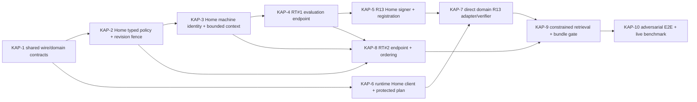

# Knowledge Authorization Plan and runtime contract

**Status:** **§17 ACCEPTED; §19 PROPOSED, NOT BOARD-RATIFIED.** The Architecture Board accepted the original contract in §17. The architect accepted §19's Knowledge-only recovery scope and default-closed gateway only as a disposable integration candidate. No endpoint, runtime, credential, certificate, schema, or deployment is created by this document.
**Baseline:** `origin/main` `b1a3d5f7cc58b58968a3250b752a1dab37d0fa8b` (PRs #52, #54, and #55 contained).
**Obligations:** **#2 OPEN; #3 OPEN; #5 OPEN.** R13 mechanism selection remains closed; production rollout is a separate gate.

## 1. Decision and recovered gap

The accepted process is protected security-metadata planning → one complete Authorization Plan at Home RT#1 → constrained Knowledge and domain execution → ranking among authorized content → mandatory fresh Home RT#2 → request-local ContextBundle. This contract defines the domain model and services/APIs for that process. It does not define agent tools or UI. [B1](KNOWLEDGE_B1_SECURITY_SCOPE.md), [B2](KNOWLEDGE_B2_SENSITIVITY_INHERITANCE.md), [B3](KNOWLEDGE_B3_LIFECYCLE.md), [B4](KNOWLEDGE_B4_FORGET_DELETE.md), [B5](KNOWLEDGE_B5_OWNERSHIP_BOUNDARIES.md), [B6](KNOWLEDGE_B6_TRUSTED_RETRIEVAL.md), and [R13](KNOWLEDGE_R13_PRODUCTION_MECHANISM.md) are governing decisions.

Repository truth at this baseline:

* `apps/episteck_home/episteck_home/api.py` has `check_access` and `check_access_many`, but the latter accepts one Person and at most eight `(domain, action)` requirements. It has no typed Circle evaluation, multi-operation plan, basis issuer, or RT#2 endpoint. The current pure policy is Person-only; B1's typed PERSON/CIRCLE grant model is accepted architecture, not deployed behavior.
* `identity/auth_hook.py` authenticates a Frappe machine caller first, verifies `X-Episteck-Delegation`, atomically claims its ID in shared Redis, resolves the opaque Home Delegated Session to a User, and derives one Person server-side. The delegation is 120-second maximum, single-audience, single-use. `resolve_principals()` does not let a machine credential stand in for a Person. Home has no request-scoped continuation after that request.
* Home MCP and Nutrition use different Frappe API Users and persistent `httpx.Client` instances. Nutrition still calls Home before its sensitive repository reads. Home BFF mints the Home-audience delegation; the browser holds an opaque cookie, and the agent does not receive machine credentials. These existing clients are evidence for transport and identity patterns, not the Knowledge client.
* `packages/home-contracts` contains a conceptual `ContextBundle` and Knowledge types but no retrieval runtime. Its current bundle does not enforce B1–B6 exact-version, partition, lifecycle, classification, suppression, or RT#2 semantics. The SQLite Knowledge owner selected by the technology gate is not installed.
* Nuremberg services use rootless Podman and private Tailscale routing to Ashburn Home. [PR #52](KNOWLEDGE_WARM_COLD_E2E_VALIDATION.md) proved two actual Home sends in a disposable P1/P2/P3 rig, but missed latency targets. [PR #54](KNOWLEDGE_HOME_TRANSPORT_TRACE.md) isolated a disposable `http.client` responder pathology, not production. [PR #55](KNOWLEDGE_PRODUCTION_TRANSPORT_VALIDATION.md) did not reproduce it using the reusable Python/httpx/nginx/Gunicorn stack; it classified the absent Knowledge path as C. No transport correction is selected.

The missing production pieces are typed complete Home evaluation, an authenticated runtime caller, Home-side human continuity, issuance from trusted service registration, direct R13 domain adapters, current-state RT#2 ordering, and bundle integration. None can be inferred from the benchmark stub.

## 2. Production sequence and ownership

```mermaid
sequenceDiagram
    autonumber
    participant B as BFF / trusted ingress
    participant R as Knowledge/Olin trusted runtime
    participant K as Knowledge owner (SQLite)
    participant H as Home authority (Ashburn)
    participant D as Domain owner(s)
    participant C as ContextBundle disclosure
    B->>R: one-use Home delegation via protected server path
    R->>K: partition-bound protected security-metadata plan (no content)
    K-->>R: exact versions, complete requirements, control revisions
    R->>H: RT#1 POST complete plan + one-use delegation + machine credential
    H->>H: claim delegation; resolve actor/partition; evaluate every operation
    H->>H: create bounded request context; mint R13 bases from trusted registration
    H-->>R: plan ID, context handle, ordered decisions, allowed-domain bases
    par authorized execution only
        R->>K: constrained eligible exact-version retrieval
        K-->>R: authorized eligible content and provenance
    and each allowed domain operation
        R->>D: direct mTLS + exact R13 basis and request
        D->>D: live peer + basis + replay + repository guard
        D-->>R: bounded domain result and version/reference
    end
    R->>R: rank/select only authorized eligible inputs; identify contributors
    R->>H: RT#2 POST contributors + context handle + same machine credential
    H->>H: consume context; recheck session, partition, grants/policy and fence NOW
    H-->>R: fresh decision for each contributor + disclosure fence
    R->>K: final exact-version suppression/lifecycle/classification/dependency check
    K-->>R: current eligibility/fence or refusal
    R->>C: construct bounded, ephemeral bundle only if every contributor passes
```

Home owns identity, partition resolution, grant/policy decisions, authorization revision, and the transient request context. Knowledge owns canonical assertions, protected metadata, lifecycle, suppression, restore freshness, and exact-version eligibility. Each domain owns its structured repository and R13 verifier. The runtime coordinates; it is not an authorization authority. A Home network crossing, an Authorization Plan, and an Authorization Operation are three different units. Ordinary successful retrieval uses one RT#1 crossing and one RT#2 crossing regardless of domain fanout.

## 3. Domain model and data handling

The names below are logical contract names. No production type is introduced here. `request_id` is the request execution correlation ID; `execution_id` is the distinct, one-use R13 domain execution ID. All IDs are opaque, nonempty printable ASCII; generated IDs use at least 128 bits of unpredictability. Home never infers actor or partition from an ID.

| Concept / owner | Lifecycle and authoritative fields | Caller fields, persistence, confidentiality, replay and correlation |
| --- | --- | --- |
| **AuthorizationPlanRequest / runtime** | One immutable, bounded RT#1 submission: protocol version, runtime-generated `request_id`, ordered complete operations and their protected metadata bindings. It is a request, not an authority. | Runtime supplies operation descriptors, never actor, partition, machine service text, or an allow. Home retains only its bounded evaluated form. Confidential server-to-server. Same `request_id` after an uncertain send is **not** an idempotent replay; a fresh delegation and new request are required. |
| **AuthorizationOperation / runtime proposes, Home decides** | One independently meaningful question with stable `operation_id`, `kind`, `use_class`, complete typed resource × domain/action requirements, and an exact target descriptor. Its requirement set is indivisible. | Runtime derives it from trusted Knowledge security metadata and the invoked server operation. Model nominations are data only. Home stores the exact normalized descriptor in context. Its ID correlates RT#1, R13, RT#2, and audit, but grants nothing. |
| **ResourceTarget / Home policy and owning repository** | Typed `PERSON/<id>` or `CIRCLE/<id>` authorization target, plus a separate Knowledge exact-version or domain record target. Partition-local existence/type are validated before content. | Runtime may nominate canonical IDs from protected resolution; Home proves the trusted partition. IDs and requirement metadata are confidential; no cross-partition lookup or existence-bearing error. Home's policy target is not a domain record ID. |
| **AuthorizationPlan / Home** | Home-generated `plan_id`, ordered independent decisions, expiry, context handle, and issuance outcomes. One plan has no aggregate authorization verdict. | Home holds the authoritative decision set only for RT#1 execution within the window; the runtime holds it in request memory. Never a permission cache or persisted Knowledge artifact. `plan_id` is correlation, not authority. |
| **AuthorizationDecision / Home** | Per-operation `ALLOW` or `DENY`, `decision_id`, completeness digest, `authorization_revision`, and validity window. `ALLOW` means all required tuples allowed at RT#1. | No caller-supplied allow/reason/revision. Safe external denial is generic; tuple detail remains Home audit only. The decision cannot authorize disclosure or a different operation. |
| **RequestAuthorizationContext / Home** | A short-lived Home-side record binding authenticated machine User, Home-resolved actor/User/session, trusted partition, `request_id`, `plan_id`, complete operations, RT#1 revisions, window and expiry. | Home creates it after delegation claim. Runtime receives only a random opaque handle; neither handle nor decision ID is a bearer permission. Redis policy in §11. One RT#2 consumption. Never Knowledge-persistent or model/browser-visible. |
| **ExecutionBasis / Home, verified by domain** | One R13 v1 signed envelope for each allowed downstream operation. Contains one-use `execution_id`, exact operation, service/SPKI, audience, actor/partition, request/plan/op IDs, revision/window and expiry. | Home mints from independently trusted registration. Runtime carries only in memory to the exact domain; domain claims replay atomically. No basis for denied or local Knowledge operations. Never ContextBundle/log/persistent Knowledge. |
| **PreDisclosureRevalidationRequest / runtime** | RT#2 assertion of actual `operation_id`s that influenced the selected answer, plus exact selected Knowledge versions and domain result references/revisions. It is evidence of contribution, not authority. | Runtime supplies IDs and observed revisions, never actor/partition/old allow. Home compares all to its retained context. One-shot; no addition or expansion of operations. |
| **PreDisclosureRevalidationResult / Home** | Fresh per-contributor decisions plus Home authorization revision, fence and evaluation time. No old allow or basis validity is accepted as current proof. | Request-local, confidential, single disclosure attempt. Runtime must still run Knowledge-local final eligibility. Never persists as a reusable grant. |
| **ContributingOperation / runtime selection** | An RT#1 allowed operation whose content, score, omission-sensitive comparison, quotation, citation, or domain value actually influenced selection/output. Its selected exact versions/references are a subset of the RT#1 bound target. | Built only after authorized ranking. Even a result used only to choose another result contributes. No caller may hide influence to evade RT#2. Held in request memory, not Knowledge-persistent. |
| **AuthorizationRevision / Home; KnowledgeControlRevision / Knowledge** | Distinct monotonic or otherwise provably current fences. Home revision covers grants, typed policy and relevant partition authority; Knowledge revision covers lifecycle, classification, suppression, dependencies and restore state. | Home issues the first; Knowledge issues the second. The runtime may carry both as comparisons, never mint either. An RT#1 revision is historical correlation, never an RT#2 shortcut. Unknown/rollback/stale fences deny. §19 proposes a fresh-incarnation recovery alternative for Knowledge; it is not Board-ratified. |

**Knowledge must never persist** the original delegation, the Frappe API secret, Home context handle/value, Home decision/allow as an access cache, R13 basis or private key, RT#2 result as reusable authority, request transcript, selected ContextBundle, domain response as a shadow canonical record, or raw actor/session binding for later impersonation. Knowledge's legitimate canonical provenance and audit metadata remain governed by B1–B5; this ban concerns transient retrieval authorization state. Logs/traces follow §15.

## 4. Human actor continuity and trusted partition

At RT#1, Frappe authenticates the dedicated machine API User; the existing Home auth hook verifies and **atomically spends** the Home-audience delegation. Home resolves its opaque `sid` against the active Home Delegated Session, obtains its User, derives exactly one linked Person, and resolves one partition from authenticated Home site/deployment binding and validated references. It records both principals separately. The runtime cannot submit `actor_person_id`, `partition_id`, User, or `sid` as authority. A supplied field with any of those names is malformed, not ignored.

Home creates a **new, distinct request context with a 60-second maximum lifetime** after RT#1 validation. Its effective lifetime is no greater than `min(60 seconds, remaining delegated Home session lifetime, any shorter authorization/window bound)`; it is never a renewable lease. The context is bounded to the authenticated `olin-runtime` machine User, exact request/plan IDs, actor/User/session and partition Home resolved, and the immutable operation set. Under the proposed §19 candidate it also binds the current Knowledge authorization incarnation. RT#2 presents the opaque handle with the *same* Frappe machine credential and no delegation header. Home looks up and atomically consumes its own context, then rechecks that the retained session is active, User enabled, User→Person still unambiguous and unchanged, partition binding still valid, and current grants/policy; §19 would additionally require the incarnation to remain admitted and unchanged. The original delegation is never replayed, reminted, lengthened or accepted at RT#2. The context is continuity of trusted identity for **one request**, not continuing authorization: possession cannot yield content, change actor, add operations, or bypass fresh evaluation. It cannot be refreshed, extended or recovered after an uncertain RT#2. Expiry, missing context, logout/revocation, mapping change or ambiguity denies; under §19, incarnation change also denies.

The Home site's existing single-partition deployment mapping can be the initial trusted partition resolver only if it proves the authenticated site, actor, service and every target belong to that one stable partition. `Host`, `X-Partition-ID`, request body, model text, Circle membership and Care Relationship never select the partition. There is no global fallback. The concrete partition binding/check and typed Circle policy are production prerequisites, not claims that today's Person-only API already provides them.

## 5. Machine caller authentication and Home transport

**Select a dedicated Frappe API User and key/secret pair for `olin-runtime`**, using the existing machine authentication mechanism, distinct from Home MCP and Nutrition credentials. Frappe's authenticated User is the Home machine principal; Home allowlists that exact User for only these two methods, with no System Manager role, generic DocType access, ConsentGrant mutation or human Person mapping. The secret is owner-readable by the trusted runtime service only, never browser/model/tool-visible or in a ContextBundle. Rotate by issuing a replacement credential for the same explicitly registered service principal, overlap only under operator control, revoke the old key, and deny if authentication or registration is ambiguous. Machine authentication alone never supplies a human actor.

**Select the current reusable Home transport:** Python 3.11+, one persistent synchronous `httpx.Client` per trusted runtime process (not per request), HTTP/1.1, verified HTTPS to `home.episteck.com`, private Tailscale routing to Ashburn `100.71.79.33`, existing nginx 1.24 → Gunicorn 23 → Frappe 15.99. Keep the hostname as URL/SNI/certificate identity; private DNS or host mapping may route it, but an IP URL or disabled verification is invalid. No Home mTLS requirement is introduced. R13's mTLS remains **runtime → domain**, independently.

The pool owner opens it at process startup and closes it on shutdown; after fork, each process owns a new client. Keepalive is enabled with explicit limits of 20 total/10 idle connections and 15-second idle expiry (no longer than the observed nginx keepalive), with connection reuse across RT#1 and RT#2 when available. Use a 1-second connect timeout, 3-second read and write timeouts, and 0.5-second pool timeout as fail-closed ceilings, not latency targets. Set `trust_env=False` unless an explicitly approved environment proxy is required; use system/explicit CA trust with `verify=True`. Use JSON `Content-Length`, no streaming request body. No automatic transport retry for either POST: RT#1 consumes a delegation and may have committed context/bases; RT#2 consumes context. A lost response is indeterminate, and the request aborts. A **new user turn** may start with a fresh delegation and new request ID. No TCP_NODELAY, nginx buffering, HTTP/2, or kernel tuning change is selected; PR #55 found no pathology in the reusable stack.

## 6. RT#1 Authorization Plan wire contract

**Method/path:** `POST /api/method/episteck_home.api.create_knowledge_authorization_plan` over the selected Home transport. `Content-Type: application/json`; `Authorization: token <dedicated-key>:<secret>`; `X-Episteck-Delegation: <one-use Home-audience token>`. Request and successful response use Frappe's JSON `message` wrapper only where the current HTTP API requires it; the request body itself is the following versioned object. This is a proposed wire contract, not an existing endpoint.

```json
{
  "version": 1,
  "request_id": "opaque-runtime-random-id",
  "operations": [
    {
      "operation_id": "op-k",
      "kind": "KNOWLEDGE_READ",
      "use_class": "ORDINARY_READ",
      "requirements": [
        {"resource_type": "PERSON", "resource_id": "PSN-1", "domain": "KNOWLEDGE", "action": "VIEW"},
        {"resource_type": "PERSON", "resource_id": "PSN-1", "domain": "NUTRITION", "action": "VIEW"}
      ],
      "target": {
        "owner": "KNOWLEDGE",
        "exact_versions": [
          {"version_id": "version-1", "classification_revision": "c1", "control_revision": "l1", "requirement_digest": "sha256-hex"}
        ],
        "requested_interval": null
      },
      "domain_request": null
    }
  ]
}
```

The example shows one operation; an ordinary P2/P3 request places the independently complete domain operations in the **same** array and one network send. Each operation has one owning domain/use, one complete, normalized, deduplicated set of typed resource × domain/action tuples, and a target manifest. For Knowledge, OP-K's requirements are the union of every tuple needed for the bounded planned addressable set, including scope, complete subjects, every content domain, KNOWLEDGE, and inherited B2 requirements. **For v1, a denied tuple denies an indivisible OP-K as a whole.** The runtime may not remove the denied requirement, retrieve a smaller subset as if it answered the same question, auto-decompose the question after denial, or use denied/hidden metadata to choose an allowed fallback answer. Protected metadata planning is not candidacy or scoring. If the union is too broad for the bound, abstain; never truncate. Independently meaningful domain reads are separate operations, not slices of OP-K. Future independent-query decomposition requires separate architecture review because it can change semantics and create authorization, existence or timing oracles.

For a `DOMAIN_READ` operation, `target` is `{ "owner": "DOMAIN", "resource_ids": [..] }` and `domain_request` is required:

```json
{
  "audience": "spiffe://episteck.internal/service/svc-nutrition",
  "method": "POST",
  "target": "/v1/r13/knowledge-read",
  "body": {"subject_person_ids": ["PSN-1"], "resource_ids": ["record-1"], "query": {"limit": 10}},
  "request_sha256": "64-lowercase-hex-of-JCS-normalized-body"
}
```

The exact method/target and body schema are fixed by a separately reviewed owning-domain adapter. No arbitrary URL, host, redirect, query string, or method is accepted. Home verifies the fixed audience/route registration, canonical JCS body hash, and that actual body subject/resource arguments match the complete authorized operation. The domain repeats that match against the actual invocation and its repository guard. `body` is operation data, never identity authority. OP-K has no downstream basis; the Knowledge owner enforces Home's allowed constraint locally. Source expansion is a separate operation/use, not smuggled into an ordinary plan.

R13 v1 has one signed `domain` and `action`, and requires nonempty `subject_person_ids` and `resource_ids`. Thus a v1 `DOMAIN_READ` may cover only one domain/action/use and a complete nonempty Person subject/resource set that the domain can compare to its repository arguments. A proposed domain read whose full requirement set needs additional domains/actions, or a subjectless Circle-only read, is `UNSUPPORTED_OPERATION` for this v1 direct adapter; Home must not silently omit a requirement or forge a Person subject to mint a basis. **Subjectless Circle Knowledge** remains expressible as local OP-K, with its Circle requirements and no R13 basis. Extending the domain basis to other shapes would require a separate R13 version/Board decision, outside this contract.

**Bounds and ordering:** 1–32 operations, 1–256 distinct requirement tuples across the plan, at most 128 exact Knowledge versions per Knowledge operation, at most 64 KiB canonical JSON request body, and one `request_id` per plan. Each operation has 1–64 tuples. Duplicate operation IDs, duplicate target entries, mixed owners or actions outside Home's known vocabulary, unknown use/route, noncanonical IDs, a requirement/metadata mismatch, an empty required set, or any excess bound rejects the **whole request** as malformed; no prefix is evaluated. The runtime sends operations and tuples in deterministic normalized order. Home returns exactly one decision at the same index and matching `operation_id` and `requirement_digest`; the client rejects missing, extra, reordered or mismatched results. Requirement digest is SHA-256 of JCS of the normalized full operation descriptor excluding transport credentials and any Home-generated fields. The runtime's claim of completeness is checked against its trusted protected metadata manifest and Home's typed policy validation; it is never inferred from a model prompt.

Home creates a context only after a valid delegation, actor, partition, well-formed complete plan, current policy evaluation, and successful issuance for **all allowed domain operations**. If a basis cannot be issued for any allowed domain operation, the entire RT#1 is indeterminate: no actionable plan or handle is returned. A decision's validity ends at `min(Home context expiry, 60 seconds from issue)`; Home chooses server time, not a caller clock. The request's `requested_interval`, if present, is a data filter and never an authorization clock.

Successful HTTP 200 has this Frappe response body:

```json
{
  "message": {
    "version": 1,
    "request_id": "opaque-runtime-random-id",
    "plan_id": "opaque-home-id",
    "plan_context": "opaque-256-bit-home-handle",
    "expires_at": 1790000060,
    "authorization_revision": "home-revision-at-rt1",
    "window_id": "opaque-home-window",
    "decisions": [
      {"operation_id": "op-k", "requirement_digest": "sha256-hex", "outcome": "ALLOW", "decision_id": "opaque-home-id", "execution_basis": null}
    ]
  }
}
```

The `decisions` list is complete and ordered, with `outcome` exactly `ALLOW` or `DENY`. An allowed `DOMAIN_READ` has an R13 v1 `execution_basis` envelope; an allowed local Knowledge read and every denied operation have `null`. A denied decision gives no reason, tuple detail, resource existence, or basis to the runtime. Home audit may retain protected tuple-level reasons under its retention policy. **Partial denial rule:** a valid plan returns a mixed complete decision set; each operation is all or nothing. An allowed independent operation may execute even if another operation denies, provided doing so does not rewrite an indivisible compound request. If the base OP-K denies, no Knowledge candidate is addressable. `DENY` is a completed policy outcome, not a transport failure. A malformed plan, unknown actor/partition, authority outage or incomplete result yields no usable decision set.

## 7. R13 basis issuance and downstream execution

Home resolves the RT#1 Frappe API User to one operator-registered `spiffe://episteck.internal/service/olin-runtime` logical service and **one issuance-active, non-revoked client SPKI SHA-256**. This mapping and current signed trust state are Home-side trusted configuration; `caller_service` or SPKI text in a request is forbidden. Home does not need to see the runtime's live domain mTLS handshake to mint a basis: it signs only the registered active pair; each domain later verifies possession on its live connection. Zero/multiple active SPKIs, stale trust or uncertain rotation makes issuance fail closed.

For each allowed `DOMAIN_READ`, Home mints exactly the already selected R13 v1 envelope: `claims_jcs_b64u` and `signature_hex` over `b"episteck-r13-v1\x00" || JCS(claims)` with Ed25519. Claims are exactly R13's `version`, `home_kid`, unique `execution_id`, `request_id`, `plan_id`, `operation_id`, trusted `actor_person_id` and `partition_id`, ordered `subject_person_ids` and `resource_ids`, `domain`, `action`, `use_class`, fixed `audience`, registered `caller_service` and `caller_spki_sha256`, exact `method`, `target`, `request_sha256`, `issued_at`, `expires_at`, `authorization_revision`, `window_id`, and correlation-only `decision_id`. R13's restricted v1 claim schema, strict duplicate/unknown-field rejection, safe integers, general RFC 8785 production library, key/trust-bundle rules, 60-second maximum lifetime and five-second verifier skew apply unchanged. The Home private signing key never leaves Home. No basis is issued for `DENY`, local Knowledge work, malformed operations, or a route lacking a domain verifier.

After RT#1 the runtime constrains its Knowledge query to the authorized exact versions, suppression/lifecycle predicates and trusted partition. Knowledge's SQLite repository must make unauthorized/ineligible text, vectors, scores, counts and cache entries unaddressable, not retrieve then filter. Allowed domain operations execute directly and concurrently by default over verified server TLS and client mTLS. Each domain validates live cert chain, EKU, URI SAN and SPKI, current signed trust bundle, Home Ed25519 signature and canonical claims, local audience, exact IDs/method/target/body hash, time/window and domain resource/partition mapping; it atomically claims `(audience, execution_id)` **before** repository access, then applies its own repository guard. No domain→Home call occurs in this ordinary path. The R13 replay ledger and trust-generation anchor retain R13's durable, fail-closed semantics.

A domain timeout or unavailable domain contributes no result; its operation cannot be called successful merely because Home allowed it. If that read was optional and independently meaningful, omit it before ranking and report bounded/unavailable context only if that marker itself is non-revealing. A failed operation's content cannot influence selection; if its partial response did, abort. A retry of the same R13 basis is forbidden even after a lost response or domain crash; a new execution needs a new Home-approved operation and is outside the ordinary two-crossing attempt. An operation absent from RT#1 can never be executed or added at RT#2. Late-discovered source expansion requires a separately declared exceptional Home crossing and authorization before source content; it is outside the ordinary budget.

## 8. RT#2 pre-disclosure revalidation wire contract

**Method/path:** `POST /api/method/episteck_home.api.revalidate_knowledge_disclosure`. Same dedicated Frappe `Authorization` credential; `X-Knowledge-Plan-Context: <opaque handle>`; **no** `X-Episteck-Delegation`. One request carries the **whole actual contributing set**, not one call per item/domain. The runtime sends only previously allowed RT#1 operation IDs, in original plan order. An operation that affected ranking, exclusion, summary wording or citation choice is contributing even if its value is not quoted.

```json
{
  "version": 1,
  "request_id": "opaque-runtime-random-id",
  "plan_id": "opaque-home-id",
  "contributions": [
    {
      "operation_id": "op-k",
      "selected_versions": [
        {"version_id": "version-1", "classification_revision": "c1", "control_revision": "l1"}
      ],
      "domain_results": []
    }
  ]
}
```

For domain contributions, `selected_versions` is empty and `domain_results` holds the exact returned resource ID/version or freshness marker and the relevant `execution_id`; Home matches them to the RT#1 target and issued basis. Home does **not** treat the domain's marker as an authorization decision or independently certify the domain's repository truth. For Knowledge contributions, exact versions must be a nonempty subset of RT#1's manifest with matching recorded control/classification revisions. A changed version cannot be silently retargeted to `latest`; it requires a new plan. Unknown/duplicate/non-allowed operation, out-of-plan version/resource, changed target, empty contributions on a purported disclosure, extra actor/partition fields, missing/mismatched handle or machine User, or expired/consumed context denies the entire attempt. The RT#2 body has the same 64 KiB bound; its contributor count cannot exceed the RT#1 count.

Home atomically consumes the context, reloads current session/User/Person and partition binding, then **freshly reevaluates each contributing operation's complete original requirements** against current grants and policy under a current authorization revision/fence. It never accepts caller `allow`, an RT#1 decision, an unexpired R13 basis, a ContextBundle, or a stale policy cache as the current answer. The response is HTTP 200 only for a determinate completed evaluation and has:

```json
{
  "message": {
    "version": 1,
    "request_id": "opaque-runtime-random-id",
    "plan_id": "opaque-home-id",
    "evaluated_at": 1790000030,
    "authorization_revision": "home-revision-at-rt2",
    "disclosure_fence": "opaque-current-home-fence",
    "decisions": [
      {"operation_id": "op-k", "outcome": "ALLOW"}
    ],
    "disclosure": "ALLOW"
  }
}
```

The result has exactly one ordered decision per contributor. `disclosure` is `ALLOW` **only if every contributing operation freshly allows** and the Home ordering/freshness proof is valid. Otherwise it is `DENY` with no permitted subset. An indeterminate, unavailable, expired-context, malformed or missing-operation response gives **no** disclosure proof. On any RT#2 failure or denial, the runtime discards the entire selected answer and emits no ContextBundle in this attempt. It cannot simply remove one denied contributor: earlier ranking or wording may already have been influenced. A new request can replan and rerank from fresh authority. This stricter all-or-nothing final bundle rule preserves B6's per-operation all-or-nothing semantics without a third ordinary crossing.

Immediately after an RT#2 `ALLOW`, Knowledge checks every selected exact version against its own current suppression register, lifecycle/attestation, classification, applicability clock, dependency and restore-freshness fence. Its check and release must have an enforceable ordering with Knowledge control commits; unknown ordering denies. Home's RT#2 covers **Home authority**, not Knowledge-owned control facts, and cannot replace this local last gate. No model/tool/browser sees content until both gates pass. The bundle is bounded, request-local, provenance-carrying, exact-version, non-authoritative, and never persisted. A material delay or new disclosure boundary after this gate requires a fresh request/barrier; the result is not a reusable permit.

## 9. Freshness and revocation ordering

The **Home Control Plane authorization-policy layer** owns a durable, rollback-safe authorization revision/fence within the trusted security partition; Knowledge, the runtime and domains do not own or advance it. Every supported mutation of relevant authority—including ConsentGrant, typed Circle authorization/grant, authorization-policy and partition-authority changes as applicable—must advance it atomically/transactionally with that mutation. It is partition-scoped or proves equivalent isolation and cannot roll back after restore under the accepted §17 contract. §19 proposes a Knowledge-only fresh-incarnation alternative for Board review; its gateway is accepted only as a disposable integration candidate. RT#1 records a revision for basis audit/window only. RT#2 must evaluate from a consistent current Home authorization snapshot/order and serialize its decision against relevant authority changes. RT#2 is the logical Home disclosure-ordering point: a revocation or recovery closure ordered before it is observed and denies; a revocation or closure ordered after it bars future use, while a previously authorized immediate release follows this same ordering. The runtime releases immediately after the Home and Knowledge barriers, with no intervening model call, queue, implicit third Home crossing or long-lived result. If ordering or immediate release cannot be proved, it withholds. Mere wall-clock recency, a 60-second basis, Redis context TTL or an old allow cannot prove this ordering. Session validity, User enablement and User→Person mapping are rechecked freshly at RT#2; they need not be represented solely by this revision.

Knowledge's separate control fence advances on suppression, lifecycle, classification, dependency and restore-freshness changes. Suppressed or ineligible content is excluded **before candidacy** and checked again at final release. A stale index/cache/vector never revives it. If stronger classification or source invalidation is accepted in flight, the old version is ineligible; all influenced output is discarded. Authoritative time governs expiry; a user-requested historical interval does not change that clock. The Home and Knowledge fences are independent; neither service becomes authority for the other's state.

## 10. Replay and correlation model

| Item | Replay rule |
| --- | --- |
| Original delegation | Existing shared Redis atomic claim, exactly once at RT#1. No retry or RT#2 reuse. A valid token spent before a later RT#1 error stays spent. |
| `request_id`, `plan_id`, `operation_id`, `decision_id` | Correlation/binding only. Repeating any value does not authorize or recover a lost response. `decision_id` never acts as a capability. |
| Plan context handle | 256-bit random, Home-only state, bound to same authenticated machine and plan. Proposed §19 also binds the Knowledge authorization incarnation and rejects old-incarnation handles. One atomic RT#2 consume before evaluation; duplicate/parallel RT#2 calls fail. An uncertain RT#2 response ends the attempt. |
| R13 `execution_id` | Unique Home-generated ID per allowed domain operation and audience, claimed once at domain before repository access, durable through normal restart. Retries need a new Home plan. |
| ContextBundle / RT#2 result | Request-local outcome, no replay, no persistence or transfer to another session, actor, partition or request. |

## 11. Home request-context storage

Use Home's existing shared Redis security-state facility, **separate namespace from delegation replay**, not Frappe's ordinary authorization cache and not Knowledge SQLite. Key: `episteck:knowledge:plan:v1:<site-id>:<SHA-256(handle)>`; the random raw handle appears only in the protected RT#1 response and RT#2 header, never in the key or logs. Value: schema version; creation/expiry epoch; authenticated Frappe machine User and registered logical service; Home-derived delegated User, Person, opaque session reference and trusted partition; `request_id`, Home `plan_id`, `window_id`; exact normalized ordered operation descriptors and requirement digests; RT#1 decision IDs/outcomes and authorization revision; issued domain execution IDs and target bindings. Proposed §19 adds the current Knowledge authorization incarnation to this value. No statement text, snippets, embeddings, domain result payload, ContextBundle or persistent allow cache. Encrypt/segregate Redis access according to Home security-state custody; only Home workers read it. Under §19, an old key restored by Redis or Home backup is unusable because RT#2 compares its incarnation with the fresh independently admitted witness incarnation; key deletion is additional cleanup, not the safety proof.

TTL is no greater than **`min(60 seconds from RT#1 Home time, remaining delegated Home session lifetime, any shorter authorization/window bound)`**. It is a maximum lifetime, never a renewable lease; no refresh or extension path exists. A basis expires no later than this window and its own 60-second maximum. Context creation is atomic after complete plan evaluation and all required basis issuance; if Redis write fails, RT#1 fails closed. RT#2 uses an atomic read-and-delete or compare-and-delete script that verifies site/handle and consumes once; machine/plan bindings are then checked against the authenticated request. Wrong-machine attempts must not consume a legitimate context: atomically compare the authenticated machine binding before deletion. A correctly bound but malformed/denied RT#2 attempt consumes it, preventing probing. Redis eviction, restart, replication uncertainty or unavailable atomicity is indeterminate and denies; no local worker fallback. TTL cleanup is automatic; successful RT#2 deletes immediately. If a response is lost, the context either expires unused or has been consumed; the runtime never recovers by retrying the same attempt. Retained RT#1 allows are used only to ensure RT#2 does not admit a formerly denied/absent operation; **fresh evaluation determines current permission**.

## 12. Error model and wire handling

Every error response uses a fixed versioned `error.code`, `retryable` boolean and opaque correlation ID; no delegation, context handle, basis, actor, partition, sensitive resource ID, tuple-level reason or stack trace appears. Authenticated internal metrics may distinguish static categories. HTTP status is part of the contract even if Frappe needs an adapter to emit it consistently.

| Class / HTTP | Meaning and retry |
| --- | --- |
| `UNAUTHENTICATED_MACHINE` / 401 | Missing/invalid dedicated Frappe credential; non-retryable until credential repaired. |
| `INVALID_DELEGATION` / 403 | Missing, invalid, already claimed, wrong audience or expired RT#1 delegation; includes replay without an oracle. Non-retryable for this token. |
| `ACTOR_UNRESOLVED` / 403 | Session/User→Person missing, disabled or ambiguous; non-retryable in this attempt. External shape may collapse with `INVALID_DELEGATION`. |
| `PARTITION_UNRESOLVED` / 403 | Trusted binding absent/ambiguous or references out of partition; non-retryable in this attempt. External shape is non-enumerating. |
| `MALFORMED_PLAN` / 400; `UNSUPPORTED_OPERATION` / 400 | Schema/bound/completeness or route/use failure. No partial evaluation; correct request before new attempt. Unsupported or undiscoverable sensitive target is externally generic. |
| `DENIED` / 200 outcome | Determinate policy refusal of a complete operation or RT#2 disclosure. No basis for denied op; no automatic retry or weakened requirements. |
| `INDETERMINATE` / 503 | Current grants/policy/revision/ordering cannot be proved. Retryable only as a **fresh** authorized request, never same delegation/context/basis. |
| `PLAN_CONTEXT_EXPIRED` / 403 | Missing, expired or already consumed context. Externally generic to prevent probing; no same-attempt retry. |
| `REPLAY` / 403 | Internal category for delegation/context/domain replay; external shape collapses with invalid credential/context as appropriate. No retry of same artifact. |
| `TRUST_STALE` / 503 | Home issuance registration or domain R13 trust bundle/revocation state stale or ambiguous; new attempt only after trust repair. |
| `R13_ISSUANCE_FAILURE` / 503 | Home cannot mint every required allowed-domain basis; no actionable plan; new delegation and request after repair. |
| `HOME_UNAVAILABLE` / transport | Timeout/TLS/DNS/connection or malformed Home response seen by runtime. No automatic POST retry; no bundle. |
| `INTERNAL_FAILURE` / 500 | Unclassified Home/context/signing failure; no partial result, no bundle; investigate before new attempt. |

HTTP 200 `DENY` never means a malformed or stale response is acceptable. The runtime verifies exact response schema, ordered coverage, IDs, booleans/enums, expiry and basis presence rules; any mismatch becomes indeterminate. Cross-partition, absent and undiscoverable resources have indistinguishable public denial shape; timing equivalence remains obligation #3 OPEN. Domain errors distinguish operational classes only inside trusted telemetry and never echo protected identifiers. Availability failures may prompt a later *new* turn; they do not authorize hidden fallback to Nutrition's legacy Home call or a `2 + N` path under the ordinary label.

## 13. Latency, crossing and observability contract

The ordinary successful path has exactly **two actual Home client sends**: RT#1 evaluates `N ≥ 1` complete operations, and RT#2 reevaluates the `1..N` actual contributors. Domain adapters use local R13 verification and zero domain→Home sends; Knowledge checks its own local state. Thus for P1/P2/P3 with 0/1/3 domains, Home crossing count is 2/2/2; authorization operation count is 1/2/4 in the canonical scenario, independent of the two evaluations. A late source expansion or a truly new operation is exceptional and declares its extra crossing; it cannot be hidden in the ordinary budget.

Instrument **at transport boundaries**: `home_auth_round_trip_count` increments on each actual Home send (including uncertain sends), `authorization_operation_count` counts distinct RT#1 logical operations once, `domain_operation_count` counts attempted direct domain sends, and `source_expansion_count` counts separately authorized source expansions. Also record RT#1/RT#2 durations, pool reuse vs fresh TLS, plan operation/tuple counts, R13 issue/verify/claim outcome, trust generation age, domain verifier/repository duration, Knowledge planning/read/final eligibility, and ContextBundle construction. Count failed paths truthfully; the exactly-two assertion applies to ordinary **successful** retrieval, not all attempts. Do not sum parallel domain durations as serial time.

Keep B6 targets unchanged: pre-LLM p50 ≤300 ms **aspiration** (especially contingent for P2/P3), ordinary p95 ≤500 ms architecture target, initial p99 ≤800 ms Gate target; measure TTFT separately. PR #52 did not pass all latency targets, and PR #55 measured a healthy reusable transport surrogate, not the absent exact endpoint. **#2 remains OPEN until the real implemented client, Home endpoints, direct domain adapters and ContextBundle path pass the prescribed warm/cold end-to-end benchmark.** #5 still needs real R14/domain measurement.

Logs, traces and metrics carry only fixed outcome/error classes, stage timings, counts, redacted/hardened correlation hashes, service URI, Home key ID, trust generation and hashed SPKI where operationally needed. They never carry actor/User/session identifiers unnecessarily, delegation or API credentials, raw context handle/key, signed basis bytes/claims, protected metadata/resource IDs, query text, snippets, domain body/result, or ContextBundle content. Home's restricted audit may retain the minimal actor/machine/partition and decision evidence required by its authority role under explicit retention/access controls; that is separate from general logs. Do not put sensitive IDs into metric labels, URL query strings or error messages.

## 14. Rejected alternatives

| Alternative | Reason rejected |
| --- | --- |
| Replay the original delegation or mint a second one for RT#2 | Violates its atomic single-use property and changes the human trust boundary; adds another BFF/Home interaction or permits replay. |
| Caller-supplied actor/partition, Circle membership or Care Relationship as permission | Conflicts with B1/G1.6; cannot establish Home authorization. |
| Use `decision_id`, context handle, basis TTL, cached allow or ContextBundle as RT#2 authority | These are correlations/execution constraints, not current grant/policy proof. |
| Home mTLS for runtime authentication | R13 selected mTLS for runtime→domain only. Adding a Home client-cert terminator to the healthy existing Home route would create an unproven new identity handoff and operational surface; dedicated Frappe machine auth already supplies a server-resolved service principal. Revisit only on independent evidence/Board decision. |
| Share Home MCP or Nutrition API credentials | Collapses least-privilege and revocation boundaries; the runtime has a distinct role. |
| Raw signed bearer basis or domain→Home check per read | Violates R13 independent live peer proof or grows Home crossings to `2 + N`. |
| Per-candidate Home authorization, retrieve-then-filter, automatic compound-question decomposition | Violates B1/B6 candidacy and all-or-nothing semantics, and introduces authorization or timing oracles. |
| Automatic POST retries or durable plan/allow cache | Delegation/context/basis can already be spent; retry cannot recover certainty and a cache cannot prove RT#2 freshness. |
| TCP_NODELAY/nginx/HTTP2 tuning now | PR #55 did not reproduce PR #54's disposable responder pathology; no correction was selected. |

## 15. Implementation dependency graph after architecture approval

The graph identifies separately reviewable production changes, **not authorization to implement them in this PR**:



| Phase | Scope and prerequisite | Invariant, tests, deployment and rollback |
| --- | --- | --- |
| **KAP-1** | Versioned strict wire/domain contracts and test vectors; starts after Board approval. | Preserve the complete validated operation and adapter-owned result markers; reject extra identity-authority fields recursively, incomplete sets and altered ordering/hash. Requirements use case-sensitive ASCII lexical order by `(resource_type, resource_id, domain, action)`, with duplicates rejected; at most 256 distinct tuples per plan and existing per-operation limits. Missing trusted interval or adapter validators fail closed. Contract-only package change; deployment not required. Roll back package consumers together. |
| **KAP-2** | Home Control Plane authorization-policy layer owns B1 typed PERSON/CIRCLE evaluation, trusted partition binding and a durable partition-scoped (or equivalently isolated), rollback-safe authorization revision/commit fence; needs KAP-1. Select the concrete storage/mechanism here. | Every relevant ConsentGrant, typed Circle authorization/grant, policy and partition-authority mutation advances the fence atomically; RT#2 reads a consistent current order and fails closed on uncertainty. Circle/care never grant; self-access Person-only; mutation/restore/race tests. Home app/schema deployment **required** (manual `bench migrate` where needed). Rollback must preserve revision high-water and not revive old permission unless the proposed Knowledge-only §19 alternative receives Board ratification. |
| **KAP-3** | Dedicated allowlisted machine identity path and Redis request context; needs KAP-2. | Same-machine binding, one-use consume, expiry, eviction/outage, logout/Person ambiguity tests. Home deployment and separately approved credential provisioning required. Rollback revokes new credential and expires contexts; no reuse of Nutrition secrets. |
| **KAP-4** | RT#1 full validation/decision endpoint; needs KAP-3. | Complete independent operations, mixed decisions, no per-tuple salvage, protected metadata binding tests. Home deployment required; rollback disables endpoint and expires contexts. |
| **KAP-5** | Home R13 signer integration, trusted service URI→one active SPKI registration and key distribution; needs KAP-4. | Exact JCS/signature/route/body/audience, rotation/stale-trust and issuance-failure tests. Home deployment plus separate key/trust provisioning required. Rollback stops issuance and revokes affected key; preserve trust generation anchors. |
| **KAP-6** | Trusted runtime persistent httpx client and complete protected metadata planner; needs KAP-1 and KAP-4 wire stability. | One-use delegation, no actor/partition input, no pre-auth content or retries; contract/failure tests. Runtime deployment required. Rollback removes new route, discards in-memory plans. |
| **KAP-7** | Direct domain mTLS listener/adapter and R13 verifier/replay store per domain; needs KAP-5 and KAP-6. | Live URI/SPKI, exact request, atomic replay, repository guard, stale bundle fail-closed tests. Domain deployment/cert provisioning required; existing legacy route stays separately identified until cutover. Rollback disables R13 route, never silently falls back during a Knowledge request. |
| **KAP-8** | RT#2 endpoint and fresh Home evaluation; needs KAP-2/3/4. | Session/grant/policy revocation races, consumed/expired/wrong-machine context, out-of-plan contributors, no cached allow tests. Home deployment required; rollback disables Knowledge disclosure path. |
| **KAP-9** | Knowledge constrained SQLite execution, final control fence and exact-version ContextBundle integration; needs KAP-6/7/8 and the selected SQLite durability/restore mechanisms. | B1 unauthorized candidacy, B3/B4 suppression/lifecycle, B5 owner boundaries, RT#2 withholding tests. Knowledge/runtime deployment required; rollback disables reads and quarantines transient artifacts, preserves canonical/suppression state. |
| **KAP-10** | Direct negative tests and live P1/P2/P3 warm/cold, timing and real R14/domain measurement; needs all prior phases. | Actual crossing counters, 0/1/3+ fanout, failure probes, #2 latency gate, #3 oracle/timing gate, #5 real domain gate. Test deployment required; rollback/disable on invariant failure. Board alone disposes the open obligations. |

Every production app-code change follows branch → PR → `main` → `episteck-deploy`; no direct bench app edits. Provisioning and schema migration follow the workspace deployment standard. This document creates none of those changes.

## 16. Architecture review gate

| Governing decision | Self-review result |
| --- | --- |
| B1 no unauthorized candidacy | Protected metadata precedes complete OP-K; only allowed exact versions become addressable. Circle/care are not grants; no per-candidate post-filter. **Pass as contract; implementation unproved.** |
| B3/B4 lifecycle and suppression | Knowledge excludes ineligible versions before candidacy and rechecks after RT#2 under a current control fence; restore uncertainty denies. **Pass as contract; implementation unproved.** |
| B5 ownership | Home keeps identity/permission/partition authority, Knowledge keeps assertion and suppression, domains keep structured truth. **Pass as contract.** |
| B6 two crossings and mandatory RT#2 | One complete plan send and one current-state contributor send; no domain→Home call, no stale basis substitution. **Pass as contract; production count unproved.** |
| R13 exact basis and independent live identity | Home signs from trusted registration; domains compare live URI SAN/SPKI, exact request and replay ledger. **Pass as contract; provisioning unproved.** |
| PR #55 transport | Existing stack selected; no optimization of the nonreproduced pathology. **Pass.** |

No contradiction with accepted architecture was found. The Architecture Board has disposed of the three review questions in §17. Its acceptance is of this architecture contract, not authorization to start KAP-1 or any production implementation.

**Obligation status at PR:** #2 **OPEN** (real path and latency unmeasured), #3 **OPEN** (timing/existence-oracle closure unproved), #5 **OPEN** (real R14/domain measurement absent). Do not close any from this architecture proposal.

## 17. Architecture Board disposition — accepted for v1

The Architecture Board **ACCEPTS the Knowledge Authorization Plan and runtime contract for v1**, subject to the following recorded interpretations. Acceptance does **not** approve production implementation, close obligations, or authorize KAP-1. This PR remains documentation-only.

1. **Home request context — APPROVED FOR V1.** The 60-second Home request context is a **maximum lifetime, never a renewable lease**. Its effective lifetime is no greater than `min(60 seconds, remaining delegated Home session lifetime, any shorter authorization/window bound)`. It is Home-owned; bound to the authenticated `olin-runtime` machine principal; retains the Home-resolved actor, session and partition; and is bound to the exact `request_id`, `plan_id` and operation set. It permits exactly one RT#2 consumption. It cannot be refreshed, extended or recovered after uncertain RT#2. It is neither an authorization cache nor a reusable capability. Possession without the same authenticated machine identity grants nothing. **Fresh RT#2 reevaluation remains mandatory.**
2. **Authorization revision / ordering owner — APPROVED.** The **Home Control Plane authorization-policy layer** owns the durable, rollback-safe authorization revision/fence within the trusted security partition—not Knowledge, the runtime or domain services. KAP-2 selects the concrete storage/mechanism; this architecture PR does not. The fence is partition-scoped or proves equivalent isolation, advances atomically/transactionally with every supported relevant ConsentGrant, typed Circle authorization/grant, authorization-policy and partition-authority mutation, and cannot roll back after restore. RT#2 evaluates from a consistent current authorization snapshot/order. A revocation ordered before its disclosure fence must be observed; uncertain ordering fails closed. Session validity, User enablement and User→Person mapping are also rechecked freshly at RT#2 and need not be represented solely by that revision. The Knowledge-only alternative in §19 is a candidate, not a Board-ratified amendment to this decision.
3. **OP-K whole-question abstention — APPROVED FOR V1.** If protected metadata planning shows an indivisible OP-K requires a tuple that Home denies, **OP-K is denied as a whole**. The runtime must not silently remove that requirement, retrieve a smaller subset as the same answer, auto-decompose the question after seeing the denial, or use denied/hidden metadata to choose an allowed fallback. This conservative behavior is intentional. Future independent-query decomposition requires separate architecture review because it changes semantics and can introduce authorization, existence or timing oracles.

**Obligations after disposition:** #2 **OPEN**; #3 **OPEN**; #5 **OPEN**. No endpoint, credential, certificate, deployment or production code is approved or created by this disposition.

## 18. KAP-1 architecture review follow-up

These implementation interpretations were supplied by the architect during review of KAP-1 PR #58 and are recorded here for the contract implementation:

1. **Requirement ordering.** Accept case-sensitive ASCII lexical ordering by `(resource_type, resource_id, domain, action)`; reject input that is not in that order and reject duplicate tuples. The plan-wide maximum is 256 distinct tuples, while the existing per-operation maximum remains in force.
2. **Validation ownership.** Knowledge owns interval semantics. Each domain owns strict request and result schemas. KAP-1 requires the corresponding trusted validator registration and fails closed when one is missing.
3. **Evidence preservation and later phases.** KAP-1 preserves the complete validated operation, including the requested interval and domain audience, method, target, body and request hash. It also preserves each adapter's result revision/version/freshness markers alongside resource and execution IDs. R13 signing/trust integration belongs to KAP-5; domain-side verification belongs to KAP-7. KAP-1 preserves the evidence those phases require without implementing either phase.

These decisions refine KAP-1 implementation details and do not alter the Architecture Board dispositions in §17 or approve deployment.

## 19. Proposed Board amendment — Knowledge witness recovery incarnation

**Architecturally accepted only as a disposable integration candidate; Board ratification is pending.** If ratified, after witness service or database restart, replacement, connection loss with uncertain state, or uncertain restore/recovery, the independently enforced witness admission gate defaults to `CLOSED`. Knowledge RT#1 and RT#2 authorization deny until a new incarnation is established. An old Home or witness `COMMITTED`/`READY` row, Redis value, signed artifact, or matching pair of restored database snapshots cannot reopen the gate. The gate must be outside the restorable Home and witness tables, be the sole reachable Knowledge-witness reader/writer boundary, and fail closed on its own restart or lost database connection. A single unknown mutation acknowledgement while the witness instance remains continuously live leaves its partition PENDING/denied until exact-event readback proves the outcome; if that cannot be proved, close admission and use a new incarnation. Production proof of this boundary remains KAP-2 work.

The recovery authority creates a fresh CSPRNG-generated 256-bit Knowledge authorization incarnation identifier, rejects any known collision and never intentionally reuses an identifier; uniqueness across lost history rests on the negligible collision probability, not a recovered counter. It fences prior writer/publisher epochs, reconciles or quarantines pending events, and binds both Home and witness to the new identifier while the gate remains closed. A revision is ordered only **within** its incarnation; the pair `(incarnation, revision)` is the Home Knowledge authorization fence. The v1 wire fields `authorization_revision` and `disclosure_fence` remain opaque strings and require no KAP-1 schema change. Home encodes the pair in its own issued revision; the runtime and domains may compare exact issued values but cannot manufacture or treat them as permission. No cross-incarnation numeric comparison grants access.

Every pre-change Knowledge plan context is invalid: RT#2 rejects it by incarnation mismatch even if a Redis key or Home backup restores it, and Home purges old keys where possible. RT#1 and RT#2 must use a fresh admission result under the guarded Home partition lane; stale in-process or Redis `OPEN` state is never sufficient. Recovery ordered before RT#2 denies and the runtime discards selected content. An RT#2 allow already ordered before recovery permits only the existing immediate release under §9; it is not reusable and adds no model call, queue or third Home crossing. Already issued bounded, one-use, read-only R13 calls may complete into trusted request memory but cannot bypass RT#2 or become persistent authority. No write-capable domain basis is added by this candidate; such a basis or immediate domain-side invalidation needs separate review.

Previous Knowledge grants and self-access eligibility are **quarantined**, not copied into the new incarnation. A Knowledge grant becomes usable only after a fresh affirmative act by an authenticated, currently authorized issuer that names its exact Person/Circle target, domain, actions and partition, passes current issuer/dependency checks, and is committed under the new incarnation. `granted_by` text, membership/care, administrator status, old signatures, backup rows and restored legacy grants do not count. Person self-access remains Person-only and requires that Person's own authenticated recovery activation in the new incarnation; there is no Circle self-access. Revocation or invalid issuer dependency in either Home's live authority or the new Knowledge overlay denies. The infrastructure operator can start recovery but cannot impersonate a grant issuer or bulk reactivate grants.

This quarantine applies **only to Knowledge authorization** through RT#1/RT#2 and its new overlay. Existing Home `can_access` behavior, ConsentGrant rows, Nutrition/Home APIs, sessions and permissions for unrelated workflows remain as they are. The recovery process does not revoke or rewrite those permissions. A legitimate underlying Home grant is necessary but insufficient for Knowledge until its current-incarnation reauthorization is recorded. Once Home/witness agreement, context invalidation, epoch fencing and default-deny overlay are proved, the gate may open; only newly reauthorized Knowledge operations can allow. If that proof or a read is uncertain, the gate stays closed and Knowledge denies without changing unrelated Home results.

If the Board ratifies it, this amendment would replace §17's cross-restore high-water requirement **for Knowledge authorization only** with fresh-incarnation quarantine. It would not weaken same-incarnation atomic mutation ordering, partition isolation, current RT#2 evaluation, the Knowledge-owned control fence, or the rule that a previously revoked Knowledge permission never revives automatically. [ADR-0010](../adr/0010-knowledge-authorization-recovery-incarnation.md) records the tradeoff; the [KAP-2 amendment and integration plan](KNOWLEDGE_KAP2_INCARNATION_ADMISSION_AMENDMENT.md) gives the candidate mechanism and tests. No production schema, credentials, migration, service or endpoint are approved here.
