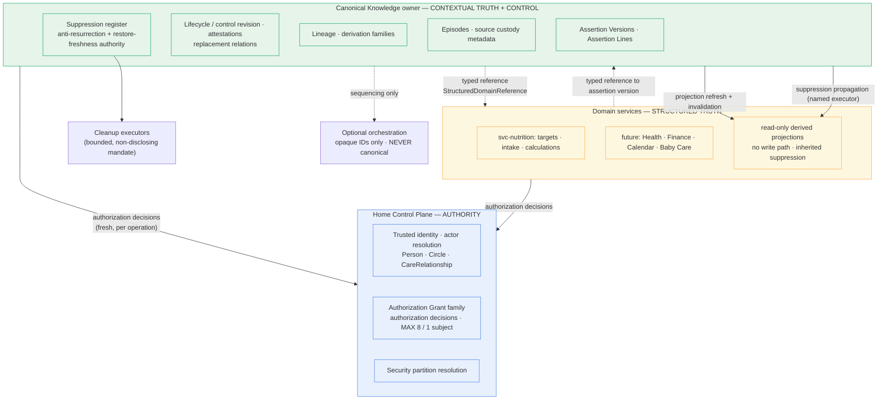

# Knowledge B5 — Ownership boundaries

Status: PROPOSED — AWAITING PRODUCT ARCHITECT REVIEW

Date: 2026-09-21

Repository: `EKvargas/episteck_home`

Main baseline: `90d1b7ad73e9c06482d6bd009623f978ffbfe947`, verified current `origin/main` after [PR #27](https://github.com/EKvargas/episteck_home/pull/27) merged and made accepted B4 authoritative on `main`. This equals the commit named in the investigation request; `main` has not moved.

Branch: `docs/knowledge-b5-ownership`

Gate: [B5 — Ownership boundaries](KNOWLEDGE_TECHNOLOGY_GATE.md#b5--ownership-boundaries)

Decision owner: Product Architect

Disposition: **NOT DECIDED — PROPOSAL ONLY**

This document is an architecture investigation and proposal. It is **not** an accepted decision, and nothing in it is authoritative until the Product Architect records a disposition. It changes no contract, schema, service, runtime, index, deployment or production system, and selects no storage, retrieval, graph, vector, orchestration, messaging or key-management technology. B1–B4 remain RESOLVED and unamended. B5 remains OPEN pending the decisions in section 18. **B6 remains OPEN. The Knowledge Technology Gate remains OPEN.** All named people and household statements are synthetic.

---

## 1. Problem statement

B1–B4 decided *what must be true* about Knowledge: one trusted partition per object, conjunctive authorization, sensitivity that follows information through transformations, lifecycle bound to exact immutable assertion versions with CAS-equivalent commits, and a durable suppression register that is authoritative independently of cleanup. None of them decided *who is accountable for making those things true*.

That gap is now load-bearing. Four accepted decisions explicitly defer to B5:

| Accepted decision | Exact deferral to B5 |
|---|---|
| [B1 §14](KNOWLEDGE_B1_SECURITY_SCOPE.md) | "Nutrition preference ownership and the Knowledge persistence owner/service boundary" |
| [B2 §13](KNOWLEDGE_B2_SENSITIVITY_INHERITANCE.md) | "Nutrition preferences, Knowledge persistence/service boundary, source/document custodianship responsibilities and migration" |
| [B3 §13](KNOWLEDGE_B3_LIFECYCLE.md) | "One accountable canonical command boundary must own atomic lifecycle decisions and receipts while Home remains grant/operation-policy authority" |
| [B4 §17](KNOWLEDGE_B4_FORGET_DELETE.md) | Six named ownership assignments, including the anti-resurrection freshness authority and a cross-owner suppression executor |

The question B5 must answer is not "where do we put a table." It is: **for each responsibility that B1–B4 made mandatory, which component is accountable, who may write, who may read, and what is authoritative?** Until that is fixed, B3's atomic commit has no boundary to be atomic *within*, B4's suppression has no owner to commit it, and the Knowledge Technology Gate cannot evaluate a persistence candidate because there is no owner whose requirements it would satisfy.

There is also a live, verified hazard. Contextual statements are already accumulating in domain-owned schema: Nutrition persists `preferences`/`dislikes` as free text, the Home Control Plane carries a dormant `Nutrition Profile` DocType with the *same* fields, and `Care Journey Item` has grown its own divergent provenance vocabulary. None of this is governed by the accepted Knowledge decisions. B5's durable value is the rule that stops this spreading, not merely the placement of a future service.

### 1.1 What B5 is not

B5 does not select technology, design retrieval, define schema, authorize migration, or approve runtime. It does not decide whether Knowledge is "in Frappe" or "in a container" as a deployment question — it decides **accountability**, from which the deployment question later follows. Section 16 explains why the recommended model deliberately leaves that placement question open.

---

## 2. Existing repository evidence

Investigation began with `git fetch origin --prune`; `origin/main` was verified at the baseline above, equal to the requested commit. The pre-existing detached checkout carried untracked `apps/home-hub/` and `docs/ref/`; both were preserved and are not part of this change. The working branch was created directly from `origin/main` with clean tracked status. All 12 existing contract tests pass on the baseline, which verifies the inspected baseline only and proves nothing about this proposal.

Read in full: [ARCHITECTURE](../ARCHITECTURE.md), [KNOWLEDGE](../KNOWLEDGE.md), [DATA_OWNERSHIP](../DATA_OWNERSHIP.md), [SECURITY_AND_CONSENT](../SECURITY_AND_CONSENT.md), [DEPLOYMENT](../DEPLOYMENT.md), [ROADMAP](../ROADMAP.md), [STATUS](../STATUS.md), the [gate register](KNOWLEDGE_TECHNOLOGY_GATE.md), accepted [B1](KNOWLEDGE_B1_SECURITY_SCOPE.md)/[B2](KNOWLEDGE_B2_SENSITIVITY_INHERITANCE.md)/[B3](KNOWLEDGE_B3_LIFECYCLE.md)/[B4](KNOWLEDGE_B4_FORGET_DELETE.md), the [independent review](../reviews/2026-09-19-knowledge-independent-architecture-review.md), and ADRs 0001–0009. Implementation was inspected directly rather than inferred from prose.

### 2.1 Findings that materially shape the proposal

| # | Verified fact | Evidence | Consequence for B5 |
|---|---|---|---|
| **F1** | **Preferences/dislikes are accepted on the general profile path, not only pregnancy.** `ProfileIn` declares `preferences`, `dislikes`, `intolerances`; `PUT /profile/{person_id}` passes `body.model_dump()` straight through `upsert_profile` to the repository. | [`main.py` L43–69](../../../services/nutrition/app/main.py), [`service.py` L121–125](../../../services/nutrition/app/service.py) | The collision is broader than the gate register's pregnancy-shaped description. Any general profile write persists contextual preference text today. |
| **F2** | **The Nutrition profile is one opaque JSON blob keyed by `person_id`.** `upsert_profile` serialises the whole dict into a single `doc` column with `ON CONFLICT DO UPDATE`. | [`sqlite_repo.py` L33–45](../../../services/nutrition/app/store/sqlite_repo.py) | A preference inside it has **no independent identity**. It cannot be versioned, attested, disputed, suppressed or referenced. Every B3 and B4 guarantee is structurally unrepresentable there. This is the decisive fact of section 9. |
| **F3** | **No delete path exists.** `NutritionRepository` declares only `upsert_profile`, `get_profile`, `add_intake`, `list_intake`, `set_consent`, `get_consent`. Repository-wide search finds no `forget`, `suppress`, `tombstone` or `anti_resurrection` symbol in `packages/`, `services/` or `apps/`. | [`repository.py`](../../../services/nutrition/app/store/repository.py); independently re-verified | B4's Scenario A is correct and remains unsatisfiable without an assigned executor. Confirmed rather than inherited from B4. |
| **F4** | **The Home Control Plane holds a dormant `Nutrition Profile` DocType with `preferences`, `dislikes`, `explicit_intolerances` — the same fields as svc-nutrition — plus a `Nutrition Intake` DocType and a `nutrition/calculator.py`.** No application code references either DocType; both grant System Manager full CRUD including delete. | [`nutrition_profile.json`](../../../apps/episteck_home/episteck_home/episteck_home/doctype/nutrition_profile/nutrition_profile.json), [`nutrition_intake.json`](../../../apps/episteck_home/episteck_home/episteck_home/doctype/nutrition_intake/nutrition_intake.json) | **Not previously recorded in any gate document.** Preference fields exist in *two* stores today, not one. This is pre-ADR-0004 residue: dormant, but installed and writable, so it is a latent dual-canonical hazard rather than a harmless leftover. Section 9.4 addresses it. |
| **F5** | **`Care Journey Item` carries its own `knowledge_status` enum** (`USER_CONFIRMED` / `EXTERNAL_REPORTED` / `AI_EXTRACTED` / `AI_HYPOTHESIS`) and rejects anything not `USER_CONFIRMED`. | [`care_journey_item.py` L20–21](../../../apps/episteck_home/episteck_home/episteck_home/doctype/care_journey_item/care_journey_item.py), [schema](../../../apps/episteck_home/episteck_home/episteck_home/doctype/care_journey_item/care_journey_item.json) | A third, divergent provenance vocabulary, overlapping but not equal to `KnowledgeProvenance`. Evidence that domains organically grow knowledge-shaped fields. The B5 rule must govern this pattern, not just Nutrition. |
| **F6** | **`StructuredDomainReference(subject_person_id, domain, owner_service, record_type, record_id)` already exists** in the contracts, and `ContextBundle` refuses it without matching subject/domain VIEW. | [`context.py` L72–89, L119–120](../../../packages/home-contracts/src/episteck_home_contracts/context.py) | The reference-not-duplicate mechanism B5 needs is already contracted in one direction. It is a foundation to build on, not something to invent. |
| **F7** | **`check_access_many` decides at most `MAX_REQUIREMENTS = 8` (domain, action) pairs for exactly ONE subject Person, resolves the actor server-side, caches nothing, and refuses the whole call on any malformed entry.** The Nutrition client verifies an allow positionally against the exact requirements sent. | [`api.py` L102, L110–192](../../../apps/episteck_home/episteck_home/api.py), [`client.py` L136–217](../../../services/nutrition/app/home_control/client.py) | A multi-subject claim (B1 scenario C needs six tuples across two Persons plus a Circle) cannot be authorized by today's endpoint at all. Any ownership model that puts a commit boundary across a service edge inherits this limit. Quantified in section 12. |
| **F8** | **Delegations are single-use; one delegated Home request per operation.** Nutrition makes exactly one call and has no separate `whoami` pre-call, by deliberate fix. | [`client.py` L17–37](../../../services/nutrition/app/home_control/client.py), [`replay.py`](../../../apps/episteck_home/episteck_home/identity/replay.py) | A commit spanning two owners cannot casually "just check again." Commit-time revalidation (B3 §11.8) across a service edge costs a fresh delegation and must be designed, not assumed. |
| **F9** | **`no cross-region DB` is an accepted deployment constraint.** Home Control Plane is Ashburn (US); domain services are Nuremberg (EU); cross-node calls go over Tailscale. Measured cross-node `check_access` p95 is ~120 ms. | [SECURITY_AND_CONSENT §Data residency](../SECURITY_AND_CONSENT.md), [DEPLOYMENT](../DEPLOYMENT.md), [STATUS L93](../STATUS.md) | Ownership placement has a latency and partition-failure profile. Any model requiring synchronous cross-node writes inside one atomic commit is operationally worse, independent of correctness. |
| **F10** | **G1.7 (EU Home Control Plane migration) is WITHDRAWN and must not be re-created.** EU residency is explicitly *not* a blocker; it is a future commercialization concern. | [ROADMAP L41–50](../ROADMAP.md) | Data residency **must not** be used as a B5 argument for or against placing Knowledge in Home. This proposal deliberately does not invoke it. |
| **F11** | **A documentation contradiction exists.** ROADMAP requires the governance layer "implemented in the Home Control Plane"; DATA_OWNERSHIP and KNOWLEDGE describe a separate `Knowledge service [CONTRACT-ONLY]`. | [ROADMAP L52–57](../ROADMAP.md) vs [DATA_OWNERSHIP L14](../DATA_OWNERSHIP.md), [KNOWLEDGE](../KNOWLEDGE.md) | Independently re-confirmed (the review raised it; it is still unresolved on `main`). B5 must resolve it explicitly rather than let two canonical documents disagree. Section 17.1. |
| **F12** | **ADR-0001 explicitly rejects `svc-home-core`**; STATUS repeats it under "Deliberately NOT done." | [ADR-0001](../adr/0001-home-control-plane-is-frappe.md), [STATUS](../STATUS.md) | A recommendation that effectively recreates a second control plane would contradict an accepted ADR. Constrains alternative B in section 4. |
| **F13** | **`KnowledgeClaim` requires a non-empty subject tuple even for CIRCLE scope, has one `domain` string, one scalar `source_episode_id`, and only `supersedes_claim_id` as an inter-claim link.** No partition field exists. | [`knowledge.py` L98–145](../../../packages/home-contracts/src/episteck_home_contracts/knowledge.py) | Contracts cannot yet express B1 partition, B2 conjunctive requirements, B3 versions/lines, or B4 families. B5 assigns *who owns fixing this*; it does not fix it. |
| **F14** | **`ContextBundle` holds claims by value with no revalidation member**, and accepts a `REVOKED` claim's full statement text. | [`context.py` L92–139](../../../packages/home-contracts/src/episteck_home_contracts/context.py); B4 probes P1/P2 | Re-verified. Reinforces that ContextBundle is a derivative, never an authority — an ownership statement B5 must record (section 13). |

### 2.2 Prior characterizations corrected

Two existing statements need correction from evidence, in the spirit of B4 §2.

First, the **gate register's B5 entry** says "Nutrition already persists preferences/dislikes; Knowledge has no runtime yet, so the duplicate canonical store is a risk to avoid, not an assertion that two stores already exist." Per **F4**, two stores with these fields *do* already exist — svc-nutrition's live profile blob and Home's dormant `Nutrition Profile` DocType. The second is unused by application code, so it is not an *active* dual-write, but it is installed, writable and un-governed. The register's framing is too reassuring and should be corrected on acceptance.

Second, the **independent review** recommends "Knowledge owns reusable food preferences" with "an explicit transition from existing Nutrition fields." That direction is sound, but it is stated as a storage-relocation outcome. Per **F2**, the more important point is structural: the current representation has no per-preference identity, so this is not a migration of comparable records but a **re-capture into a different shape**. Section 9 treats it accordingly, and this distinction changes what migration can honestly promise.

---

## 3. Ownership invariants

These are proposed as the durable, checkable rules B5 contributes. They are derived from B1–B4 rather than newly invented, and are intended to let a future team decide ownership without convening the board.

1. **One canonical owner per fact.** Every durable fact has exactly one component accountable for its truth. No fact is independently editable in two places. Unknown ownership is not a default to "both" — it fails closed and blocks admission (B3 §6 canonical routing).
2. **Authority and custody are different.** The component that decides *whether an operation may happen* (Home) is not necessarily the component that *stores the result*. Separating them is legitimate; conflating them is what produces god-services.
3. **Control state and payload share an owner.** Any state that must be evaluated atomically with a commit — lifecycle revision, replacement-line revision, suppression, admission — belongs to the same transactional owner as the content it governs. Distributing these across owners converts a CAS check into a distributed transaction (section 12).
4. **Authority is never materialized.** A projection, cache, snapshot, index or `ContextBundle` may exist durably, but may never be the basis of an authorization, lifecycle or suppression decision. Anything materialized is by definition stale until revalidated.
5. **Reference beats duplication; duplication requires a declared derivation.** A component needing another's fact holds a typed reference (F6). Where a materialized copy is operationally unavoidable, it is explicitly a derived projection with recorded lineage, an invalidation obligation, and no write path of its own.
6. **Suppression binds every owner that holds a representation.** A non-use decision is not satisfied by the canonical owner alone (B4 Scenario A). Any component holding a copy, projection or index inherits the obligation, and the propagation must have a named executor.
7. **Orchestration is never canonical.** A workflow engine, queue or job may sequence work and may hold opaque identifiers. It may never be the source of truth for admission, lifecycle, authorization or suppression (B4 §17).
8. **A domain may not grow its own governance vocabulary.** Provenance, confirmation, lifecycle and consent semantics belong to their accepted owners. F5 shows this drifts by default; the rule exists to stop it.

---

## 4. Alternative models considered

Four models were developed. Each is described as it would actually be built against this repository, not as an abstract pattern. All four preserve Home as the grant/operation-policy authority, because B1 fixes that and no evidence contradicts it.

### Alternative A — Centralized Knowledge aggregate service

A new `svc-knowledge` owns everything contextual: assertion versions, lines, lifecycle/control revision, attestations, replacement relations, lineage, Episodes, source custody metadata, the suppression register and the anti-resurrection authority. Domains keep structured facts. Home keeps identity, partition and authorization. All contextual assertions, across every domain, live in one service.

*Assessment.* This is the cleanest fit for B3 and B4. Every guarantee they require — exact-version precondition, CAS commit, one atomic outcome, business idempotency, suppression committed synchronously — lands inside a single transactional boundary and never crosses a service edge. It directly satisfies B3 §13's "one accountable canonical command boundary." It gives B4 §17 an unambiguous answer for five of its six required assignments.

Its real cost is **scope discipline**, not correctness. A service that owns "all contextual meaning across all domains" is one careless decision away from becoming the shadow database the gate register forbids. The mitigation is not architectural modesty but an enforceable admission rule (section 8): if the rule is sound, centralizing contextual assertions is safe; if the rule is unsound, no placement saves it. It also introduces a new service and a new operational surface, which ADR-0002 permits but which must be justified rather than assumed.

### Alternative B — Knowledge governance in the Home Control Plane

Knowledge persistence becomes additional DocTypes in the `episteck_home` Frappe app, alongside Person/Circle/ConsentGrant. Authorization and persistence share one transactional boundary; a commit-time authorization barrier becomes a local transaction rather than a network call.

*Assessment.* This is the ROADMAP's stated direction (F11), and it has one genuinely strong property: B3 §11.8's commit-time authorization barrier — the hardest guarantee to establish across owners — becomes trivially local. F7/F8 stop being obstacles, because there is no delegation to spend.

Three findings weigh against it. First, it places durable personal Knowledge on the node that domain services must read across a WAN (F9), inverting the current locality: today Nuremberg calls Ashburn for a *small boolean*; under B this would additionally call across for *bulk contextual content* on every retrieval, at ~120 ms p95 per authorization round trip. Second, it grows the Control Plane from "identity, relationships, consent" into the largest content store in the system, which is the second failure mode the investigation brief names, and which F4/F5 show Home already drifts toward. Third, B1 §4.2 requires trusted partition binding for every Knowledge object; Frappe's DocType/permission machinery is per-site and role-based (F4 shows System Manager CRUD on personal content), so partition isolation would have to be rebuilt inside it rather than inherited.

It does **not** contradict ADR-0001, which rejects a *second identity control plane*, not Knowledge co-location. Data residency is deliberately **not** offered as an argument here (F10).

### Alternative C — Domain-owned facts with a thin Knowledge metadata/control layer

Each domain keeps its own contextual assertions in its own store (Nutrition keeps preferences, a future Health service keeps health context). A central Knowledge component owns only cross-cutting *control*: lifecycle revision, suppression, lineage and admission policy, referencing domain-held payloads.

*Assessment.* Maximal domain autonomy and no migration. It is the only model where "Nutrition keeps its preferences" is literally true.

It fails invariant 3, and the failure is not recoverable by engineering effort. B3 requires that a lifecycle decision validate an expected content version *and* an expected control revision, then commit atomically. If content lives in Nutrition and control lives in Knowledge, every admission, correction, supersession, attestation and suppression becomes a two-owner distributed transaction — precisely what B3 §11.3's "no observable interval may expose a new current version while leaving a conflicting old one current" forbids without a consensus protocol that no accepted decision authorizes. F2 compounds it: the domain payload has no version identity for the control layer to bind to. Cross-domain reuse also collapses — a preference stated once would need N domain homes to be usable by N domains, or Knowledge becomes a router that cannot answer a simple query without fan-out.

### Alternative D — Split command/control and payload ownership ("Knowledge control plane + domain projections")

A hybrid: a Knowledge owner holds canonical assertion versions, lifecycle, lineage and suppression. Domains hold **read-only derived projections** of the assertions they need for operational use, refreshed from the canonical owner, with no independent write path and an inherited invalidation obligation.

*Assessment.* This is A plus an explicit, constrained answer to the operational-coupling objection. It preserves the single transactional boundary for everything B3/B4 require (all canonical state stays with one owner), while acknowledging that a domain service legitimately needs fast local access to, say, a dislike when generating a meal plan across a WAN link (F9).

Its risk is that "projection" degrades into "second copy people edit." That risk is manageable only with an explicit, testable rule set — no write path, declared lineage, inherited suppression, never an authorization basis — which section 13 supplies. Without those rules D is strictly worse than A, because it looks like A while behaving like C.

---

## 5. Tradeoff analysis

Per B2/B3/B4 convention, no numerical scoring. Evaluated against the dimensions the investigation requires.

| Dimension | A: centralized Knowledge service | B: Knowledge inside Home | C: domain facts + thin control | D: canonical Knowledge + domain projections |
|---|---|---|---|---|
| **B1 security consistency** | Partition binding designed in from the start for one store. Home stays sole authority. | Home is authority *and* store; partition isolation must be rebuilt inside Frappe's role model (F4). | Partition coverage must be re-established in every domain store independently — N places to get right. | Same as A; projections are additionally partition-bound and carry inherited requirements. |
| **B2 sensitivity/lineage** | Lineage graph in one owner; conjunctive requirements travel with the artifact. | Same, but mixes personal content into the control plane's blast radius. | Lineage spans owners; a derivative in one domain from a source in another cannot be bound reliably. | Same as A; each projection is a declared derivative inheriting requirements (B2 §5.2). |
| **B3 transactional guarantees** | **Fully local.** Exact-version, CAS, atomic replacement, idempotency all inside one boundary. Commit-time authorization barrier still crosses to Home (F7/F8). | **Fully local including the authorization barrier** — its single strongest property. | **Fails.** Every lifecycle command becomes a two-owner distributed transaction with no authorized protocol; F2 leaves nothing to version-bind. | Same as A. Projection refresh is explicitly *outside* the commit and may be asynchronous. |
| **B4 suppression/anti-resurrection** | One register, one freshness authority, one executor to name. | Same, co-located with authorization. | Register must consult N domain owners to establish non-use; "unknown coverage" becomes the normal case, so the system fails closed constantly. | One register; propagation to projections is an explicit, named obligation (B4 Scenario A satisfied by construction). |
| **Domain autonomy** | Domains keep all structured truth; lose contextual assertions they never governed correctly anyway (F2/F3). | Same, but domains now depend on the control plane for contextual reads too. | Maximal. | High: domains keep structured truth *and* fast local reads, without canonical authority. |
| **Cross-domain reuse** | Natural — one preference, many consumers. | Natural. | Poor — requires fan-out or duplication. | Natural, with locality. |
| **Coupling** | Domains gain a dependency on a new service for contextual reads. | Domains gain a WAN content dependency on the control plane (F9). | Low service coupling, very high *semantic* coupling via the control layer. | Moderate: hard dependency for writes, soft (cached) for reads. |
| **Operational complexity** | One new service, one new store, one backup/restore path. | No new service; a much larger control plane. | No new service; N stores must each implement suppression, lineage and versioning. | One new service plus projection refresh and invalidation machinery. |
| **Shadow-database risk** | Real, mitigated only by the section 8 rule. | Real *and* compounded — Home already drifts (F4, F5). | Inverted risk: Knowledge becomes a shadow *control* plane over data it cannot see. | Same as A, plus a distinct risk that projections become editable copies — addressed in section 13. |
| **Distributed-transaction risk** | Confined to the commit-time authorization barrier (section 12). | **Lowest** — the barrier is local. | **Highest** — pervasive and unavoidable. | Same as A. |
| **Migration impact** | Nutrition preference re-capture (section 9); dormant Home DocTypes retired (9.4). | Same data work; additionally concentrates content in Home. | None — which is why it looks attractive and is not. | Same as A, plus defining the first projection. |
| **Evolution toward B6** | Clean: one owner participates in the retrieval protocol and owns pre-use barriers. | Clean, but retrieval reaches across the WAN for content. | Hard: B6 would need to enforce eligibility over payloads it does not own. | Clean; projections are explicitly *not* a retrieval authority and must be revalidated. |
| **Fit with current Olin architecture** | Consistent with ADR-0002's independent-services pattern; adds a service, which ADR-0002 anticipates ("future … Knowledge"). | Consistent with ROADMAP's wording (F11); in tension with the Control Plane's stated scope. | Consistent with ADR-0002 superficially; violates the "one canonical owner" principle it exists to protect. | Consistent with ADR-0002 and with F6's existing reference contract. |

**C is rejected on correctness**, not preference: it cannot satisfy B3 §11 without a distributed-commit protocol that no accepted decision authorizes, and F2 shows the domain payload cannot even be version-bound today.

**B is viable and has the single best answer to the hardest transactional problem.** It is rejected as the *recommendation* — not as impossible — because it concentrates the system's most sensitive content in the component whose accepted scope is identity, relationships and consent, in a role-based permission model that F4 shows already grants blanket CRUD over personal fields, while placing that content a WAN hop from the services that consume it (F9). Its transactional advantage is real and is preserved in the recommendation by keeping the *authorization barrier* problem explicit rather than pretending it disappears (section 12).

**A and D differ only in whether domain-local materialization is permitted.** D is A with an explicit, bounded escape valve for operational locality. Choosing A and forbidding projections outright would be simpler, but F9's cross-node topology makes a projection mechanism likely to be demanded later; defining its rules now is safer than having it improvised.

---

## 6. Recommended ownership architecture

**Recommend Alternative D: a single canonical Knowledge owner holding all canonical contextual assertion state and control state, with Home remaining the sole authorization and identity authority, domains retaining all structured domain truth, and strictly-governed read-only domain projections permitted where operational locality requires them.**

Three components, three distinct accountabilities:



The load-bearing separation is between the top two boxes. **Home decides; Knowledge remembers.** Home never stores contextual assertions; Knowledge never issues a grant or resolves an actor. Neither can become the god-service, because neither holds the other's authority — and domains keep every structured fact, so Knowledge cannot become a shadow domain database either.

### 6.1 Why one Knowledge owner rather than several

B3 §11 requires that a single command validate expected content version, lifecycle/control revision and replacement-line revision, then commit one atomic outcome including admission, predecessor closure, attestation, challenge effects, decision history and the invalidation obligation. B4 requires suppression to commit synchronously in the domain and never wait on an orchestrator. These are not separable responsibilities: they are one transaction. Splitting them across owners does not distribute work — it converts a local compare-and-swap into a consensus problem.

So the answer to B5 question 1's "one logical owner or safely separated" is: **assertion versions, lines, lifecycle/control revision, attestations, replacement relations, lineage and suppression must share one transactional owner.** Episodes and source *payloads* may be separated (section 10). Everything else on that list may not.

### 6.2 What is deliberately left open

The recommendation names an **accountable owner**, not a deployment. Whether that owner is realized as a new `svc-knowledge`, a bounded module inside an existing service, or something else is an implementation decision that depends on the technology the Knowledge Technology Gate has not yet selected. Fixing deployment now would invert the gate's own `PROCESS → DOMAIN MODEL → SERVICES / APIs` sequence.

What B5 *does* fix is that the owner is **one** logical owner, distinct from Home, with the responsibilities in section 7. This is sufficient for the gate to proceed and is the minimum needed to make B3/B4 guarantees assignable. Section 18 records this as an explicit Product Architect decision (**PA-2**), because reasonable architects may wish to bind placement earlier.

---

## 7. Canonical owner / responsibility matrix

`KN` = canonical Knowledge owner. `HOME` = Home Control Plane. `DOM` = owning domain service. Authoritative means a decision may be based on it directly. Every reader remains subject to B1 authorization; "allowed readers" names components, not a permission grant.

| # | Responsibility | Canonical owner | Allowed writers | Allowed readers / consumers | Authoritative | Duplication / materialization | Governing constraint |
|---|---|---|---|---|---|---|---|
| 1 | **Trusted identity / actor resolution** | HOME | HOME only (server-side from session) | All services, via decisions | **Yes** | **Never.** No component caches an actor. | B1 §4.2; ADR-0009; F8 |
| 2 | **Security partition resolution** | HOME | Trusted server config / HOME | KN, DOM as bound context | **Yes** | **Never.** Not a payload field. | B1 §5.1 |
| 3 | **Authorization (grants + decisions)** | HOME | HOME only, via constrained processes | KN, DOM per operation | **Yes** | **Never.** A prior ALLOW is not reusable. | B1 §7, §11; B3 §11.8 |
| 4 | **Canonical Knowledge assertion (content)** | **KN** | KN only, via authorized command | Retrieval (B6), projections | **Yes** | Projection allowed (§13) | B3 §4; invariant 1 |
| 5 | **Assertion Version** | **KN** | KN only | KN, B6 | **Yes** | Reference only | B3 §4 |
| 6 | **Assertion Line + line revision** | **KN** | KN only | KN | **Yes** | **No** — replacement selection must not be materialized | B3 §4, §11.2 |
| 7 | **Lifecycle / control revision** | **KN** | KN only | KN; B6 as eligibility input | **Yes** | **No** | B3 §5, §11.1 |
| 8 | **Attestation** | **KN** | KN only, bound to exact version + actor | KN, B6 | **Yes** | Reference only | B3 §7 |
| 9 | **Replacement relation** | **KN** | KN only | KN, B6 | **Yes** | **No** | B3 §4, §8 |
| 10 | **Lineage / derivation family** | **KN** | KN, recorded at derivative creation | KN, cleanup executors | **Yes** | **No** | B2 §5.2; B4 §7 |
| 11 | **Episode (capture evidence)** | **KN** | KN only | KN, B6 (separately authorized) | **Yes** | Reference only | B3 §4; B1 §8.4 |
| 12 | **Source payload (original artifact)** | **Custodian** (§10); KN owns custody *metadata* | Custodian; KN for metadata | Separately authorized only | Yes, for the artifact | Bytes may be stored separately | B2 §8.2.2; B4 §5 |
| 13 | **Suppression state (register)** | **KN** | KN only, synchronous commit | Every pre-use barrier; executors | **Yes** | **Never.** Not cacheable as an ALLOW. | B4 §1, §8 |
| 14 | **Anti-resurrection state** | **KN** | KN only | Admission + re-admission barriers | **Yes** | **No** | B4 §10, C2 |
| 15 | **Restore-freshness authority** | **KN** (§11.3) | KN only | Restore reconciliation | **Yes** | **No** — must be provably current, not a copy | B4 C1, §12.1 |
| 16 | **Cleanup orchestration** | KN commands it; orchestrator sequences | KN; orchestrator holds opaque IDs | Operators | **No** | N/A | B4 §17; invariant 7 |
| 17 | **Cleanup execution** | Executor per store, under bounded mandate | Executor within its store | — | **No** (receipts are evidence, not authority) | N/A | B4 §14; B1 §109 |
| 18 | **Domain canonical state** | **DOM** | DOM only | KN by reference; B6 authorized | **Yes** | **No** second canonical copy | ADR-0002, ADR-0004 |
| 19 | **Domain Knowledge projection** | **KN** owns it; DOM hosts it | **KN only** — DOM has no write path | DOM operationally | **No** | This *is* the materialization; §13 rules | invariants 4, 5, 6 |
| 20 | **Retrieval / candidate selection** | **RESERVED FOR B6** | — | — | — | — | B6 |
| 21 | **ContextBundle** | Ephemeral derivative of a request | Assembler | Agent, for that request | **No — never authority** | Must not persist as a cross-domain store | B1 §12; B4 §13; F14 |

Rows 20 and 21 are recorded to fix their *status*, not to design them. B5 states that ContextBundle is not an authority and that retrieval is B6's; it designs neither.

---

## 8. Domain fact versus contextual Knowledge — the durable rule

This is the rule intended to outlive B5 and let future teams decide without escalation.

> **A fact belongs to a domain service when the system is accountable for its accuracy as a record of what happened or what applies, and it is produced or validated by that domain's own process.**
>
> **A fact belongs to Knowledge when it is a durable, reusable expression of a person's or household's meaning — a preference, goal, constraint, routine, decision or rationale — whose value is that someone asserted it, and which is reusable across more than the domain that happens to consume it first.**

Four discriminating questions, applied in order:

1. **Who is accountable if it is wrong?** If a domain's calculations, compliance or operational output would be wrong — it is a domain fact. If the answer is "we recorded what the person said, and they can correct it" — it is contextual Knowledge.
2. **Is it produced by a domain process or asserted by a person?** Measured, calculated, imported from a provider, or transacted → domain. Stated, preferred, decided, explained → Knowledge.
3. **Would it still be meaningful if the domain did not exist?** "I dislike mushrooms" survives the deletion of every meal planner. "Vitamin D target = 20 µg" does not survive the deletion of Nutrition.
4. **Does it need attribution, attestation, dispute or forgetting?** These are B3/B4 lifecycle facilities. A fact needing them needs Knowledge's machinery; a fact for which they are meaningless does not.

Question 3 is the sharpest single test and should be used first when the others are ambiguous.

### 8.1 Explicit answers to B5 question 5

- **Nutrition owns the meal plan; Knowledge owns "I dislike mushrooms."** The plan is a domain artifact produced by a domain process (Q1, Q2). The dislike is an attributed assertion, reusable by Nutrition, a future shopping feature, a restaurant suggestion and Ask Olin (Q3), and must support correction and forgetting (Q4).
- **Operational necessity does not confer ownership.** Nutrition *needs* the dislike to plan a meal; a payroll system needs a person's name without owning identity. Necessity creates a read requirement, satisfied by reference or projection (section 13) — never by a second canonical copy. This directly answers "does operational requirement make the domain the canonical owner": **no.**
- **Knowledge may reference domain state**, via the existing `StructuredDomainReference` (F6). It fetches current values under separate authorization and never persists them as durable Knowledge (KNOWLEDGE.md; B2 §12).
- **Domains may reference Knowledge**, by exact assertion version. A domain must not store assertion *text* as its own field; if it needs local text it takes a governed projection (§13).
- **Duplication is prohibited** whenever both copies would be independently writable, or where the copy would be treated as authoritative for a lifecycle, authorization or suppression decision.
- **A projection is permitted** when it is read-only, declares its canonical source and version, inherits suppression, and is never an authorization basis.
- **Lineage** is represented by the canonical owner recording, at creation, each derivative's partition, direct inputs by exact version, family root, kind and classification revision (B4 §7). A projection is a derivative and records the same.
- **What stops Knowledge becoming a shadow database** is Q1 and Q2 together, enforced at admission via B3 §6 canonical-domain routing: content that a domain is accountable for is *routed to that domain and refused durable Knowledge admission*. Knowledge cannot accumulate domain facts, because admitting one is a routing failure, not a storage decision. This is the single most important enforcement point in the proposal.

### 8.2 The rule applied to the brief's future examples

These deliberately do not all have the same answer — that is the test of a real rule.

| Example | Canonical operational fact | Contextual assertion? | Reference direction | Lifecycle | Suppression meaning | Deletion propagation |
|---|---|---|---|---|---|---|
| **"Baby usually drinks 140 ml at 03:00"** | None yet. The *observations* (individual feeds) are domain facts of a future Baby Care service. | **Yes** — "usually" is a generalization with applicability, correctable and time-bounded (Q2, Q4). It is not an observation. | Assertion may reference the feed records that motivated it; Baby Care does not reference the assertion for its own records. | Full B3: admission, CHANGE as the baby grows, expiry of applicability. | Stop using the generalization in guidance. Individual feed observations are untouched. | Forgetting the pattern does not delete feeds; deleting feeds suppresses a pattern *derived* from them (B4 §9), but not one independently asserted by a parent. |
| **"Erick prefers notifications only after 08:00"** | The notification service's **effective configuration** is a domain fact — it must be operationally reliable. | **Yes**, as the stated preference and its rationale. The two are genuinely distinct: the config is what the system will do; the preference is what Erick wants. | Config references the assertion version it was derived from; the assertion does not depend on the config. | Preference: B3 lifecycle. Config: ordinary domain state. | Suppressing the preference stops using it as reusable context and obliges re-derivation or reversion of the config. | Deleting the assertion must propagate to the config's derivation, per invariant 6. A user who forgets the preference but keeps a quiet-hours setting they later set directly is a legitimate outcome. |
| **"Bedroom CO₂ exceeded a threshold yesterday"** | **Device Gateway / Healthy Home.** A measurement with device provenance (Q1, Q2 — measured, not asserted). | **No.** This is an observation, not meaning. Knowledge must refuse it at admission. | Knowledge may reference it as evidence for an assertion such as "we ventilate the bedroom before bed." | Domain retention, not B3. | Not a Knowledge suppression at all; a data-retention question for the owning domain. | Deleting the measurement suppresses Knowledge assertions *derived* from it (B4 Scenario C), not independently asserted routines. |

The third case is the important one: it shows the rule **refusing** something, which is what prevents shadow-database growth. A rule that admits everything is not a rule.

---

## 9. Nutrition preferences/dislikes — proposed resolution

### 9.1 Exactly what exists today

Per F1–F4, verified:

- `ProfileIn` accepts `preferences`, `dislikes`, `intolerances` on `PUT /profile/{person_id}`; `upsert_profile` writes the whole dict through unchanged.
- `PregnancyProfileIn` accepts the same three plus `avoided_foods`, stored under `context: "PREGNANCY"` with `intolerances` renamed to `explicit_intolerances`.
- Storage is a single JSON `doc` per `person_id`, upserted wholesale. **No per-preference identity, version, provenance, attribution, applicability interval or delete path.**
- Home additionally holds a dormant `Nutrition Profile` DocType with `preferences`, `dislikes`, `explicit_intolerances` — same concept, second store, unreferenced by code, System Manager CRUD.
- Every write is authorized by Home under NUTRITION/UPDATE. The text is otherwise ungoverned: no B1 subject set, no B2 classification, no B3 lifecycle, no B4 suppression.

Two consequences follow immediately. First, a "dislike" recorded today cannot be forgotten, attested, disputed or corrected as a distinct thing — only overwritten wholesale. Second, free text in these fields can already carry HEALTH-sensitive content ("no shellfish, anaphylaxis") under NUTRITION-only authorization, with no B2 classification. That second point is a **current-state observation**, not a claimed incident, and it is exactly the exposure the accepted decisions exist to close.

### 9.2 Alternatives for these records

| Option | Assessment |
|---|---|
| **Retain domain ownership** | Contradicts section 8 (Q3: the dislike outlives Nutrition) and leaves B4 Scenario A unsatisfiable. Preferences would stay ungoverned indefinitely. Rejected. |
| **Transfer canonical ownership to Knowledge** | Consistent with the rule and with the review's direction. Requires re-capture, not row migration (F2). **Recommended**, subject to 9.3. |
| **Split preference categories** | Genuinely necessary, but as a *classification* matter, not an ownership split. See below. |
| **Reference canonical Knowledge** | The end state for Nutrition: hold typed references to assertion versions. Recommended, combined with transfer. |
| **Maintain explicitly derived projections** | Recommended where Nutrition needs local text across the WAN link (F9), under section 13's rules. |
| **Transitional migration approach** | Required. Recommended shape in 9.3. |

On splitting: `preferences` and `dislikes` are reusable taste assertions → Knowledge. `intolerances` / `explicit_intolerances` / `avoided_foods` are **not** safely in the same class. An intolerance may be a medical fact belonging to a future Health/FHIR owner, a user-stated avoidance, or an allergy — which the Knowledge Technology Gate's first vertical *explicitly excludes* ("allergy", "medical contraindication"). Proposed treatment: **taste preferences and dislikes transfer to Knowledge; intolerance-shaped fields are out of scope for B5 and must not be moved by default.** Their ownership is a Health-architecture decision (**PA-6**). Moving them as a side effect of a preference decision would be exactly the over-reach section 8 warns against.

### 9.3 Proposed conceptual end state and transition

End state:

1. Knowledge is canonical for reusable taste preferences and dislikes, with full B1–B4 governance.
2. Nutrition retains all structured Nutrition truth (targets, intake, calculations) — ADR-0004 unchanged.
3. Nutrition consumes preferences by reference, or via a governed read-only projection.
4. **No independently editable second copy exists anywhere.**

Because F2 means existing values have no identity, provenance or attribution, the honest transition is:

- **Do not silently convert existing blob text into admitted assertions.** That would fabricate provenance and attribution, violating B3 §6 (admission requires trusted save intent, approved class, routing, B1/B2 checks) and B2 §D3 (independence cannot be assumed).
- Treat existing values as **legacy unattributed domain text**: retained, readable, explicitly *not* admitted Knowledge, and marked as such.
- Admit preferences into Knowledge through the normal capture path going forward, with real save intent and attribution.
- Optionally offer the user an explicit review-and-confirm path that turns a legacy value into a properly attributed assertion — a B3 admission event, not a migration script.
- Once Knowledge is authoritative for a preference, **close the domain write path** so the field cannot be independently edited (invariant 1).
- Legacy text remains subject to suppression propagation from day one (invariant 6), because B4 Scenario A's promise must hold even for un-migrated values.

This is deliberately slower than a data move, and it is the only version that does not manufacture governance metadata that never existed. **No migration is implemented or authorized here**; this records what should happen if the proposal is accepted.

### 9.4 The dormant Home DocTypes (F4)

`Nutrition Profile` and `Nutrition Intake` in `episteck_home` contradict ADR-0004 as schema, even though no code uses them. Proposed treatment: **explicitly retire them** — documented as superseded by ADR-0004, then removed or restricted in a separately approved change. They are not a second canonical store *in practice*, but they are installed, writable, and would become one the moment anything wrote to them.

This is recorded as a finding requiring Product Architect direction (**PA-5**), not as an authorized change. Similarly, `Care Journey Item.knowledge_status` (F5) should be reviewed against `KnowledgeProvenance` so one vocabulary governs provenance; also **PA-5**.

---

## 10. Source and Episode custody

B5 question 7 asks whether Knowledge owns sources themselves or only references. Proposed answer: **Knowledge owns the Episode and custody metadata; it does not necessarily own the source payload bytes.**

| Artifact | Canonical owner | Rationale |
|---|---|---|
| **Episode** (capture evidence: what happened, when, by whom, referencing what) | **KN** | It is Knowledge's own evidence of an admission/confirmation event. B3 §4 makes Episodes evidence, and they bind directly to assertion versions. |
| **Source custody metadata** (identity, version, type, classification, applicable use restrictions, custody authority) | **KN** | B2 requires source restrictions to propagate into derivatives; the propagating owner must hold the metadata. B4 requires source-identity suppression to bar re-import. |
| **Source payload** (the document, photo, message bytes) | **Custodian** — Knowledge for conversational captures it originates; a future Documents service for uploads; the originating provider where applicable | Large binary storage has different scaling, retention and access properties. B2 §8.2.2 already distinguishes source-handling authority from Person authority. The review notes one physical store may initially hold both without changing conceptual ownership. |
| **Source extraction artifacts** (chunks, spans, extracted text) | **KN** | Derivatives under B2 §5.2, members of a B4 §7 derivation family. |
| **Assertions derived from sources** | **KN** | Canonical contextual Knowledge. |

The custodian distinction matters because **B2 §8.2.2 and B4 §5 assign source deletion to source-handling authority, not Knowledge MANAGE.** If Knowledge owned every payload it would also absorb that authority, collapsing a separation the accepted decisions deliberately created.

### 10.1 DELETE SOURCE versus FORGET, operationally

Both commit suppression synchronously in the Knowledge owner; they differ in target, authority and blast radius.

| | FORGET (durable Knowledge) | DELETE SOURCE |
|---|---|---|
| Target | An assertion version and its derivation family | The original artifact and its Episode payload |
| Authority | B1 Q(MANAGE) plus the authorized removal process | **Source-handling / custody authority** (B2 §8.2.2) — *not* Knowledge MANAGE |
| Suppression committed | On the assertion, its family, and re-extraction of the proposition | On the source identity, barring re-import, plus the source-derived family |
| Source afterwards | **Untouched** | Erased by its custodian, evidenced |
| Derived assertions afterwards | N/A | Suppressed and erased with the family, except independently-supported assertions, approved B2 projections, or explicit source-only intent (B4 D4) |
| Independent assertions | Untouched | Untouched — separate lineage (B4 §9) |
| Where offered | Memory context | **Document/source context** (B4 §14.1) — deliberately not presented as a "forget" variant |

Both commands are **accepted by the Knowledge owner**, because both commit suppression and suppression is single-owner (invariant 3). `DELETE SOURCE` additionally issues an erasure obligation to the payload custodian, which returns a cleanup receipt. The custodian never decides suppression; the Knowledge owner never overrides custody authority.

---

## 11. Suppression, forget and delete ownership

Answering B4 §17's six required assignments explicitly.

| B4 §17 requirement | Proposed assignment |
|---|---|
| **One accountable command boundary owning suppression commit and the register** | **KN.** Suppression commits synchronously with the domain outcome, never waiting on orchestration (B4 §17). |
| **Ownership of the anti-resurrection authority and its freshness proof (C1)** | **KN**, as a responsibility distinct from ordinary payload persistence — see 11.3. |
| **Named executor for cross-owner suppression propagation** (required by Scenario A) | **KN commands; each holder executes within its own store and returns a receipt.** See 11.2. |
| **Custody authority for source erasure, distinct from Knowledge MANAGE** | **Payload custodian** (section 10), acting on a KN-issued obligation. |
| **Partition-bound, non-disclosing cleanup mandate** | A bounded mandate issued by KN per obligation: scoped to one partition and one family, capable only of erasure and receipt, never of disclosure or read-for-other-purposes. B1 §109 requires it be separately approved — **PA-4**. |
| **Retention ownership for the differentiated elements in §10.1** | **KN** owns both schedules, kept independent: anti-resurrection matching state persists while the prohibition is in force; actor/decision metadata is minimized on its own basis (B4 D3). |

### 11.1 Why suppression cannot be distributed

B4's core inversion is that correctness must not depend on the least reliable cleanup path. If suppression state were partitioned across owners, "is this suppressed?" would require a distributed query whose unavailability is common — and B4 §8's invariant is that *no path into usable state may bypass the register*. A register that is sometimes unreachable converts a safety property into an availability property. One owner, consulted by every barrier, is the only shape that preserves it.

### 11.2 Cross-owner propagation (B4 Scenario A)

Verified by F3: Nutrition holds preference text with no delete path. So suppression propagation is mandatory, not optional.

Proposed division:
- **KN commits suppression immediately** — the authoritative non-use fact, independent of any other owner's cooperation. This is what makes the user-facing promise true at acknowledgement.
- **KN issues an erasure/invalidation obligation** to every holder of a representation (projections, indexes, caches, legacy domain text).
- **Each holder executes within its own store** under the bounded mandate and returns a cleanup receipt. A holder cannot refuse the prohibition; it can only be slow, and slowness degrades to "prohibited but not yet erased" (B4 §4).
- **KN records completion only on evidence from every required store** (B4 §14).

For an un-migrated Nutrition preference (9.3), this means: suppression commits in KN, Nutrition is obliged to clear the legacy text, and until the receipt returns the state is honestly `ERASURE PENDING`, not `ERASED`.

### 11.3 Restore-freshness authority (B4 C1)

This is the subtlest assignment and deserves its own statement, because the naive answer is wrong.

The invariant is that restored data must not become usable unless the control state used for reconciliation is provably at least as current as the payload. **The failure mode is precisely that the control state was restored from the same snapshot as the payload.** Therefore assigning the freshness authority to "whoever owns the register" is necessary but not sufficient — it must additionally be true that the authority's currency can be established *independently of the payload's own backup lineage*.

Proposed assignment: **KN owns the restore-freshness authority as a responsibility explicitly separable from its ordinary payload persistence.** Concretely, B5 requires that:

- KN can state a positive currency claim for its anti-resurrection state, not merely possess it.
- That claim must be establishable without relying solely on the same snapshot that carries the restored payload.
- Unknown or unprovable currency leaves restored Knowledge **unusable**, not merely stale (B4 §12.1).
- Partial availability is acceptable: unaffected domains may return while Knowledge stays withheld.

**No persistence, replication or attestation mechanism is selected** — B4 explicitly reserved that, and it is a technology question the Knowledge Technology Gate must handle. What B5 fixes is that the obligation has a single named owner and that owner's design must satisfy it. This is recorded as **PA-3** because it constrains the eventual technology selection more tightly than any other B5 assignment.

### 11.4 What the Knowledge owner must not own

To keep the god-service failure mode closed: KN does not resolve actors, issue or evaluate grants, resolve partitions, own domain structured truth, or execute cleanup inside another owner's store. It commands, records and refuses — it does not authorize.

---

## 12. Transaction and command boundaries

B3 §11's ten obligations must survive the ownership split. The recommended model keeps nine of them inside one boundary. The tenth genuinely crosses one, and this section states that honestly rather than assuming it away.

| B3 §11 obligation | Where it lives under the recommendation |
|---|---|
| 1. Exact preconditions | **Local to KN.** All bound revisions are KN-owned (matrix rows 5–10). |
| 2. CAS-equivalent commit | **Local to KN.** |
| 3. One atomic domain outcome | **Local to KN.** Admission, closure, attestation, challenge effects, history and the invalidation obligation are all KN state. |
| 4. Business idempotency | **Local to KN**, keyed on partition + actor + operation kind. |
| 5. No replay disclosure | **Local to KN**; receipts are KN-owned and non-authoritative. |
| 6. Capture duplicates | **Local to KN** via source identity/version and capture intent. |
| 7. Transition races | **Local to KN.** |
| 8. **Commit-time authorization barrier** | **CROSSES to HOME.** See below. |
| 9. No stale disclosure/publication | Shared: KN owns eligibility state; B6 owns the disclosure protocol. |
| 10. Finite retention, durable correctness | **Local to KN** (B4 D3 schedules). |

### 12.1 The commit-time authorization barrier is the one real cross-boundary problem

B3 §11.8 requires that authorization be revalidated at commit, with an enforceable ordering against revocation: if revocation is accepted before commit, deny; if commit orders first, revocation bars future use; unknown order means no commit.

Under **any** model where Home is the authorization authority and something else persists Knowledge — including alternatives A, C and D — this barrier spans two owners. Only alternative B makes it local, which is its genuine and acknowledged advantage.

F7 and F8 quantify the difficulty precisely:
- One delegated Home request per operation; delegations are **single-use** (F8), so a commit cannot casually re-check.
- `check_access_many` covers at most **8** (domain, action) pairs for **one** subject (F7).
- A B1 scenario-C claim needs `{Circle, Person E, Person A} × {KNOWLEDGE, HOUSEHOLD}` = **6 tuples across three resources and two Persons** — not expressible in one call today, at any limit, because the endpoint is single-subject.
- Cross-node p95 is ~120 ms (F9), so a naive check-then-commit-then-recheck pattern is both incorrect and slow.

B5 therefore states the requirement and its owner, and explicitly defers the protocol:

- **HOME owns the authorization decision and its freshness semantics.** KN must not cache, infer or re-derive it (invariant 4).
- **KN owns commit ordering.** It must not commit without a decision it can bind to the commit, and must fail closed on unknown ordering.
- **A bounded, complete, multi-resource decision protocol is required and does not exist today.** B1 §5.1 already forbids solving it by looping single-use tokens over the current endpoint.
- Designing that protocol is **B6's** responsibility (B3 §13 assigns the mechanism to B5/B6; B5 assigns the owners, B6 designs the exchange).

This is the sharpest limitation of the recommendation, and it is recorded as an open risk (section 17) rather than glossed. It is not a reason to prefer C, which has the same problem *plus* distributed transactions on every lifecycle command.

### 12.2 Propagation outside the commit

Projection refresh, index updates, cleanup and orchestration notification are all **outside** the atomic outcome. B4 §4 already establishes that correctness must not depend on them. An outbox-style durable handoff is one conceptual option for the commit→propagation seam; **no mechanism or technology is selected.** What B5 fixes is that nothing outside the commit may be required for the commit to be correct, and that the failure window between a KN commit and any downstream notification must be explicit in the eventual design.

---

## 13. Reference, projection and duplication rules

| Form | May be durable? | May be authoritative? | Rules |
|---|---|---|---|
| **Canonical record** | Yes | **Yes** | Exactly one owner (invariant 1). |
| **Reference** | Yes | No (it *points at* authority) | Typed, partition-local, validated before content load. Knowing an ID is not authorization (B1 §5.2). |
| **Derived projection** | Yes | **No** | See below. |
| **Materialized representation** (chunk, embedding, summary, index entry) | Yes | **No** | B2 §10.2 derivative; family member (B4 §7); ineligible when suppressed, before physical removal. |
| **Cache** | Yes | **No** | Must carry invalidation binding. A cached ALLOW is never authorization (B2 §10.2). |
| **Snapshot / backup** | Yes | **No** | Restore is a re-admission event subject to §11.3 freshness. |
| **ContextBundle** | **Should not persist** | **No — never** | Ephemeral, request-bound. Must not become a durable cross-domain store (B6 question). F14: no revalidation hook exists today. |

**A derived projection is permitted only when all of the following hold.** These are the rules that keep alternative D from degrading into alternative C:

1. It declares its canonical source owner and the **exact assertion version** it reflects.
2. It has **no write path** — not through an API, not through an admin UI, not through a direct store write. The hosting service can read it and nothing else.
3. It inherits the source's B2 requirements and restrictions in full.
4. It is a **recorded derivation-family member**, so B4 cleanup reaches it by construction.
5. It carries an **invalidation binding** and becomes ineligible on suppression, reclassification or supersession *before* physical removal.
6. It is **never** the basis of an authorization, lifecycle or suppression decision.
7. Its staleness is bounded and explicit; unknown freshness makes it ineligible, not merely old.

If a proposed copy cannot satisfy all seven, it is a prohibited duplicate, not a projection. This is a testable checklist, which is the point.

---

## 14. Home Control Plane boundary

| Responsibility | Home | Knowledge owner | Rationale |
|---|---|---|---|
| Trusted identity / actor resolution | **Yes** | No | ADR-0009; actor is never an input anywhere |
| Security partition resolution | **Yes** | No — consumes bound context | B1 §5.1 |
| Authorization decisions | **Yes — sole authority** | No | B1 §4.11; ADR-0008 |
| Delegated authority (grants, stewardship, issuance) | **Yes** | No | B1 §7.1 |
| Cross-domain policy (which domains exist, what actions mean) | **Yes** | No | SECURITY_AND_CONSENT |
| Knowledge persistence | No | **Yes** | Sections 6, 7 |
| Lifecycle commands | No | **Yes** | B3 §13 single command boundary |
| Suppression authority | No | **Yes** | B4 §17 |
| Orchestration | Neither owns canonically | Commands it | invariant 7 |
| Domain business logic | No | No | Domain services (ADR-0002) |

Two failure modes, both closed by construction:

- **Knowledge as god-service** — prevented because KN holds no authority: it cannot resolve an actor, cannot issue or evaluate a grant, cannot resolve a partition, and cannot admit a domain fact (section 8.1 routing).
- **Home as universal database** — prevented because Home holds no contextual content and no domain truth. F4 and F5 show Home has drifted in this direction; section 9.4 proposes correcting it.

This preserves ADR-0001 exactly: Home remains the Control Plane for identity, relationships and consent, and **no `svc-home-core` is proposed**. A Knowledge owner is not a second control plane — it holds no control-plane responsibility.

---

## 15. B5 / B6 responsibility boundary

| Area | B5 (this proposal) | B6 (remains OPEN) |
|---|---|---|
| Trusted retrieval protocol | Names KN as the participant that owns eligibility state | Designs the protocol |
| Candidate authorization before retrieval | Confirms HOME is the decision authority; KN supplies protected security metadata | Designs the exchange and its bounds |
| Suppression before candidate selection | Assigns the register to KN; requires every barrier to consult it | Designs where barriers sit and how they are invoked |
| Revalidation before disclosure | States ContextBundle is never authority (row 21) | Designs the revalidation hook (F14: none exists) |
| Lifecycle/time eligibility during retrieval | Assigns lifecycle/control revision to KN | Designs eligibility evaluation at retrieval |
| Exact-version ContextBundle semantics | States versions are KN-owned | Designs version carriage and binding |
| Stale context invalidation | Assigns invalidation obligation to KN at commit | Designs propagation and enforcement |
| Cache/index invalidation protocol | Requires family-aware reachability (B4 §7) | Designs the protocol |
| Bounded retrieval | — | B6 |
| Source expansion authorization | Assigns custody (section 10) | Designs authorization of expansion |
| Ask Olin context construction | — | B6 |
| Concrete freshness/enforcement protocol | States the requirement and owner (§11.3, §12.1) | Designs the mechanism |
| **Multi-resource authorization protocol** | Identifies it as required and absent (F7, §12.1) | **Designs it** |

**B6 remains OPEN. Nothing here resolves it.**

---

## 16. Migration implications

If accepted, the following work becomes necessary. **None is authorized by this proposal**, and each requires separate approval.

1. **Contract evolution** (F13): partition, complete conjunctive requirements, assertion version/line identity, derivation families, attestations, suppression. Owner: KN, with Home unchanged.
2. **Nutrition preference transition** (§9.3): legacy text marked non-admitted; forward capture through Knowledge; domain write path closed once Knowledge is authoritative; suppression propagation from day one.
3. **Intolerance fields** (§9.2): deliberately **not** moved. Deferred to Health architecture (**PA-6**).
4. **Dormant Home DocTypes** (§9.4): `Nutrition Profile` / `Nutrition Intake` retired as superseded by ADR-0004 (**PA-5**).
5. **Provenance vocabulary alignment** (F5): `Care Journey Item.knowledge_status` reconciled with `KnowledgeProvenance` (**PA-5**).
6. **Documentation reconciliation** (F11): ROADMAP versus DATA_OWNERSHIP/KNOWLEDGE (§17.1).
7. **Multi-resource authorization protocol** (§12.1): required before any Knowledge runtime; B6.
8. **Bounded cleanup mandate** (§11): separately approved per B1 §109 (**PA-4**).

Explicitly **not** required by acceptance: any new service deployment, any storage selection, any schema change, any data movement, any Nutrition runtime change, any Home runtime change.

---

## 17. Risks and open questions

| # | Risk | Assessment |
|---|---|---|
| R1 | **The commit-time authorization barrier crosses an owner boundary** (§12.1) | The most significant limitation. Inherent to any model where Home authorizes and another owner persists. Mitigated by keeping all other B3 obligations local; resolved only by B6's protocol. Alternative B avoids it at costs stated in §4. |
| R2 | **Projections degrade into editable copies** | Mitigated by §13's seven testable rules. Residual risk is organizational, not architectural: someone adds a write path. Recommend the rules become an acceptance criterion. |
| R3 | **Knowledge accumulates domain facts anyway** | Mitigated by §8's routing-at-admission rule. Residual risk is a wrong routing judgment; B3 §6 already fails closed on unknown ownership. |
| R4 | **Restore-freshness cannot be satisfied cheaply** (§11.3) | Real. It constrains technology selection more than any other requirement. Unknown freshness failing closed means a restore could leave Knowledge unusable — operationally painful but correct. Must be evaluated by the Technology Gate, not assumed. |
| R5 | **Legacy Nutrition text is unsuppressible until propagation exists** | Currently true regardless of B5 (F3). Acceptance makes it an explicit obligation with a named executor rather than an unowned gap. |
| R6 | **Preference fields carry unclassified sensitive content today** (§9.1) | A current-state exposure, not created by B5. Closing it requires B2 classification at admission, which needs an owner — which is what B5 assigns. |
| R7 | **Deployment placement deferred** (§6.2) | Deliberate, to preserve the gate's sequence. If the Product Architect prefers to bind it now, **PA-2** is the decision point. |

### 17.1 Documentation inconsistencies found

1. **ROADMAP vs DATA_OWNERSHIP/KNOWLEDGE** (F11): governance "implemented in the Home Control Plane" versus a separate `Knowledge service [CONTRACT-ONLY]`. **Unresolved on `main`.** The recommendation is consistent with DATA_OWNERSHIP; ROADMAP's wording would need correction on acceptance. Flagged, not edited — correcting canonical documents requires an accepted decision first.
2. **Gate register B5 framing** (§2.2): says duplicate stores are "a risk to avoid, not an assertion that two stores already exist"; F4 shows two stores with these fields do exist, one dormant.
3. **Home Nutrition DocTypes vs ADR-0004** (F4): schema contradicts an accepted ADR.
4. **`Care Journey Item.knowledge_status` vs `KnowledgeProvenance`** (F5): two divergent provenance vocabularies.
5. **KNOWLEDGE.md lifecycle** (`PROPOSED → ACTIVE → …`) predates accepted B3, which makes ACTIVE a derived label and adds ADMITTED/REJECTED/HELD. B3 §1 already anticipates this ("governs where older documentation is less precise, pending later consolidation"). Noted for eventual consolidation, not a new conflict.

None of these contradicts B1–B4 in a way that requires reopening them.

---

## 18. Product Architect decisions required

| # | Decision | Proposal's recommendation |
|---|---|---|
| **PA-1** | **Ownership model.** Accept D (canonical Knowledge owner + Home authority + domain structured truth + governed read-only projections)? Or A (no projections), or B (Knowledge inside Home)? | **Accept D.** A is acceptable if projections are to be forbidden outright; B is viable but concentrates content in the Control Plane (§4, §5). |
| **PA-2** | **Deployment placement.** Leave "one logical Knowledge owner" without binding it to a service/deployment until the Technology Gate, or bind it now? | **Leave open** (§6.2), to preserve the gate's `PROCESS → DOMAIN MODEL → SERVICES` sequence. |
| **PA-3** | **Restore-freshness authority.** Accept that KN owns it as a responsibility separable from ordinary persistence, with unknown freshness leaving Knowledge unusable? | **Accept** (§11.3). Constrains technology selection; no mechanism selected. |
| **PA-4** | **Bounded cleanup mandate.** Approve the concept of a partition-bound, non-disclosing, erase-and-receipt-only mandate issued per obligation? | **Approve in concept**; B1 §109 requires separate approval before implementation. |
| **PA-5** | **Pre-existing collisions.** Direct retirement of the dormant Home `Nutrition Profile`/`Nutrition Intake` DocTypes and reconciliation of `Care Journey Item.knowledge_status`? | **Direct both**, as separately approved changes (§9.4). |
| **PA-6** | **Intolerance scope.** Confirm that intolerance/avoidance fields are **out of B5 scope** and deferred to Health architecture? | **Confirm** (§9.2). Moving them under a preference decision would over-reach. |
| **PA-7** | **Nutrition transition shape.** Accept re-capture with legacy text marked non-admitted, rather than converting existing blob values into admitted assertions? | **Accept** (§9.3). Conversion would fabricate provenance, contradicting B3 §6 and B2 D3. |
| **PA-8** | **Domain fact vs Knowledge rule.** Accept §8's rule and four questions as the durable, reusable ownership test? | **Accept.** It is the deliverable most likely to outlive the specific model. |
| **PA-9** | **Documentation reconciliation.** Direct correction of the ROADMAP/DATA_OWNERSHIP contradiction and the gate register's B5 framing on acceptance? | **Direct**, as part of accepting B5 (§17.1). |

---

## 19. Proposed B5 acceptance criteria

B5 may be considered resolved when the Product Architect has:

1. Recorded a disposition on **PA-1 through PA-9**.
2. Confirmed that every responsibility in the section 7 matrix has exactly one canonical owner, and that no responsibility is jointly owned.
3. Confirmed that all state B3 §11 requires to be validated atomically shares one transactional owner (invariant 3), and accepted §12.1's statement that the commit-time authorization barrier crosses to Home and is B6's protocol to design.
4. Confirmed that all six B4 §17 ownership requirements are assigned (§11).
5. Accepted the domain-fact-versus-Knowledge rule (§8) and its application to the three future examples (§8.2), including that they do **not** all resolve the same way.
6. Accepted the reference/projection/duplication rules (§13), including the seven-condition projection test.
7. Accepted the Nutrition resolution and transition shape (§9), with intolerances explicitly out of scope.
8. Directed treatment of the pre-existing collisions (§9.4) and documentation inconsistencies (§17.1).
9. Confirmed that **B6 remains OPEN** and the **Knowledge Technology Gate remains OPEN**, and that no technology, runtime, schema, migration or deployment is approved.

Acceptance of B5 supplies no runtime approval, no technology selection, and no authorization to implement anything described here.

---

## 20. Verification and change boundary

This change adds this proposal and updates the B5 entry and status references in the gate register. B1–B4 accepted decisions, canonical architecture documents, ADRs, contracts, services, apps, deployment and production are untouched.

```json
{
  "task": "knowledge_b5_architecture_proposal",
  "baseline_main_sha": "90d1b7ad73e9c06482d6bd009623f978ffbfe947",
  "main_moved_since_requested_commit": false,
  "baseline_tracked_worktree_clean": true,
  "existing_contract_tests_passed": 12,
  "recommended_model": "canonical Knowledge owner with Home authority, domain structured truth, and governed read-only projections",
  "alternatives_evaluated": 4,
  "b1": "RESOLVED",
  "b2": "RESOLVED",
  "b3": "RESOLVED",
  "b4": "RESOLVED",
  "b5": "PROPOSED — AWAITING PRODUCT ARCHITECT DECISION",
  "b6": "OPEN",
  "knowledge_technology_gate": "OPEN",
  "technology_selected": false,
  "deployment_placement_selected": false,
  "contracts_or_schemas_changed": false,
  "knowledge_runtime_implemented": false,
  "migration_performed": false,
  "production_changed": false
}
```

Verify the docs-only change:

```powershell
git diff --check origin/main...HEAD
git diff --name-only origin/main...HEAD
git status --short --branch
```

Expected changed paths: `docs/architecture/proposals/KNOWLEDGE_B5_OWNERSHIP_BOUNDARIES.md` and `docs/architecture/proposals/KNOWLEDGE_TECHNOLOGY_GATE.md`.

Reproduce the baseline contract check without writing cache files:

```powershell
$env:PYTHONPATH = (Join-Path (Get-Location) 'packages/home-contracts/src')
$env:PYTHONDONTWRITEBYTECODE = '1'
python -m pytest packages/home-contracts/tests -q -p no:cacheprovider
```

Passing verifies the inspected baseline only, not enforcement of this proposal.

**B5 PROPOSED — NOT DECIDED**

**B1–B4 REMAIN RESOLVED**

**B6 REMAINS OPEN**

**KNOWLEDGE TECHNOLOGY GATE REMAINS OPEN**

**NO TECHNOLOGY SELECTED**

**NO KNOWLEDGE RUNTIME IMPLEMENTED**

**NO PRODUCTION CHANGE**
