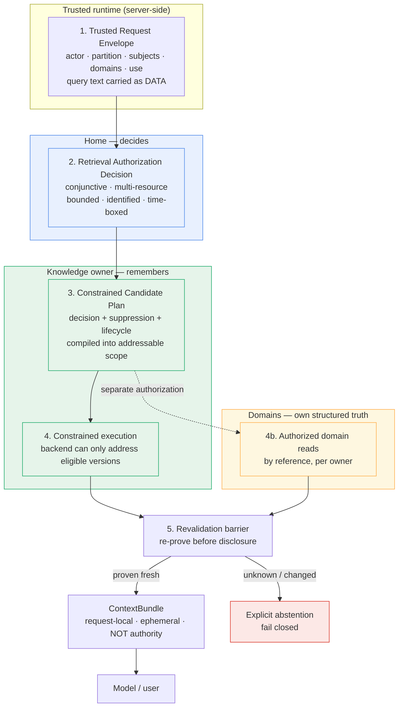
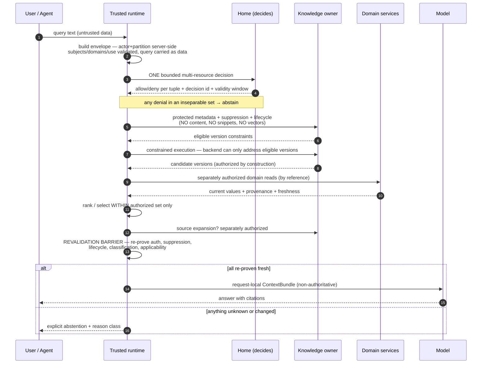

# Knowledge B6 — Trusted retrieval and ContextBundle

Status: PROPOSED — AWAITING PRODUCT ARCHITECT REVIEW

Date: 2026-09-22

Repository: `EKvargas/episteck_home`

Main baseline: `33df3d08467013e3fd6a55de1d8c6732115e7411`, verified current `origin/main` after [PR #28](https://github.com/EKvargas/episteck_home/pull/28) merged and made accepted B5 authoritative on `main`. This equals the commit named in the investigation request; `main` has not moved.

Branch: `docs/knowledge-b6-retrieval`

Gate: [B6 — Trusted retrieval and ContextBundle](KNOWLEDGE_TECHNOLOGY_GATE.md#b6--trusted-retrieval-and-contextbundle)

Decision owner: Product Architect

Disposition: **NOT DECIDED — PROPOSAL ONLY**

This document is an architecture investigation and proposal. It is **not** an accepted decision, and nothing in it is authoritative until the Product Architect records a disposition. It changes no contract, schema, service, runtime, index, deployment or production system, and selects no storage, retrieval, search, index, vector, graph, embedding, cache, queue, orchestration or messaging technology. B1–B5 remain RESOLVED and unamended. **B6 remains OPEN. The Knowledge Technology Gate remains OPEN.** All named people, household statements and scenarios are synthetic.

---

## 1. Problem statement

B1–B5 established what must be true about Knowledge and who is accountable for it. None of them defined **how a request actually becomes context**. That is the whole of B6.

The concrete question:

> How does a request move from a trusted actor plus intended subjects and domains to an exact, authorized, fresh, bounded ContextBundle — without unauthorized, suppressed, stale, superseded or reclassified information entering the model's context at any point?

This is harder than it sounds because the dangerous paths are not the obvious ones. Denying a final answer is easy. The accepted decisions forbid something much stronger: unauthorized content must never become a *candidate*, must never be *ranked*, must never influence *which* authorized content is selected, and must never survive in a cache, index or assembled bundle that outlives the authorization that justified it.

Three structural facts make B6 non-trivial in this repository specifically:

1. **The authorization interface cannot express the questions retrieval must ask.** `check_access_many` decides at most eight `(domain, action)` pairs for exactly **one** subject Person (F1). A single B1 scenario-D claim needs six tuples across a Circle and two Persons. Retrieval routinely needs more.
2. **The delegation budget is one per HTTP request, enforced at two layers.** The gateway mints exactly one delegation per POST via `auth_request`, delegations are single-use with atomic replay claiming, and the pinned MCP runtime rejects JSON-RPC batch arrays outright (F2, F3, F4). A retrieval that needs many authorization decisions cannot simply ask many times.
3. **ContextBundle today accepts everything B6 must exclude.** Verified by probe: it accepts REVOKED and PROPOSED claims, accepts claims whose validity window closed a year ago, never checks Circle authorization even when it holds `circle_ids`, cannot express a second content domain, has no partition binding, no revalidation hook, no decision binding, and is a plain frozen dataclass that can be deep-copied and reused indefinitely (F5–F9).

B6 must therefore design a protocol, not a filter. The protocol has to remain correct under technology substitution, because the Knowledge Technology Gate has not run and B6 must not pre-empt it.

### 1.1 What B6 is not

B6 does not select storage, index, search, vector, graph, embedding, cache or queue technology. It does not finalize code schema. It does not decide physical placement — B5 fixed the logical ownership boundary and explicitly left placement to the Technology Gate. It does not design the Enterprise profile. It does not reopen B1–B5.

---

## 2. Existing repository evidence

Investigation began with `git fetch origin --prune`; `origin/main` was verified at the baseline above, equal to the requested commit, with PR #28 merged at `2026-09-21T21:53:03Z`. The pre-existing untracked `apps/home-hub/` and `docs/ref/` were preserved. The working branch was created directly from `origin/main` with clean tracked status. All 21 existing tests pass on the baseline (12 contracts, 9 nutrition-domain), which verifies the inspected baseline only and proves nothing about this proposal.

Read in full: accepted [B1](KNOWLEDGE_B1_SECURITY_SCOPE.md), [B2](KNOWLEDGE_B2_SENSITIVITY_INHERITANCE.md), [B3](KNOWLEDGE_B3_LIFECYCLE.md), [B4](KNOWLEDGE_B4_FORGET_DELETE.md) and [B5](KNOWLEDGE_B5_OWNERSHIP_BOUNDARIES.md); the [gate register](KNOWLEDGE_TECHNOLOGY_GATE.md); [ARCHITECTURE](../ARCHITECTURE.md), [KNOWLEDGE](../KNOWLEDGE.md), [DATA_OWNERSHIP](../DATA_OWNERSHIP.md), [SECURITY_AND_CONSENT](../SECURITY_AND_CONSENT.md), [AGENTS](../AGENTS.md), [DEPLOYMENT](../DEPLOYMENT.md), [ROADMAP](../ROADMAP.md), [STATUS](../STATUS.md); the [independent review](../reviews/2026-09-19-knowledge-independent-architecture-review.md); and ADRs 0001–0009. Implementation was inspected directly and probed in memory rather than inferred from prose.

### 2.1 Findings that materially shape the design

| # | Verified fact | Evidence | Consequence for B6 |
|---|---|---|---|
| **F1** | **`check_access_many` decides at most `MAX_REQUIREMENTS = 8` `(domain, action)` pairs for exactly ONE subject Person**, resolves the actor server-side, caches nothing, and refuses the whole call on any malformed entry. The Nutrition client verifies an allow positionally against the exact requirements sent. | [`api.py` L102, L110–192](../../../apps/episteck_home/episteck_home/api.py), [`client.py` L136–217](../../../services/nutrition/app/home_control/client.py) | The multi-resource protocol B5 identified as missing is genuinely missing. Its absence is not a limit to raise but an interface shape to replace: no value of `MAX_REQUIREMENTS` fixes a single-subject endpoint. §8. |
| **F2** | **The gateway mints exactly one delegation per HTTP POST** via nginx `auth_request` to a UDS-only mint app, sets it as `X-Episteck-Delegation`, strips inbound forged values, hides it from responses, and does not retry upstream failures. | [`nginx-mcp-gateway.conf` L27–78](../../../deploy/gateway/nginx-mcp-gateway.conf), [`internal_app.py`](../../../services/home-bff/home_bff/internal_app.py), [`test_gateway_integration.py` L214–290](../../../deploy/gateway/tests/test_gateway_integration.py) | The delegation budget is structural, not a tuning parameter. A retrieval needing N authorization decisions cannot obtain N delegations inside one tool call. §8.3. |
| **F3** | **Delegations are single-use, atomically claimed, and fail closed.** Replay is enforced by a single `SET NX EX` claim shared across workers; store unavailability raises rather than returns, so an outage denies. Audience-bound, `MAX_LIFETIME_SECONDS = 300`, 30s skew tolerance. | [`replay.py`](../../../apps/episteck_home/episteck_home/identity/replay.py), [`delegation.py` L49–178](../../../apps/episteck_home/episteck_home/identity/delegation.py) | Freshness has a hard upper bound already: no delegated decision can be older than 300s, and none can be reused. This is a gift for B6's freshness model and a constraint on its shape. §8.4, §11. |
| **F4** | **The pinned MCP runtime rejects JSON-RPC batch arrays** with HTTP 400 and `id: null`; the gateway forwards a batch body unparsed and still mints **once**. | [`test_fastmcp_protocol.py` L20–68](../../../deploy/gateway/tests/test_fastmcp_protocol.py), [`test_gateway_integration.py` L270–279](../../../deploy/gateway/tests/test_gateway_integration.py) | Batching cannot be used to amortize delegations, and a batch that *were* accepted would be worse: one mint for two calls means the second is replay-denied. One tool call = one POST = one delegation is enforced twice over. §8.3. |
| **F5** | **ContextBundle accepts every lifecycle status**, including `REVOKED` and `PROPOSED`, with full statement text. Probe P2 across all six `KnowledgeStatus` values: all six accepted. | Probe P2 (in-memory, no repository files written); [`context.py` L92–139](../../../packages/home-contracts/src/episteck_home_contracts/context.py) | Re-verified independently of B4's P1. Lifecycle eligibility is entirely absent from the only assembly contract that exists. §10. |
| **F6** | **ContextBundle accepts a claim whose `valid_until` closed a year ago.** Probe P1 constructed a bundle containing a claim expired by its own stated validity; no check exists. | Probe P1 | Temporal eligibility is absent too. B3's EXPIRED facet has no representation at assembly. §10.3. |
| **F7** | **ContextBundle never authorizes the Circle**, even though it holds `circle_ids`. A CIRCLE-scoped claim was accepted with only Person-side `AuthorizedDomain` entries; `circle_ids` is carried but never checked. `MANAGE` alone satisfies a `VIEW` requirement. | Probe P3; [`context.py` L103–139](../../../packages/home-contracts/src/episteck_home_contracts/context.py) | B1's conjunctive scope-AND-subject-AND-domain rule is not expressible in the current contract. The scope half is simply missing. §12. |
| **F8** | **`KnowledgeClaim.domain` is a single string**, so a mixed-domain claim (B1 scenario D: HOUSEHOLD + HEALTH) cannot state its second required domain. Claim fields carry no partition and no lifecycle/control revision. | Probe P3, P4; [`knowledge.py` L98–145](../../../packages/home-contracts/src/episteck_home_contracts/knowledge.py) | The conservative cross-product B1 §8.1 requires cannot be evaluated from the artifact itself. B6 must specify what protected metadata retrieval needs, without designing the schema. §9.2. |
| **F9** | **ContextBundle has no partition, no retrieval timestamp, no decision binding, no freshness marker and no revalidation member**, and is a plain frozen dataclass that deep-copies cleanly and remains "valid" indefinitely. | Probe P3, P5 | A bundle is currently a durable, portable assertion of authorization. That is precisely the shadow-authority failure mode B1 §12 and B5 row 21 forbid. §12, §13. |
| **F10** | **No Knowledge retrieval exists anywhere.** `ContextBundle` is never constructed in `services/` or `apps/`; no search, rerank, embedding, chunk, index or vector symbol exists for Knowledge. The `search_food` hits are an external food-provider interface over USDA/Open Food Facts, not personal Knowledge. | Repository-wide search; [`food_provider.py` L28–31](../../../services/nutrition/app/providers/food_provider.py) | B6 is greenfield. No existing retrieval behaviour constrains the design, and none should be promoted to a requirement merely because it exists. |
| **F11** | **The transport seam is solid and worth preserving.** The delegation is read from transport context outside any model-controlled argument; no tool accepts an actor or delegation parameter; credential headers are stripped; concurrency verified 8/8 with no bleed; tests assert the tool inventory never exposes a delegation or actor parameter. | [`context.py`](../../../services/home-mcp/home_mcp/context.py), [`server.py`](../../../services/home-mcp/home_mcp/server.py), [`test_transport_binding.py`](../../../services/home-mcp/tests/test_transport_binding.py) | B6's trusted request envelope should extend this seam, not invent a parallel one. Query text must enter through the same untrusted door as every other model argument. §7. |
| **F12** | **Nutrition authorizes independently per operation and composes internally.** `svc.daily` was deliberately refactored to authorize VIEW once rather than spend the single-use delegation twice. Domain tools are per-subject, per-operation. | [`main.py` L77–85](../../../services/nutrition/app/main.py), [`client.py` L17–37](../../../services/nutrition/app/home_control/client.py) | The "one decision, compose internally" pattern already exists and is the right precedent for B6's domain-context inclusion. §13. |
| **F13** | **`StructuredDomainReference(subject_person_id, domain, owner_service, record_type, record_id)` exists** and `ContextBundle` refuses it without matching subject/domain VIEW. | [`context.py` L72–89, L119–120](../../../packages/home-contracts/src/episteck_home_contracts/context.py) | The reference-not-duplicate mechanism for domain context is already contracted in one direction. Build on it. §13. |
| **F14** | **Cross-node p95 for `check_access` is ~120 ms**; Home is Ashburn (US), domain services and agents are Nuremberg (EU); Tailscale between; **no cross-region DB**. | [STATUS L93](../STATUS.md), [SECURITY_AND_CONSENT](../SECURITY_AND_CONSENT.md), [DEPLOYMENT](../DEPLOYMENT.md) | Authorization round trips are expensive enough that a protocol requiring one per candidate is not viable. This is a design pressure toward one bounded decision per request, not many small ones. §8.3. |

### 2.2 Prior characterizations corrected

Two corrections from evidence, in the spirit of B4 §2.2 and B5 §2.2.

First, **B5 F7 described the authorization limit as "at most 8 requirements for one subject."** That is accurate but incomplete as a B6 input: the binding constraint is not the number 8, it is that the endpoint is *single-subject and single-decision-per-delegation*. Raising `MAX_REQUIREMENTS` to 64 would change nothing for a two-Person claim. B6 therefore proposes replacing the interface shape rather than its bound (§8).

Second, **the gate register's B6 entry says the bundle's "accepted content is broader than normal active/current retrieval."** Probes P1 and P2 show it is broader than *any* retrieval: it accepts `REVOKED` and `PROPOSED` claims and claims expired by their own validity window. The register's wording understates the gap and should be corrected on acceptance.

---

## 3. B1–B5 constraints B6 must preserve

These are carried forward unchanged. Where this proposal is less precise than an accepted decision, the accepted decision governs.

| Source | Constraint B6 inherits |
|---|---|
| **B1 §10** | Eligible candidates constrained **before** sensitive retrieval. Global-search-then-filter is forbidden. Partition isolation alone is insufficient. Protected authorization-metadata lookup is **distinct from** retrieving statements, snippets or vectors. Never reuse a bundle's `authorized_domains` as a bearer permission. Deny, missing tuple, unknown state, authority outage or oversized request denies **as a whole**; never truncate requirements to fit the current API. |
| **B1 §4** | One trusted partition per object; trusted actor and partition from server-side context; all references resolve within the partition; scope AND every subject AND every required domain; self-access covers only one's own Person; untrusted metadata and unknown references deny. |
| **B2 §5, §10** | Conjunctive requirements with actual-influence lineage; ordinary transformation never weakens protection; chunks, embeddings, summaries, index entries and caches are protected derivatives; reclassification makes stale derivatives **immediately** ineligible, before any reindex; a denied actor must not receive top-k matches, scores, titles or counts influenced by hidden records. |
| **B3 §5** | Lifecycle attaches to exact immutable assertion versions. ACTIVE is derived readiness, never truth or authorization. Ordinary use requires the full conjunction: admitted version selected for purpose and applicable time, required attestations, no relevant unresolved challenge, non-use, hold or hard expiry, current classification and dependency validity, plus B1 and B2. History, proposal and dispute review are **separate explicitly requested uses**. |
| **B3 §11** | Exact-version preconditions; CAS-equivalent commit; commit-time authorization barrier with enforceable ordering against revocation; stale receipts are never authority; unknown ordering means no commit. |
| **B4 §8, §12.1** | No path into usable state may bypass the suppression register — retrieval, restore, import, reindex and regeneration are all admission events. Suppression before candidates **and** again before disclosure. Restored data unusable unless control-state currency is **proven** at least as current as the payload; unknown freshness fails closed. Correctness must not depend on cleanup succeeding. |
| **B5** | Home decides → Knowledge remembers → Domains own structured operational truth. ContextBundle is never authority. Projections are never authoritative. A domain-derived fact does not become Knowledge by being rendered as natural language. Ownership may not be collapsed. |

---

## 4. Trusted retrieval invariants

Proposed as the durable, checkable rules B6 contributes. Each is traceable to an accepted decision; none is newly invented.

1. **Authorization precedes candidacy.** No record may enter the candidate set — for search, ranking, expansion, scoring or counting — before the authorization that covers it has been decided. Filtering after retrieval is not compliance (B1 §10).
2. **Suppression precedes candidacy.** The suppression register is consulted before a record can be a candidate, independently of whether its payload, index entry or cache entry still exists (B4 §8).
3. **Eligibility is evaluated on an exact version.** Retrieval selects assertion versions, not topics or lines. A version that is superseded, revoked, expired, held or relevantly disputed is not ordinarily eligible (B3 §5).
4. **Protected metadata resolution is separate from content retrieval.** Establishing what a candidate requires is a distinct, partition-bound, minimized step that never discloses statements, snippets or vectors to the model, and never fetches unauthorized text to discover how it should have been authorized (B1 §10).
5. **Nothing materialized is authority.** Indexes, chunks, embeddings, summaries, caches, projections and assembled bundles may exist durably, and may never be the basis of an authorization, lifecycle or suppression decision (B2 §10.2, B5 invariant 4).
6. **Disclosure requires revalidation.** Eligibility at selection does not authorize disclosure. The state that justified selection must be re-proven, within a bounded freshness window, immediately before the content reaches the model or the user (B3 §11.8, B4 §13).
7. **Unknown fails closed, as a whole.** A missing decision, unresolvable metadata, unavailable authority, unavailable suppression state, unprovable restore freshness or an oversized request denies the entire request path. Requirements are never truncated to fit an interface (B1 §10).
8. **Query text is data, never authority.** Natural language, model output and tool arguments cannot select an actor, a partition, a subject the request did not trust, a domain, or a scope. They may only narrow within what trusted context already authorized (B1 scenario H, F11).
9. **Retrieval is bounded and declares its bounds.** Every dimension — candidates, subjects, domains, expansions, recursion depth, time, context budget — has a limit, and exceeding it produces an explicit bounded-result outcome, never a silent truncation that hides denials (§15).
10. **Every disclosed item carries its provenance and its binding.** Anonymous text chunks are not an acceptable retrieval output; the bundle carries exact versions and the decision that justified them (§12).

---

## 5. Alternatives considered

Four architectures were developed against this repository's actual constraints. All four preserve Home as the authorization authority and the Knowledge owner as the eligibility-state owner; those are fixed by B1 and B5.

### Alternative A — Post-retrieval filtering

Retrieve broadly from whatever backend exists, then apply authorization, suppression and lifecycle checks to the result set before assembling the bundle.

*Assessment.* **Explicitly forbidden by B1 §10** ("Forbidden: global search → retrieve unauthorized candidates/text → application-filter"). It is recorded here only because it is what a team reaches for by default, and because naming it makes the invariant testable. It fails B2 additionally: ranking over unauthorized content leaks through scores, counts and which authorized items surface, even when the unauthorized text is discarded. **Rejected — not viable.**

### Alternative B — Eligibility-first materialized view per actor

Precompute, per actor, a materialized set of eligible assertion versions. Retrieval runs only inside that set.

*Assessment.* Attractive because the retrieval step becomes trivially safe, and it maps onto any backend. It fails on freshness and on blast radius. The materialized set is a derivative that must be invalidated on every grant change, revocation, suppression, supersession, expiry boundary, reclassification and Circle transition — and B2 §10.3 requires those to take effect *immediately*, not after a rebuild. That forces either a synchronous rebuild on every control change (unacceptable coupling) or a staleness window (unacceptable correctness). It also concentrates one precomputed "who may see what" structure whose compromise is total, and it does not naturally express B1's conjunctive Circle-plus-subjects-plus-domains composition. **Rejected as the primary mechanism**, though its idea of narrowing *before* search is retained in the recommendation.

### Alternative C — Authorization-constrained query planning ("authorization as query plan")

Do not retrieve, then check. Instead, decide authorization first, compile the decision into the *constraints of the retrieval operation itself*, and execute only a plan that structurally cannot address unauthorized records. The retrieval backend never receives an unconstrained query.

*Assessment.* This is the direct architectural expression of B1 §10 and the DLM prior art's strongest idea (§A below). Its decisive property: safety comes from what the query *can address*, not from what the post-processing removes, so a backend bug or a reranker change cannot leak. It composes naturally with B1's conjunctive model, because the authorization decision yields a constraint set rather than a boolean. It is technology-neutral by construction — a plan constraint can be compiled into a structured predicate, a lexical filter, a vector namespace restriction or a graph edge restriction.

Its cost is that a plan is only as good as the decision it compiles, which makes the multi-resource authorization protocol (§8) a hard prerequisite rather than a nicety, and it requires protected candidate metadata to be resolvable without touching content (B1 §10's "initial protected authorization-metadata lookup").

### Alternative D — Capability/token-bound retrieval

Issue a short-lived capability describing what may be retrieved; the retrieval backend honours the capability.

*Assessment.* Operationally appealing and superficially similar to C, but it inverts the trust direction in a way B1 forbids. A capability that travels is a bearer permission; B1 §10 explicitly refuses to let an earlier bundle's `authorized_domains` act as one, and B1 scenario H refuses model-supplied authority. It also makes revocation ordering ambiguous — the exact problem B3 §11.8 requires an enforceable fence for. It could be made safe by binding the capability to a server-side decision record and revalidating it, at which point it *is* Alternative C with extra serialization. **Rejected as a distinct model**; its useful residue — a durable, referenceable decision identity — is retained in §8.5.

### Comparison

| Dimension | A: post-filter | B: materialized eligibility | C: authorization-constrained planning | D: capability-bound |
|---|---|---|---|---|
| **B1 authorization completeness** | **Fails** — forbidden explicitly | Partial — hard to express Circle ∧ subjects ∧ domains | **Full** — decision compiles to constraints | Partial — bearer risk, B1 scenario H |
| **B2 sensitivity inheritance** | **Fails** — ranking leaks via scores/counts | Requires immediate rebuild on reclassification | Holds — constraints include classification revision | Holds only if capability re-derived |
| **B3 lifecycle exactness** | Late and version-blind | Versions go stale inside the view | Holds — version predicates are plan constraints | Holds if bound to versions |
| **B4 suppression** | Suppressed data already retrieved | View rebuild lags suppression | Holds — register consulted at plan time and disclosure | Ambiguous revocation ordering |
| **B5 ownership separation** | Blurs — filter logic accretes authority | KN would host an authorization artifact | Clean — Home decides, KN constrains, domains answer | Token risks becoming authority |
| **Multi-subject support** | Incidental | Awkward | **Natural** — conjunction is the plan | Natural but duplicated per token |
| **Stale-state behaviour** | Worst | Silent staleness | Explicit revalidation barrier | Depends on TTL |
| **Latency / ops complexity** | Low, unsafe | High rebuild cost | One bounded decision + constrained execution | Extra issuance path |
| **Technology neutrality** | Neutral but unsafe | Ties to a materialization engine | **Neutral** — a constraint compiles anywhere | Neutral |
| **Cache/index safety** | None | View is itself a stale cache | Bindings make stale entries unservable | Depends |
| **Source expansion** | Unbounded | Unmodelled | Separate plan, separately authorized | Token scope creep |
| **Future B2B reuse** | N/A | Poor — Home-shaped view | **Good** — policy adapter swaps below the plan | Poor — token semantics leak policy |

**Recommend Alternative C**, with B's narrow-before-search intuition and D's decision-identity residue folded in.

---

## 6. Recommended protocol

**Adopt authorization-constrained retrieval planning with a mandatory pre-disclosure revalidation barrier.**

Five stages, each with one owner and one failure mode:



The load-bearing idea is stage 3. **A retrieval never receives an unconstrained query.** The authorization decision, the suppression register and the lifecycle predicates are compiled into the addressable scope of the operation, so unauthorized, suppressed or ineligible records are not filtered out — they are *not addressable*. Whether that scope is expressed as a structured predicate, a namespace restriction or an index partition is a Technology Gate decision that does not change the protocol.

Stage 5 exists because stage 3 is necessarily a snapshot. Between planning and disclosure, a grant can be revoked, an assertion superseded, a classification strengthened or a suppression committed. B3 §11.8 and B4 §13 require an enforceable fence, and the fence must be at the last moment before content leaves the trusted boundary.

---

## 7. Trusted request envelope

The envelope is the boundary between what the system knows and what the model claims. Its design follows the existing transport seam (F11) rather than inventing a parallel channel.

| Field | Source | Trusted? | Notes |
|---|---|---|---|
| Actor Person | Server-side from validated session | **Trusted** | Never a parameter anywhere (ADR-0009, F11) |
| Security partition | Trusted server/deployment binding | **Trusted** | Never browser/model/MCP input (B1 §5.1) |
| Machine caller | Service credential | **Trusted** | Dual principal retained in audit (B1 §2) |
| Requested subject Persons | **Request parameter, trust-validated** | Semi | A parameter legitimately — "ask about someone else" — but every one is authorized, and discoverability is not permission (B1 §2) |
| Requested Circles / scopes | **Request parameter, trust-validated** | Semi | Same treatment; membership is not authorization |
| Requested content domains | **Request parameter, trust-validated** | Semi | May only narrow; cannot add authority |
| Operation / use class | Trusted runtime, from the invoked operation | **Trusted** | Ordinary use vs history/proposal/dispute review are different uses (B3 §5) |
| Applicability time | Trusted clock | **Trusted** | Never a model-supplied "as of" |
| Query text | **Model / user** | **Untrusted data** | May influence ranking within authorized scope; may never select actor, partition, subject, domain, scope or use |
| Source-expansion intent | **Request parameter** | Semi | A request to attempt expansion, never a grant (§14) |
| Domain references | Prior authorized results | Semi | Knowing an ID is not authorization (B1 §5.2) |

**The separation rule:** trusted context *establishes* what may be addressed; request parameters may only *narrow* within it; query text may only *rank* within the result of those two. Nothing in the second or third category can ever widen the first.

This directly answers scenario 19: a query saying "also tell me about Ana's health" does not add Ana or HEALTH to the envelope. If they were not authorized subjects and domains of the request, they are not addressable, and the correct outcome is an explicit abstention, not a partial answer that silently omits them.

---

## 8. Multi-resource authorization protocol

This is the central missing piece B5 identified (F1). B6 defines its **shape and semantics**, not its transport.

### 8.1 Request shape

A single bounded decision request carrying the complete requirement set:

- trusted partition and trusted actor (server-derived, not fields a caller supplies)
- a set of **typed resources**: `PERSON/<id>` and `CIRCLE/<id>` — B1's two resource kinds, no others
- a set of required **content domains** per resource
- the required **actions** (ordinarily VIEW for retrieval)
- the **operation/use class**
- a caller-supplied **request identity** for idempotent correlation

The request is **complete or refused**. There is no partial submission, no pagination of requirements, and no "decide what you can." B1 §10 forbids truncating requirements to fit an interface, so the interface must accept the whole question.

### 8.2 Result shape

- one overall decision: **allow only if every required tuple allows**
- per-tuple detail sufficient to explain a refusal **without disclosing** which hidden resource caused it to an unauthorized caller
- a **decision identity and version**, so later stages and audit can reference exactly this decision
- an explicit **validity bound** (see §8.4)
- an explicit **completeness assertion**: the decision covers exactly the tuples requested, verifiable positionally as the Nutrition client already does (F1)

### 8.3 All-or-nothing versus partial

**All-or-nothing for a single assertion; explicitly-bounded partial across a request.**

These are different questions and conflating them is a known trap:

- **Within one assertion**, authorization is conjunctive and indivisible. A claim with subjects {A, B} and domains {HOUSEHOLD, HEALTH} is disclosed only if *every* tuple allows. One denial removes the whole inseparable claim (B1 scenario D). There is no redaction, no subject-dropping, no weaker-domain substitution.
- **Across a request** covering several subjects, a request may legitimately proceed with the authorized portion — but only if the outcome **explicitly declares** that it is partial and which requested scope was excluded, without revealing what was in it. Silent partial results are forbidden: they let a caller mistake "nothing authorized" for "nothing exists," which is both a correctness and a privacy failure (scenario 18).

**Why one bounded decision rather than many small ones.** F2, F3 and F4 together mean one tool call yields exactly one delegation, single-use, and batching is rejected at the protocol layer. F14 adds ~120 ms cross-node cost per round trip. A protocol requiring one authorization call per candidate or per subject is therefore not merely slow — it is unimplementable within the accepted delegation model without weakening replay protection, which B1 §5.1 forbids. **One bounded decision per retrieval operation is the only shape consistent with the existing trust architecture.**

### 8.4 Freshness semantics

A decision is valid for a **bounded window** that must not exceed the delegation lifetime already enforced (`MAX_LIFETIME_SECONDS = 300`, F3), and should in practice be far shorter for retrieval. Within that window the decision may constrain planning and execution. **It may not authorize disclosure on its own** — §11's barrier applies regardless of how recent the decision is, because revocation ordering, not elapsed time, is the property B3 §11.8 requires.

Unknown freshness, an unreachable authority, or a decision whose window has closed denies the whole path (invariant 7).

### 8.5 Binding decisions to later operations

A decision identity **may be referenced** by later stages of the *same* request to prove which decision justified an action, and **must never be presentable as authority** by a caller. This is D's useful residue without D's bearer risk: the identity is a server-side correlation handle, not a token that grants anything. B1 §10's prohibition on reusing `authorized_domains` as a bearer permission applies to decision identities equally.

### 8.6 Fail-closed cases

Deny the whole request on: any denied tuple within an inseparable assertion; unknown or unresolvable resource; cross-partition reference; authority unavailable or indeterminate; malformed or oversized requirement set; decision window closed; completeness assertion mismatched; unresolvable protected metadata for any candidate.

---

## 9. Candidate authorization boundary

### 9.1 The exact rule

> **A record may enter the candidate set only if the authorization decision covering its complete requirement set has already been made and is currently valid, and that decision is expressed as a constraint on what the retrieval operation can address — not as a filter applied to what it returned.**

"Candidate set" includes anything that influences the outcome: direct-ID reads, lexical or semantic matching, chunk or passage selection, query expansion using stored material, ranking and reranking, scoring, counting, source expansion and cache lookup. B2 §10.2 is explicit that a denied actor must not receive top-k matches, scores, titles or counts influenced by hidden records — so even *counting* unauthorized matches is disclosure.

### 9.2 Protected metadata resolution

B1 §10 requires an initial protected lookup that establishes eligibility **without** retrieving statements, snippets or vectors. B6 formalizes this as a distinct stage with its own rules:

- it is partition-bound and minimized to security metadata: scope, complete subject set, complete required domains, applicable restrictions, the version those apply to, lifecycle/control revision, suppression status, classification revision
- it is **never disclosed to the model** in any form
- it must be resolvable **without** reading content — which is a real design obligation on whatever the Technology Gate selects, because F8 shows today's contract cannot express a second domain and carries no partition or control revision
- unclassified or unresolvable metadata means **not eligible**; the record is not a candidate, and the caller learns nothing about its existence

### 9.3 What the retrieval backend receives

From trusted orchestration only, never from the model: the bound partition, the trusted request context, the decision identity and its constraint set, the eligibility predicates, and explicit bounds. The backend must be incapable of widening any of these. If a backend cannot accept constraints of this shape, it is disqualified at the Technology Gate — which is exactly the kind of requirement B6 exists to produce.

---

## 10. Suppression and lifecycle eligibility

### 10.1 The suppression rule

> **The suppression register is consulted before a record can become a candidate, and again before disclosure. A record covered by an applicable suppression entry is not addressable, regardless of whether its payload, index entry, chunk, embedding, summary, projection or cache entry still exists.**

This follows B4's core inversion directly: correctness must not depend on cleanup. The register is the authoritative non-use fact; physical presence is a cleanup state, not an exposure (B4 §6).

### 10.2 The three-way stale case

The scenario the brief asks about explicitly — canonical says suppressed, index still has the vector, cache still has the text:

| Layer | State | Behaviour |
|---|---|---|
| Suppression register | Suppressed | **Authoritative.** The record is not addressable. |
| Canonical Knowledge | Payload may still exist | Not addressable; awaiting erasure (`ERASURE PENDING`) |
| Index / embedding | Entry still present | **Must not be servable.** Requires a binding (§15) that makes it unservable without consulting the register |
| Cache | Old text still present | **Must not be servable.** Same binding requirement |
| Result | — | Zero candidates from that record; no score, no count, no title, no "something was removed" signal to an unauthorized caller |

The architectural requirement this generates: **every materialized representation must be bound to something that makes it unservable when the register says so**, and that binding must be checkable without a rebuild. §15 states the binding requirement; the mechanism is a Technology Gate decision.

### 10.3 Lifecycle and temporal eligibility

Ordinary use requires the full B3 §5 conjunction on an **exact version**:

| Facet | Ordinary-use effect | Notes |
|---|---|---|
| **ADMITTED** | Required | Admission is not truth or authorization (B3 §5.1) |
| **PROPOSED / REJECTED** | **Excluded** from ordinary use | Available only in an explicitly requested proposal/review use |
| **CURRENT for purpose and time** | Required | Selection is per line, per purpose, per applicable interval |
| **SUPERSEDED** | Excluded for the interval a successor covers | Still valid history for its earlier interval; future-effective replacement does not suppress the predecessor early (B3 §5.2) |
| **REVOKED** | Excluded | Not a claim of falsity; not erasure |
| **EXPIRED** | Excluded for ordinary use | Evaluated from **authoritative time**, not from whether a timer job ran (B3 §10). F6 shows today's contract ignores this entirely |
| **HELD** | Excluded | Fail-closed pending review |
| **DISPUTED** | See §10.4 | Bounded exclusion, not a veto |

**Lifecycle is not truth ranking.** Eligibility answers "may this version be used for this purpose now," never "is this the most true statement." Two independently attributed assertions may both be eligible and disagree; that is a disagreement to surface, not a contest to resolve by score (B3 §9).

### 10.4 Disputed assertions

Per B3 §9 and its D4 clarification: an accepted unresolved relevant challenge **excludes the contested content from ordinary recommendations and answers**, bounded to the contested proposition, use and overlapping applicability. It does **not** make the assertion universally unretrievable.

- **Ordinary use:** excluded within the contested scope.
- **Explicitly requested review/history use:** may be retrieved *with attribution and uncertainty*, subject to its own authorization and non-use rules.
- **Never:** substitute the disputed value, use it indirectly via an older summary, or reveal challenge existence or authorship to someone unauthorized to know it — dispute metadata is itself protected.
- **Carryover** to a successor requires materially preserved contested meaning for overlapping applicability; uncertainty withholds the contested use pending review.

Scenario 12 resolves as: both attestations surface in an authorized review use with attribution; ordinary use abstains on the contested point rather than picking a winner.

---

## 11. Revalidation before disclosure

### 11.1 The rule

> **Eligibility established at selection does not authorize disclosure. Immediately before content crosses the trusted boundary — bundle finalization, model exposure, source expansion, or tool-result return — the state that justified selection must be re-proven within a bounded freshness window. Anything that cannot be re-proven is withheld, and the outcome is explicit.**

### 11.2 What must be revalidated versus carried forward

| Must be revalidated | May be carried forward |
|---|---|
| Authorization decision still valid and unrevoked | The trusted actor and partition binding (immutable for the request) |
| Suppression register state for every included version | The exact version identities selected |
| Lifecycle/control revision unchanged for every included version | The decision identity, as a correlation reference |
| Classification revision unchanged (B2 §10.3) | Deterministic computations over already-authorized values |
| Applicability window still open against authoritative time | Bounded-result markers |
| Dependency/release validity for any projection or derived output | — |

The asymmetry is deliberate: **identity may be carried, authority may not.** Carrying a version ID forward is safe; carrying "and it was allowed" forward is precisely the bearer-permission failure B1 §10 forbids.

### 11.3 Ordering against revocation

B3 §11.8's fence applies unchanged: if a revocation, suppression or reclassification is accepted **before** the disclosure barrier, disclosure is denied; if disclosure ordered first, the later change bars **future** use and cannot recall what was shown. **Unknown ordering denies.** Already-disclosed content is never recallable, and the architecture must say so plainly rather than imply otherwise (B4 §6).

### 11.4 Cost

Revalidation is a real cost, and F14's ~120 ms cross-node figure makes a naive "re-ask Home per item" design untenable. The protocol therefore revalidates **once per disclosure boundary over the whole selected set**, not per item — the same "one bounded decision" discipline as §8.3. This is also why the freshness window (§8.4) should be short: a short window plus one barrier is cheaper and safer than a long window plus many checks.

---

## 12. Exact-version ContextBundle semantics

F5–F9 established that the current bundle accepts revoked, proposed and expired content, never authorizes a Circle, cannot express a second domain, carries no partition, and survives deep-copy as a portable authorization assertion. B6 defines the **semantics and invariants** a future bundle must satisfy. It does **not** finalize schema.

### 12.1 Invariants

1. **Request-local.** A bundle belongs to exactly one request, one actor, one partition, one use class.
2. **Ephemeral.** It has no durable life. It is not a store, not a cache, not a document.
3. **Never authority.** Its contents cannot justify any later authorization, lifecycle or suppression decision. Possessing a bundle grants nothing (B5 row 21).
4. **Non-transferable.** It cannot grant access to a different actor, session, partition or later request.
5. **Exact-version.** Every Knowledge item is an exact immutable assertion version, never a line, topic or "latest."
6. **Provenance-bearing.** Every item carries enough provenance to be cited and audited; anonymous text chunks are not acceptable output.
7. **Bounded and honest.** If content was excluded by bounds or denial, the bundle says so explicitly (§15, §17).
8. **Cannot become a cross-domain shadow store.** Domain values appear as references plus, where authorized, selected current values with provenance and freshness — never as a durable second copy (§13).

### 12.2 Semantics each item must carry

Stated as required *meanings*, not field names:

| Meaning | Why required |
|---|---|
| Exact assertion version identity | B3: lifecycle attaches to versions (F8: absent today) |
| Lifecycle/control revision it was evaluated against | B3 §11: enables revalidation and stale detection |
| Immutable trusted partition binding | B1 §4.1; B5 §7.1 (F9: absent today) |
| Complete subject set | B1: every subject must have been authorized (F7) |
| Complete required content domains | B1 §8.1 conservative cross-product (F8: single string today) |
| Classification revision | B2 §10.3: stale classification must be detectable |
| Lineage / source references | B2 §5.2: actual-influence lineage |
| Authorization decision binding | Which decision justified inclusion — as a reference, never a capability (§8.5) |
| Retrieval timestamp and freshness marker | §11: bounds the window in which the bundle is meaningful |
| Suppression-checked marker | B4: records that the register was consulted at both barriers |
| Structured domain references | B5/F13: reference-not-duplicate |
| Source citation references | §14: citation is not disclosure |

### 12.3 What a bundle must *not* carry

Bearer material, an actor the model could alter, a reusable authorization assertion, unbounded domain snapshots, unclassified content, or any content whose protected metadata could not be resolved.

---

## 13. Domain structured context

B5 fixed that domain facts stay domain-owned. Ask Olin still needs current domain state.

**Rule:** a bundle carries a **typed reference** to canonical domain state (F13), plus — where separately authorized — **selected current values** with provenance and a freshness marker, fetched at request time from the owning service and never persisted as Knowledge.

| Aspect | Treatment |
|---|---|
| Canonical owner | The domain service, unchanged (ADR-0002, ADR-0004, B5) |
| Authorization | **Separate** from Knowledge authorization. A KNOWLEDGE/VIEW allowance is not a domain read (B1 §8.4). Each domain read is its own authorized operation |
| Delegation cost | One authorized operation per domain owner per request, composing internally — the pattern `svc.daily` already establishes (F12) |
| Values in bundle | Selected, current, provenance-bearing, freshness-marked, request-local |
| Persistence | **None.** Values are not durable Knowledge and create no second canonical store (B2 §12, B5 §8) |
| Staleness | If a domain record changes after the read, the bundle's value is a *snapshot with a freshness marker*, not a claim of current truth (scenario 11) |

This generalizes unchanged to Healthy Home, Baby Care, future Health and future Finance: each is a separate owner, separately authorized, referenced not duplicated. A Baby Care analytic remains a Baby Care fact even when phrased conversationally (B5 §8.0).

---

## 14. Source expansion

Permission to use an assertion is **not** permission to open its sources (B1 §8.4, B2 §9).

| Step | Rule |
|---|---|
| **Request** | Expansion is an explicit, separate request naming what is to be expanded. Intent in the envelope is a request to attempt, never a grant |
| **Authorization** | Independently decided against the source's own resource, subject and domain requirements, **plus** the custodian's handling authority (B5 §10). Knowing a source ID is not authorization (B1 §5.2) |
| **Inherited sensitivity** | The source carries its own requirements *and* everything B2 §5.2 attaches; a narrower excerpt is not automatically less protected |
| **Custodian involvement** | The payload custodian participates for the artifact itself; Knowledge holds Episode and custody metadata (B5 §10) |
| **Denial behaviour** | The assertion may remain usable while expansion is denied. Use neutral wording — "I can't provide further provenance details" — identical for absent, unavailable and unauthorized, so denial is not an existence oracle (B2 §9) |
| **Citation without disclosure** | A bundle may carry a citation *reference* that supports audit and revalidation without disclosing title, author, locator or excerpt to the model |

Scenario 10 resolves as: the assertion is disclosed, expansion is refused with neutral wording, and the refusal reveals nothing about whether a source exists.

---

## 15. Cache, index and materialization semantics

B6 defines the **enforcement requirement**, not the mechanism.

### 15.1 Two distinct things

- **Authoritative non-use** — immediate, register-backed, never dependent on cleanup.
- **Eventual physical invalidation** — asynchronous, evidenced, allowed to lag (B4 §14).

Conflating them is the failure B4 exists to prevent. Correctness comes from the first; tidiness from the second.

### 15.2 Required bindings

Every materialized representation — chunk, embedding, lexical index entry, summary, cached answer, projection, retained bundle artifact — must carry bindings sufficient to determine, **without a rebuild**, that it must not be served:

| Binding | Makes detectable |
|---|---|
| Partition | Cross-partition addressing (B1 §5.2) |
| Exact source version identity | Supersession and correction |
| Derivation family membership | Family-wide suppression reachability (B4 §7) |
| Classification revision | Reclassification (B2 §10.3) |
| Lifecycle/control revision | Revocation, hold, dispute |
| Suppression-check obligation | That the register must be consulted before serving |

**A representation that cannot prove these is not servable.** That is a strong requirement and deliberately so: it converts "we should invalidate this" into "this cannot be used until it proves itself," which is the only form that survives partial cleanup failure. Unknown binding state fails closed (scenario 17).

### 15.3 What this forbids

Serving from a cache without consulting the register; rebuilding an index as the *mechanism* of suppression; treating a reindex completion as evidence of non-use; any index whose entries cannot be attributed to an exact version and family.

---

## 16. Restore-freshness enforcement

B4 C1 applied to retrieval. The scenario, restated:

```text
T1  backup taken, contains assertion X
T2  X forgotten — suppression committed AFTER the snapshot
T3  system lost
T4  T1 payload restored
```

Reconciling T1 payload against a T1-era register finds no prohibition and X resurrects — a correct-looking restore that silently undoes a deletion.

**Rule:** restored Knowledge does not enter the retrieval-eligible set until the system **proves** that the suppression/control state used for reconciliation is at least as current as the restored payload. **Unknown freshness leaves restored Knowledge unusable, not merely stale.**

Evidence a future implementation must provide (mechanism deliberately unselected, per B4 C1 and B5 PA-3):

1. A **positive currency claim** for the anti-resurrection state — possession is not proof.
2. Establishable **independently of the restored payload's own backup lineage**, since that is the exact failure mode.
3. A **comparison** showing control state is no older than the payload it governs.
4. **Partial availability is acceptable:** unaffected domains may serve while Knowledge stays withheld. Usable Knowledge without a freshness proof is not.
5. Failure is **explicit** — an abstention naming unproven restore freshness, never a silently smaller result set.

Scenario 9 resolves as: after a T1 restore, X is not retrievable; if currency cannot be proven at all, *no* restored Knowledge is retrievable and Olin says so.

---

## 17. Failure and abstention model

Adapted from the DLM "cites-or-abstains" prior art (§20.B), constrained to Olin's accepted decisions.

> **A retrieval either returns provenance-bearing, authorized, revalidated content — or it returns an explicit abstention with a reason class. It never silently synthesizes, silently truncates, or silently omits.**

Two Olin-specific corrections to the prior art. First, **confidence is not authority**: a confidence score may inform ranking and may justify abstaining, but may never justify *disclosure*, and must never be computed over unauthorized content (B2 §10.2). Second, **reason classes must not become an existence oracle**: the class told to the user must not distinguish "you are not allowed to see this" from "this does not exist" where that distinction itself leaks.

| Condition | Outcome | Open or closed |
|---|---|---|
| Unauthorized | Abstain; neutral wording; zero candidates; no counts or scores | **Closed** |
| Partially authorized | Proceed with authorized portion **and explicitly declare** the bounded scope | **Closed** for the excluded part |
| No content | "Nothing recorded" — phrased identically to unauthorized where distinguishing would leak | **Closed** |
| Stale control state | Abstain | **Closed** |
| Suppression state unavailable | Abstain — the register is the safety property (B4) | **Closed** |
| Authorization authority unavailable | Abstain (ADR-0008 fail-closed) | **Closed** |
| Restore freshness unknown | Abstain for Knowledge; other domains may serve | **Closed** |
| Conflicting assertions | Surface attributed positions in an authorized review use; abstain on the contested point in ordinary use | Explicit |
| Source unavailable | Assertion may still be usable; expansion abstains with neutral wording | Explicit |
| Retrieval backend degraded | Explicit bounded/degraded result, never a silently smaller set presented as complete | Explicit |
| Context budget exceeded | Explicit bounded result naming that selection was truncated | Explicit |

**Bounded retrieval.** Every dimension has a limit — candidate count, subjects, domains, expansion breadth and depth, recursion, time budget, model-context budget. B6 asserts the **invariant** that bounds exist, are enforced before execution rather than by stopping mid-flight, and that exceeding one produces an explicit bounded-result outcome. **Concrete numbers are deliberately not chosen**; they are product and technology calibration. The one non-negotiable: a bound must never silently convert a denial into an absence.

---

## 18. Ask Olin end-to-end sequence

The brief offered a candidate ordering and asked whether it is correct. **Three changes are proposed**, each for a specific safety reason.



**Changes from the brief's candidate ordering, and why:**

1. **Suppression and lifecycle move *before* candidate retrieval, not after.** The brief placed "suppression/lifecycle eligibility" after "authorized Knowledge candidate retrieval." That ordering would let a suppressed record become a candidate and influence ranking before being removed — which B4 §8 forbids ("no path into usable state may bypass the register"). They belong in the same constraint-compilation step as authorization.
2. **Rank/select is explicitly scoped to the authorized set.** Reranking is a disclosure-influencing operation; B2 §10.2 forbids scores influenced by hidden records. Making the scope explicit in the sequence prevents a future implementation from "just reranking a bit wider."
3. **Source expansion sits before the barrier, not after.** Expansion is itself a disclosure decision and must be revalidated along with everything else, rather than being an authorized afterthought appended to a validated bundle.

The retained ordering — authorization before retrieval, revalidation immediately before the model — is correct and is the heart of the protocol.

---

## 19. Acceptance scenarios

Accepted architecture outcomes and future acceptance specifications, **not implemented tests**. All synthetic; all in trusted partition P.

| # | Scenario | Expected outcome | Posture |
|---|---|---|---|
| 1 | Authorized single-Person retrieval | Eligible versions addressable; bundle carries exact versions, provenance, decision binding; revalidated before disclosure | Allow |
| 2 | Unauthorized Person | **Zero candidates.** No records addressable, no scores, no counts, no titles, no "something exists" signal. Neutral abstention | **Closed** |
| 3 | Multi-Person claim, one subject denies | **Whole inseparable claim excluded.** No redaction, no subject-dropping, no weaker-domain substitution (B1 scenario D) | **Closed** |
| 4 | Circle + Person conjunctive | Requires Circle scope AND every Person subject AND every domain. Membership alone authorizes nothing. F7 shows today's contract skips the Circle half entirely | **Closed** on any missing tuple |
| 5 | Forgotten while index still contains it | Register is authoritative: **not addressable**. Index entry unservable via its binding; erasure proceeds asynchronously (§10.2, §15) | **Closed** |
| 6 | Superseded during an active request | Revalidation detects the changed lifecycle/control revision; superseded version withheld for the covered interval; no silent substitution of the successor | **Closed** |
| 7 | Authorization revoked between retrieval and disclosure | Barrier denies. If revocation ordered first → no disclosure. If disclosure ordered first → future use barred, already-shown content not recallable, stated plainly | **Closed** |
| 8 | Sensitivity reclassified after candidate generation | Old classification revision immediately invalid; affected candidates withheld before disclosure; no grace period for a reindex (B2 §10.3) | **Closed** |
| 9 | Restored old backup after later forget | X not retrievable. If control-state currency unprovable, **no** restored Knowledge is retrievable; explicit abstention (§16) | **Closed** |
| 10 | Source expansion denied, assertion viewable | Assertion disclosed; expansion refused with neutral wording identical to "absent"; citation reference may remain for audit | Mixed, explicit |
| 11 | Domain reference authorized, record later changes | Bundle carried a snapshot with a freshness marker, not a truth claim. Later change does not retroactively invalidate the answer; next request re-reads | Explicit |
| 12 | Disputed assertion, differing attestations | Ordinary use abstains on the contested point; authorized review use surfaces attributed positions with uncertainty; no winner chosen; dispute metadata protected | Explicit |
| 13 | ContextBundle reused in a later request | **Grants nothing.** Not authority, not transferable, not durable. The later request re-decides from scratch (F9 shows today's bundle would happily be reused) | **Closed** |
| 14 | Suppression state unavailable | Abstain. The register is the safety property; unavailability is not "not suppressed" | **Closed** |
| 15 | Authorization authority unavailable | Abstain (ADR-0008, F3's fail-closed precedent) | **Closed** |
| 16 | Retrieval backend degraded | Explicit degraded/bounded result; never a silently smaller set presented as complete | Explicit |
| 17 | Candidate cache stale | Unservable unless its bindings prove currency; unknown binding state fails closed (§15.2) | **Closed** |
| 18 | Multiple allowed subjects + one unauthorized | Authorized portion may proceed **only with an explicit declaration** that scope was bounded; silent omission forbidden (§8.3) | Mixed, explicit |
| 19 | Query text requests another Person/partition | Query text cannot widen the envelope. The extra Person/partition is not addressable; explicit abstention rather than partial silent answer (§7, B1 scenario H) | **Closed** |
| 20 | LLM attempts to expand beyond authorized scope | No channel exists: the model holds no actor, no partition, no delegation, and the plan constrains addressability. Attempt is inert; terminal denial, no retry with altered parameters (F11) | **Closed** |

---

## 20. Prior art evaluated

The brief supplied DLM/SAP Knowledge Vault ideas as prior art, explicitly not predetermined answers. Assessed against B1–B5.

| Idea | Verdict | Reasoning |
|---|---|---|
| **A. Authorization-as-query-plan** | **Adopted as an invariant** | It is the direct expression of B1 §10's existing requirement. Olin does not adopt it *because* DLM proposed it; DLM's framing usefully names a principle B1 already mandates. Elevated to invariant 1 and Alternative C |
| **B. Cites-or-abstains** | **Adopted with two corrections** | Strongly compatible with fail-closed. Corrections: confidence is never authority and must not be computed over unauthorized content; reason classes must not become an existence oracle. §17 |
| **C. Source → governed canonical → dissemination** | **Adopted structurally, terminology rejected** | The three-layer shape maps cleanly: Source/Episode → canonical exact versions + domain references → request-local ContextBundle. Archival vocabulary is *not* imported — B3/B4/B5 already have precise terms, and a second vocabulary would create the divergence B5 invariant 8 forbids |
| **D. Provenance-bearing retrieval** | **Adopted** | Anonymous chunks are incompatible with B2 lineage and B3 exact versions. §12.2 makes provenance a bundle invariant |
| **E. Hybrid retrieval (lexical + semantic + rerank)** | **Explicitly not adopted as a requirement** | Olin's first vertical is bounded authorized preference retrieval over a small personal corpus; there is no evidence semantic retrieval is needed. The protocol is specified so it holds under structured queries, lexical search, vector search, graph traversal or any combination. Whether vectors are needed at all is a Technology Gate question |

The broader lesson taken from the prior art is one of *sequencing*, not mechanism: enforcement belongs at plan construction, and output belongs in a shape that either cites or abstains. Both were already implied by B1–B4; the prior art helped name them.

---

## 21. Enterprise-reuse observations

The brief asks whether these abstractions could later generalize to an Episteck Knowledge Core serving both Olin and a future B2B Enterprise profile. **Observations only — no Enterprise design, no scope broadening, and Olin correctness stays primary.**

| Abstraction | Reusable? | Observation |
|---|---|---|
| Trusted request envelope | **Yes** | Actor/partition/use/subjects is not Home-specific. An enterprise profile would swap Person/Circle for its own principal/group types |
| Multi-resource authorization protocol | **Yes, if kept abstract** | The shape — typed resources × domains × actions, conjunctive, bounded, identified, time-boxed — is policy-neutral. **Only if** `PERSON`/`CIRCLE` stay behind a resource-type abstraction rather than being hard-coded throughout |
| Constrained candidate planning | **Yes** | The strongest reuse candidate. "Compile the decision into addressability" is domain-independent |
| Suppression register + anti-resurrection | **Yes** | Enterprise retention and legal-hold needs are at least as strong |
| Exact-version lifecycle | **Yes** | Versioning, supersession and dispute generalize well |
| Revalidation barrier | **Yes** | Independent of policy model |
| ContextBundle semantics | **Yes** | Request-local, ephemeral, non-authoritative, provenance-bearing is a general property |
| Home-specific concepts | **No — and that is the point** | Person, Circle, stewardship, ConsentGrant are Olin's policy model. They belong behind a **policy adapter seam** |

**The single design implication for B6:** keep the authorization *protocol* separate from the Home *policy model*. If the protocol speaks in terms of typed resources, required domains and actions — with Home supplying the resource types and the decision — then substituting a different policy adapter later is an adapter change, not a protocol redesign. This costs nothing in Olin correctness and is worth preserving deliberately. It is recorded as **PA-6**.

No Enterprise profile is designed, proposed or approved here.

---

## 22. Risks and open questions

| # | Risk | Assessment |
|---|---|---|
| R1 | **The multi-resource protocol does not exist and is a hard prerequisite** | Everything in §9 depends on §8. Without it, the recommended architecture cannot be implemented at all. This is the single largest piece of work B6 implies, and it sits at the Home boundary that B5 fixed |
| R2 | **Protected metadata must be resolvable without reading content** | F8 shows today's contract cannot express a second domain, a partition or a control revision. Whatever the Technology Gate selects must make this resolvable cheaply, or every retrieval pays a heavy pre-pass. This is a genuine constraint on technology selection, not an implementation detail |
| R3 | **One delegation per request may prove too tight** | F2/F3/F4 make the budget structural. The protocol is designed for one bounded decision, but source expansion plus multiple domain owners plus revalidation may need more round trips than one delegation allows. **This may require an extension to the delegation model** — which is a Home-boundary change and must not weaken replay protection (B1 §5.1). Flagged as **PA-4** |
| R4 | **Revalidation cost at disclosure** | ~120 ms cross-node (F14) per barrier is acceptable once per request, not per item. If a future design needs per-item revalidation, latency becomes a product problem. Mitigated by §11.4's once-per-boundary discipline |
| R5 | **Materialization bindings are demanding** | §15.2 requires every cached or indexed representation to prove currency. Some backends make this natural; others make it expensive or impossible. This will disqualify candidates at the Technology Gate — intended, but worth stating before the gate runs |
| R6 | **Bounded-partial results can leak by shape** | §8.3 requires declaring bounded scope. A careless declaration ("3 of 5 subjects") can itself disclose that two hidden subjects exist. The declaration must be coarse enough not to enumerate. Needs care at design time |
| R7 | **Abstention classes can become an oracle** | §17 corrects for this, but the distinction between "not allowed" and "does not exist" must be enforced in wording, not just intent. Requires acceptance testing |
| R8 | **No Knowledge runtime exists to validate against** | F10: this is greenfield. Every scenario in §19 is a conceptual expectation, not a verified behaviour. Acceptance must not be read as evidence of enforcement |

### 22.1 Inconsistencies found in current docs

1. **Gate register B6 entry understates the ContextBundle gap** (§2.2): says accepted content is "broader than normal active/current retrieval"; probes show it accepts REVOKED, PROPOSED and validity-expired claims. Corrected in this PR's gate edit.
2. **`KNOWLEDGE.md` pipeline predates accepted B3/B4** — it shows `authorization → retrieve → rerank → assemble` with no suppression stage, no revalidation barrier and no exact-version semantics. Not a new conflict: B3 §1 anticipates older docs being less precise. Tracked for consolidation (D-3 in B5 §17.2), not edited here.
3. **`KNOWLEDGE.md` lifecycle** still reads `PROPOSED → ACTIVE → …`, superseded by accepted B3. Same tracking.

None contradicts B1–B5 in a way requiring any of them to reopen.

---

## 23. Product Architect decisions required

| # | Decision | Recommendation |
|---|---|---|
| **PA-1** | **Retrieval architecture.** Accept Alternative C (authorization-constrained planning) with a mandatory pre-disclosure revalidation barrier? | **Accept.** A is forbidden by B1; B fails immediacy; D risks bearer semantics |
| **PA-2** | **Multi-resource authorization protocol.** Accept the §8 shape — one bounded, complete, identified, time-boxed conjunctive decision per retrieval, replacing rather than extending the single-subject interface? | **Accept.** Raising `MAX_REQUIREMENTS` cannot fix a single-subject endpoint |
| **PA-3** | **Partial-result policy.** Accept all-or-nothing within an assertion, and explicitly-declared bounded partial across a request? | **Accept** (§8.3), subject to R6's coarseness caution |
| **PA-4** | **Delegation budget.** Does the accepted delegation model need extension to support one retrieval requiring several authorized operations (Knowledge + N domains + expansion + revalidation)? | **Flag for decision.** B6 designs within one-decision-per-operation, but R3 is a real constraint. Any extension is a Home-boundary change and must not weaken replay protection |
| **PA-5** | **Disputed-content retrieval.** Accept that disputed assertions are excluded from ordinary use but retrievable in an explicitly requested review use with attribution? | **Accept** (§10.4), consistent with B3 D4 |
| **PA-6** | **Policy-adapter seam.** Accept keeping the authorization protocol abstract over resource types so a future Enterprise policy adapter is a substitution rather than a redesign? | **Accept** (§21). Costs nothing in Olin correctness |
| **PA-7** | **Bounds.** Accept that bounds are an architectural invariant while concrete numbers remain product/technology calibration? | **Accept** (§17) |
| **PA-8** | **Abstention model.** Accept cites-or-abstains with the two corrections (confidence is not authority; reason classes must not become an existence oracle)? | **Accept** (§17, §20.B) |
| **PA-9** | **Hybrid retrieval.** Confirm that vector/semantic retrieval is **not** assumed, and the protocol must hold under any backend the Technology Gate selects? | **Confirm** (§20.E) |

---

## 24. Proposed B6 acceptance criteria

B6 may be considered resolved when the Product Architect has:

1. Recorded a disposition on **PA-1 … PA-9**.
2. Accepted the ten trusted-retrieval invariants (§4) as binding on any future implementation.
3. Accepted the authorization-before-candidacy rule (§9.1) and confirmed it forbids retrieve-then-filter in every form, including ranking, scoring and counting.
4. Accepted the suppression-before-candidacy rule (§10.1) and the three-way stale-state resolution (§10.2).
5. Accepted the lifecycle/temporal eligibility model (§10.3) including that ACTIVE is derived readiness and lifecycle is not truth ranking.
6. Accepted the revalidation barrier (§11), including the identity-may-be-carried / authority-may-not asymmetry.
7. Accepted the ContextBundle semantics and invariants (§12) without finalizing schema.
8. Accepted the source-expansion model (§14) and the domain-context inclusion rule (§13).
9. Accepted the materialization-binding requirement (§15.2) and acknowledged it will constrain technology selection.
10. Accepted the restore-freshness enforcement (§16) and the failure/abstention model (§17).
11. Accepted the end-to-end sequence (§18), including the three ordering corrections.
12. Accepted scenarios 1–20 (§19) as future acceptance specifications, explicitly not as evidence of implemented enforcement.
13. Confirmed that **B1–B5 remain RESOLVED and unamended**, that the **Knowledge Technology Gate remains OPEN**, and that no technology, runtime, schema, placement, migration or deployment is approved.

Acceptance of B6 supplies no runtime approval and no technology selection. It closes the last architecture blocker before the Technology Gate may run.

---

## 25. Verification and change boundary

This change adds this proposal and updates the B6 entry and status references in the gate register. B1–B5 accepted decisions, canonical architecture documents, ADRs, contracts, services, apps, deployment and production are untouched.

```json
{
  "task": "knowledge_b6_architecture_proposal",
  "baseline_main_sha": "33df3d08467013e3fd6a55de1d8c6732115e7411",
  "main_moved_since_requested_commit": false,
  "pr_28": "MERGED",
  "baseline_tracked_worktree_clean": true,
  "existing_tests_passed": 21,
  "probes": "in-memory only; no repository files written",
  "recommended_model": "authorization-constrained retrieval planning with mandatory pre-disclosure revalidation barrier",
  "alternatives_evaluated": 4,
  "scenarios": "1-20: accepted architecture outcomes, not implemented tests",
  "b1": "RESOLVED",
  "b2": "RESOLVED",
  "b3": "RESOLVED",
  "b4": "RESOLVED",
  "b5": "RESOLVED",
  "b6": "PROPOSED — AWAITING PRODUCT ARCHITECT DECISION",
  "knowledge_technology_gate": "OPEN",
  "technology_selected": false,
  "retrieval_technology_selected": false,
  "vector_or_graph_selected": false,
  "placement_selected": false,
  "contracts_or_schemas_changed": false,
  "knowledge_runtime_implemented": false,
  "production_changed": false
}
```

Verify the docs-only change:

```powershell
git diff --check origin/main...HEAD
git diff --name-only origin/main...HEAD
git status --short --branch
```

Expected changed paths: `docs/architecture/proposals/KNOWLEDGE_B6_TRUSTED_RETRIEVAL.md` and `docs/architecture/proposals/KNOWLEDGE_TECHNOLOGY_GATE.md`.

Reproduce the baseline test check without writing cache files:

```powershell
$env:PYTHONDONTWRITEBYTECODE = '1'
$env:PYTHONPATH = (Join-Path (Get-Location) 'packages/home-contracts/src')
python -m pytest packages/home-contracts/tests -q -p no:cacheprovider
$env:PYTHONPATH = (Join-Path (Get-Location) 'packages/nutrition-domain/src')
python -m pytest packages/nutrition-domain/tests -q -p no:cacheprovider
```

Passing verifies the inspected baseline only, not enforcement of this proposal.

**B6 PROPOSED — NOT DECIDED**

**B1–B5 REMAIN RESOLVED**

**KNOWLEDGE TECHNOLOGY GATE REMAINS OPEN**

**NO TECHNOLOGY SELECTED**

**NO RETRIEVAL TECHNOLOGY SELECTED**

**NO KNOWLEDGE RUNTIME IMPLEMENTED**

**NO PRODUCTION CHANGE**
