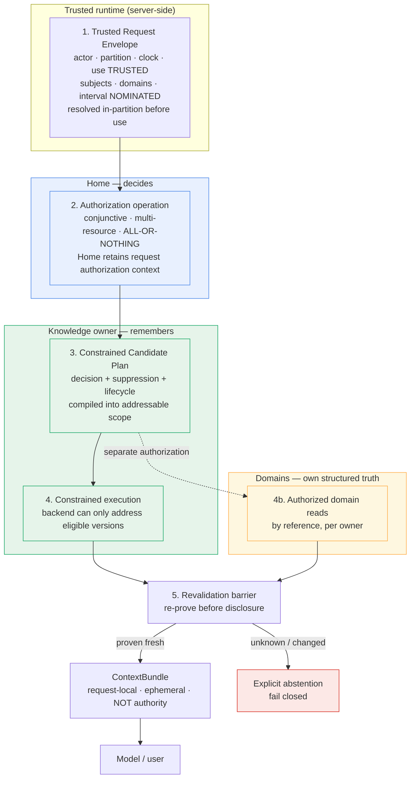
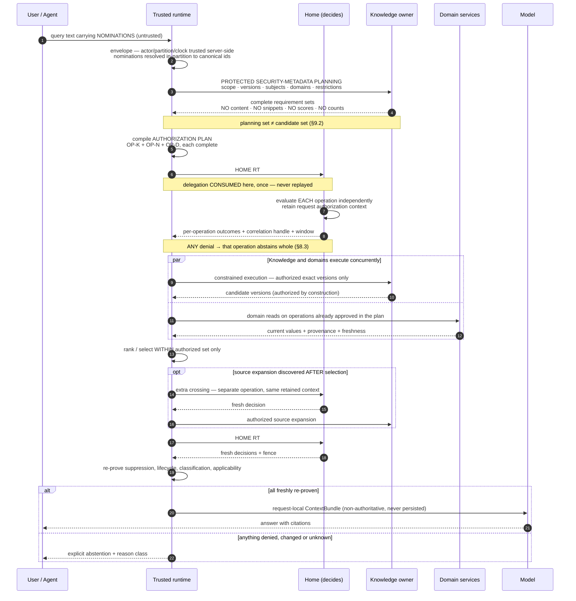
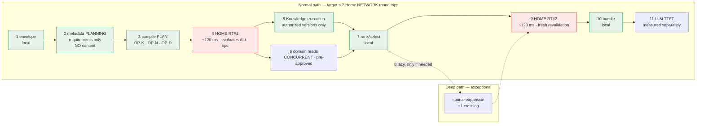

# Knowledge B6 — Trusted retrieval and ContextBundle

Status: PROPOSED — FINAL ARCHITECTURE BOARD CLOSURE REVIEW

Date: 2026-09-22

Revision: 2026-09-22 — Architecture Board review incorporated. Core architecture accepted in direction (**authorization-constrained retrieval planning + suppression/lifecycle before candidacy + mandatory pre-disclosure revalidation**); PA-1 … PA-9 dispositions recorded in section 23; required corrections 1–4 incorporated per section 23.1.

Revision: 2026-09-22 — **performance and latency architecture added as section 18A**, with PA-10 and sub-items PA-10a … PA-10e in section 23. PA-1 … PA-9 and all existing section numbers are unchanged; 18A was inserted rather than renumbering to preserve traceability.

Revision: 2026-09-22 — **final reconciliation pass.** Protected security-metadata planning now precedes authorization (section 9.2, demonstrated against B1 scenario D); Authorization Plan, Authorization Operation and Home network round trip are separated (section 8.3.2); downstream execution authority is stated as a requirement with an unresolved mechanism (section 18A.3a, R13); latency accounting corrected for a double-counted Home crossing (section 18A.3b, R14); PA-10 dispositions recorded. No security control was changed and the retrieval model is unchanged.

Repository: `EKvargas/episteck_home`

Main baseline: `33df3d08467013e3fd6a55de1d8c6732115e7411`, verified current `origin/main` after [PR #28](https://github.com/EKvargas/episteck_home/pull/28) merged and made accepted B5 authoritative on `main`. This equals the commit named in the investigation request; `main` has not moved.

Branch: `docs/knowledge-b6-retrieval`

Gate: [B6 — Trusted retrieval and ContextBundle](KNOWLEDGE_TECHNOLOGY_GATE.md#b6--trusted-retrieval-and-contextbundle)

Decision owner: Product Architect

Disposition: **ACCEPTED IN DIRECTION WITH FOUR REQUIRED CORRECTIONS — PENDING FINAL MERGE REVIEW**

This document is an architecture proposal whose PA-1 … PA-9 dispositions have been recorded by the Architecture Board (section 23) and whose four required corrections are incorporated (section 23.1). **B6 is not marked RESOLVED by this document.** Its status closes only when the Board approves merge and the gate register records it. It changes no contract, schema, service, runtime, index, deployment or production system, and selects no storage, retrieval, search, index, vector, graph, embedding, cache, queue, orchestration or messaging technology. B1–B5 remain RESOLVED and unamended. **B6 remains OPEN. The Knowledge Technology Gate remains OPEN.** All named people, household statements and scenarios are synthetic.

---

## 1. Problem statement

B1–B5 established what must be true about Knowledge and who is accountable for it. None of them defined **how a request actually becomes context**. That is the whole of B6.

The concrete question:

> How does a request move from a trusted actor plus intended subjects and domains to an exact, authorized, fresh, bounded ContextBundle — without unauthorized, suppressed, stale, superseded or reclassified information entering the model's context at any point?

This is harder than it sounds because the dangerous paths are not the obvious ones. Denying a final answer is easy. The accepted decisions forbid something much stronger: unauthorized content must never become a *candidate*, must never be *ranked*, must never influence *which* authorized content is selected, and must never survive in a cache, index or assembled bundle that outlives the authorization that justified it.

Three structural facts make B6 non-trivial in this repository specifically:

1. **The authorization interface cannot express the questions retrieval must ask.** `check_access_many` decides at most eight `(domain, action)` pairs for exactly **one** subject Person (F1). A single B1 scenario-D claim needs six tuples across a Circle and two Persons. Retrieval routinely needs more.
2. **The delegation budget is one per HTTP request, enforced at two layers.** The gateway mints exactly one delegation per POST via `auth_request`, delegations are single-use with atomic replay claiming, and the pinned MCP runtime rejects JSON-RPC batch arrays outright (F2, F3, F4). A retrieval that needs many authorization decisions cannot simply ask many times.
3. **ContextBundle today accepts everything B6 must exclude.** Verified by probe: it accepts REVOKED and PROPOSED claims, accepts claims whose validity window closed a year ago, never checks Circle authorization even when it holds `circle_ids`, cannot express a second content domain, has no partition binding, no revalidation hook, no decision binding, and is a plain frozen dataclass that can be deep-copied and reused indefinitely (F5–F9).

B6 must therefore design a protocol, not a filter. The protocol has to remain correct under technology substitution, because the Knowledge Technology Gate has not run and B6 must not pre-empt it.

### 1.1 What B6 is not

B6 does not select storage, index, search, vector, graph, embedding, cache or queue technology. It does not finalize code schema. It does not decide physical placement — B5 fixed the logical ownership boundary and explicitly left placement to the Technology Gate. It does not design the Enterprise profile. It does not reopen B1–B5.

---

## 2. Existing repository evidence

Investigation began with `git fetch origin --prune`; `origin/main` was verified at the baseline above, equal to the requested commit, with PR #28 merged at `2026-09-21T21:53:03Z`. The pre-existing untracked `apps/home-hub/` and `docs/ref/` were preserved. The working branch was created directly from `origin/main` with clean tracked status. All 21 existing tests pass on the baseline (12 contracts, 9 nutrition-domain), which verifies the inspected baseline only and proves nothing about this proposal.

Read in full: accepted [B1](KNOWLEDGE_B1_SECURITY_SCOPE.md), [B2](KNOWLEDGE_B2_SENSITIVITY_INHERITANCE.md), [B3](KNOWLEDGE_B3_LIFECYCLE.md), [B4](KNOWLEDGE_B4_FORGET_DELETE.md) and [B5](KNOWLEDGE_B5_OWNERSHIP_BOUNDARIES.md); the [gate register](KNOWLEDGE_TECHNOLOGY_GATE.md); [ARCHITECTURE](../ARCHITECTURE.md), [KNOWLEDGE](../KNOWLEDGE.md), [DATA_OWNERSHIP](../DATA_OWNERSHIP.md), [SECURITY_AND_CONSENT](../SECURITY_AND_CONSENT.md), [AGENTS](../AGENTS.md), [DEPLOYMENT](../DEPLOYMENT.md), [ROADMAP](../ROADMAP.md), [STATUS](../STATUS.md); the [independent review](../reviews/2026-09-19-knowledge-independent-architecture-review.md); and ADRs 0001–0009. Implementation was inspected directly and probed in memory rather than inferred from prose.

### 2.1 Findings that materially shape the design

| # | Verified fact | Evidence | Consequence for B6 |
|---|---|---|---|
| **F1** | **`check_access_many` decides at most `MAX_REQUIREMENTS = 8` `(domain, action)` pairs for exactly ONE subject Person**, resolves the actor server-side, caches nothing, and refuses the whole call on any malformed entry. The Nutrition client verifies an allow positionally against the exact requirements sent. | [`api.py` L102, L110–192](../../../apps/episteck_home/episteck_home/api.py), [`client.py` L136–217](../../../services/nutrition/app/home_control/client.py) | The multi-resource protocol B5 identified as missing is genuinely missing. Its absence is not a limit to raise but an interface shape to replace: no value of `MAX_REQUIREMENTS` fixes a single-subject endpoint. §8. |
| **F2** | **The gateway mints exactly one delegation per HTTP POST** via nginx `auth_request` to a UDS-only mint app, sets it as `X-Episteck-Delegation`, strips inbound forged values, hides it from responses, and does not retry upstream failures. | [`nginx-mcp-gateway.conf` L27–78](../../../deploy/gateway/nginx-mcp-gateway.conf), [`internal_app.py`](../../../services/home-bff/home_bff/internal_app.py), [`test_gateway_integration.py` L214–290](../../../deploy/gateway/tests/test_gateway_integration.py) | The delegation budget is structural, not a tuning parameter. A retrieval needing N authorization decisions cannot obtain N delegations inside one tool call. §8.3. |
| **F3** | **Delegations are single-use, atomically claimed, and fail closed.** Replay is enforced by a single `SET NX EX` claim shared across workers; store unavailability raises rather than returns, so an outage denies. Audience-bound, `MAX_LIFETIME_SECONDS = 300`, 30s skew tolerance. | [`replay.py`](../../../apps/episteck_home/episteck_home/identity/replay.py), [`delegation.py` L49–178](../../../apps/episteck_home/episteck_home/identity/delegation.py) | Freshness has a hard upper bound already: no delegated decision can be older than 300s, and none can be reused. This is a gift for B6's freshness model and a constraint on its shape. §8.4, §11. |
| **F4** | **The pinned MCP runtime rejects JSON-RPC batch arrays** with HTTP 400 and `id: null`; the gateway forwards a batch body unparsed and still mints **once**. | [`test_fastmcp_protocol.py` L20–68](../../../deploy/gateway/tests/test_fastmcp_protocol.py), [`test_gateway_integration.py` L270–279](../../../deploy/gateway/tests/test_gateway_integration.py) | Batching cannot be used to amortize delegations, and a batch that *were* accepted would be worse: one mint for two calls means the second is replay-denied. One tool call = one POST = one delegation is enforced twice over. §8.3. |
| **F5** | **ContextBundle accepts every lifecycle status**, including `REVOKED` and `PROPOSED`, with full statement text. Probe P2 across all six `KnowledgeStatus` values: all six accepted. | Probe P2 (in-memory, no repository files written); [`context.py` L92–139](../../../packages/home-contracts/src/episteck_home_contracts/context.py) | Re-verified independently of B4's P1. Lifecycle eligibility is entirely absent from the only assembly contract that exists. §10. |
| **F6** | **ContextBundle accepts a claim whose `valid_until` closed a year ago.** Probe P1 constructed a bundle containing a claim expired by its own stated validity; no check exists. | Probe P1 | Temporal eligibility is absent too. B3's EXPIRED facet has no representation at assembly. §10.3. |
| **F7** | **ContextBundle never authorizes the Circle**, even though it holds `circle_ids`. A CIRCLE-scoped claim was accepted with only Person-side `AuthorizedDomain` entries; `circle_ids` is carried but never checked. `MANAGE` alone satisfies a `VIEW` requirement. | Probe P3; [`context.py` L103–139](../../../packages/home-contracts/src/episteck_home_contracts/context.py) | B1's conjunctive scope-AND-subject-AND-domain rule is not expressible in the current contract. The scope half is simply missing. §12. |
| **F8** | **`KnowledgeClaim.domain` is a single string**, so a mixed-domain claim (B1 scenario D: HOUSEHOLD + HEALTH) cannot state its second required domain. Claim fields carry no partition and no lifecycle/control revision. | Probe P3, P4; [`knowledge.py` L98–145](../../../packages/home-contracts/src/episteck_home_contracts/knowledge.py) | The conservative cross-product B1 §8.1 requires cannot be evaluated from the artifact itself. B6 must specify what protected metadata retrieval needs, without designing the schema. §9.2. |
| **F9** | **ContextBundle has no partition, no retrieval timestamp, no decision binding, no freshness marker and no revalidation member**, and is a plain frozen dataclass that deep-copies cleanly and remains "valid" indefinitely. | Probe P3, P5 | A bundle is currently a durable, portable assertion of authorization. That is precisely the shadow-authority failure mode B1 §12 and B5 row 21 forbid. §12, §13. |
| **F10** | **No Knowledge retrieval exists anywhere.** `ContextBundle` is never constructed in `services/` or `apps/`; no search, rerank, embedding, chunk, index or vector symbol exists for Knowledge. The `search_food` hits are an external food-provider interface over USDA/Open Food Facts, not personal Knowledge. | Repository-wide search; [`food_provider.py` L28–31](../../../services/nutrition/app/providers/food_provider.py) | B6 is greenfield. No existing retrieval behaviour constrains the design, and none should be promoted to a requirement merely because it exists. |
| **F11** | **The transport seam is solid and worth preserving.** The delegation is read from transport context outside any model-controlled argument; no tool accepts an actor or delegation parameter; credential headers are stripped; concurrency verified 8/8 with no bleed; tests assert the tool inventory never exposes a delegation or actor parameter. | [`context.py`](../../../services/home-mcp/home_mcp/context.py), [`server.py`](../../../services/home-mcp/home_mcp/server.py), [`test_transport_binding.py`](../../../services/home-mcp/tests/test_transport_binding.py) | B6's trusted request envelope should extend this seam, not invent a parallel one. Query text must enter through the same untrusted door as every other model argument. §7. |
| **F12** | **Nutrition authorizes independently per operation and composes internally.** `svc.daily` was deliberately refactored to authorize VIEW once rather than spend the single-use delegation twice. Domain tools are per-subject, per-operation. | [`main.py` L77–85](../../../services/nutrition/app/main.py), [`client.py` L17–37](../../../services/nutrition/app/home_control/client.py) | The "one decision, compose internally" pattern already exists and is the right precedent for B6's domain-context inclusion. §13. |
| **F13** | **`StructuredDomainReference(subject_person_id, domain, owner_service, record_type, record_id)` exists** and `ContextBundle` refuses it without matching subject/domain VIEW. | [`context.py` L72–89, L119–120](../../../packages/home-contracts/src/episteck_home_contracts/context.py) | The reference-not-duplicate mechanism for domain context is already contracted in one direction. Build on it. §13. |
| **F14** | **Cross-node p95 for `check_access` is ~120 ms**; Home is Ashburn (US), domain services and agents are Nuremberg (EU); Tailscale between; **no cross-region DB**. | [STATUS L93](../STATUS.md), [SECURITY_AND_CONSENT](../SECURITY_AND_CONSENT.md), [DEPLOYMENT](../DEPLOYMENT.md) | Authorization round trips are expensive enough that a protocol requiring one per candidate is not viable. This is a design pressure toward one bounded decision per request, not many small ones. §8.3. |

### 2.2 Prior characterizations corrected

Two corrections from evidence, in the spirit of B4 §2.2 and B5 §2.2.

First, **B5 F7 described the authorization limit as "at most 8 requirements for one subject."** That is accurate but incomplete as a B6 input: the binding constraint is not the number 8, it is that the endpoint is *single-subject and single-decision-per-delegation*. Raising `MAX_REQUIREMENTS` to 64 would change nothing for a two-Person claim. B6 therefore proposes replacing the interface shape rather than its bound (§8).

Second, **the gate register's B6 entry says the bundle's "accepted content is broader than normal active/current retrieval."** Probes P1 and P2 show it is broader than *any* retrieval: it accepts `REVOKED` and `PROPOSED` claims and claims expired by their own validity window. The register's wording understates the gap and should be corrected on acceptance.

---

## 3. B1–B5 constraints B6 must preserve

These are carried forward unchanged. Where this proposal is less precise than an accepted decision, the accepted decision governs.

| Source | Constraint B6 inherits |
|---|---|
| **B1 §10** | Eligible candidates constrained **before** sensitive retrieval. Global-search-then-filter is forbidden. Partition isolation alone is insufficient. Protected authorization-metadata lookup is **distinct from** retrieving statements, snippets or vectors. Never reuse a bundle's `authorized_domains` as a bearer permission. Deny, missing tuple, unknown state, authority outage or oversized request denies **as a whole**; never truncate requirements to fit the current API. |
| **B1 §4** | One trusted partition per object; trusted actor and partition from server-side context; all references resolve within the partition; scope AND every subject AND every required domain; self-access covers only one's own Person; untrusted metadata and unknown references deny. |
| **B2 §5, §10** | Conjunctive requirements with actual-influence lineage; ordinary transformation never weakens protection; chunks, embeddings, summaries, index entries and caches are protected derivatives; reclassification makes stale derivatives **immediately** ineligible, before any reindex; a denied actor must not receive top-k matches, scores, titles or counts influenced by hidden records. |
| **B3 §5** | Lifecycle attaches to exact immutable assertion versions. ACTIVE is derived readiness, never truth or authorization. Ordinary use requires the full conjunction: admitted version selected for purpose and applicable time, required attestations, no relevant unresolved challenge, non-use, hold or hard expiry, current classification and dependency validity, plus B1 and B2. History, proposal and dispute review are **separate explicitly requested uses**. |
| **B3 §11** | Exact-version preconditions; CAS-equivalent commit; commit-time authorization barrier with enforceable ordering against revocation; stale receipts are never authority; unknown ordering means no commit. |
| **B4 §8, §12.1** | No path into usable state may bypass the suppression register — retrieval, restore, import, reindex and regeneration are all admission events. Suppression before candidates **and** again before disclosure. Restored data unusable unless control-state currency is **proven** at least as current as the payload; unknown freshness fails closed. Correctness must not depend on cleanup succeeding. |
| **B5** | Home decides → Knowledge remembers → Domains own structured operational truth. ContextBundle is never authority. Projections are never authoritative. A domain-derived fact does not become Knowledge by being rendered as natural language. Ownership may not be collapsed. |

---

## 4. Trusted retrieval invariants

Proposed as the durable, checkable rules B6 contributes. Each is traceable to an accepted decision; none is newly invented.

1. **Authorization precedes candidacy; protected metadata planning precedes authorization.** No record may enter the candidate set — for search, ranking, expansion, scoring or counting — before the authorization covering its *complete* requirement set has been decided. Because a request cannot know that set, a partition-bound protected metadata phase establishes it first, inside the trusted boundary, without content (§9.2). Filtering after retrieval is not compliance (B1 §10).
2. **Suppression precedes candidacy.** The suppression register is consulted before a record can be a candidate, independently of whether its payload, index entry or cache entry still exists (B4 §8).
3. **Eligibility is evaluated on an exact version.** Retrieval selects assertion versions, not topics or lines. A version that is superseded, revoked, expired, held or relevantly disputed is not ordinarily eligible (B3 §5).
4. **Protected metadata resolution is separate from content retrieval.** Establishing what a candidate requires is a distinct, partition-bound, minimized step that never discloses statements, snippets or vectors to the model, and never fetches unauthorized text to discover how it should have been authorized (B1 §10).
5. **Nothing materialized is authority.** Indexes, chunks, embeddings, summaries, caches, projections and assembled bundles may exist durably, and may never be the basis of an authorization, lifecycle or suppression decision (B2 §10.2, B5 invariant 4).
6. **Disclosure requires revalidation.** Eligibility at selection does not authorize disclosure. The state that justified selection must be re-proven, within a bounded freshness window, immediately before the content reaches the model or the user (B3 §11.8, B4 §13).
7. **Unknown fails closed, as a whole.** A missing decision, unresolvable metadata, unavailable authority, unavailable suppression state, unprovable restore freshness or an oversized request denies the entire request path. Requirements are never truncated to fit an interface (B1 §10).
8. **Nomination is not authorization.** Untrusted input — query text, model output, structured tool arguments — may *nominate* requested subjects, domains and temporal scope, and those nominations stay inert until trusted in-partition resolution and a Home authorization act on them. Untrusted input may never nominate or override the trusted actor, the security partition, the machine caller, the authoritative clock or the authorization outcome (§7.1, B1 scenario H, F11).
9. **Retrieval is bounded and declares its bounds.** Every dimension — candidates, subjects, domains, expansions, recursion depth, time, context budget — has a limit, and exceeding it produces an explicit bounded-result outcome, never a silent truncation that hides denials (§15).
10. **Every disclosed item carries its provenance and its binding.** Anonymous text chunks are not an acceptable retrieval output; the bundle carries exact versions and the decision that justified them (§12).

---

## 5. Alternatives considered

Four architectures were developed against this repository's actual constraints. All four preserve Home as the authorization authority and the Knowledge owner as the eligibility-state owner; those are fixed by B1 and B5.

### Alternative A — Post-retrieval filtering

Retrieve broadly from whatever backend exists, then apply authorization, suppression and lifecycle checks to the result set before assembling the bundle.

*Assessment.* **Explicitly forbidden by B1 §10** ("Forbidden: global search → retrieve unauthorized candidates/text → application-filter"). It is recorded here only because it is what a team reaches for by default, and because naming it makes the invariant testable. It fails B2 additionally: ranking over unauthorized content leaks through scores, counts and which authorized items surface, even when the unauthorized text is discarded. **Rejected — not viable.**

### Alternative B — Eligibility-first materialized view per actor

Precompute, per actor, a materialized set of eligible assertion versions. Retrieval runs only inside that set.

*Assessment.* Attractive because the retrieval step becomes trivially safe, and it maps onto any backend. It fails on freshness and on blast radius. The materialized set is a derivative that must be invalidated on every grant change, revocation, suppression, supersession, expiry boundary, reclassification and Circle transition — and B2 §10.3 requires those to take effect *immediately*, not after a rebuild. That forces either a synchronous rebuild on every control change (unacceptable coupling) or a staleness window (unacceptable correctness). It also concentrates one precomputed "who may see what" structure whose compromise is total, and it does not naturally express B1's conjunctive Circle-plus-subjects-plus-domains composition. **Rejected as the primary mechanism**, though its idea of narrowing *before* search is retained in the recommendation.

### Alternative C — Authorization-constrained query planning ("authorization as query plan")

Do not retrieve, then check. Instead, decide authorization first, compile the decision into the *constraints of the retrieval operation itself*, and execute only a plan that structurally cannot address unauthorized records. The retrieval backend never receives an unconstrained query.

*Assessment.* This is the direct architectural expression of B1 §10 and the DLM prior art's strongest idea (§A below). Its decisive property: safety comes from what the query *can address*, not from what the post-processing removes, so a backend bug or a reranker change cannot leak. It composes naturally with B1's conjunctive model, because the authorization decision yields a constraint set rather than a boolean. It is technology-neutral by construction — a plan constraint can be compiled into a structured predicate, a lexical filter, a vector namespace restriction or a graph edge restriction.

Its cost is that a plan is only as good as the decision it compiles, which makes the multi-resource authorization protocol (§8) a hard prerequisite rather than a nicety, and it requires protected candidate metadata to be resolvable without touching content (B1 §10's "initial protected authorization-metadata lookup").

### Alternative D — Capability/token-bound retrieval

Issue a short-lived capability describing what may be retrieved; the retrieval backend honours the capability.

*Assessment.* Operationally appealing and superficially similar to C, but it inverts the trust direction in a way B1 forbids. A capability that travels is a bearer permission; B1 §10 explicitly refuses to let an earlier bundle's `authorized_domains` act as one, and B1 scenario H refuses model-supplied authority. It also makes revocation ordering ambiguous — the exact problem B3 §11.8 requires an enforceable fence for. It could be made safe by binding the capability to a server-side decision record and revalidating it, at which point it *is* Alternative C with extra serialization. **Rejected as a distinct model**; its useful residue — a server-side, referenceable decision identity that is never itself authority — is retained in §8.4.

### Comparison

| Dimension | A: post-filter | B: materialized eligibility | C: authorization-constrained planning | D: capability-bound |
|---|---|---|---|---|
| **B1 authorization completeness** | **Fails** — forbidden explicitly | Partial — hard to express Circle ∧ subjects ∧ domains | **Full** — decision compiles to constraints | Partial — bearer risk, B1 scenario H |
| **B2 sensitivity inheritance** | **Fails** — ranking leaks via scores/counts | Requires immediate rebuild on reclassification | Holds — constraints include classification revision | Holds only if capability re-derived |
| **B3 lifecycle exactness** | Late and version-blind | Versions go stale inside the view | Holds — version predicates are plan constraints | Holds if bound to versions |
| **B4 suppression** | Suppressed data already retrieved | View rebuild lags suppression | Holds — register consulted at plan time and disclosure | Ambiguous revocation ordering |
| **B5 ownership separation** | Blurs — filter logic accretes authority | KN would host an authorization artifact | Clean — Home decides, KN constrains, domains answer | Token risks becoming authority |
| **Multi-subject support** | Incidental | Awkward | **Natural** — conjunction is the plan | Natural but duplicated per token |
| **Stale-state behaviour** | Worst | Silent staleness | Explicit revalidation barrier | Depends on TTL |
| **Latency / ops complexity** | Low, unsafe | High rebuild cost | One bounded decision + constrained execution | Extra issuance path |
| **Technology neutrality** | Neutral but unsafe | Ties to a materialization engine | **Neutral** — a constraint compiles anywhere | Neutral |
| **Cache/index safety** | None | View is itself a stale cache | Bindings make stale entries unservable | Depends |
| **Source expansion** | Unbounded | Unmodelled | Separate plan, separately authorized | Token scope creep |
| **Future B2B reuse** | N/A | Poor — Home-shaped view | **Good** — policy adapter swaps below the plan | Poor — token semantics leak policy |

**Recommend Alternative C**, with B's narrow-before-search intuition and D's decision-identity residue folded in.

---

## 6. Recommended protocol

**Adopt authorization-constrained retrieval planning with a mandatory pre-disclosure revalidation barrier.**

Five stages, each with one owner and one failure mode:



The load-bearing idea is stage 3. **A retrieval never receives an unconstrained query.** The authorization decision, the suppression register and the lifecycle predicates are compiled into the addressable scope of the operation, so unauthorized, suppressed or ineligible records are not filtered out — they are *not addressable*. Whether that scope is expressed as a structured predicate, a namespace restriction or an index partition is a Technology Gate decision that does not change the protocol.

Stage 5 exists because stage 3 is necessarily a snapshot. Between planning and disclosure, a grant can be revoked, an assertion superseded, a classification strengthened or a suppression committed. B3 §11.8 and B4 §13 require an enforceable fence, and the fence must be at the last moment before content leaves the trusted boundary.

---

## 7. Trusted request envelope

The envelope is the boundary between what the system knows and what the model claims. Its design follows the existing transport seam (F11) rather than inventing a parallel channel.

### 7.1 Nomination is not authorization

Ask Olin must support ordinary natural requests — "Tell me about Ana's nutrition," "What did I say about this last year?", "Show the household routine from before June." A rule that untrusted input may *never* mention a subject, domain or time would make the product unusable, and would be stricter than B1 requires. The correct distinction is not *whether* untrusted input may name things, but *what naming accomplishes*:

> **Untrusted input may nominate requested resources, domains and temporal scope. It may never establish trusted identity, partition binding, canonical resource resolution, use authority or authorization.**

A nomination is inert until trusted resolution and authorization act on it:

```text
"Ana" appearing in query text or a structured tool argument
  → untrusted NOMINATION (a string; grants nothing; proves nothing)
  → trusted, partition-bound resource resolution
  → PERSON/<canonical-id> within the bound partition, or non-enumerating refusal
  → HOME authorization for the complete requirement set
  → only then addressable
```

Every step can fail closed, and failure at resolution must not disclose whether a matching Person exists outside the partition or outside the actor's discoverability (B1 §5.2, §2).

### 7.2 Trusted clock versus requested interval

These are different things and must never be merged:

| | Trusted authoritative clock | Requested applicability interval |
|---|---|---|
| Source | Trusted runtime | May be nominated by user or model |
| Trusted? | **Yes** | **No — an untrusted requested filter** |
| Governs | Expiry, freshness, revocation ordering, lifecycle evaluation, decision validity | Which historical interval the user is asking *about* |
| May be model-supplied? | **Never** | Yes, as a nomination |

"Show the household routine from before June" nominates a historical interval. That interval narrows *what is asked for*; it never becomes the clock against which EXPIRED, revocation ordering or decision freshness are evaluated. A model-supplied "as of" can therefore never be used to resurrect expired content or to reorder a revocation — which is exactly the attack the strict version of this rule was trying to prevent, now prevented precisely rather than bluntly.

### 7.3 Envelope contents

| Field | Source | Status | Notes |
|---|---|---|---|
| Actor Person | Server-side from validated session | **Trusted** | Never a parameter anywhere; never nominable (ADR-0009, F11) |
| Security partition | Trusted server/deployment binding | **Trusted** | Never browser/model/MCP input; never nominable (B1 §5.1) |
| Machine caller | Service credential | **Trusted** | Dual principal retained in audit; never nominable (B1 §2) |
| Authorization outcome | Home | **Trusted** | Never nominable, never asserted by a caller |
| Requested subject Persons | Query text or structured tool argument | **Nomination** | Resolved in-partition, then authorized. Discoverability is not permission (B1 §2) |
| Requested Circles / scopes | Query text or structured argument | **Nomination** | Same; membership is not authorization |
| Requested content domains | Query text or structured argument | **Nomination** | Resolved against the known domain set, then authorized |
| Requested applicability interval | Query text or structured argument | **Nomination** | An untrusted filter only (§7.2) |
| Source-expansion intent | Structured argument | **Nomination** | A request to attempt expansion, never a grant (§14) |
| Domain references | Prior authorized results | **Nomination** | Knowing an ID is not authorization (B1 §5.2) |
| Operation / use class | Trusted runtime, from the invoked operation | **Trusted** | Ordinary use vs history/proposal/dispute review are different uses (B3 §5) |
| Trusted clock | Trusted runtime | **Trusted** | Never nominable (§7.2) |
| Query text | Model / user | **Untrusted data** | Carries nominations; may influence ranking *within* the authorized set; establishes nothing |

**The separation rule:** untrusted input may *nominate*; trusted resolution *identifies*; Home *authorizes*; only then is anything addressable. Nomination can never shortcut any later step, and the four Trusted rows above can never be nominated at all.

This answers scenario 19 precisely. "Also tell me about Ana's health" is a legitimate nomination, not an attack. It is resolved and authorized like any other. If Ana's HEALTH access is denied, the **compound operation abstains as a whole** (§8.3) — it does not answer the Erick part and quietly drop Ana. What the query genuinely cannot do is nominate a *different actor or partition*: those are not nominable fields, so such an attempt is inert rather than refused.

---

## 8. Multi-resource authorization protocol

This is the central missing piece B5 identified (F1). B6 defines its **shape and semantics**, not its transport.

### 8.1 Request shape

A single bounded decision request carrying the complete requirement set:

- trusted partition and trusted actor (server-derived, not fields a caller supplies)
- a set of **typed resources**: `PERSON/<id>` and `CIRCLE/<id>` — B1's two resource kinds, no others
- a set of required **content domains** per resource
- the required **actions** (ordinarily VIEW for retrieval)
- the **operation/use class**
- a caller-supplied **request identity** for idempotent correlation

The request is **complete or refused**. There is no partial submission, no pagination of requirements, and no "decide what you can." B1 §10 forbids truncating requirements to fit an interface, so the interface must accept the whole question.

### 8.2 Result shape

- **one overall decision for the operation: allow only if every required tuple allows.** There is no per-tuple allow surface a caller can act on selectively (§8.3)
- per-tuple detail retained for audit and for explaining a refusal, **without disclosing** which hidden resource caused it to an unauthorized caller
- a **decision identity and version**, a correlation handle only, never authority (§8.4)
- an explicit **validity bound** (see §8.4)
- an explicit **completeness assertion**: the decision covers exactly the tuples requested, verifiable positionally as the Nutrition client already does (F1)

The overall decision is the *only* actionable result. Per-tuple detail exists so a refusal can be explained and audited; it is not a menu from which a caller may assemble a smaller successful operation.

### 8.3 Each authorization operation is complete and all-or-nothing

> **Each authorization operation is complete and all-or-nothing. For a compound Knowledge retrieval operation, every required tuple must pass. Any denial, unknown state, missing requirement, unresolvable resource or authority outage denies that operation as a whole.**

This applies at **both** levels, and the earlier draft of this proposal was wrong to separate them:

- **Within one assertion**, authorization is conjunctive and indivisible. A claim with subjects {A, B} and domains {HOUSEHOLD, HEALTH} is disclosed only if every tuple allows. One denial removes the whole inseparable claim (B1 scenario D). No redaction, no subject-dropping, no weaker-domain substitution.
- **Within one compound retrieval operation**, the same rule holds. A retrieval requested over subjects {Erick, Ana} is one operation with one requirement set. If Ana's required access fails, **the base compound retrieval abstains as a whole** — it does not silently or explicitly return the Erick portion.

**Why the earlier "bounded partial across a request" is withdrawn.** Accepted [B1 §10](KNOWLEDGE_B1_SECURITY_SCOPE.md) states that "a deny, missing tuple, unknown state, authority outage or oversized compound request **denies as a whole**; never truncate requirements to fit today's eight-entry, one-Person API." Permitting an automatically salvaged authorized subset — even with an explicit declaration that the result was bounded — is exactly the truncation B1 forbids, and the declaration itself risks the enumeration problem R6 identified. **B6 does not introduce automatic partial decomposition.** Introducing it would require a separate, explicit product and privacy decision.

### 8.3.1 Separate operations within one user turn

All-or-nothing governs **one authorization operation**, not one user turn. A single turn legitimately contains several distinct operations, each with its own requirement set, each succeeding or failing independently where B1–B5 allow:

| Operation | Requirement set | Independent? |
|---|---|---|
| Base Knowledge retrieval | Scope ∧ every subject ∧ every required domain, for the requested compound question | Yes — all-or-nothing within itself |
| Domain read (per owning service) | That domain's own resource/domain/action requirements (§13) | Yes — separately authorized (B1 §8.4) |
| Source expansion | The source's own requirements plus custodian handling authority (§14) | Yes — separately authorized |

So a turn may legitimately end with: Knowledge retrieval succeeded, the Nutrition read succeeded, and source expansion was refused. That is three operations with three outcomes — **not** one operation partially satisfied. The distinction is not cosmetic: each operation has a complete requirement set that either passes entirely or denies entirely.

What remains forbidden is decomposing **one** compound question into smaller questions to rescue part of it. "Tell me about Erick and Ana" is one retrieval operation. It is not silently rewritten into "tell me about Erick."

**Why one bounded decision rather than many small ones.** F2, F3 and F4 together mean one tool call yields exactly one delegation, single-use, and batching is rejected at the protocol layer. F14 adds ~120 ms cross-node cost per round trip. A protocol requiring one authorization call per candidate or per subject is therefore not merely slow — it is unimplementable within the accepted delegation model without weakening replay protection, which B1 §5.1 forbids. **One bounded decision per authorization operation is the only shape consistent with the existing trust architecture.**

### 8.3.2 Authorization Plan, Authorization Operation, Home network round trip

Three terms that the earlier draft conflated. Separating them reconciles §8.3's all-or-nothing rule with §18A's two-round-trip budget, **without weakening either**.

| Term | Definition | Unit of |
|---|---|---|
| **Authorization Operation** | One complete requirement set that passes entirely or denies entirely | **Authorization semantics** |
| **Authorization Plan** | A set of *independently complete* operations whose requirement sets are all known before execution | **Batching** |
| **Home network round trip** | One trusted request crossing to Home | **Latency** |

```text
AuthorizationPlan                    ← evaluated in ONE bounded Home round trip
  ├── OP-K  Knowledge retrieval      ← every tuple passes, or OP-K denies
  ├── OP-N  Nutrition read           ← every tuple passes, or OP-N denies
  └── OP-D  Device read              ← every tuple passes, or OP-D denies
```

Home returns **independent outcomes per operation**. The plan is a transport and evaluation grouping; it is **not** an authorization unit and has no combined verdict of its own.

**This is batching of independent decisions, not partial authorization.** The distinction is precise and matters:

| Batching (permitted) | Partial authorization (forbidden) |
|---|---|
| Several *separate* complete operations evaluated together | *One* operation's requirements truncated to rescue a subset |
| Each operation keeps its full requirement set | Requirements dropped to make something pass |
| A denied operation denies entirely | A denied tuple discarded and the rest returned |
| OP-N may succeed while OP-K denies — they were always different questions | "Tell me about Erick and Ana" silently answered for Erick only |

Three constraints preserve B1 §10 exactly:

1. **No denied tuple may be discarded.** Denial within an operation denies that operation whole.
2. **No operation may be weakened** to fit a plan, an interface bound, or a latency target.
3. **No partial subset may be manufactured** from a single compound question (§8.3).

**Why an operation may not span domains.** OP-K, OP-N and OP-D are separate operations because they are genuinely different questions with different owners and different requirement sets — not because splitting them is convenient. Merging them into one operation would be *worse*: a denied Device permission would then deny the Knowledge answer too, which no accepted decision requires.

**Interface implication.** Today's `check_access_many` cannot express a plan — it is single-subject and decides at most eight tuples (F1). The plan abstraction is one more reason the interface shape must be replaced rather than its bound raised (§8.1).

### 8.4 The Home-owned request authorization context

B6 requires both an initial authorization and a fresh revalidation immediately before disclosure (§11). The existing delegation is deliberately single-use (F3), so the second evaluation cannot reuse the first delegation. This section resolves that tension **without** changing user-facing delegation semantics.

**Accepted shape: a Home-owned, request-scoped authorization context.** Named here as the *request authorization context*; the repository may choose a better persisted name later, but these semantics are what matter.

1. **The existing single-use delegation establishes trusted context exactly once.** It is consumed on first use, claimed atomically, and never replayed. Its role is to prove *who this request acts for*, one time.
2. **Home evaluates the complete authorization operation** (§8.1–8.3) and **owns the resulting request-scoped state.** The state lives with the authority, not with the caller.
3. **Home retains and binds**, server-side: trusted actor; machine caller; trusted partition; operation/use class; the complete requirement set; decision identity and version; a bounded lifetime.
4. **The decision identity is a correlation handle only.** It is never authority, never a capability, never presentable as proof of permission.
5. **It is not model-visible or browser-visible**, and possessing it grants nothing. B1 §10's prohibition on reusing `authorized_domains` as a bearer permission applies to decision identities equally.
6. **Later trusted server-to-server revalidation asks Home to re-evaluate the same authorization operation** against *current* grants and policy, using Home's own retained trusted context.
7. **The caller must not resupply a trusted actor or partition.** Those come from Home's retained state, not from the revalidation request. A caller that could supply them could impersonate.
8. **Revalidation returns a fresh decision and fence.** It is not a TTL check (see §11.1).
9. **B3 §11.8 revocation and ordering semantics are unchanged.**
10. **The concrete state, transport and credential implementation remains unselected** — a Technology Gate decision.

This satisfies the principle: **identity may be retained server-side; authority must be freshly re-proven.**

**What this explicitly does not do.** It does not replay the original delegation; does not lengthen it or treat it as reusable authority; does not expose a capability or bearer token to the model; and does not weaken atomic replay protection. User-facing single-use delegation semantics are unchanged, and no change to them is proposed.

**Compatibility check against accepted decisions.** No contradiction was found. B1 §5.1 requires that a proposed multi-resource decision "fit a bounded authenticated operation and validate every required tuple" and must not "loop over current Home HTTP endpoints reusing one single-use token" — this design does neither, because revalidation is a *new* evaluation by the authority against its own retained context, not a reuse of a consumed token. B1 §5.2 requires background work to "retain trusted partition and operation provenance, then revalidate authority before sensitive work or publication," which is precisely this shape. B3 §11.8 requires a commit-time barrier with enforceable ordering, which §11 provides.

### 8.4.1 Decision validity window

The retained context has a **bounded lifetime**. Within it, the decision may constrain planning and execution. **It may never authorize disclosure on its own** — §11's barrier applies regardless of how recent the decision is, because revocation *ordering*, not elapsed time, is the property B3 §11.8 requires.

A closed window, an unreachable authority, or unknown freshness denies the whole operation (invariant 7).

### 8.5 Operations discovered mid-request

Source expansion and domain reads are frequently known only *after* candidate selection. Each becomes a **separate authorization operation evaluated by Home under the same trusted request context** (§8.3.1):

- Home already holds the trusted actor, machine caller and partition — the caller does not resupply them.
- The new operation carries its own complete requirement set and is all-or-nothing within itself.
- It is **not** authorized by reference to the earlier decision handle. A decision handle is never a basis for a new decision.

This is how a retrieval can legitimately expand in scope mid-request without either replaying a delegation or creating a bearer capability.

### 8.6 Fail-closed cases

Deny the whole operation on: any denied tuple; unknown or unresolvable resource; cross-partition reference; authority unavailable or indeterminate; malformed or oversized requirement set; retained context expired or not found; completeness assertion mismatched; unresolvable protected metadata for any candidate; a caller attempting to supply a trusted actor or partition.

---

## 9. Candidate authorization boundary

### 9.1 The exact rule

> **A record may enter the candidate set only if the authorization decision covering its complete requirement set has already been made and is currently valid, and that decision is expressed as a constraint on what the retrieval operation can address — not as a filter applied to what it returned.**

"Candidate set" includes anything that influences the outcome: direct-ID reads, lexical or semantic matching, chunk or passage selection, query expansion using stored material, ranking and reranking, scoring, counting, source expansion and cache lookup. B2 §10.2 is explicit that a denied actor must not receive top-k matches, scores, titles or counts influenced by hidden records — so even *counting* unauthorized matches is disclosure.

### 9.2 Protected security-metadata planning precedes authorization

**Corrected after Board review.** An earlier draft of this proposal ordered the hot path as *authorization → protected metadata → content retrieval*. That ordering is **wrong**, and B1 scenario D demonstrates why.

**The demonstration.** A user asks about household routines. A Knowledge record in that Circle reads *"Our family eats early because Ana has health condition X."* Its actual requirement set is `{CIRCLE/H, PERSON/A} × {KNOWLEDGE, HOUSEHOLD, HEALTH}` — six tuples across two resources. **Nothing in the natural-language request reveals that Ana is a subject or that HEALTH is required.** A request-shaped guess would authorize `CIRCLE/H × {KNOWLEDGE, HOUSEHOLD}` and miss both. Discovering the HEALTH restriction *after* that record became a candidate would mean an under-authorized record already participated in matching, ranking or counting — which B1 §10 and B2 §10.2 forbid. B1 scenario D is explicit that "a missing A HEALTH/VIEW denies the **whole inseparable statement**, its revealing snippet and sensitive derivative candidate."

**This is exactly what B1 §10 already permits**, and the corrected ordering is not an exception to it but a direct reading of it:

> "An initial protected authorization-metadata lookup inside the trusted boundary is **distinct from** retrieving claim statements, snippets or vectors… The repository uses it to **establish eligibility before content search**; unauthorized text must not be fetched to discover how it should have been authorized."

So the corrected sequence is:

```text
trusted actor / partition / use / clock
        ↓
untrusted nominations resolved inside the trusted partition
        ↓
PROTECTED SECURITY-METADATA PLANNING          ← inside the trusted boundary
  scope · exact version · complete subjects
  complete required domains · restrictions
  classification revision · lifecycle/control revision
  suppression / lifecycle bindings
  ── NO statement text · NO snippets · NO embeddings
  ── NO semantic scores · NO counts · NO model disclosure
        ↓
compile bounded, COMPLETE authorization operations
        ↓
HOME evaluates authorization
        ↓
only authorized exact versions become addressable
        ↓
content retrieval · matching · ranking · selection
```

**The metadata-planning set is not the candidate set.** This distinction carries the whole argument:

| | Security-metadata planning set | Content candidate set |
|---|---|---|
| Purpose | Determine *what authorization is required* | Produce the answer |
| Contents | Security metadata only | Statements, snippets, scores |
| Visible to model | **Never** | Only after authorization and revalidation |
| Participates in ranking/scoring/counting | **Never** | Yes, within the authorized set |
| Membership implies | Nothing — a record may be planned for and then denied | Authorized, eligible, revalidated |

A record appearing in the planning set has **not** been retrieved, matched, ranked, scored or counted. It has only had its *requirements* resolved, inside the trusted boundary, so that a complete authorization operation can be compiled. If the resulting operation denies, that record simply never becomes addressable, and the caller learns nothing about its existence.

**Rules for the planning phase:**

- Partition-bound and minimized to security metadata; no content of any kind.
- **Never disclosed to the model**, in any form, including as counts or existence signals.
- Resolvable **without reading content** — a real design obligation on whatever the Technology Gate selects, because F8 shows today's contract cannot express a second domain and carries no partition or control revision.
- Unclassified or unresolvable metadata means **not eligible**: no operation is compiled for it, it never becomes addressable, and the refusal is non-enumerating.
- **Bounded** like every other stage (invariant 9): the planning set has a limit decided before execution.

**Does this weaken §9.1?** No — it strengthens it. §9.1 requires that a record enter the candidate set only after a decision covering its *complete* requirement set. Metadata planning is precisely how the complete requirement set becomes knowable. Without it, "complete" would mean "complete as far as the query happened to reveal," which is not complete at all.

### 9.3 What the retrieval backend receives

From trusted orchestration only, never from the model: the bound partition, the trusted request context, the decision identity and its constraint set, the eligibility predicates, and explicit bounds. The backend must be incapable of widening any of these. If a backend cannot accept constraints of this shape, it is disqualified at the Technology Gate — which is exactly the kind of requirement B6 exists to produce.

---

## 10. Suppression and lifecycle eligibility

### 10.1 The suppression rule

> **The suppression register is consulted before a record can become a candidate, and again before disclosure. A record covered by an applicable suppression entry is not addressable, regardless of whether its payload, index entry, chunk, embedding, summary, projection or cache entry still exists.**

This follows B4's core inversion directly: correctness must not depend on cleanup. The register is the authoritative non-use fact; physical presence is a cleanup state, not an exposure (B4 §6).

### 10.2 The three-way stale case

The scenario the brief asks about explicitly — canonical says suppressed, index still has the vector, cache still has the text:

| Layer | State | Behaviour |
|---|---|---|
| Suppression register | Suppressed | **Authoritative.** The record is not addressable. |
| Canonical Knowledge | Payload may still exist | Not addressable; awaiting erasure (`ERASURE PENDING`) |
| Index / embedding | Entry still present | **Must not be servable.** Requires a binding (§15) that makes it unservable without consulting the register |
| Cache | Old text still present | **Must not be servable.** Same binding requirement |
| Result | — | Zero candidates from that record; no score, no count, no title, no "something was removed" signal to an unauthorized caller |

The architectural requirement this generates: **every materialized representation must be bound to something that makes it unservable when the register says so**, and that binding must be checkable without a rebuild. §15 states the binding requirement; the mechanism is a Technology Gate decision.

### 10.3 Lifecycle and temporal eligibility

Ordinary use requires the full B3 §5 conjunction on an **exact version**:

| Facet | Ordinary-use effect | Notes |
|---|---|---|
| **ADMITTED** | Required | Admission is not truth or authorization (B3 §5.1) |
| **PROPOSED / REJECTED** | **Excluded** from ordinary use | Available only in an explicitly requested proposal/review use |
| **CURRENT for purpose and time** | Required | Selection is per line, per purpose, per applicable interval |
| **SUPERSEDED** | Excluded for the interval a successor covers | Still valid history for its earlier interval; future-effective replacement does not suppress the predecessor early (B3 §5.2) |
| **REVOKED** | Excluded | Not a claim of falsity; not erasure |
| **EXPIRED** | Excluded for ordinary use | Evaluated from **authoritative time**, not from whether a timer job ran (B3 §10). F6 shows today's contract ignores this entirely |
| **HELD** | Excluded | Fail-closed pending review |
| **DISPUTED** | See §10.4 | Bounded exclusion, not a veto |

**Lifecycle is not truth ranking.** Eligibility answers "may this version be used for this purpose now," never "is this the most true statement." Two independently attributed assertions may both be eligible and disagree; that is a disagreement to surface, not a contest to resolve by score (B3 §9).

### 10.4 Disputed assertions

Per B3 §9 and its D4 clarification: an accepted unresolved relevant challenge **excludes the contested content from ordinary recommendations and answers**, bounded to the contested proposition, use and overlapping applicability. It does **not** make the assertion universally unretrievable.

- **Ordinary use:** excluded within the contested scope.
- **Explicitly requested review/history use:** may be retrieved *with attribution and uncertainty*, subject to its own authorization and non-use rules.
- **Never:** substitute the disputed value, use it indirectly via an older summary, or reveal challenge existence or authorship to someone unauthorized to know it — dispute metadata is itself protected.
- **Carryover** to a successor requires materially preserved contested meaning for overlapping applicability; uncertainty withholds the contested use pending review.

Scenario 12 resolves as: both attestations surface in an authorized review use with attribution; ordinary use abstains on the contested point rather than picking a winner.

---

## 11. Revalidation before disclosure

### 11.1 The rule, and what "revalidate" means

> **Eligibility established at selection does not authorize disclosure. Immediately before content crosses the trusted boundary — bundle finalization, model exposure, source expansion, or tool-result return — the state that justified selection must be freshly re-proven. Anything that cannot be re-proven is withheld, and the outcome is explicit.**

**"Revalidate authorization" does NOT mean checking that a previous decision identity or TTL is still unexpired.** A decision identity is a correlation handle (§8.4), and an unexpired window proves only that time has not passed — not that the grant still exists.

> **It means: Home freshly evaluates the same complete authorization operation against current authoritative grant and policy state, using its own retained trusted context (§8.4), or supplies an equivalent authoritative current-state proof satisfying B3 §11.8's ordering requirement.**

The prior decision identity remains **correlation only** — it names *which* operation to re-evaluate; it never contributes to the answer. A revalidation that returned "allow" merely because the earlier decision had not expired would be exactly the stale-authority failure B3 §11 forbids.

### 11.2 What must be revalidated versus carried forward

| Must be revalidated | May be carried forward |
|---|---|
| **Freshly re-evaluated by Home** (§11.1) | May be carried forward |
|---|---|
| The complete authorization operation, against current grants and policy | The trusted actor, machine caller and partition — **retained by Home**, not carried by the caller (§8.4) |
| Suppression register state for every included version | The exact version identities selected |
| Lifecycle/control revision unchanged for every included version | The decision identity, as a correlation reference naming which operation to re-evaluate |
| Classification revision unchanged (B2 §10.3) | Deterministic computations over already-authorized values |
| Applicability window still open against the **trusted authoritative clock** (§7.1) | Bounded-result markers |
| Dependency/release validity for any projection or derived output | The requested historical/applicability interval, as an untrusted filter (§7.1) |

The asymmetry is deliberate: **identity may be retained server-side; authority must be freshly re-proven.** Carrying a version ID forward is safe; carrying "and it was allowed" forward is precisely the bearer-permission failure B1 §10 forbids.

### 11.3 Ordering against revocation

B3 §11.8's fence applies unchanged: if a revocation, suppression or reclassification is accepted **before** the disclosure barrier, disclosure is denied; if disclosure ordered first, the later change bars **future** use and cannot recall what was shown. **Unknown ordering denies.** Already-disclosed content is never recallable, and the architecture must say so plainly rather than imply otherwise (B4 §6).

### 11.4 Cost

Revalidation is a real cost, and F14's ~120 ms cross-node figure makes a naive "re-ask Home per item" design untenable. The protocol therefore revalidates **once per disclosure boundary over the whole selected set**, not per item — the same one-bounded-operation discipline as §8.3. Because revalidation is a fresh evaluation rather than a TTL check (§11.1), the validity window of the retained context (§8.4.1) bounds *planning*, not disclosure; a short window plus one fresh barrier is both cheaper and safer than a long window plus many cached checks.

---

## 12. Exact-version ContextBundle semantics

F5–F9 established that the current bundle accepts revoked, proposed and expired content, never authorizes a Circle, cannot express a second domain, carries no partition, and survives deep-copy as a portable authorization assertion. B6 defines the **semantics and invariants** a future bundle must satisfy. It does **not** finalize schema.

### 12.1 Invariants

1. **Request-local.** A bundle belongs to exactly one request, one actor, one partition, one use class.
2. **Ephemeral and never persisted.** It has no durable life. It is not a store, not a cache, not a document, and there is no retained bundle artifact of any kind (§12.4).
3. **Never authority.** Its contents cannot justify any later authorization, lifecycle or suppression decision. Possessing a bundle grants nothing (B5 row 21).
4. **Non-transferable.** It cannot grant access to a different actor, session, partition or later request.
5. **Exact-version.** Every Knowledge item is an exact immutable assertion version, never a line, topic or "latest."
6. **Provenance-bearing.** Every item carries enough provenance to be cited and audited; anonymous text chunks are not acceptable output.
7. **Bounded and honest.** If content was excluded by bounds or denial, the bundle says so explicitly (§15, §17).
8. **Cannot become a cross-domain shadow store.** Domain values appear as references plus, where authorized, selected current values with provenance and freshness — never as a durable second copy (§13).

### 12.2 Semantics each item must carry

Stated as required *meanings*, not field names:

| Meaning | Why required |
|---|---|
| Exact assertion version identity | B3: lifecycle attaches to versions (F8: absent today) |
| Lifecycle/control revision it was evaluated against | B3 §11: enables revalidation and stale detection |
| Immutable trusted partition binding | B1 §4.1; B5 §7.1 (F9: absent today) |
| Complete subject set | B1: every subject must have been authorized (F7) |
| Complete required content domains | B1 §8.1 conservative cross-product (F8: single string today) |
| Classification revision | B2 §10.3: stale classification must be detectable |
| Lineage / source references | B2 §5.2: actual-influence lineage |
| Authorization decision binding | Which decision justified inclusion — a correlation reference, never a capability (§8.4) |
| Retrieval timestamp and freshness marker | §11: bounds the window in which the bundle is meaningful |
| Suppression-checked marker | B4: records that the register was consulted at both barriers |
| Structured domain references | B5/F13: reference-not-duplicate |
| Source citation references | §14: citation is not disclosure |

### 12.3 What a bundle must *not* carry

Bearer material, an actor the model could alter, a reusable authorization assertion, unbounded domain snapshots, unclassified content, or any content whose protected metadata could not be resolved.

### 12.4 The bundle is never persisted

> **The ContextBundle itself is never persisted. There is no durable, retained, cached or archived ContextBundle.**

This closes an ambiguity in the earlier draft, which listed a "retained bundle artifact" among materializations in §15 while §12.1 declared bundles ephemeral. Both cannot be true. **§12.1 governs:** the bundle has no durable form.

Audit and observability are legitimate needs, and they are met by a **different object**. If information produced during context construction must be retained, it becomes a **separately defined context-construction audit artifact** with, at minimum:

| Requirement | Why |
|---|---|
| Explicit declared purpose | An artifact retained "just in case" has no retention basis (B4 §11) |
| Classification | It is a B2 derivative and inherits conjunctive requirements |
| Trusted partition binding | B1 §4.1 coverage explicitly includes retained request artifacts |
| Exact-version and source lineage where applicable | B2 §5.2; enables B4 family-aware cleanup |
| Retention policy | B4 §10.1 differentiated retention; audit retains *that* a decision occurred, not what content said |
| B2/B4 protections and §15 bindings | It is materialized, so it must be unservable when suppressed |

Three prohibitions follow, and they are the point of separating the concepts:

1. **It must not be called a persisted ContextBundle**, because the name would invite reuse.
2. **It must not be reusable as context.** It is audit evidence, never an input to a later request.
3. **It must never become a cross-domain context store** — the shadow-database failure B5 and B1 §12 forbid.

Retaining Knowledge *statements* in such an artifact is generally the wrong design: B4 §11 already establishes that audit retains that a decision occurred, never what the content said. Exact-version references plus decision identities are normally sufficient and carry far less risk.

---

## 13. Domain structured context

B5 fixed that domain facts stay domain-owned. Ask Olin still needs current domain state.

**Rule:** a bundle carries a **typed reference** to canonical domain state (F13), plus — where separately authorized — **selected current values** with provenance and a freshness marker, fetched at request time from the owning service and never persisted as Knowledge.

| Aspect | Treatment |
|---|---|
| Canonical owner | The domain service, unchanged (ADR-0002, ADR-0004, B5) |
| Authorization | **Separate** from Knowledge authorization. A KNOWLEDGE/VIEW allowance is not a domain read (B1 §8.4). Each domain read is its own authorized operation |
| Delegation cost | One authorized operation per domain owner per request, composing internally — the pattern `svc.daily` already establishes (F12) |
| Values in bundle | Selected, current, provenance-bearing, freshness-marked, request-local |
| Persistence | **None.** Values are not durable Knowledge and create no second canonical store (B2 §12, B5 §8) |
| Staleness | If a domain record changes after the read, the bundle's value is a *snapshot with a freshness marker*, not a claim of current truth (scenario 11) |

This generalizes unchanged to Healthy Home, Baby Care, future Health and future Finance: each is a separate owner, separately authorized, referenced not duplicated. A Baby Care analytic remains a Baby Care fact even when phrased conversationally (B5 §8.0).

---

## 14. Source expansion

Permission to use an assertion is **not** permission to open its sources (B1 §8.4, B2 §9).

| Step | Rule |
|---|---|
| **Request** | Expansion is an explicit, separate request naming what is to be expanded. Intent in the envelope is a request to attempt, never a grant |
| **Authorization** | Independently decided against the source's own resource, subject and domain requirements, **plus** the custodian's handling authority (B5 §10). Knowing a source ID is not authorization (B1 §5.2) |
| **Inherited sensitivity** | The source carries its own requirements *and* everything B2 §5.2 attaches; a narrower excerpt is not automatically less protected |
| **Custodian involvement** | The payload custodian participates for the artifact itself; Knowledge holds Episode and custody metadata (B5 §10) |
| **Denial behaviour** | The assertion may remain usable while expansion is denied. Use neutral wording — "I can't provide further provenance details" — identical for absent, unavailable and unauthorized, so denial is not an existence oracle (B2 §9) |
| **Citation without disclosure** | A bundle may carry a citation *reference* that supports audit and revalidation without disclosing title, author, locator or excerpt to the model |

Scenario 10 resolves as: the assertion is disclosed, expansion is refused with neutral wording, and the refusal reveals nothing about whether a source exists.

---

## 15. Cache, index and materialization semantics

B6 defines the **enforcement requirement**, not the mechanism.

### 15.1 Two distinct things

- **Authoritative non-use** — immediate, register-backed, never dependent on cleanup.
- **Eventual physical invalidation** — asynchronous, evidenced, allowed to lag (B4 §14).

Conflating them is the failure B4 exists to prevent. Correctness comes from the first; tidiness from the second.

### 15.2 Required bindings

Every materialized representation — chunk, embedding, lexical index entry, summary, cached answer, projection, or a separately defined context-construction audit artifact (§12.4) — must carry bindings sufficient to determine, **without a rebuild**, that it must not be served:

| Binding | Makes detectable |
|---|---|
| Partition | Cross-partition addressing (B1 §5.2) |
| Exact source version identity | Supersession and correction |
| Derivation family membership | Family-wide suppression reachability (B4 §7) |
| Classification revision | Reclassification (B2 §10.3) |
| Lifecycle/control revision | Revocation, hold, dispute |
| Suppression-check obligation | That the register must be consulted before serving |

**A representation that cannot prove these is not servable.** That is a strong requirement and deliberately so: it converts "we should invalidate this" into "this cannot be used until it proves itself," which is the only form that survives partial cleanup failure. Unknown binding state fails closed (scenario 17).

### 15.3 What this forbids

Serving from a cache without consulting the register; rebuilding an index as the *mechanism* of suppression; treating a reindex completion as evidence of non-use; any index whose entries cannot be attributed to an exact version and family.

---

## 16. Restore-freshness enforcement

B4 C1 applied to retrieval. The scenario, restated:

```text
T1  backup taken, contains assertion X
T2  X forgotten — suppression committed AFTER the snapshot
T3  system lost
T4  T1 payload restored
```

Reconciling T1 payload against a T1-era register finds no prohibition and X resurrects — a correct-looking restore that silently undoes a deletion.

**Rule:** restored Knowledge does not enter the retrieval-eligible set until the system **proves** that the suppression/control state used for reconciliation is at least as current as the restored payload. **Unknown freshness leaves restored Knowledge unusable, not merely stale.**

Evidence a future implementation must provide (mechanism deliberately unselected, per B4 C1 and B5 PA-3):

1. A **positive currency claim** for the anti-resurrection state — possession is not proof.
2. Establishable **independently of the restored payload's own backup lineage**, since that is the exact failure mode.
3. A **comparison** showing control state is no older than the payload it governs.
4. **Partial availability is acceptable:** unaffected domains may serve while Knowledge stays withheld. Usable Knowledge without a freshness proof is not.
5. Failure is **explicit** — an abstention naming unproven restore freshness, never a silently smaller result set.

Scenario 9 resolves as: after a T1 restore, X is not retrievable; if currency cannot be proven at all, *no* restored Knowledge is retrievable and Olin says so.

---

## 17. Failure and abstention model

Adapted from the DLM "cites-or-abstains" prior art (§20.B), constrained to Olin's accepted decisions.

> **A retrieval either returns provenance-bearing, authorized, revalidated content — or it returns an explicit abstention with a reason class. It never silently synthesizes, silently truncates, or silently omits.**

Two Olin-specific corrections to the prior art. First, **confidence is not authority**: a confidence score may inform ranking and may justify abstaining, but may never justify *disclosure*, and must never be computed over unauthorized content (B2 §10.2). Second, **reason classes must not become an existence oracle**: the class told to the user must not distinguish "you are not allowed to see this" from "this does not exist" where that distinction itself leaks.

| Condition | Outcome | Open or closed |
|---|---|---|
| Unauthorized | Abstain; neutral wording; zero candidates; no counts or scores | **Closed** |
| Any requirement of the operation denied | **The whole operation abstains.** No salvaged subset, declared or otherwise (§8.3) | **Closed** |
| A *different* operation in the same turn succeeds | Reported on its own terms — e.g. Knowledge retrieval abstained, the authorized Nutrition read succeeded (§8.3.1) | Per operation |
| No content | "Nothing recorded" — phrased identically to unauthorized where distinguishing would leak | **Closed** |
| Stale control state | Abstain | **Closed** |
| Suppression state unavailable | Abstain — the register is the safety property (B4) | **Closed** |
| Authorization authority unavailable | Abstain (ADR-0008 fail-closed) | **Closed** |
| Restore freshness unknown | Abstain for Knowledge; other domains may serve | **Closed** |
| Conflicting assertions | Surface attributed positions in an authorized review use; abstain on the contested point in ordinary use | Explicit |
| Source unavailable | Assertion may still be usable; expansion abstains with neutral wording | Explicit |
| Retrieval backend degraded | Explicit bounded/degraded result, never a silently smaller set presented as complete | Explicit |
| Context budget exceeded | Explicit bounded result naming that selection was truncated | Explicit |

**Bounded retrieval.** Every dimension has a limit — candidate count, subjects, domains, expansion breadth and depth, recursion, time budget, model-context budget. B6 asserts the **invariant** that bounds exist, are enforced before execution rather than by stopping mid-flight, and that exceeding one produces an explicit bounded-result outcome. **Concrete numbers are deliberately not chosen**; they are product and technology calibration. The one non-negotiable: a bound must never silently convert a denial into an absence.

---

## 18. Ask Olin end-to-end sequence

The brief offered a candidate ordering and asked whether it is correct. **Three changes are proposed**, each for a specific safety reason.



**Changes from the brief's candidate ordering, and why:**

1. **Protected security-metadata planning precedes authorization.** Corrected after Board review: a request cannot know a record's complete requirement set, so authorizing a request-shaped guess would let an under-authorized record become a candidate. B1 §10 expressly permits this lookup before content search. See §9.2 and the B1 scenario D demonstration.
2. **Suppression and lifecycle move *before* candidate retrieval, not after.** The brief placed "suppression/lifecycle eligibility" after "authorized Knowledge candidate retrieval." That ordering would let a suppressed record become a candidate and influence ranking before being removed — which B4 §8 forbids ("no path into usable state may bypass the register"). They belong in the same planning step.
3. **Rank/select is explicitly scoped to the authorized set.** Reranking is a disclosure-influencing operation; B2 §10.2 forbids scores influenced by hidden records. Making the scope explicit prevents a future implementation from "just reranking a bit wider."
4. **Source expansion sits before the barrier, not after.** Expansion is itself a disclosure decision and must be revalidated along with everything else.

**How the delegation budget is respected.** The single-use delegation is consumed exactly once, at the first authorization operation, and is never replayed. Every later evaluation — the domain read, the expansion, the final revalidation — is a **fresh evaluation by Home against its own retained request authorization context** (§8.4), not a reuse of a consumed token and not a bearer handle presented by the caller. The caller never resupplies a trusted actor or partition. This is why the sequence can contain four Home interactions while the accepted single-use delegation semantics remain completely unchanged.

The retained ordering — authorization before retrieval, fresh revalidation immediately before the model — is correct and is the heart of the protocol.

**On the number of Home interactions.** The ordinary path costs **two Home network crossings**: RT#1 evaluates the whole Authorization Plan, RT#2 revalidates. Several complete operations share one crossing (§8.3.2) without any becoming partial. The `opt` block is conditional and skipped on the ordinary path. This holds only if §18A.3a's execution requirement is met; otherwise the honest budget is 2 + N. Performance analysis is in §18A.

---

## 18A. Performance and latency architecture

This section was added after Board review to answer a specific question: **can the accepted security architecture support interactive chat, and what invariants prevent security layers from becoming serial latency?** It preserves every B1–B5 guarantee. Nothing here trades security for speed; where the two appeared to conflict, the resolution was to remove *unnecessary round trips*, never to remove checks.

### 18A.1 Measured baseline from the repository

All figures below are **measured evidence already recorded in the repository**, not estimates. This matters because the performance case rests on them.

| Path | Median | p95 | Source |
|---|---:|---:|---|
| Nuremberg → `home.episteck.com`, **new TLS connection per request** | 307.48 ms | 311.56 ms | [G1.5 §6](../G1_5_VALIDATION.md) |
| Home `check_access` from svc-nutrition, **persistent client** | 111.57 ms | 119.88 ms | [G1.5 §6](../G1_5_VALIDATION.md) |
| Cross-person Nutrition profile request | 114.55 ms | 121.60 ms | [G1.5 §6](../G1_5_VALIDATION.md) |
| Hermes → gateway → Home `whoami` (post-G1.6 cutover) | 130.79 ms | 133.94 ms | [G1.6 §Rollback and latency](../G1_6_VALIDATION.md) |
| Hermes → gateway → Nutrition profile (post-G1.6 cutover) | 131.23 ms | 139.06 ms | [G1.6 §Rollback and latency](../G1_6_VALIDATION.md) |

Three findings shape everything that follows:

- **F15 — the ~120 ms is network, not Home.** G1.6 §7 records that adding delegation verification — HMAC plus JSON plus one indexed session lookup, no network, no authorization cache — cost "well under a millisecond against a ~120 ms network-bound baseline." **The cross-Atlantic hop dominates; Home's own work is close to free.** Optimizing Home's logic would therefore buy almost nothing; *reducing the number of crossings* is the only lever that matters.
- **F16 — connection reuse is worth ~195 ms per call and is already in place.** A fresh TLS connection costs ~307 ms; the deployed persistent client costs ~111 ms. Both the Nutrition and Home MCP clients construct a long-lived `httpx.Client`, and the gateway uses HTTP/1.1 upstream keepalive. Any future component on this path inherits an obligation to reuse connections; a design that opens a new connection per authorization would roughly triple the dominant cost.
- **F17 — the cross-Atlantic hop is permanent for this deployment.** G1.6 §7 states it plainly: Stage G1.7 was withdrawn and the Control Plane stays in Ashburn. The latency model must therefore be *designed around* a ~120 ms Home round trip rather than assume it will improve.

**F18 — existing timeout budgets.** The Home clients use a 3 s timeout (`HOME_API_TIMEOUT_SECONDS`, default 3); the gateway mint sub-request uses 3 s connect/read/send; MCP upstreams allow 300 s for model-bearing responses. These are the outer bounds a future design inherits, and they are far looser than the targets proposed below — a 3 s ceiling is a failure boundary, not a performance goal.

### 18A.2 Logical security layers are not network hops

> **B6 performance principle: logical security layers ≠ network round trips.**

This is the single most important performance invariant, because the naive reading of B6 — authorization, then suppression, then lifecycle, then classification, then applicability, then lineage — suggests six sequential remote checks. It does not, and must not.

| Predicate | Owner | Evaluated where |
|---|---|---|
| Partition binding | Knowledge owner (records Home's resolved result, §7.1) | **Within the Knowledge owner**, alongside everything else it owns |
| Suppression | Knowledge owner | Same boundary |
| Lifecycle / control revision | Knowledge owner | Same boundary |
| Classification revision | Knowledge owner | Same boundary |
| Applicability window | Knowledge owner, against the trusted clock | Same boundary |
| Lineage / derivation binding | Knowledge owner | Same boundary |
| **Authorization** | **Home** | **The only predicate that necessarily crosses to another owner** |

B5 placed assertion versions, lifecycle/control revision, lineage, suppression and the restore-freshness authority under **one** transactional owner precisely so they commit atomically. That same co-location makes them evaluable **together, in one pass, inside one boundary**. The ownership decision that B5 made for correctness turns out to be exactly the decision that makes B6 fast.

So the requirement is: **wherever ownership permits, compose predicates within the owning boundary and into the retrieval plan — never as a chain of remote calls.** Only authorization is genuinely a different owner, and §18A.4 bounds how often it is consulted.

### 18A.3 The ordinary read hot path

Modelling "What foods does Ana dislike?", "What are my current nutrition preferences?", "How is my weight progressing against my stated goal?"

**Corrected after Board review** for the §9.2 ordering (metadata planning precedes authorization) and for the latency double-counting identified in §18A.3b.

| # | Stage | Local / remote | Sequential? | Concurrent? | Optional? | Dominates? |
|---|---|---|---|---|---|---|
| 1 | Trusted envelope: actor, partition, clock; resolve nominations in-partition | Local | Yes | — | No | No |
| 2 | **Protected security-metadata planning** (§9.2) — requirements only, no content | Local to Knowledge owner | Yes | Composed in one pass (§18A.2) | No | No |
| 3 | Compile bounded complete operations into one **Authorization Plan** (§8.3.2) | Local | Yes | — | No | No |
| 4 | **HOME ROUND TRIP #1** — evaluate every operation in the plan | **Remote → Home** | Yes — everything depends on it | Operations batched in one crossing | No | **Yes (~120 ms)** |
| 5 | Constrained Knowledge execution over authorized exact versions | Local to Knowledge owner | Yes | — | No | Depends on backend |
| 6 | Domain reads, on operations already approved in the plan | Remote per domain | **No** | **Yes, by default** (§18A.6) | Often | Only if serialized |
| 7 | Ranking / selection within the authorized set | Local | Yes | — | No | No |
| 8 | Source expansion, if discovered late | Remote (+1 crossing) | — | — | **Yes — lazy** (§18A.7) | Only when invoked |
| 9 | **HOME ROUND TRIP #2** — fresh revalidation of every contributing operation | **Remote → Home** | Yes — must be last | Operations batched in one crossing | No | **Yes (~120 ms)** |
| 10 | ContextBundle construction | Local | Yes | — | No | No |
| 11 | LLM request / TTFT | Remote | Yes | — | No | **Yes — but measured separately** (§18A.12) |



### 18A.3a Downstream execution without hidden Home crossings

The two-round-trip target holds **only if** executing an operation already approved in plan #1 does not silently cause a third crossing. This section states what must be true, and does not select a mechanism.

**The required invariant:**

> **A domain owner must be able to verify that the exact operation was freshly authorized by Home, without requiring an avoidable additional cross-region authorization round trip on the ordinary path.**

**Why this is not solved today.** F12 and the measured path show Nutrition calls Home itself, per operation, before every repository access. That is correct under the current architecture and must not be weakened — but it means each domain read *is* a Home crossing today (§18A.3b).

**Constraints any mechanism must satisfy.** An execution basis must be:

| Requirement | Why |
|---|---|
| Server-side only; never model- or browser-visible | B1 scenario H; F11 transport seam |
| Partition-bound | B1 §5.2 |
| Actor- and request-bound | Cannot be lifted into another request or another actor |
| Operation/resource/domain/action-bound | Proves *this* operation, not general access |
| Bounded lifetime | Cannot outlive the request |
| Non-reusable outside its exact purpose | Not a bearer capability (§8.4 item 4) |
| Revocation and revalidation semantics preserved | B3 §11.8 ordering fence intact; RT#2 still re-evaluates |
| Domain-side enforcement preserved | The domain still verifies; it does not simply trust a caller |

**What is explicitly forbidden as a solution:** replaying the consumed delegation; treating `decision_id` as bearer authority; trusting a model-supplied claim; weakening domain-side enforcement; bypassing Home as the authorization authority; or lengthening the delegation into reusable authority.

**Is such a mechanism consistent with B1–B5?** **Yes — nothing in the accepted decisions prohibits this shape**, and one accepted passage anticipates it. B1 §5.2 requires background work to "retain trusted partition and operation provenance, then revalidate authority before sensitive work or publication" — a trusted, bounded, server-side basis carried forward and revalidated is exactly that pattern. What B1 forbids is a *bearer* permission (§10) and a *model-supplied* authority (scenario H); a server-side, operation-bound, short-lived proof produced by Home as part of its own decision is neither.

**One plausible shape, not selected:** Home's plan evaluation could produce, per approved operation, a bounded execution basis that the owning domain verifies before acting — audience-scoped to that domain, bound to partition/actor/operation, short-lived, single-purpose. The existing delegation design already demonstrates every one of these properties (audience binding, 300 s maximum lifetime, single-use claiming, fail-closed verification, F3), so the security pattern is proven in this codebase even though its application here is new.

**Honest status.** This is an **architectural requirement with an unresolved mechanism**. B6 states what must be true; the mechanism is a Technology Gate and implementation decision, and §18A.10 requires the benchmark to *prove* no hidden crossings occur. **If no safe mechanism is found, the ≤2 round-trip target must be revised upward rather than the requirement quietly dropped** — a 3-domain query would then cost 5 crossings (~600 ms) and the p95 target would be unreachable. Recorded as **R13**.

### 18A.3b Corrected latency accounting

**The earlier draft double-counted.** It listed "domain reads, concurrent ~120–140 ms" citing the measured G1.6 figure, *and* counted two Home crossings separately. But the measured path

```text
Hermes → gateway → Nutrition → Home check_access → local SQLite read
```

**already contains a Home authorization crossing.** Verified in code: `get_profile` calls `_require_access` before the repository read, and the repository read is a single indexed local SQLite `SELECT`. So the ~131 ms median / ~139 ms p95 decomposes roughly as gateway hop + **~120 ms Home crossing** + sub-millisecond local read.

Counting that figure *as well as* two separate Home crossings charged the Home crossing twice.

**What is measured, and what is not:**

| Quantity | Status |
|---|---|
| Home authorization crossing | **Measured** ~111–120 ms (G1.5), ~131–134 ms via gateway (G1.6) |
| Current whole authorized domain path (incl. its own Home crossing) | **Measured** ~131 ms / ~139 ms (G1.6) |
| **Raw domain data-access cost, excluding authorization** | **UNKNOWN — benchmark required.** No repository evidence isolates it. The one indicator is that Nutrition's own read is a local SQLite query, so the *current* raw cost is likely small — but that is one service with one storage shape and must not be generalized |
| Future domain access under a pre-authorized plan | **UNKNOWN — benchmark required** (§18A.10) |

**Corrected budget, Knowledge + one domain**, assuming §18A.3a is solved:

| Component | Estimate | Basis |
|---|---:|---|
| Envelope + metadata planning | ~10–40 ms | Estimate; local, one pass, no network |
| **Home RT #1** (plan) | ~120 ms | **Measured** (F15) |
| Knowledge execution | ~10–50 ms | Estimate; local, small personal corpus |
| Domain reads, concurrent, **excluding authorization** | **UNKNOWN** | **Benchmark required.** Overlaps Knowledge execution where concurrent |
| Ranking / selection | ~5–20 ms | Estimate; bounded set |
| **Home RT #2** (revalidation) | ~120 ms | **Measured** (F15) |
| Bundle construction | ~5–15 ms | Estimate; local |
| **Total pre-LLM** | **~270–365 ms + UNKNOWN domain access** | Two Home crossings ≈ 240 ms of it |

**If §18A.3a is *not* solved**, each domain read adds its own crossing, and the same query costs roughly ~240 ms + N × ~120 ms — about 360 ms for one domain and ~600 ms for three, before any local work. **That is the difference the mechanism buys, and it is the difference between meeting and missing the p95 target.**

Two Home round trips remain ~240 ms — the dominant, irreducible component. **The architecture's latency shape is network-bound on crossings, not compute-bound on security logic.**

### 18A.4 Round-trip budget — proposed invariant

> **An ordinary read SHOULD require no more than two Home authorization NETWORK round trips: one bounded Authorization Plan evaluation, and one bounded fresh revalidation.**

The unit is the **network crossing**, not the authorization operation (§8.3.2). A single plan may carry several independently complete operations, so a 4-operation query can still cost 2 crossings — provided every requirement set is known up front and §18A.3a's execution requirement is satisfied.

**Accept as an architectural invariant**, with exceptions named explicitly:

| Path | Home round trips | Why |
|---|---:|---|
| Ordinary read (Knowledge ± concurrent domains) | **2** | The target |
| Explicitly requested source expansion | 3 | Expansion is a separate operation discovered after selection (§8.5) |
| History / review / dispute use | 2–3 | A different use class; may need its own operation |
| Writes and mutations | ≥ 2 | B3 §11.8 commit barrier is separate work, outside this read budget |
| Unusual multi-step workflows | Bounded, declared | Must be explicit, never emergent |

**Why two, and not one.** One is impossible without weakening the model: B3 §11.8 requires an enforceable fence against revocation, and §11.1 requires revalidation to be a *fresh evaluation against current grants*, not a TTL check. Collapsing to one round trip would mean either no revalidation or a cached-authority revalidation — both forbidden.

**Why two, and not more.** Each extra crossing costs ~120 ms (F15). Three round trips push an ordinary read past 400 ms of orchestration before the model is even invoked. The budget exists to make additional crossings a **deliberate, visible decision** rather than something that accumulates.

**Reconciling with §18's sequence and with §8.3.1.** There is no conflict once the three terms are separated (§8.3.2). Operations stay all-or-nothing individually; the *plan* batches them into one crossing. On the ordinary path both `opt` blocks are skipped: domain operations are carried in plan #1 where their requirements are known up front, and source expansion does not occur. An operation whose requirements *cannot* be known until after candidate selection is the exception that justifies a third crossing — and it should be recognised as leaving the ordinary budget rather than absorbed silently.

**This target is conditional.** It holds only if §18A.3a's execution requirement is satisfied. If it is not, the honest budget is 2 + N crossings for N domains, and this invariant must be revised upward rather than the requirement quietly dropped (R13).

### 18A.5 Forbidden: authorization per candidate

> **FORBIDDEN: one authorization decision per candidate, per chunk, per version, or per row.**

```text
candidate 1 → Home auth      ← FORBIDDEN
candidate 2 → Home auth
candidate 3 → Home auth
```

This is simultaneously a **security** and a **performance** anti-pattern, and it fails on four independent grounds:

1. **Security.** Authorization must constrain the candidate space *before* retrieval (B1 §10, invariant 1). Per-candidate authorization implies candidates were already materialized to be asked about — retrieve-then-filter wearing different clothes.
2. **Delegation semantics.** Delegations are single-use with atomic replay claiming (F3). N candidate checks cannot obtain N delegations within one operation; the second would be replay-denied. The pattern is not merely slow — it is **unimplementable** without weakening replay protection, which B1 §5.1 forbids.
3. **Cross-region cost.** At ~120 ms per crossing (F15), 20 candidates would cost ~2.4 s of pure authorization latency.
4. **Scalability.** Latency would grow linearly with corpus size, so the system would get slower precisely as it becomes more useful.

The same reasoning applies at the disclosure barrier: **revalidation operates once over the selected set** (§11.4), not per item. A future per-item revalidation would require an explicitly approved use case and its own latency justification.

### 18A.6 Concurrency — independent domain reads

> **After authorization prerequisites are satisfied, independent domain reads SHOULD execute concurrently by default.**

```text
FORBIDDEN (serial):   Knowledge → wait → Nutrition → wait → Device → wait   ≈ sum
REQUIRED (parallel):  Knowledge ∥ Nutrition ∥ Device                        ≈ slowest
```

**What genuinely cannot be parallelized**, and why:

| Dependency | Reason |
|---|---|
| Initial authorization **before** everything | Nothing may be addressed before the decision exists (invariant 1) |
| Eligibility **before** retrieval | Suppression and lifecycle precede candidacy (invariants 2, 3) |
| Selection **before** source expansion | Expansion targets are unknown until candidates are selected |
| Ranking **after** all inputs that feed it | Ranking over a partial set produces a different answer |
| Revalidation **after** selection, **before** disclosure | It is the last gate by definition (§11) |
| A domain read whose *input* is another read's output | True data dependency — rare on the ordinary path |

Everything else is parallelizable. In particular, Knowledge retrieval and independent domain reads have no ordering relationship once authorization is settled. **Concurrency is the difference between a 3-domain query costing ~140 ms and ~420 ms of domain time.**

### 18A.7 Lazy source expansion

> **Source expansion is a deep path and SHOULD be lazy. Ordinary chat does not automatically fetch original documents, transcripts, long Episodes or external provider payloads.**

Expansion occurs only when: the user explicitly asks for evidence; a contradiction or review path requires it; an evidence threshold demands it; or the answer is inherently about a source.

**This is security-positive, not a trade-off.** B1 §8.4 and B2 §9 already establish that permission to use an assertion is *not* permission to open its sources, and that each expansion is separately authorized. Lazy expansion means the system does not routinely request authorization for sources it does not need — reducing both latency and the number of authorization decisions made about sensitive originals. §12.2 already requires each bundle item to carry provenance and citation references, so ordinary answers can cite without expanding.

Checked against B1–B5: consistent with all five. No accepted decision requires eager expansion; several discourage it.

### 18A.8 Proposed performance targets

Four categories, deliberately distinguished:

| Category | Meaning | Status |
|---|---|---|
| **Measured baseline** | Recorded in the repository today | Fact (§18A.1) |
| **Architecture target** | What the design must be capable of | Proposed here |
| **Product UX target** | What the experience should feel like | Product decision, not B6's |
| **Technology benchmark** | What a candidate must demonstrate | Gate criterion (§18A.10) |

**Ordinary read, pre-LLM orchestration.** Revised after the §18A.3b accounting correction. **The repository does not demonstrate any of these end-to-end**; the only measured components are the Home crossings.

| Metric | Target | Status and honest assessment |
|---|---:|---|
| p50 | **≤ 300 ms** | **Aspiration, not a demonstrated capability.** Achievable only if §18A.3a is solved *and* raw domain access proves small. Two measured crossings are ~225–240 ms at p50, leaving ~60–75 ms for metadata planning, Knowledge execution, concurrent domain access, ranking and assembly. Plausible for **Knowledge-only** (P1); **for Knowledge + domain it is contingent on an UNKNOWN**, so it is marked **for Technology Gate calibration** rather than asserted |
| p95 | **≤ 500 ms** | Useful ordinary-read architecture target, **explicitly subject to Technology Gate measurement**. Two measured p95 crossings are ~240–270 ms, leaving ~230–260 ms |
| p99 | **≤ 800 ms** | Initial Technology Gate target, revisable from real measurements. p99 is where cold connection re-establishment (~307 ms, F16) and retries surface |

**Differentiated by path**, since one number cannot honestly cover both:

| Path | p50 | p95 | Confidence |
|---|---:|---:|---|
| **P1 — Knowledge only** | ≤ 300 ms | ≤ 500 ms | Reasonable: two measured crossings plus local work only |
| **P2/P3 — Knowledge + domains** | ≤ 300 ms **aspirational** | ≤ 500 ms | **Contingent** on §18A.3a and on unmeasured domain access. Calibrate at the Gate |
| **P4 — deep / expansion** | — | 1–2 s orchestration | A third crossing plus source fetches; user-initiated, so a visible pause is acceptable |

**Why not simply lower the p50 target.** Lowering it to match uncertainty would be as dishonest as keeping an unsupported number. The correct treatment is to state the target, name the unknown that gates it, and require the Gate to measure it. **If measurement shows Knowledge + domain cannot reach 300 ms at p50, the target changes — not the accounting.**

**Time to first token:** p50 < 1.5 s, p95 < 2.5 s — reasonable, contingent on orchestration hitting the above and on TTFT being measured separately (§18A.12).

**These are not SLAs.** They are architecture targets for the Technology Gate to test against, revisable on measured evidence.

### 18A.9 Performance scenarios

Future benchmark specifications. **No benchmark is implemented by this proposal.**

| # | Scenario | Auth **operations** | Home **network RTs** | Concurrent | Expansion | Posture | Expected dominant cost |
|---|---|---:|---:|---|---|---|---|
| **P1** | Knowledge only, single Person | 1 (OP-K) | **2** | — | No | Fail closed on any denial | Two crossings (~240 ms) ≈ 80–90% of orchestration |
| **P2** | Knowledge + Nutrition | 2 (OP-K, OP-N) | **2** | — | Yes: Knowledge ∥ Nutrition | No | Fail closed | Two crossings; domain access overlaps Knowledge work |
| **P3** | Knowledge + 3 independent domains | **4** (OP-K, OP-N, OP-D, OP-B) | **2** | — | All four in parallel | No | Fail closed; optional domains may degrade (P8) | Two crossings + **slowest** domain, not the sum. **This row is the headline claim of the plan abstraction and must be measured** |
| **P4** | Base retrieval + source expansion | 2–3 | **3** | Base reads parallel; expansion after selection | Yes | Expansion denial ≠ base failure (§14) | Third crossing + source fetch; deep-path budget |
| **P5** | Denied request | 1, denied | **1** | None | No | **Fail closed** — no candidates, scores or counts | Single crossing; should be the *fastest* path |
| **P6** | Suppressed record still in index/cache | 1 | **2** | Normal | No | **Fail closed** — not addressable | Register consulted inside the owner boundary; **no extra crossing** (§18A.2) |
| **P7** | Authorization/lifecycle changes after selection | 1–N | **2** | Normal | No | **Fail closed** at the barrier | RT#2 detects the change — the crossing earning its cost |
| **P8** | Optional domain slow or unavailable | 2+ | **2** | Yes, with per-domain timeout | No | **Explicit bounded/degraded result**, never silently smaller (§17) | Timeout budget, not the domain itself |

**P3 is the decisive benchmark.** Four authorization operations in **two** network crossings is the entire claim of the plan abstraction (§8.3.2) and of §18A.3a. If measurement shows four operations costing four or five crossings, the abstraction has not been implemented and the p95 target is unreachable. **This is precisely the case §18A.10's instrumentation must detect** — a candidate can pass a small latency test while still having an N-domain → N-crossing architecture.

**P5 deserves attention:** a denied request should be the *fastest* outcome, not the slowest. If a denial is slower than an allow, the timing itself becomes an oracle — a side channel that would undermine §17's anti-oracle rule. **Denial-path timing should not be distinguishable in a way that reveals whether data exists.**

### 18A.10 Technology Gate benchmark requirement

Before approving any Knowledge technology or runtime, measure **p50, p95 and p99** for each stage:

initial authorization · protected-metadata/eligibility evaluation · Knowledge retrieval · concurrent domain reads · ranking/selection · final revalidation · ContextBundle construction · **total pre-LLM orchestration** · model TTFT · **total time to first token**

Conditions:

- **Warm and cold-ish paths both.** Cold matters because of F16: a re-established connection costs ~195 ms more.
- **Realistic cross-node topology.** Localhost benchmarks are misleading when ~120 ms of the budget is a cross-Atlantic hop (F15, F17). A localhost measurement would understate orchestration by roughly 240 ms.
- **Scenarios P1–P8**, so scaling and failure behaviour are measured, not assumed.
- **Orchestration and TTFT reported separately** (§18A.12).

**Required: measure Home crossings independently from domain-service latency, and prove that an ordinary pre-authorized domain execution introduces no hidden Home authorization round trips.**

This is a *correctness* measurement expressed as instrumentation, not a nicety. §18A.3b showed that the one measured "domain read" figure already contains a Home crossing; a benchmark that reports only latency would repeat exactly that conflation. Instrumentation must therefore report, per scenario, alongside latency:

```text
home_auth_round_trip_count       ← network crossings to Home
authorization_operation_count    ← complete operations evaluated
domain_call_count                ← calls to domain owners
source_expansion_count           ← expansions performed
```

**Expected relationships on the ordinary path**, which the benchmark must assert rather than assume:

| Assertion | Meaning |
|---|---|
| `home_auth_round_trip_count == 2` for P1, P2, P3, P6, P7, P8 | The plan abstraction works |
| `authorization_operation_count >= domain_call_count + 1` for P2, P3 | Every domain call was covered by an approved operation |
| `home_auth_round_trip_count` **does not grow with** `domain_call_count` | **The decisive test.** Growth reveals an N-domain → N-crossing architecture |
| `source_expansion_count == 0` on ordinary paths | Expansion stayed lazy (§18A.7) |
| `home_auth_round_trip_count == 1` for P5 | Denial short-circuits before retrieval |

A candidate may meet a latency threshold during a small test while still crossing to Home per domain — the counts expose that; the timings alone would not.

### 18A.11 Technology disqualification criteria

A candidate is **rejected** if it requires any of the following on the normal chat path. Each is both a performance and a correctness failure:

| Disqualifier | Correctness basis | Performance basis |
|---|---|---|
| Authorization per candidate | B1 §10 retrieve-then-filter | Linear in corpus; unimplementable under single-use delegation |
| Serial authorization per domain where one bounded decision suffices | — | ~120 ms per avoidable crossing |
| Global retrieval then filtering | **B1 §10 forbids explicitly** | Wasted retrieval over unauthorized space |
| Suppression enforced only after retrieval | B4 §8 | Suppressed data already fetched |
| Full index rebuild to make suppression effective | B4 §4 — correctness must not depend on cleanup | Rebuild latency becomes exposure window |
| Source expansion on every query | B1 §8.4, B2 §9 | Deep-path cost on the ordinary path |
| Sequential independent domain reads | — | Sum instead of max (§18A.6) |
| Per-item disclosure revalidation | §11.4 | N × 120 ms |
| Index/cache unable to test freshness/bindings efficiently | §15.2 | Either unsafe or unusably slow |
| Excessive cross-region round trips from the retrieval engine | B1 §5.2 partition binding | Multiplies the dominant cost |

### 18A.12 Separating orchestration from inference

> **Olin orchestration latency and LLM inference latency MUST be measured and reported independently.**

Without this separation, a 2 s TTFT hides whether orchestration took 300 ms or 1.5 s, and platform regressions become invisible behind model variance. Three consequences:

- Orchestration is what B6 governs and what the Technology Gate tests.
- TTFT is a model and routing concern, relevant to the future LLM Routing & Cost Gate.
- Both are reported; neither is allowed to mask the other.

### 18A.13 Scaling with the number of domains

**Desired shape: adding independent domains increases total work but not critical-path latency, because concurrent reads cost the slowest rather than the sum.**

Two distinct effects must not be conflated — the earlier draft did conflate them (§18A.3b):

**Effect 1 — Home crossings.** Governed by the plan abstraction (§8.3.2) plus §18A.3a:

| Domains | If §18A.3a is solved | If it is not |
|---|---:|---:|
| 1 | **2 crossings** (~240 ms) | 3 (~360 ms) |
| 3 | **2 crossings** (~240 ms) | 5 (~600 ms) |
| 5 | **2 crossings** (~240 ms) | 7 (~840 ms) |

**Effect 2 — domain data access.** Governed by concurrency (§18A.6). The per-domain cost is **UNKNOWN** and benchmark-required (§18A.3b), so it is expressed as multiples of an unmeasured `d`:

| Domains | Serial (rejected) | Concurrent (required) |
|---|---:|---:|
| 1 | `d` | `d` |
| 3 | `3d` | **≈ slowest `d`** |
| 5 | `5d` | **≈ slowest `d`** |

**Combined, with both mechanisms working:** orchestration ≈ 240 ms + max(`d`) + local work, roughly **flat** as domains are added. **With either broken** it grows linearly: crossings at ~120 ms each, or domain access at `d` each. Two independent mechanisms must both hold, and §18A.10's counters test both.

Required supporting mechanisms:

- **Bounded fan-out.** Concurrency is bounded, not unlimited — B6 invariant 9 already requires bounds decided before execution.
- **Slowest-domain effect.** Critical path equals the slowest *required* domain, which is why per-domain timeouts matter more than average latency.
- **Timeout budget.** Per-domain timeouts must be well inside the orchestration target; the existing 3 s client timeout (F18) is a failure boundary, far too loose to protect a 500 ms p95.
- **Optional vs required context.** Optional domains may degrade (P8); required domains cannot, and their failure denies the operation.
- **Degraded semantics.** Always explicit, never a silently smaller result (§17).
- **Context budget.** More domains also means more tokens; bounds apply to context size, not only latency.

### 18A.14 Enterprise-reuse observation

The performance invariants are policy-neutral and generalize on the same terms as §21 — **an observation, not an Enterprise design.** The shape

> one authorization planning operation → parallel Knowledge + live business/domain reads → one final revalidation → model

holds regardless of whether the policy authority is Home or a future adapter. Enterprise deployments would likely find the network profile *easier*, since authority and data are more often co-located than Olin's deliberate cross-Atlantic split (F17). No Enterprise architecture is designed here.

### 18A.15 Assessment of the ten proposed invariants

| # | Invariant | Disposition | Rationale |
|---|---|---|---|
| 1 | No authorization per candidate | **ACCEPT** | Security and performance failure on four grounds (§18A.5) |
| 2 | Ordinary reads ≤ 2 Home **network** round trips | **ACCEPT WITH CLARIFICATION** | The unit is the network crossing, not the operation; a plan batches several complete operations into one crossing (§8.3.2). Two is the floor given B3 §11.8. **Conditional on §18A.3a** (R13) |
| 3 | Independent domain reads concurrent by default | **ACCEPT** | The difference between flat and linear scaling (§18A.13) |
| 4 | Predicates composed within owner boundaries | **ACCEPT** | B5's co-location decision makes this natural (§18A.2) |
| 5 | Source expansion lazy/conditional | **ACCEPT** | Security-positive as well as faster (§18A.7) |
| 6 | Revalidation once per disclosure boundary | **ACCEPT** | Already §11.4; restated as a performance invariant |
| 7 | Bounds decided before execution | **ACCEPT** | Already invariant 9; mid-flight truncation can hide denials |
| 8 | p50/p95/p99 measured before technology approval | **ACCEPT** | With cold-path and realistic-topology conditions (§18A.10) |
| 9 | Pre-LLM ordinary-read p95 ≤ 500 ms | **ACCEPT** | Realistic but not generous; ~240–270 ms is Home alone |
| 10 | TTFT measured separately | **ACCEPT** | Prevents inference masking orchestration (§18A.12) |

**Additions proposed:** a **p99 ≤ 800 ms** target (§18A.8), since p99 is where connection re-establishment appears; and **denial-path timing should not be a side channel** (§18A.9, P5).

**Modification proposed:** p50 recorded as **≤ 300 ms** rather than 250–300 ms, because 250 ms is not achievable on the measured topology once a domain read is involved.

### 18A.16 Does performance analysis change the B6 recommendation?

**No.** The security architecture remains viable for interactive chat. The reconciliation pass corrected the *ordering* of metadata planning and the *accounting* of domain latency, but changed no security control and no retrieval model:

- The dominant cost is **network crossings, not security logic** (F15). Security predicates are essentially free; it is geography that is expensive.
- **B5's single-owner decision is what makes B6 fast.** Co-locating versions, lifecycle, lineage and suppression for transactional correctness also makes them evaluable in one local pass.
- **The bounded-decision protocol (§8) was already the fast design.** The shape B1's single-use delegation forced is also the shape that minimizes crossings.
- **No security control had to be relaxed.** Every latency improvement came from removing unnecessary round trips or adding concurrency.
- **The §9.2 ordering correction made the model both safer and no slower.** Metadata planning is local to the Knowledge owner, so moving it before authorization costs nothing in crossings while closing a real gap: authorizing a request-shaped guess could have let an under-authorized record reach candidacy (B1 scenario D).

**Residual risk, restated after the reconciliation pass.** Two items are genuinely open and neither is hidden by the targets:

- **R13 — downstream execution authority.** §18A.3a states what must be true; no mechanism is selected. If none is found, the budget becomes 2 + N crossings and the p95 target is unreachable for multi-domain queries. This is the largest open item.
- **R14 — raw domain access is unmeasured.** §18A.3b showed the one available figure already contains a Home crossing, so it could not be reused as a domain-access estimate.

The p95 ≤ 500 ms target retains ~230–260 ms of headroom after two measured crossings — workable, not comfortable, and explicitly subject to Gate measurement. **The reconciliation made the model less flattering and more honest: one estimate was withdrawn as double-counted, one number became UNKNOWN, and one target became conditional.** None of that changed the architecture; it changed what the architecture is allowed to claim.

---

## 19. Acceptance scenarios

Accepted architecture outcomes and future acceptance specifications, **not implemented tests**. All synthetic; all in trusted partition P.

| # | Scenario | Expected outcome | Posture |
|---|---|---|---|
| 1 | Authorized single-Person retrieval | Eligible versions addressable; bundle carries exact versions, provenance, decision binding; revalidated before disclosure | Allow |
| 2 | Unauthorized Person | **Zero candidates.** No records addressable, no scores, no counts, no titles, no "something exists" signal. Neutral abstention | **Closed** |
| 3 | Multi-Person claim, one subject denies | **Whole inseparable claim excluded.** No redaction, no subject-dropping, no weaker-domain substitution (B1 scenario D) | **Closed** |
| 4 | Circle + Person conjunctive | Requires Circle scope AND every Person subject AND every domain. Membership alone authorizes nothing. F7 shows today's contract skips the Circle half entirely | **Closed** on any missing tuple |
| 5 | Forgotten while index still contains it | Register is authoritative: **not addressable**. Index entry unservable via its binding; erasure proceeds asynchronously (§10.2, §15) | **Closed** |
| 6 | Superseded during an active request | Revalidation detects the changed lifecycle/control revision; superseded version withheld for the covered interval; no silent substitution of the successor | **Closed** |
| 7 | Authorization revoked between retrieval and disclosure | Barrier denies. If revocation ordered first → no disclosure. If disclosure ordered first → future use barred, already-shown content not recallable, stated plainly | **Closed** |
| 8 | Sensitivity reclassified after candidate generation | Old classification revision immediately invalid; affected candidates withheld before disclosure; no grace period for a reindex (B2 §10.3) | **Closed** |
| 9 | Restored old backup after later forget | X not retrievable. If control-state currency unprovable, **no** restored Knowledge is retrievable; explicit abstention (§16) | **Closed** |
| 10 | Source expansion denied, assertion viewable | Assertion disclosed; expansion refused with neutral wording identical to "absent"; citation reference may remain for audit | Mixed, explicit |
| 11 | Domain reference authorized, record later changes | Bundle carried a snapshot with a freshness marker, not a truth claim. Later change does not retroactively invalidate the answer; next request re-reads | Explicit |
| 12 | Disputed assertion, differing attestations | Ordinary use abstains on the contested point; authorized review use surfaces attributed positions with uncertainty; no winner chosen; dispute metadata protected | Explicit |
| 13 | ContextBundle reused in a later request | **Grants nothing, and cannot arise by design.** The bundle is never persisted (§12.4), so there is no retained form to reuse; even if one were reconstructed it is not authority, not transferable, and the later request re-decides from scratch. Any retained context-construction audit artifact is a different object and is never an input to a later request (F9 shows today's bundle would happily be reused) | **Closed** |
| 14 | Suppression state unavailable | Abstain. The register is the safety property; unavailability is not "not suppressed" | **Closed** |
| 15 | Authorization authority unavailable | Abstain (ADR-0008, F3's fail-closed precedent) | **Closed** |
| 16 | Retrieval backend degraded | Explicit degraded/bounded result; never a silently smaller set presented as complete | Explicit |
| 17 | Candidate cache stale | Unservable unless its bindings prove currency; unknown binding state fails closed (§15.2) | **Closed** |
| 18 | Multiple allowed subjects + one unauthorized | **The compound retrieval operation abstains as a whole.** "Tell me about Erick and Ana" with Ana denied returns no Erick content either — no automatic decomposition into a smaller question, no declared-partial result (§8.3). A *separate* operation in the same turn, such as an authorized domain read, may still succeed on its own terms (§8.3.1) | **Closed** |
| 19 | Query text requests another Person / another partition | Two distinct cases (§7.1). **Another Person:** a legitimate *nomination* — resolved in-partition, then authorized. If denied, the compound operation abstains as a whole (§8.3); resolution failure is non-enumerating. **Another partition, or a different actor:** not nominable fields at all, so the attempt is **inert** rather than refused — trusted context still governs (B1 scenario H) | **Closed** |
| 19b | Model supplies "as of June 2025" | A nomination narrowing the *requested interval* only. It never becomes the trusted clock, so it cannot resurrect EXPIRED content, alter revocation ordering, or extend decision freshness (§7.2) | **Closed** |
| 20 | LLM attempts to expand beyond authorized scope | No channel exists: the model holds no actor, no partition, no delegation, and the plan constrains addressability. Attempt is inert; terminal denial, no retry with altered parameters (F11) | **Closed** |

---

## 20. Prior art evaluated

The brief supplied DLM/SAP Knowledge Vault ideas as prior art, explicitly not predetermined answers. Assessed against B1–B5.

| Idea | Verdict | Reasoning |
|---|---|---|
| **A. Authorization-as-query-plan** | **Adopted as an invariant** | It is the direct expression of B1 §10's existing requirement. Olin does not adopt it *because* DLM proposed it; DLM's framing usefully names a principle B1 already mandates. Elevated to invariant 1 and Alternative C |
| **B. Cites-or-abstains** | **Adopted with two corrections** | Strongly compatible with fail-closed. Corrections: confidence is never authority and must not be computed over unauthorized content; reason classes must not become an existence oracle. §17 |
| **C. Source → governed canonical → dissemination** | **Adopted structurally, terminology rejected** | The three-layer shape maps cleanly: Source/Episode → canonical exact versions + domain references → request-local ContextBundle. Archival vocabulary is *not* imported — B3/B4/B5 already have precise terms, and a second vocabulary would create the divergence B5 invariant 8 forbids |
| **D. Provenance-bearing retrieval** | **Adopted** | Anonymous chunks are incompatible with B2 lineage and B3 exact versions. §12.2 makes provenance a bundle invariant |
| **E. Hybrid retrieval (lexical + semantic + rerank)** | **Explicitly not adopted as a requirement** | Olin's first vertical is bounded authorized preference retrieval over a small personal corpus; there is no evidence semantic retrieval is needed. The protocol is specified so it holds under structured queries, lexical search, vector search, graph traversal or any combination. Whether vectors are needed at all is a Technology Gate question |

The broader lesson taken from the prior art is one of *sequencing*, not mechanism: enforcement belongs at plan construction, and output belongs in a shape that either cites or abstains. Both were already implied by B1–B4; the prior art helped name them.

---

## 21. Enterprise-reuse observations

The brief asks whether these abstractions could later generalize to an Episteck Knowledge Core serving both Olin and a future B2B Enterprise profile. **Observations only — no Enterprise design, no scope broadening, and Olin correctness stays primary.**

| Abstraction | Reusable? | Observation |
|---|---|---|
| Trusted request envelope | **Yes** | Actor/partition/use/subjects is not Home-specific. An enterprise profile would swap Person/Circle for its own principal/group types |
| Multi-resource authorization protocol | **Yes, if kept abstract** | The shape — typed resources × domains × actions, conjunctive, bounded, identified, time-boxed — is policy-neutral. **Only if** `PERSON`/`CIRCLE` stay behind a resource-type abstraction rather than being hard-coded throughout |
| Constrained candidate planning | **Yes** | The strongest reuse candidate. "Compile the decision into addressability" is domain-independent |
| Suppression register + anti-resurrection | **Yes** | Enterprise retention and legal-hold needs are at least as strong |
| Exact-version lifecycle | **Yes** | Versioning, supersession and dispute generalize well |
| Revalidation barrier | **Yes** | Independent of policy model |
| ContextBundle semantics | **Yes** | Request-local, ephemeral, non-authoritative, provenance-bearing is a general property |
| Home-specific concepts | **No — and that is the point** | Person, Circle, stewardship, ConsentGrant are Olin's policy model. They belong behind a **policy adapter seam** |

**The single design implication for B6:** keep the authorization *protocol* separate from the Home *policy model*. If the protocol speaks in terms of typed resources, required domains and actions — with Home supplying the resource types and the decision — then substituting a different policy adapter later is an adapter change, not a protocol redesign. This costs nothing in Olin correctness and is worth preserving deliberately. It is recorded as **PA-6**.

No Enterprise profile is designed, proposed or approved here.

---

## 22. Risks and open questions

| # | Risk | Assessment |
|---|---|---|
| R1 | **The multi-resource protocol does not exist and is a hard prerequisite** | Everything in §9 depends on §8. Without it, the recommended architecture cannot be implemented at all. This is the single largest piece of work B6 implies, and it sits at the Home boundary that B5 fixed |
| R2 | **Protected metadata must be resolvable without reading content** | F8 shows today's contract cannot express a second domain, a partition or a control revision. Whatever the Technology Gate selects must make this resolvable cheaply, or every retrieval pays a heavy pre-pass. This is a genuine constraint on technology selection, not an implementation detail |
| R3 | **Delegation budget** | **Resolved at the architecture level (PA-4).** The single-use delegation is consumed once to establish trusted context; later evaluations are fresh Home re-evaluations against its own retained request authorization context (§8.4). No reusable or bearer user delegation is introduced and replay protection is unchanged. Residual risk moves to implementation: the retained context is server-side state whose lifetime, scoping and cleanup must be designed so it cannot outlive the request or be addressed by a caller |
| R4 | **Revalidation cost at disclosure** | ~120 ms cross-node (F14) per barrier is acceptable once per request, not per item. If a future design needs per-item revalidation, latency becomes a product problem. Mitigated by §11.4's once-per-boundary discipline |
| R5 | **Materialization bindings are demanding** | §15.2 requires every cached or indexed representation to prove currency. Some backends make this natural; others make it expensive or impossible. This will disqualify candidates at the Technology Gate — intended, but worth stating before the gate runs |
| R6 | **Abstention granularity can leak by shape** | The bounded-partial mechanism that created this risk is **withdrawn** (Correction 1), which removes its sharpest form. The residual risk is narrower: a per-operation abstention in a multi-operation turn ("Knowledge abstained, Nutrition answered") still reveals that a Knowledge question was asked and refused. Wording must not enumerate what was excluded, and must not distinguish denial from absence where that distinction leaks (§17) |
| R7 | **Abstention classes can become an oracle** | §17 corrects for this, but the distinction between "not allowed" and "does not exist" must be enforced in wording, not just intent. Requires acceptance testing |
| R8 | **No Knowledge runtime exists to validate against** | F10: this is greenfield. Every scenario in §19 is a conceptual expectation, not a verified behaviour. Acceptance must not be read as evidence of enforcement |
| R9 | **The p95 ≤ 500 ms target has thin headroom** | Two measured Home crossings consume ~240–270 ms at p95, leaving ~230–260 ms for eligibility, retrieval, concurrent domain reads, ranking and assembly. Workable but not comfortable. This is the number most likely to need revision on measured evidence, and a third mandatory crossing would make it unreachable on this topology (§18A.8) |
| R10 | **Cross-Atlantic hop is permanent and dominates** | F15/F17: ~120 ms per Home crossing is network, not Home's work, and G1.7's withdrawal makes it a deliberate constraint. No amount of Home-side optimization helps; only reducing crossings does. A future commercial deployment with co-located authority would see materially different numbers |
| R11 | **Concurrency is required, not optional** | §18A.13: serial domain reads grow linearly and stop being interactive at roughly four or five domains. If a future implementation serializes for simplicity, the architecture silently stops meeting its targets as Olin grows |
| R13 | **Downstream execution authority is an unresolved mechanism** | §18A.3a states what must be true for a pre-authorized domain operation to execute without another Home crossing, and confirms B1–B5 permit such a mechanism — but none is selected. **If no safe mechanism is found, the ≤2 crossing target must be revised upward to 2 + N**, making the p95 target unreachable for multi-domain queries. This is the single largest open item in the performance model and §18A.10's counters exist to detect it |
| R14 | **Raw domain access latency is unmeasured** | §18A.3b: the one measured "domain read" figure already contains a Home crossing, so the raw cost is UNKNOWN. Nutrition's own read is a local SQLite query and so is likely small, but that is one service with one storage shape and must not be generalized to future Health, Finance or Device services |
| R12 | **Denial-path timing as a side channel** | §18A.9 P5: if a denial is measurably slower than an allow, timing reveals whether data exists, undermining §17's anti-oracle rule. Requires acceptance testing, not just intent |

### 22.1 Inconsistencies found in current docs

1. **Gate register B6 entry understates the ContextBundle gap** (§2.2): says accepted content is "broader than normal active/current retrieval"; probes show it accepts REVOKED, PROPOSED and validity-expired claims. Corrected in this PR's gate edit.
2. **`KNOWLEDGE.md` pipeline predates accepted B3/B4** — it shows `authorization → retrieve → rerank → assemble` with no suppression stage, no revalidation barrier and no exact-version semantics. Not a new conflict: B3 §1 anticipates older docs being less precise. Tracked for consolidation (D-3 in B5 §17.2), not edited here.
3. **`KNOWLEDGE.md` lifecycle** still reads `PROPOSED → ACTIVE → …`, superseded by accepted B3. Same tracking.

None contradicts B1–B5 in a way requiring any of them to reopen.

---

## 23. Product Architect dispositions

The Architecture Board reviewed this proposal and recorded the dispositions below. The core architecture is **accepted in direction**:

> **authorization-constrained retrieval planning + suppression/lifecycle before candidacy + mandatory pre-disclosure revalidation.**

Four required corrections were issued and are incorporated; §23.1 maps each to where it landed. **B6 is not marked RESOLVED by this document** — it closes only when the Board approves merge and the gate register records it.

| # | Decision | Disposition | Where implemented |
|---|---|---|---|
| **PA-1** | Retrieval architecture | **ACCEPT** Alternative C: authorization-constrained planning with mandatory revalidation | §5, §6, §9 |
| **PA-2** | Multi-resource authorization protocol | **ACCEPT WITH CORRECTIONS** (Corrections 1 and 2) | §8, §8.3, §8.4 |
| **PA-3** | Partial-result policy | **CHANGED.** Bounded partial across one compound retrieval is **not accepted** — it conflicts with B1 §10. Each authorization operation is complete and all-or-nothing; distinct operations in one turn remain independent | §8.3, §8.3.1, §17, scenario 18 |
| **PA-4** | Revalidation under single-use delegation | **RESOLVED AT ARCHITECTURE LEVEL** via a Home-owned request authorization context. No reusable or bearer user delegation approved; replay protection unchanged | §8.4, §8.5, §11.1, §18 |
| **PA-5** | Disputed-content retrieval | **ACCEPT** — excluded from ordinary use, available in explicitly authorized review/history use with attribution | §10.4 |
| **PA-6** | Policy-adapter seam | **ACCEPT** — keep protocol abstractions policy-neutral where costless to Olin correctness | §21 |
| **PA-7** | Bounds | **ACCEPT** — architectural bounds with concrete values deferred | §17 |
| **PA-8** | Abstention model | **ACCEPT** cites-or-abstains with the anti-oracle and confidence-is-not-authority corrections | §17, §20.B |
| **PA-9** | Backend neutrality | **ACCEPT** — no semantic/vector/hybrid retrieval assumption | §20.E |
| **PA-10** | **Performance and latency architecture** *(added after the performance review; PA-1 … PA-9 unchanged)* | **ACCEPTED IN DIRECTION, sub-items below** | §18A |

**PA-10 sub-item dispositions**, recorded by the Board after the reconciliation pass:

| Sub-item | Disposition | Meaning |
|---|---|---|
| **PA-10a** — Round-trip budget | **ACCEPT WITH CLARIFICATION** | Ordinary reads target **≤ 2 Home authorization NETWORK round trips**: one bounded Authorization Plan evaluation, one bounded fresh revalidation. A single plan may contain several independently complete operations (§8.3.2). Named exceptions: late-discovered source expansion, history/review needing additional operations, writes, declared dynamic workflows. **Conditional on §18A.3a** (R13) |
| **PA-10b** — p50 target | **MODIFIED — target, not claim** | `p50 ≤ 300 ms` remains an architecture **aspiration**. The repository does **not** demonstrate it, and §18A.3b shows the earlier estimate double-counted a Home crossing. Targets are now differentiated by path: reasonable for Knowledge-only; **contingent and marked for Technology Gate calibration** for Knowledge + domain, since raw domain access is UNKNOWN. `p95 ≤ 500 ms` remains a useful ordinary-read target, explicitly subject to Gate measurement |
| **PA-10c** — p99 target | **ACCEPT** | `p99 ≤ 800 ms` retained as an initial Gate target, revisable from real measurements |
| **PA-10d** — Denial timing | **ACCEPT** | Denial-path timing must not become an existence oracle |
| **PA-10e** — Benchmark conditions | **ACCEPT** | Realistic cross-node topology plus warm and cold-ish paths, **and** the §18A.10 counter instrumentation proving no hidden Home crossings |

**Retained unchanged:** logical security layers ≠ network calls · no authorization per candidate · independent domain reads concurrent by default · lazy source expansion · one final bounded revalidation rather than per item · p50/p95/p99 required at the Technology Gate · orchestration latency measured separately from LLM TTFT.

### 23.1 Required corrections and how each was addressed

| Correction | Requirement | Change made |
|---|---|---|
| **1 — Remove bounded partial retrieval** | Each authorization operation complete and all-or-nothing; no automatic salvage of an authorized subset; distinguish separate operations within one turn | §8.3 rewritten as a single all-or-nothing rule with the withdrawal reasoned against B1 §10; new **§8.3.1** distinguishing separate operations; §8.2 result shape now yields one actionable overall decision with per-tuple detail for audit only; failure table rows replaced; **scenario 18 inverted** to abstain as a whole; PA-3 recorded as CHANGED; acceptance criterion 3 updated |
| **2 — Resolve revalidation under single-use delegation** | A Home-owned request authorization transaction; delegation consumed once; decision id is correlation only; caller never resupplies actor/partition; revalidation is a fresh evaluation, not a TTL check | New **§8.4** with the ten required semantics and an explicit compatibility check against B1 §5.1/§5.2 and B3 §11.8; **§8.5** for operations discovered mid-request; **§11.1** now states plainly what "revalidate" does and does not mean; §11.2 table reframed as *freshly re-evaluated by Home*; §11.4 cost note corrected; **sequence diagram** shows the delegation consumed once and later evaluations as fresh Home re-evaluations |
| **3 — Nomination versus authorization** | Untrusted input may nominate resources/domains/temporal scope but never establish identity, partition, resolution, use authority or authorization; separate trusted clock from requested interval | New **§7.1** with the nomination pipeline; new **§7.2** separating trusted clock from requested interval; **§7.3** envelope table reclassified into Trusted / Nomination / Untrusted data; invariant 8 rewritten; **scenario 19 split** into a legitimate Person nomination versus a non-nominable actor/partition attempt, plus new **19b** for a model-supplied "as of" |
| **4 — ContextBundle has no durable retained form** | Remove the §15 "retained bundle artifact" ambiguity; audit needs become a separately defined artifact | **§12.4** added stating the bundle is never persisted, with the six requirements and three prohibitions for a separate context-construction audit artifact; §12.1 invariant 2 strengthened; §15.2 list corrected; **scenario 13** updated to note the reuse case cannot arise by design |

### 23.2 Decisions explicitly not reopened

Per the Board's direction, this revision does not reconsider: authorization before candidacy; suppression before candidacy; exact-version lifecycle evaluation; suppression again before disclosure; classification revalidation; source expansion as a separately authorized operation; the source custodian distinction; provenance-bearing retrieval; ContextBundle non-authority; restore freshness; the materialization binding requirement; the DLM authorization-as-query-plan adoption; cites-or-abstains; the absence of any mandatory vector/hybrid retrieval; B5 ownership; or any accepted B1–B5 decision.

**No correction exposed a contradiction requiring the selected retrieval model to change**, and none required reopening B1–B5. The §8.4 request authorization context was checked against B1 §5.1, B1 §5.2 and B3 §11.8 and is consistent with all three.

---

## 24. B6 acceptance criteria

B6 is resolved when the Product Architect has:

1. Recorded a disposition on **PA-1 … PA-9** — **done**, §23.
2. Accepted the ten trusted-retrieval invariants (§4) as binding on any future implementation, including the corrected invariant 8 (nomination is not authorization).
3. Accepted the authorization-before-candidacy rule (§9.1) and confirmed it forbids retrieve-then-filter in every form, including ranking, scoring and counting; **and** accepted that each authorization operation is complete and all-or-nothing with no automatic partial decomposition of a compound question (§8.3, §8.3.1).
4. Accepted the suppression-before-candidacy rule (§10.1) and the three-way stale-state resolution (§10.2).
5. Accepted the lifecycle/temporal eligibility model (§10.3) including that ACTIVE is derived readiness and lifecycle is not truth ranking.
6. Accepted the revalidation barrier (§11) and the Home-owned request authorization context (§8.4), including that revalidation is a **fresh re-evaluation against current grants, not a TTL or decision-identity check**, and the identity-retained-server-side / authority-freshly-re-proven asymmetry.
7. Accepted the ContextBundle semantics and invariants (§12), including that **the bundle is never persisted** and that any retained context-construction audit artifact is a separately defined object (§12.4), without finalizing schema.
8. Accepted the source-expansion model (§14) and the domain-context inclusion rule (§13).
9. Accepted the materialization-binding requirement (§15.2) and acknowledged it will constrain technology selection.
10. Accepted the restore-freshness enforcement (§16) and the failure/abstention model (§17).
11. Accepted the end-to-end sequence (§18), including the three ordering corrections and the delegation-budget explanation showing single-use semantics are unchanged.
12. Accepted scenarios 1–20 plus 19b (§19) as future acceptance specifications, explicitly not as evidence of implemented enforcement.
13. Recorded a disposition on **PA-10** and its sub-items, accepting the §18A performance architecture: the latency model, the ten invariants assessed in §18A.15, the round-trip budget, the concurrency requirement, lazy source expansion, the targets, the benchmark requirement (§18A.10) and the disqualification criteria (§18A.11).
14. Confirmed that **B1–B5 remain RESOLVED and unamended**, that the **Knowledge Technology Gate remains OPEN**, and that no technology, runtime, schema, placement, migration or deployment is approved.

All criteria are satisfied by this document as corrected, subject to the Board's final merge review. Acceptance of B6 supplies no runtime approval and no technology selection. It closes the last architecture blocker before the Technology Gate may run.

---

## 25. Verification and change boundary

This change adds this proposal and updates the B6 entry and status references in the gate register. B1–B5 accepted decisions, canonical architecture documents, ADRs, contracts, services, apps, deployment and production are untouched.

```json
{
  "task": "knowledge_b6_architecture_proposal",
  "baseline_main_sha": "33df3d08467013e3fd6a55de1d8c6732115e7411",
  "main_moved_since_requested_commit": false,
  "pr_28": "MERGED",
  "baseline_tracked_worktree_clean": true,
  "existing_tests_passed": 21,
  "probes": "in-memory only; no repository files written",
  "recommended_model": "authorization-constrained retrieval planning with mandatory pre-disclosure revalidation barrier",
  "alternatives_evaluated": 4,
  "scenarios": "1-20: accepted architecture outcomes, not implemented tests",
  "b1": "RESOLVED",
  "b2": "RESOLVED",
  "b3": "RESOLVED",
  "b4": "RESOLVED",
  "b5": "RESOLVED",
  "b6": "PROPOSED — FINAL ARCHITECTURE BOARD CLOSURE REVIEW",
  "required_corrections_incorporated": 4,
  "performance_section_added": "18A",
  "performance_invariants_assessed": 10,
  "performance_invariants_accepted": 10,
  "performance_additions_proposed": ["p99 <= 800 ms", "denial-path timing is not a side channel"],
  "performance_modification_proposed": "p50 recorded as <= 300 ms rather than 250-300 ms",
  "core_recommendation_changed_by_performance_analysis": false,
  "security_control_relaxed_for_latency": false,
  "benchmark_implemented": false,
  "reconciliation_pass": {
    "metadata_planning_precedes_authorization": true,
    "plan_vs_operation_vs_round_trip_separated": true,
    "downstream_execution_authority": "REQUIREMENT STATED, MECHANISM UNRESOLVED (R13)",
    "latency_double_counting_corrected": true,
    "raw_domain_access_latency": "UNKNOWN — benchmark required (R14)",
    "duplicate_paragraph_removed": true,
    "pa10_dispositions_recorded": true
  },
  "retrieval_model_changed_by_review": false,
  "new_contradiction_found": false,
  "bounded_partial_retrieval": "WITHDRAWN — conflicted with B1 section 10",
  "delegation_semantics_changed": false,
  "knowledge_technology_gate": "OPEN",
  "technology_selected": false,
  "retrieval_technology_selected": false,
  "vector_or_graph_selected": false,
  "placement_selected": false,
  "contracts_or_schemas_changed": false,
  "knowledge_runtime_implemented": false,
  "production_changed": false
}
```

Verify the docs-only change:

```powershell
git diff --check origin/main...HEAD
git diff --name-only origin/main...HEAD
git status --short --branch
```

Expected changed paths: `docs/architecture/proposals/KNOWLEDGE_B6_TRUSTED_RETRIEVAL.md` and `docs/architecture/proposals/KNOWLEDGE_TECHNOLOGY_GATE.md`. The performance analysis in §18A cites measured figures already recorded in `G1_5_VALIDATION.md` and `G1_6_VALIDATION.md`; **neither validation document is modified**, and no benchmark is implemented.

Reproduce the baseline test check without writing cache files:

```powershell
$env:PYTHONDONTWRITEBYTECODE = '1'
$env:PYTHONPATH = (Join-Path (Get-Location) 'packages/home-contracts/src')
python -m pytest packages/home-contracts/tests -q -p no:cacheprovider
$env:PYTHONPATH = (Join-Path (Get-Location) 'packages/nutrition-domain/src')
python -m pytest packages/nutrition-domain/tests -q -p no:cacheprovider
```

Passing verifies the inspected baseline only, not enforcement of this proposal.

**B6 PROPOSED — FINAL ARCHITECTURE BOARD CLOSURE REVIEW**

**B1–B5 REMAIN RESOLVED**

**KNOWLEDGE TECHNOLOGY GATE REMAINS OPEN**

**NO TECHNOLOGY SELECTED**

**NO RETRIEVAL TECHNOLOGY SELECTED**

**NO KNOWLEDGE RUNTIME IMPLEMENTED**

**NO PRODUCTION CHANGE**
