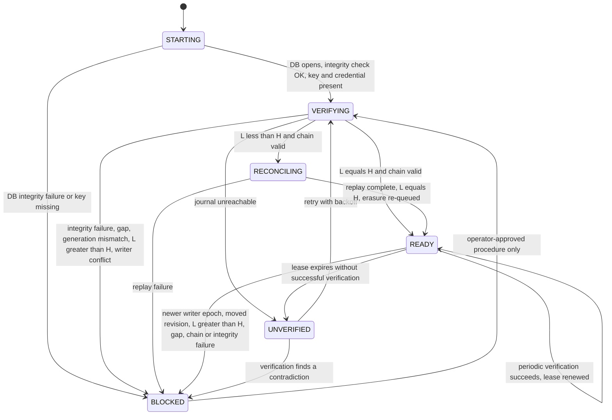

# Knowledge pre-runtime obligation #6 — Restore-freshness realization

Status: ARCHITECTURE ACCEPTED BY ARCHITECTURE BOARD (2026-09-26) — OPERATIONAL CLOSURE PENDING the physical-store capability probe (WS-1..7) and store selection. No runtime implementation approval.

Date: 2026-09-26

Revision: 2026-09-26 — Architecture Board preliminary review corrections incorporated: Forget completion requires durable journal acceptance (RF-D2); journal scope limited to Knowledge-owned control mutations (RF-D3); physical store made a conditional decision with no infrastructure selected (RF-D5); freshness invariant defined over immutable, chained history rather than a mutable latest-counter pointer (§5.2, §6); RF-D6 kept.

Revision: 2026-09-26 — Architecture Board review of PR #40 corrections incorporated: READY now requires an unexpired freshness / writer lease issued only by successful verification, so a journal outage ends READY at lease expiry and the split-brain stale-read bound is enforceable (§6.1, §8, §9.4, §10.1); the store completeness semantics required to derive H(p) are an explicit store property and probe item (S-6, WS-5); Board disposition recorded (§15, §16).

Repository: `EKvargas/episteck_home`

Main baseline: `2f5c7ebef2b7b7eade39ee6f1a4fe067ab26d534` (merge of PR #33, Technology Gate closure), verified current `origin/main`.

Branch: `docs/knowledge-restore-freshness`

Obligation: [Technology Gate §27.4 item 6](KNOWLEDGE_TECHNOLOGY_GATE_SPIKE_REPORT.md#274-pre-runtime-obligations-carried-forward-not-discharged-by-this-gate) — restore-freshness realization (B4 C1)

This is an architecture proposal. It implements nothing, creates no schema, deploys nothing, reruns no benchmark, **selects no infrastructure**, and changes no accepted decision. The Person/Circle model, B1–B6 and the S1 / SQLite 3.41.2 selection are not reopened. All scenarios are synthetic.

## 0. Summary

**Recommendation: an independent, immutable control journal.**

1. Every Knowledge-owned **control mutation** that matters for anti-resurrection or re-admission is first appended to an **off-host, independently credentialed, append-only, hash-chained control journal**. The store must enforce non-overwrite and immutable history. Only after the journal has **durably accepted** the entry does the local SQLite commit happen and the operation get acknowledged. **A Forget is never reported as complete before that.** The journal sits outside the Knowledge host's failure domain and outside the restic snapshot lineage.
2. **Every Knowledge process start is treated as a potential restore.** Knowledge serves nothing from a partition until it proves, from the journal's verified immutable history, that its locally applied control revision equals the journal revision. Missing entries are replayed first.
3. READY also requires an **unexpired freshness / writer lease**, renewed only by successful verification. During a journal outage a READY partition serves only until its lease expires, then becomes UNVERIFIED and fails closed (§6.1).
4. Anything that cannot be proven — journal unreachable, chain broken, gap, generation mismatch, local state *ahead* of the journal, or missing key — **fails closed** for the affected partitions. There is no best-effort fallback.
5. **The physical store is not selected here.** The required property is an independently credentialed off-host store with enforceable non-overwrite / immutable-history semantics. Candidates are Hetzner Object Storage with Versioning plus Object Lock/Retention, and Hetzner Storage Box only if a narrow probe proves an equivalent mechanism (§5.3). That probe closes the physical question.

Knowledge owns the freshness authority logically (B5 PA-3). Physically it lives outside the Knowledge host.

This **substantially constrains obligation #1 without closing it**: non-use durability no longer depends on SQLite `synchronous`, but ordinary acknowledged writes and durable erasure/cleanup evidence still need the production SQLite durability decision (§11).

## 1. Recovered current facts

Re-derived from the baseline, not from prior summaries.

| # | Fact | Evidence | Consequence |
|---|---|---|---|
| F1 | B4 C1 invariant: restored data must not become usable unless control state is provably at least as current as the restored payload. Unknown freshness fails closed. No mechanism is selected. | [B4 §1.1 C1, §12.1](KNOWLEDGE_B4_FORGET_DELETE.md#121-the-restore-freshness-invariant-c1) | This proposal selects the mechanism, but not the physical store. |
| F2 | Knowledge owns the restore-freshness authority, "explicitly separable from its ordinary payload persistence". Its currency must be establishable "without relying solely on the same snapshot that carries the restored payload". Partial availability is allowed. | [B5 §11.3, PA-3](KNOWLEDGE_B5_OWNERSHIP_BOUNDARIES.md#113-restore-freshness-authority-b4-c1) | Logical owner fixed. Physical persistence may differ (B5 §6.2 point 4). |
| F3 | B6 §16: five evidence requirements — a positive currency claim, independence from the payload's backup lineage, a comparison, partial availability, and explicit abstention. | [B6 §16](KNOWLEDGE_B6_TRUSTED_RETRIEVAL.md#16-restore-freshness-enforcement) | Acceptance criteria for this design (§6, §12). |
| F4 | S1 / SQLite 3.41.2 selected. The tested config (WAL / `synchronous=NORMAL`) is not approved for production because the WAL tail can be lost on OS crash or power loss. §27.3 allows either a durability config **or "an equivalent durable control-state mechanism that satisfies B4"**. | [Spike report §27.3](KNOWLEDGE_TECHNOLOGY_GATE_SPIKE_REPORT.md#273-sqlite-configuration--selected-vs-tested-vs-production) | This design constrains #1 for B4-bearing control state only (§11). |
| F5 | In S1 the suppression register is consulted **inside the retrieval plan** (H5 PASS). There are no separate derivatives besides indexes that commit with their row (H6 PASS, vacuous). | Phase-1 §8, H5/H6; spike §15 | Safety after restore reduces to register currency. Re-evaluating payload is hygiene (erasure re-queue), not the safety gate. |
| F6 | The spike's P10 is a pure-logic gate on `control_state_known_current_as_of: int \| None` (a timestamp). `None` fails closed. There is no mechanism and no storage. | `spike/knowledge-technology-gate/scenarios/test_p10_restore_freshness.py` | It shows the predicate, not a proof source. This proposal replaces timestamps with chained revisions (§5.2, §6). |
| F7 | Eventual Knowledge placement: **Nuremberg** (TG-PA-4), next to agents and domains. One node, no replica. | Phase-1 §10, §18 TG-PA-4; [DEPLOYMENT](../DEPLOYMENT.md) | A whole-host loss takes Knowledge's live DB and any host-local control copy together. |
| F8 | Backup: restic 0.18.1 → Hetzner Storage Box (u670254, EU, SFTP key-based). Daily systemd timer, `keep 7d/4w/3m`, client-side encrypted. SQLite captured with a consistent `.backup`. Secrets in `/etc/episteck/backup` (root-only). Restore validated. | [DEPLOYMENT §Off-box backup](../DEPLOYMENT.md) | RPO up to ~24 h. A restored Knowledge DB may predate any control mutation from that day. |
| F9 | The backup job's scripts and units are **not in this repository**. They are host configuration. | `git grep restic` finds only docs | Store properties are recorded as **requirements to prove** (§12.2), not as verified facts. |
| F10 | Ashburn (Home Control Plane) is a separate host and region, ~120 ms away over Tailscale. There is no cross-region database. | DEPLOYMENT, Phase-1 §10 | Home must not become the owner or holder of Knowledge control truth (B5 §6.2). |
| F11 | Every Forget already requires a live Home authorization decision. | B1 / B6 §8 | A Forget can already fail when an off-host party is unavailable; a journal dependency does not introduce a new class of outage. |
| F12 | B4 §2: lifecycle status is not an access control (probe P1). Non-use must be enforced at the barrier, from the register. | B4 §2 | Replay must write *register* facts that retrieval consults, not patch payload status columns. |

## 2. Restore / recovery process (process first)

```text
NORMAL OPERATION ─ control mutation ─▶ JOURNAL APPEND ─▶ LOCAL COMMIT ─▶ ACK
        │                              (off-host, durable,   (SQLite)
        │                               immutable history)
        ▼
BACKUP (daily restic .backup of Knowledge DB — payload + register at local revision L)
        │
FAILURE (crash | power loss | DB loss | host loss | rollback | partial restore)
        │
RESTORE (operator: provision host, restic restore DB, provision journal key + credential)
        │
START ─▶ FRESHNESS PROOF (per partition: verify immutable chain; derive H(p); compare with L(p))
        │
RECONCILIATION (replay journal entries L(p)+1 … H(p) into the register; re-queue erasure)
        │
RE-ADMISSION (restored payload becomes eligible — under the current register, in-plan)
        │
SERVICE READY (per partition)
```

| Stage | System responsibility | Operator responsibility |
|---|---|---|
| Normal operation | Journal-before-local-commit-before-ack for every control mutation. Knowledge is the single writer. | None |
| Backup | Unchanged restic job. The journal is **not** part of the restic snapshots and is never restored by restic. | Keep the journal key escrowed off-host with the restic repository password. |
| Failure | — | Detect. **Fence** the old host before restoring elsewhere (split-brain, §9.4). |
| Restore | — | Restore the DB with restic, install the journal key and credential, start Knowledge. **Never edit, copy or restore the journal.** |
| Freshness proof | Automatic on every start. Nothing is served until it completes. | None when it succeeds. Investigate on BLOCKED. |
| Reconciliation | Idempotent replay and erasure re-queue. | None |
| Re-admission | Partition flagged READY. Queued imports, extraction and jobs resume and re-check. | None |
| Service ready | Serve. Monitoring compares L and H daily. | Respond to alerts. |

A restart and a restore take the **same path**. Knowledge cannot reliably tell them apart: a restored file looks like a normal restart. Designing a separate restore mode would create a way around the proof.

## 3. Threat / failure model

Adversary scope: operational failure and operator error on a personal deployment, including restoring the wrong snapshot, copying an old DB file, restoring while the original host is still alive, and attempted deletion or overwrite of journal entries. Out of scope: a malicious root on the Knowledge host, who can defeat any local control (as in B1–B6), and timing side channels (obligation #3).

| Failure | What goes wrong without this design | Outcome under this design |
|---|---|---|
| Process crash | A crash between the journal append and the local commit leaves L = H−1. | Start → replay 1 entry → READY. The Forget was never acknowledged; resubmission is idempotent by `event_id`. |
| OS / power loss | WAL tail lost under `NORMAL`: an acknowledged suppression disappears locally. | L < H → replay from the journal → READY. Non-use is preserved, independent of `synchronous`. |
| SQLite DB loss / corruption | Restore from a day-old backup: the T1/T2/T4 resurrection. | L < H → replay → X suppressed → READY. |
| Whole-host loss | Same, with every host-local copy gone. | The journal is off-host → same as above. |
| Backup restore (core scenario, §3.1) | X resurrects. | X stays suppressed. |
| Accidental rollback (old file copied over) | Silent resurrection. | Caught on the next start, like a restore. |
| Re-import / reindex after restore | A forgotten source is re-ingested. | Admission is blocked until READY. After READY it is checked against the replayed register (B4 §8). |
| Journal temporarily unavailable | — | At start: **UNVERIFIED**, Knowledge withheld, retry. While READY: keep serving **only until the lease expires**, then READY → UNVERIFIED and fail closed; back to READY on successful verification (§6.1). A new Forget returns **INCOMPLETE**, never success (§10.2). |
| Journal permanently lost | — | While READY with a valid lease: generation succession from continuity (§9.3). Otherwise UNVERIFIED, then **BLOCKED** once loss is confirmed (§10.3). |
| Journal entry overwrite or deletion attempt | Tail entries lost or rewritten. | Prevented by the store's enforced non-overwrite / immutable-history property, which is a precondition of store selection (§5.3). Anything that slips through is detected as a chain, gap or `L > H` failure → BLOCKED. |
| Partition / account restore | Old rows for one partition re-enter a current DB. | Only that partition goes UNVERIFIED and reconciles. Other partitions are unaffected (§9.2). |
| Partial restore | For example, DB restored but key missing, or journal from the wrong account. | BLOCKED (key / generation mismatch). |
| Split brain (restore while the original is alive) | Two writers, stale reads on one of them. | The store's non-overwrite semantics make each `(partition, generation, revision)` slot single-writer. The loser goes BLOCKED. The lease plus epoch quarantine make the stale-read bound enforceable: no Forget is acknowledged while an older instance can hold a valid lease (§9.4). |

### 3.1 Core scenario, traced

```text
T1  Partition p at journal revision L=41. X is admitted. The daily backup captures DB with L(p)=41.
T2  FORGET X  →  journal append  revision 42: {p, g, prev=hash(41), event_id, suppress, X-family, matching-state}
               →  store confirms durable, non-overwritable acceptance
               →  local commit (register row, L(p)=42)  →  ack SUPPRESSED
T3  Nuremberg host lost.
T4  Operator restores the T1 snapshot (L(p)=41) on a new host and installs the journal key.
T5  Start → STARTING → VERIFYING: chain from genesis verifies, H(p)=42 > L(p)=41
         → RECONCILING: replay revision 42 into the register; re-queue erasure of X-family
         → L(p)=42=H(p) → READY(p)
    X is present in restored payload but ineligible in-plan (H5). Erasure runs again.
    If the journal is unreachable at T5: UNVERIFIED — no Knowledge from p is served.
```

## 4. Alternatives considered

| | Alternative | Assessment | Verdict |
|---|---|---|---|
| **A** | **Same SQLite DB / same backup only** | After a restore there is no fact newer than the snapshot. The system cannot distinguish "nothing happened after T1" from "X was forgotten at T2". It is B4-correct only if every restore **permanently** fails closed, which makes DR useless. The alternative is silent resurrection. An operator attestation ("nothing was forgotten") is not a proof. | **Reject** |
| A′ | Separate control DB on the **same host**, also backed up | Covers payload-file loss or corruption only. Whole-host loss and restic restore bring back an equally stale control file. | **Reject** as the sole mechanism |
| **B1** | Off-host **mutable latest-counter / high-water mark only** | Detects staleness only if the pointer itself cannot be rolled back, and a mutable pointer can be. It also cannot *reconcile*: any partition with a control mutation since the last daily backup is BLOCKED after a restore. | **Reject** as the authority. A cached head may exist as a performance hint only; it is never trusted (§6). |
| **B2** | Off-host **append-only, immutable, hash-chained control journal** (entries, not a pointer) | Proves freshness from history **and** supplies the missing control entries. Entries are exactly B4 §10's minimal anti-resurrection state, which is already required to be non-reconstructable and non-disclosing, so no new content class leaves the host. The Forget path gains one off-host append. | **Recommend** |
| B3 | Continuous replica of the whole SQLite DB (WAL shipping) | Asynchronous shipping lags, so the replica is not a proof of currency. Synchronous shipping is new infrastructure. It copies **payload** off-host continuously, which grows the B4 exposure surface that §12 wants small. | **Reject** |
| **C** | Journal inside the **Home Control Plane** (Frappe DB / DocTypes) | Separate region, and Home is already on the Forget path (F11). But Home DB/DocTypes must not hold KN control truth (B5 §6.2 points 2–3). Frappe restores can roll it back too, and it couples Knowledge DR to Home DR. | **Reject** |
| C′ | Journal as tagged **restic** snapshots | Reuses tooling. But the KN service would need the backup repository password (full backup access), restic `forget/prune` and locks interact with it, and each append costs seconds. | **Reject** |
| **D** | **Crypto-shredding** (comparison only; B4 D2 deferred it) | It makes old snapshots unreadable for destroyed keys, but it **moves** the freshness problem instead of solving it. A key store restored from backup still contains the key destroyed at T2. The key store needs exactly the same non-rollback journal. It does not substitute for B2, but B2 could later carry key-destruction entries. | **Not required**. Remains deferred. |
| E | Timestamp comparison (snapshot time vs "last control change time") | Clock skew and restore-host clocks make it unreliable, and it still needs an off-host fact. Chained revisions are strictly better. | **Reject** |

## 5. Recommended minimal realization

### 5.1 Journal scope — Knowledge-owned control mutations only

The journal contains **Knowledge-owned control mutations relevant to anti-resurrection and re-admission**: every KN-owned fact whose rollback could make ineligible Knowledge content eligible again.

**Included** (KN-owned per B5 §7):

- suppression entries (STOP USING, FORGET, DELETE SOURCE effects on KN)
- suppression supersession by deliberate reassertion (B4 §9.1). Journaled so suppress-then-supersede ordering survives replay.
- partition genesis and **partition tombstones** (B4 Scenario L)
- restrictive lifecycle / non-use decisions on KN assertion versions (B3 REVOKED / withdrawal; B5 row 7)
- restrictive reclassification of KN objects (B2 §10.3), because a rollback reverts to a weaker class

**Excluded — never journaled by Knowledge:**

- **Home-owned authorization:** grants, consent, Circle membership, actor resolution, trusted-partition resolution, authorization decisions and their freshness. Home remains their sole authority (B5 §6.2, §11.4, row 2a). Restore does not need them in the journal, because B6 already requires a **fresh** Home evaluation for every retrieval and before disclosure; nothing restored can carry authority forward.
- Domain-owned structured facts and domain projections (B5 row 19). Cross-owner suppression propagation remains B5's named obligation, not part of this journal.
- Payload admissions, content, erasure progress and cleanup receipts (§11).

This is a **scope definition for the journal**, not a change to B1–B5 semantics or ownership.

### 5.2 Journal entry — immutable logical identity

Every entry is immutable once accepted and is identified logically by:

```text
partition_id          opaque, partition-local reference (no Person id)
generation            journal generation (§9.3); changes only by explicit succession
revision              per-partition journal revision, contiguous from 1 (genesis)
previous_entry_hash   integrity hash of entry (partition_id, generation, revision-1)
event_id              unique control-event identity; idempotency key for resubmission
writer_epoch          fencing identity of the writing KN instance (§9.4)
kind                  genesis | suppress | supersede | tombstone | restrict-lifecycle | restrict-classification
payload               minimal control/replay payload: opaque target ids (B4 §10 "may be retained")
                      and B4 C2 anti-resurrection matching state (mechanism still unselected by B4)
integrity             authenticated integrity protection over all of the above; confidentiality of payload
```

The exact serialization, hash function, AEAD or signature scheme and key format are **implementation work**.

The journal *revision* is a per-partition counter over KN control mutations. It is distinct from the per-version lifecycle/control revision of B3.

**Must not contain:** plaintext, excerpts, titles, locators, embeddings, free-text reasons, actor identity, capacity, or Person ids. Actor and decision history stays in the KN DB on its own D3 schedule, which keeps the journal inside B4 §10 / D3 by construction.

### 5.3 Physical journal store — conditional, not selected

**Required property:** an **independently credentialed, off-host store with enforceable non-overwrite / immutable-history semantics.** Concretely:

| # | Requirement |
|---|---|
| S-1 | Off-host: outside the Nuremberg host's failure domain and outside the restic snapshot lineage |
| S-2 | Independent credential: the KN journal credential cannot read, write or delete restic backups, and the backup credential cannot rewrite the journal |
| S-3 | **Store-enforced** non-overwrite: an existing entry identity cannot be replaced (a conditional create fails), independent of client behavior |
| S-4 | **Store-enforced** immutable history: the KN credential cannot delete or truncate accepted entries within the retention period |
| S-5 | Durable acceptance: a successful append response means the entry is durably stored and readable from a fresh connection |
| S-6 | **Authoritative, complete history reads.** The store must provide the consistency semantics required to derive `H(p)`: (a) an acknowledged create is readable from any fresh connection; (b) enumeration and/or lookup cannot hide an entry whose create was acknowledged before the query began — in particular, a "not found" for the next revision must be authoritative, not the product of eventual or stale listing; (c) the implementation can distinguish a **complete, verified chain head** from an incomplete, truncated, paginated or stale listing. If a read cannot be shown to be authoritative and complete, `H(p)` is UNKNOWN and fails closed. The mechanism is not prescribed. |
| S-7 | Unavailability is distinguishable from rejection |

**Candidates, none selected:**

| Candidate | Status | Notes |
|---|---|---|
| **Hetzner Object Storage with Versioning + Object Lock / Retention** | Candidate | S3-compatible explicit immutable-object semantics (object lock / retention, versioning, conditional create) map directly onto S-3/S-4. EU, and the same provider as the existing backup target. To be confirmed by the probe. |
| **Hetzner Storage Box** (separate sub-account) | Candidate **only if** the probe proves S-3/S-4 through an appropriate mechanism | Already in use for restic, but plain SFTP does not by itself guarantee store-enforced non-overwrite or non-deletion. It qualifies only if a concrete mechanism (for example sub-account permissions combined with provider snapshots, or equivalent) is proven to deliver S-3/S-4. A generic Storage Box namespace is **not** accepted. |

**No infrastructure is selected in this proposal.** A narrow capability probe (§12.2) closes the physical storage question. If neither candidate passes, the physical question stays open and #6 cannot move to runtime approval; the architecture does not change.

The store implements one interface, whichever is chosen: `append_exclusive(entry)`, `list(partition_id, generation)`, `read(entry identity)`.

### 5.4 Control commit protocol

```text
1. KN (single writer) builds the entry for partition p, which must be READY with a valid lease (§6.1) and outside epoch quarantine (§9.4):
     revision = L(p)+1, previous_entry_hash = hash(entry L(p)), event_id, payload, integrity.
2. store.append_exclusive(entry) — must return durable, non-overwritable acceptance
      identity already exists → another writer exists → partition BLOCKED (§9.4)
      unavailable / timeout / ambiguous → Forget INCOMPLETE (§10.2); nothing is reported as success
3. SQLite transaction: register row(s) + L(p)=revision  (commit)
4. Acknowledge (SUPPRESSED etc.)
```

Journal-first gives the invariant **journal ⊇ every revisioned local control fact ⊇ every acknowledged control mutation**. So a local revision above the journal revision is always a contradiction, never an ordinary state. This is a write-ahead rule and adds no consensus.

An ambiguous append (timeout after send) is resolved by re-reading the entry identity before retrying. Resubmission with the same `event_id` is idempotent.

## 6. Exact freshness invariant

For a partition *p*:

- `L(p)` = highest journal revision applied to the local register.
- `H(p)` = the **journal revision proven from immutable history at verification time**: the highest revision *r* such that every entry of *p* in the current (or validly succeeded, §9.3) generation from genesis — or from a verified checkpoint (§14 U3) — up to *r* exists, passes integrity verification, and links by `previous_entry_hash`, **and** no entry exists above *r* in that generation.

`H(p)` is **never taken from a mutable remote "latest counter" pointer.** A cached head may be used as a hint, but it is never the proof. Readiness is derived from the verified history itself, and the store's immutability (S-3/S-4) is what prevents that history from being rolled back.

```text
Knowledge content of partition p may be used (retrieved, disclosed, admitted against,
re-imported into, extracted into, reindexed) only while READY(p), where

READY(p)  ⇔  local applied control revision L(p) = independently proven journal revision H(p)
          ∧  journal generation and hash chain for p are valid
          ∧  no required entry is missing (no gap, no entry above H(p) left unlinked)
          ∧  the freshness / writer lease for p is unexpired (§6.1)

Every other outcome — including any UNKNOWN — fails closed.

L(p) = H(p) is reached only by applying every entry with revision in (L(p), H(p)] to the
register. Because every acknowledged control mutation is durably journaled before it is
acknowledged, L(p) = H(p) implies the register is at least as current as every acknowledged
control mutation — and therefore at least as current as any payload restored from any snapshot.
```

This satisfies B4 C1 and all five B6 §16 requirements. The currency claim is positive (a verified chain). It is independent of the payload lineage (off-host, never restored). The comparison is `L = H` after replay. Readiness is per partition, so availability can be partial. Abstention is explicit (§10).

Detection coverage:

| Attack on history | How it is detected or prevented |
|---|---|
| Gap (entry missing mid-chain) | Chain link fails → BLOCKED |
| Rewritten entry | Integrity or `previous_entry_hash` failure → BLOCKED; also prevented by S-3 |
| Truncated tail | Prevented by S-4. If the live DB survived: `L > H` → BLOCKED |
| Wrong or replaced journal | Generation or genesis mismatch, or integrity failure under the KN key → BLOCKED |
| Mutable pointer rolled back | Not applicable: no pointer is trusted |
| Stale or incomplete listing hides an accepted higher revision | Prevented by S-6 (authoritative completeness). If the store cannot give an authoritative answer, `H(p)` is UNKNOWN → fail closed |

### 6.1 Freshness / writer lease

A proof of `L(p) = H(p)` is only true at the moment it is made. Readiness therefore carries a **lease** that bounds how long that proof may be relied on without re-verification.

```text
verification(p)  = the full §6 derivation of H(p) from authoritative journal state (S-6),
                   plus confirmation that the current writer_epoch registered in the
                   journal is this instance's own epoch, and L(p) = H(p).

t_v(p)           = local monotonic-clock time at which the last SUCCESSFUL verification(p)
                   request was SENT (not when its answer arrived — conservative).

lease_valid(p)   ⇔  now_monotonic < t_v(p) + LEASE − DRIFT_MARGIN
```

Rules:

1. **A lease is only ever issued or renewed by a successful verification.** Nothing else renews it: not a successful append, not a cached head hint, not a local timer, not reachability alone.
2. A READY instance re-verifies every partition on a period shorter than `LEASE`.
3. **Journal temporarily unreachable while READY:** the partition keeps serving **only until its lease expires**. At expiry, if verification has still not succeeded: **READY → UNVERIFIED**, and Knowledge reads, disclosure and admission for that partition fail closed with the explicit "restore freshness unproven" abstention.
4. **Journal reachable again:** UNVERIFIED → VERIFYING → READY on a successful verification (via RECONCILING if `L < H` from this instance's own epoch, which cannot occur for a single writer and is otherwise a contradiction).
5. **Contradictions are not lease matters.** A newer writer epoch, a moved revision from another epoch, `L > H`, a gap, or a chain or integrity failure found during verification → **BLOCKED**, whether or not the lease is still valid.
6. The lease check is an in-memory comparison against the local monotonic clock at the retrieval entry. It adds no network call to the B6 hot path.
7. A control mutation (§5.4) requires READY **with a valid lease** at the moment it is sequenced.

`LEASE` and `DRIFT_MARGIN` are implementation parameters (§14 U5). Their existence, and the rule that expiry fails closed, are architecture.

## 7. Logical ownership vs physical persistence

| Aspect | Owner / location | Basis |
|---|---|---|
| Logical ownership of the freshness authority, journal content, revision semantics and verification | **Knowledge (KN)** | B5 PA-3, row 15 |
| Authoritative local register and payload | KN SQLite on Nuremberg (TG-PA-4) | B5 §6.1, Gate §27.1 |
| Physical persistence of the journal | **Not selected.** Conditional on the §12.2 probe; candidates in §5.3 | B5 §6.2 point 4 (physical placement may differ when the boundary is intact) |
| Writer / reader of the journal | KN only | B5 row 15 "KN only" |
| Journal key and credential custody | KN secrets on the host. Key escrowed off-host by the operator with the restic repository password. | The DR secret class already exists (F8). This is **not** B4 D2 key management. |
| Home | No role. Home does not hold, check or attest Knowledge freshness, and Knowledge does not journal Home authority. | B5 §6.2 points 2–3; §5.1 |

## 8. Startup / recovery state machine

States are **per partition**. The process also has an overall state.



A restart always begins at STARTING, so a restart without a reachable journal ends in UNVERIFIED through VERIFYING.

| State | Knowledge reads / disclosure | Admissions / import / extraction / reindex | New control mutations (e.g. Forget) | Erasure execution |
|---|---|---|---|---|
| STARTING, VERIFYING | **Denied** | **Denied** | **INCOMPLETE** (§10.2) | Allowed (restriction-only) |
| UNVERIFIED | **Denied** — explicit abstention "restore freshness unproven" | **Denied** | **INCOMPLETE** | Allowed |
| RECONCILING | **Denied** | **Denied** | **INCOMPLETE** | Allowed |
| READY (lease valid) | Allowed (subject to B1–B6) | Allowed, checked in-plan | Normal protocol (§5.4); INCOMPLETE during epoch quarantine (§9.4) | Allowed |
| BLOCKED | **Denied** | **Denied** | **INCOMPLETE** | Allowed |

Rules:

- Erasure is allowed in every state because it can only reduce data.
- Outside READY a Forget never succeeds. Knowledge content of that partition is already unusable, so non-use holds regardless; the result is still reported as INCOMPLETE.
- There is no READY state with an expired lease: expiry is itself the READY → UNVERIFIED transition.
- The readiness check (state plus lease expiry, §6.1) is an in-memory, per-partition check at the retrieval entry. It adds no network call to the B6 hot path.
- Other domains (Nutrition etc.) are unaffected in every state (B4 §12.1 partial availability).

## 9. Backup / restore behavior

### 9.1 Whole-DB restore

The restic job is unchanged. The Knowledge DB is captured with a consistent `.backup`, the same pattern as Nutrition. The snapshot carries `L(p)` for every partition. Restore is a normal restic restore followed by a normal start (§2). No restic snapshot is rewritten (B4 §12). Snapshots remain an expiry commitment.

### 9.2 Partition / account restore

Any operation that writes payload or control rows from outside the live control stream sets that partition to VERIFYING **before** the write becomes visible, and sets `L(p)` to the value carried by the imported rows. Examples: per-partition restore, bulk import, copy from another DB, manual SQL. The normal proof and replay then apply. A tool that cannot do this must not be used. The every-start check catches an out-of-band file replacement anyway.

### 9.3 Journal generation succession

A journal can be moved or replaced only by a **READY** KN instance **with a valid lease** for every partition carried over. It writes the full current journal (or a verified checkpoint, §14 U3) to the new generation, plus a succession entry linking the old generation's verified revision and hash to the new generation. Continuity is the proof: a READY instance has held `L = H` since its last verification, within one lease. A non-READY instance, or one whose lease has expired, can never create a generation. If the old journal is permanently lost and the lease expires before succession completes, the partition becomes UNVERIFIED and then, once loss is confirmed, falls under §10.3.

### 9.4 Single writer and split brain

Each start registers a new `writer_epoch` in the journal, as an immutable entry under the same S-3/S-4/S-6 guarantees. Appends are create-exclusive per entry identity, enforced by the store (S-3), so two writers cannot both commit the same revision. The loser gets a conflict and goes BLOCKED.

The stale-read bound is enforced by the lease (§6.1), not by operator discipline:

1. **An old instance cannot renew its lease after a new epoch exists.** Renewal requires a successful verification, and verification after the new epoch's registration observes that epoch (S-6) → BLOCKED. An old instance that cannot reach the journal cannot renew either. Either way, the old instance stops serving no later than `t_v + LEASE − DRIFT_MARGIN` of its last successful verification — which was sent **before** the new epoch was registered.
2. **Epoch quarantine.** A new epoch does not acknowledge any control mutation (Forgets return `FORGET_INCOMPLETE`) until `LEASE` has elapsed on its own monotonic clock since its epoch registration was accepted. Any older instance's lease was issued before that registration and has therefore expired. Reads by the new instance may begin as soon as it is READY, because its own state is freshly verified.
3. Result: **no control mutation is ever acknowledged while an older instance can still hold a valid lease**, so an acknowledged Forget is never served by a fenced-too-late host. Unacknowledged history (anything already visible before the Forget was requested) is bounded by one lease on the old host.

This rests on bounded clock *rate* drift between hosts, not on synchronized wall clocks; `DRIFT_MARGIN` absorbs it. The restore runbook still requires fencing the old host first, as defense in depth. `LEASE` and `DRIFT_MARGIN` are implementation parameters (§14 U5).

## 10. Failure semantics

### 10.1 Outcome table

| Condition | Result | Exit |
|---|---|---|
| Journal unreachable at start | UNVERIFIED. Knowledge withheld, with an explicit abstention naming unproven restore freshness. | Automatic on successful verification |
| Journal unreachable while READY, lease still valid | Keep serving until lease expiry; Forget returns `FORGET_INCOMPLETE` (§10.2) | Automatic on successful verification (lease renewed) |
| Journal unreachable at lease expiry | READY → UNVERIFIED. Reads, disclosure and admission for the partition fail closed with the explicit abstention. | Automatic on successful verification |
| Store cannot give an authoritative complete head (S-6) | `H(p)` UNKNOWN → UNVERIFIED (never READY) | Automatic when an authoritative answer is obtained |
| Newer writer epoch or moved revision observed | BLOCKED, regardless of lease | Operator: fence, then restart the survivor |
| Integrity failure, broken chain, gap | BLOCKED | Operator: repair or recover the journal |
| Generation mismatch without valid succession | BLOCKED | Operator: supply the correct journal |
| `L(p) > H(p)` | BLOCKED (journal truncated or wrong journal) | Operator: recover the journal, or a §9.3 succession from a READY instance |
| Partition in DB but no genesis in journal | BLOCKED | As above |
| Partition tombstone in journal | Replay → partition remains deleted. Payload unusable and erasure re-queued. | — |
| Journal key or credential missing / wrong | BLOCKED | Operator: install the escrowed key |
| Writer conflict | BLOCKED on the losing instance | Operator: fence, then restart the survivor |
| Journal permanently lost, KN not READY | BLOCKED | §10.3 |
| Any UNKNOWN not listed above | Fails closed (UNVERIFIED if transient, otherwise BLOCKED) | — |

**No condition produces "serve with a caveat", "serve restored data unreconciled", or "trust the local revision".** A smaller result set is never returned silently (B6 §16 item 5).

### 10.2 Forget during journal unavailability

**A Forget MUST NOT be acknowledged as successfully completed until the independent journal has durably accepted its control event.**

When the journal is unavailable, the append is ambiguous, or the partition is not READY:

| Aspect | Behavior |
|---|---|
| External result | **`FORGET_INCOMPLETE`** (journal unavailable). Never SUPPRESSED, never success, never "done". User-facing wording: *"Olin could not complete this Forget right now. Please try again."* |
| Local fail-closed block (optional) | KN **may** immediately apply a local block that makes the target ineligible on this instance, as an **additional safety measure**. It only restricts, never permits. It is **not** a completed Forget: total host loss plus restore can erase it, which is exactly why it is never reported as success. |
| Visibility | If a local block is applied, the user is told plainly that use has been stopped on this device **but the Forget is not complete**. The block is visible to the operator in monitoring. It is not a hidden state. |
| Queueing | **No hidden pending queue.** A local block is never automatically promoted to a completed Forget. Completion requires a new authorized submission (fresh Home authorization per B6), idempotent by `event_id`, that the journal durably accepts. An automatic retry queue is permitted only if the queue itself has independent durability equivalent to the journal — which it would then be. |
| Outside READY | The partition's Knowledge is already unusable, so non-use holds. The Forget is still INCOMPLETE until journaled. |

Residual: if the host is lost while only a local block exists, the block is lost. The user was told the Forget was incomplete, so no false promise was made.

### 10.3 BLOCKED with the journal permanently lost

A destructive **re-baseline** is not defined by this proposal. A re-baseline would discard the partition's restored payload, keep the restored register, open a new generation, and disable automatic re-extraction or re-import of pre-re-baseline sources for that partition. Until the Board approves such a procedure (RF-D4), a BLOCKED partition has no exit except recovering the journal. That is intentional fail-closed behavior.

## 11. Relationship to pre-runtime durability obligation #1

| Question | Answer |
|---|---|
| What `synchronous=FULL` could solve | Local loss of the most recent committed transactions on OS crash or power loss, for **all** writes: control, admissions and erasure evidence. |
| What it cannot solve | DB-file loss, whole-host loss, backup restore, accidental rollback, split brain. **None of the C1 cases.** FULL makes a commit durable *on that disk*, and C1 is about the disk not being the latest truth. |
| Does control state need different durability from payload? | **Yes, different, not merely stronger.** It needs durability **outside the payload's failure domain and backup lineage**. The journal provides that. With journal-first plus every-start replay, a suppression lost from the local WAL tail is re-applied before anything is served. So **non-use durability is independent of `synchronous`**. |
| Does this close #1? | **No. It substantially constrains #1 but does not close it.** |
| What remains of #1 | (a) **Ordinary acknowledged writes** — admissions and other acknowledged B3 outcomes. Losing one on power loss is data loss. (b) **Durable erasure / cleanup evidence** — B4 §14 lets Olin claim ERASED only with evidence. Under `NORMAL` an acknowledged erasure receipt, and the physical DELETE it evidences, can roll back on power loss. That is not a resurrection risk (the suppression is journaled and restart re-queues erasure), but ERASED would have been claimed on non-durable evidence. Both require the **production SQLite durability decision**. |
| Proposed disposition of #1 | Keep #1 open, re-scoped to the production SQLite durability decision for ordinary acknowledged writes and durable erasure/cleanup evidence. Resolve it with §27.3's existing re-validation (P13 write/cleanup path only). Candidates include `synchronous=FULL` globally, or FULL for specific transactions. **Not selected here.** |

## 12. Acceptance scenarios and required validation

### 12.1 Future acceptance scenarios (implementation tests; not executed)

| ID | Scenario | Expected |
|---|---|---|
| RF-1 | Core T1/T2/T3/T4 (§3.1) | X ineligible after READY. Erasure re-queued. Other content usable. |
| RF-2 | Restore with journal unreachable | UNVERIFIED. No Knowledge read. Explicit abstention. Nutrition unaffected. |
| RF-3 | Restore with a replaced or empty journal | BLOCKED |
| RF-4 | Local revision above journal revision | BLOCKED |
| RF-5 | Journal gap, chain break or integrity tamper | BLOCKED |
| RF-6 | Crash between journal append and local commit | Replay 1. READY. Idempotent resubmission by `event_id`. |
| RF-7 | Power-loss simulation: WAL tail dropped after an acknowledged suppression | Replay → suppression present before any read |
| RF-8 | Older DB file copied over the live file while stopped | Replay on start |
| RF-9 | Partition tombstoned after the snapshot | Restored partition stays deleted |
| RF-10 | After restore, re-import of a source forgotten after the snapshot | Blocked at admission (B4 Scenario E) |
| RF-11 | Queued extraction/reindex jobs restored from the snapshot | Not run before READY. Re-checked after. |
| RF-12 | Journal outage during a Forget | Result is `FORGET_INCOMPLETE`, never success. Optional local block applied and disclosed as incomplete. No automatic promotion. After recovery, a new authorized submission completes it. |
| RF-13 | Two writers (restore while the original is alive) | Exclusive-create conflict. The old instance stops serving within one lease of its last verification. The new epoch acknowledges no Forget during quarantine. |
| RF-14 | Single-partition restore | Only that partition reconciles |
| RF-15 | Journal key missing | BLOCKED |
| RF-16 | Static inspection of journal entries | No plaintext, excerpts, embeddings, actor ids, Person ids or Home grant data |
| RF-17 | Reassertion (B4 §9.1) after a restore | Suppress-then-supersede order preserved on replay |
| RF-18 | Restrictive reclassification after the snapshot | Replayed. The weaker restored class is never served. |
| RF-19 | Journal generation succession from a READY instance, then restart | Verifies against the new generation |
| RF-20 | Plain restart, no restore | L = H. READY after chain verification. |
| RF-21 | A mutable "latest" hint is rolled back while the entries remain | Readiness is derived from history; the rolled-back hint is ignored |
| RF-22 | Ambiguous append (timeout after send) | Entry identity re-read before retry; no duplicate, no false success |
| RF-23 | Journal becomes unreachable while READY | Serving continues until lease expiry; at expiry READY → UNVERIFIED and all reads, disclosure and admission for the partition fail closed with the explicit abstention |
| RF-24 | Journal reachable again after RF-23 | Successful verification → READY, lease renewed |
| RF-25 | Old host partitioned from the journal while a new instance forgets X | Old host stops serving at its lease expiry; new instance returns `FORGET_INCOMPLETE` until quarantine ends; X is never served after an acknowledged Forget |
| RF-26 | Old host can reach the journal and verifies after a new epoch registers | BLOCKED immediately, regardless of remaining lease |
| RF-27 | Store listing is stale or paginated and omits an accepted higher revision | Head not accepted as complete; `H(p)` UNKNOWN → UNVERIFIED, never READY |
| RF-28 | Wall clock changed on the host | Lease measured on the monotonic clock; no extension |

### 12.2 Narrow physical-store capability probe (closes the storage question; before runtime implementation approval)

Run against a non-production account for each candidate in §5.3:

| ID | Property | Requirement |
|---|---|---|
| WS-1 | Conditional create of an existing entry identity is rejected by the store | S-3 |
| WS-2 | The KN credential cannot delete, overwrite or shorten retention of an accepted entry | S-4 |
| WS-3 | A successful append response is followed by a successful read from a fresh connection; the provider documents durable acceptance | S-5 |
| WS-4 | The journal credential cannot read, write or delete the restic repository, and vice versa | S-2 |
| WS-5 | **Completeness / consistency for deriving H(p).** Verify that (a) an acknowledged create is readable from a fresh connection immediately; (b) enumeration and/or lookup of a partition's entries never hides an entry whose create was acknowledged before the query began, including a higher revision written from a different connection or client; (c) a "not found" for revision r+1 is authoritative under the store's documented consistency model; (d) the implementation can detect an incomplete, truncated, paginated or stale listing and treat the head as UNKNOWN. Reliance on eventual or stale listing behavior happening to be correct does not pass. | S-6 |
| WS-6 | Unavailability, timeout and rejection are distinguishable | S-7 |
| WS-7 | Append latency p95 from Nuremberg | Forget-path cost only; not on the B6 retrieval path |

A candidate is selectable only if WS-1..6 pass, with WS-5 established from the store's documented consistency guarantees as well as observed behavior. WS-7 informs, it does not gate. The probe chooses a store; it cannot change the architecture. The state machine itself is validated by the RF tests at implementation time, using local fault injection, and needs no infrastructure.

## 13. Operational implications

- **One new DR secret:** the KN journal key, escrowed with the restic repository password. Without it, a restore is BLOCKED, just as a restore is impossible without the restic password.
- **One new credential:** the journal store credential for the Knowledge service user. It is separate from `/etc/episteck/backup` and cannot touch backups (S-2).
- **Restore runbook additions:** fence the old host, restore the DB, install the journal key and credential, start. Never touch the journal. Expect UNVERIFIED if the store is unreachable.
- **Monitoring:** alert on any partition in UNVERIFIED/BLOCKED, and on any local block without a completed Forget. The daily backup run also compares `L(p)` with `H(p)` and alerts on inequality.
- **Availability coupling:** a store outage makes Forget return INCOMPLETE immediately and makes restarts during that window UNVERIFIED. Retrieval on a running READY instance continues **only until each partition's lease expires**; an outage longer than `LEASE` makes Knowledge unavailable (fail closed) until the store is reachable and verification succeeds. `LEASE` trades outage tolerance against the split-brain stale-read bound, and every start or failover adds one `LEASE` of epoch quarantine before Forgets can complete.
- **Retrieval latency:** unchanged (in-memory readiness flag). The Forget path adds one off-host append (WS-7). Start-up adds chain verification, bounded by checkpoints (U3).
- **Volume:** control mutations are rare in a personal deployment, so the journal stays small.

## 14. What remains unresolved

| ID | Item | Owner / when |
|---|---|---|
| U1 | Physical store selection via WS-1..7 (§12.2) | Before runtime implementation approval |
| U2 | Destructive re-baseline procedure (§10.3) | Board (RF-D4). Deferred; BLOCKED until then. |
| U3 | Journal checkpointing / compaction, so start-up verification stays bounded and superseded entries can expire under B4 D3 without breaking chain verification; interaction with store retention periods | Implementation design |
| U4 | Residual if the chosen store's immutability is weaker than claimed or an operator with provider-admin access deletes entries while the live DB is also lost | Bounded by WS-1..2 and account separation. Accepted residual for the personal deployment. Revisit for commercial. |
| U5 | Values of `LEASE`, `DRIFT_MARGIN` and the re-verification period (§6.1, §9.4), and journal key rotation. The lease rule and fail-closed expiry are architecture; only the values are open. | Implementation parameters |
| U6 | B4 C2 matching-state mechanism: still unselected by B4. The journal carries whatever C2 selects. | B4 C2 follow-up. Not this obligation. |
| U7 | Obligation #1 remainder (§11) | Separate decision using the §27.3 re-validation |
| U8 | Metadata the journal reveals to the store operator: partition count, control-event counts and timing | Timing / metadata work (#3). Not solved here. |
| U9 | Commercial evolution: per-tenant journals, managed WORM store, B4 D2 crypto-shredding layered with key-destruction entries in the same journal | Commercialization. The design is additive. |

R13 interaction: none. The journal credential is a KN storage credential and never an authorization basis.

## 15. Architecture Board disposition

Decision owner: Architecture Board

Decision date: 2026-09-26 (review of PR #40, after the corrections recorded in the revision notes)

| ID | Disposition | Decision |
|---|---|---|
| **RF-D1** | **ACCEPT** | The independent control journal: journal-before-local-commit-before-ack; freshness proven from immutable, hash-chained history (never from a mutable latest-counter pointer); every start treated as a potential restore; per-partition fail-closed state machine where READY(p) requires local applied control revision = independently proven journal revision, a valid generation and chain, no missing required entry, and an unexpired freshness / writer lease issued only by successful verification; lease expiry during a journal outage moves READY → UNVERIFIED and fails closed; any UNKNOWN fails closed (§5, §6, §6.1, §8, §9.4). |
| **RF-D2** | **ACCEPT** | A Forget MUST NOT be acknowledged as successfully completed until the independent journal has durably accepted its control event. During journal unavailability the external result is `FORGET_INCOMPLETE` (unavailable / incomplete), never success. An immediate local fail-closed block may be applied as an additional safety measure, but it is not a completed Forget and is disclosed as incomplete. No hidden pending queue is introduced unless that queue itself has equivalent independent durability (§10.2). |
| **RF-D3** | **ACCEPT** | The journal scope is Knowledge-owned control mutations relevant to anti-resurrection / re-admission (§5.1). Home-owned authorization, grants, consent, Circle membership and partition resolution are **not** moved into Knowledge and are never journaled; Home remains their sole authority and is freshly re-evaluated per B6. This is a scope definition, not a semantic change to B1–B5. |
| **RF-D4** | **DEFER** | Destructive re-baseline. BLOCKED partitions with a permanently lost journal stay BLOCKED until a separately approved procedure exists. |
| **RF-D5** | **ACCEPT AS CONDITIONAL STORAGE DECISION — no infrastructure selected** | The required property is an independently credentialed off-host store with enforceable non-overwrite / immutable-history semantics (S-1..S-7), including the authoritative-completeness semantics of S-6 needed to derive `H(p)`. Candidates: Hetzner Object Storage with Versioning + Object Lock / Retention; Hetzner Storage Box only if a narrow capability probe proves the required semantics through an appropriate mechanism. The physical store is selected only after that probe (WS-1..7) closes the storage question. |
| **RF-D6** | **ACCEPT — obligation #1 remains open** | Obligation #1 is re-scoped, not closed: restore-freshness substantially constrains #1 (non-use durability no longer depends on SQLite `synchronous`) but does not close it. Ordinary acknowledged writes and durable erasure/cleanup evidence still require the production SQLite durability decision (§11). |

**Status of pre-runtime obligation #6:**

- **Architecture: ACCEPTED** after the corrections recorded in the revision notes.
- **Operational closure: PENDING** the narrow WS-1..7 physical-store capability probe (§12.2) and the selection of a conforming store.
- Obligation #6 is **not fully discharged** until that probe selects a store satisfying S-1..S-7.
- **No runtime implementation approval** is granted by this disposition.

## 16. Answers

**A. Is pre-runtime obligation #6 ready to CLOSE?**
**Architecturally accepted; operationally not yet discharged.** The mechanism, invariant, lease rule, owner, scope, state machine and failure semantics are accepted (§15). Obligation #6 remains open until the narrow WS-1..7 probe selects a store satisfying S-1..S-7. That probe can only select a conforming store; it cannot reopen the design. Runtime implementation approval is not granted.

**B. Does this also close #1?**
**No — it partially constrains #1.** Non-use durability no longer depends on SQLite `synchronous`. #1 stays open for ordinary acknowledged writes and durable erasure/cleanup evidence, resolved through the production SQLite durability decision and the already-specified P13 write-path re-validation (RF-D6).

**C. Is an empirical spike required before accepting the architecture?**
**No.** The architecture's correctness rests on the write-ahead ordering, the immutable chained history and the every-start proof, not on measured performance. A **narrow physical-store capability probe** (§12.2) is required **before physical store selection and runtime implementation approval**. No benchmark rerun, and no Technology Gate evidence is reopened.

## 17. Verification

```json
{
  "task": "knowledge_pre_runtime_obligation_6_restore_freshness",
  "baseline_main_sha": "2f5c7ebef2b7b7eade39ee6f1a4fe067ab26d534",
  "status": "ARCHITECTURE ACCEPTED — operational closure pending WS-1..7 store probe and store selection",
  "recommended": "independent off-host append-only immutable hash-chained control journal; journal-before-commit-before-ack; every start treated as potential restore; per-partition fail-closed state machine",
  "freshness_fact": "READY(p) iff local applied control revision == journal revision proven from immutable chained history AND generation/chain valid AND no required entry missing; no mutable latest-counter pointer trusted",
  "forget_completion": "never acknowledged before durable journal acceptance; FORGET_INCOMPLETE otherwise; optional local block is not completion; no hidden pending queue",
  "journal_scope": "Knowledge-owned control mutations relevant to anti-resurrection / re-admission; no Home authorization or grants",
  "logical_owner": "Knowledge (B5 PA-3)",
  "physical_store": "NOT SELECTED — conditional on capability probe WS-1..7; candidates: Hetzner Object Storage (Versioning + Object Lock/Retention), Hetzner Storage Box only if probe proves required semantics",
  "obligation_6": "architecture ACCEPTED; not discharged until WS-1..7 selects a conforming store",
  "ready_rule": "L(p)==H(p) from authoritative complete history AND valid chain/generation AND no missing entry AND unexpired lease renewed only by successful verification; lease expiry -> UNVERIFIED",
  "runtime_implementation_approved": false,
  "obligation_1": "substantially constrained, remains open (RF-D6 ACCEPT)",
  "spike_required_before_acceptance": false,
  "store_probe_required_before_store_selection_and_runtime_approval": true,
  "infrastructure_selected": false,
  "technology_gate_reopened": false,
  "sqlite_selection_reopened": false,
  "b1_b6_amended": false,
  "benchmarks_rerun": false,
  "schema_created": false,
  "runtime_implemented": false,
  "backup_changed": false,
  "production_changed": false
}
```

Verify the docs-only change:

```powershell
git diff --check origin/main...HEAD
git diff --name-only origin/main...HEAD
git status --short --branch
```

Expected changed path: `docs/architecture/proposals/KNOWLEDGE_RESTORE_FRESHNESS.md` only.
