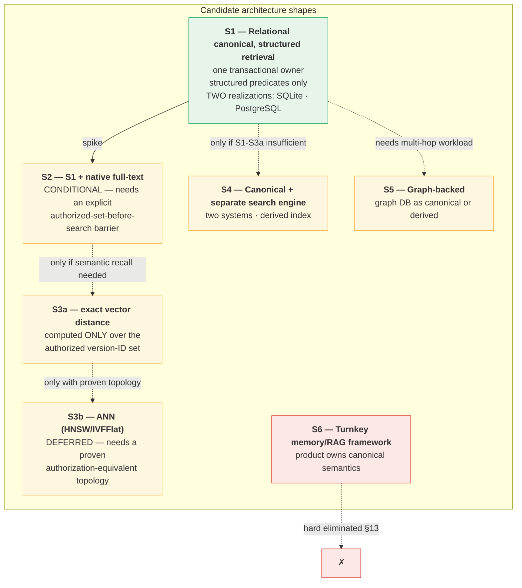
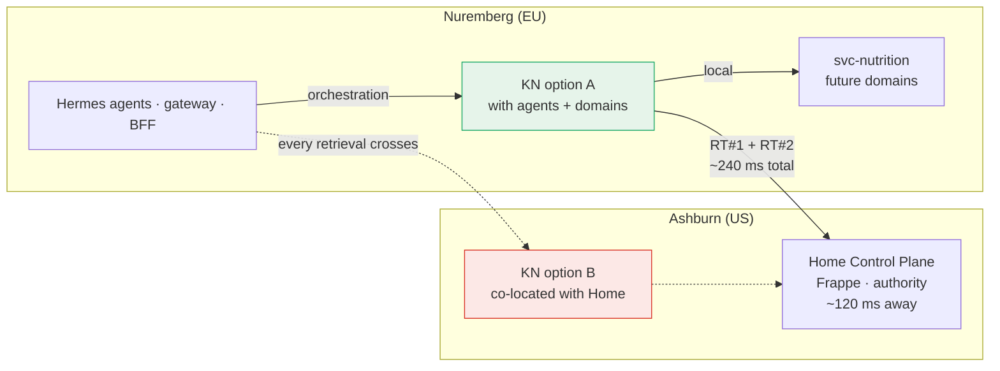
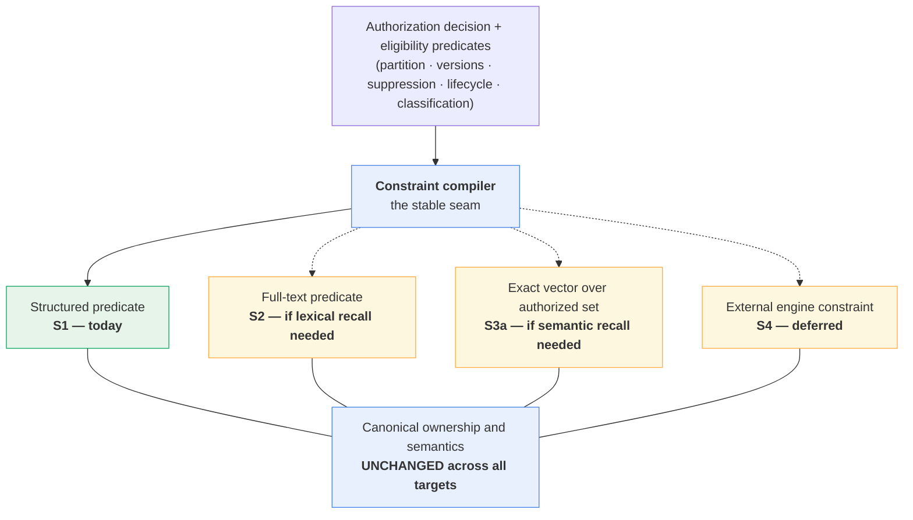

# Knowledge Technology Gate — Phase 1: candidate investigation and benchmark design

Status: **ACCEPTED — PHASE 1 COMPLETE**

Knowledge Technology Gate: **OPEN — PHASE 1 COMPLETE / EMPIRICAL SPIKE AUTHORIZED**

Technology selection: **NOT MADE**

Runtime implementation: **NOT AUTHORIZED**

Benchmark: **DESIGNED AND AUTHORIZED (TG-PA-7), NOT IMPLEMENTED**

Date: 2026-09-22

Revision: 2026-09-22 — **Architecture Board Phase-1 review incorporated.** The Board accepted the general direction and required twelve corrections before TG-PA-1 … TG-PA-7 can close. All twelve are incorporated; §23 maps each to where it landed. **Three factual characterizations were corrected against current upstream sources, two shortlist classifications were tightened, one candidate elimination was downgraded from architectural impossibility to not-shortlisted, one source citation was replaced, and the spike design was materially changed.** No correction reversed the direction of the investigation, and none required B1–B6 to reopen.

Repository: `EKvargas/episteck_home`

Main baseline: `26152713a404379a4ba6e0ac22a50edbd70eeed1`, verified current `origin/main` after [PR #29](https://github.com/EKvargas/episteck_home/pull/29) merged and made accepted B6 authoritative on `main`. This equals the commit named in the investigation request; `main` has not moved.

Branch: `docs/knowledge-technology-gate-phase1`

Gate: [Knowledge Technology Gate](KNOWLEDGE_TECHNOLOGY_GATE.md)

Decision owner: Product Architect

Decision date: 2026-09-22

Disposition: **PHASE 1 ACCEPTED — TG-PA-1 … TG-PA-7 CLOSED (§18); ISOLATED SYNTHETIC SPIKE AUTHORIZED (§18.1)**

This document records the accepted Phase-1 investigation: candidate classifications, spike candidates, an R13 mechanism family and experimental realization, a placement recommendation and a benchmark design. **Phase 1 is complete and the isolated synthetic spike is authorized.** The Gate itself remains **OPEN** — **no technology is selected**, no contract, schema, service, runtime, index, deployment or production system changes, and **no implementation is authorized**. The spike is **not implemented**. B1–B6 remain **RESOLVED and unamended**; no finding demonstrated a contradiction requiring any of them to reopen. All named people and household statements are synthetic.

---

## 1. Executive summary

B6's acceptance authorized this Gate to begin. The Gate's question is not "which memory product is best" but a narrower one:

> **What is the smallest technology architecture that can satisfy accepted B1–B6 for Olin's actual first Knowledge vertical, while leaving a sensible evolution path?**

The investigation reaches four conclusions, three of which can be made from architecture alone and one of which cannot.

**First, part of the candidate field is removed before any benchmark — but for different reasons, which §13 now separates into three categories rather than one.** Mem0 and RAGFlow are **hard-eliminated as canonical Knowledge owners** because their ownership, lifecycle and deletion semantics conflict with accepted B3/B4/B5 in ways their intended role cannot repair. Graphiti and direct graph databases are **not shortlisted for the first vertical** — a weaker and more accurate claim than the first draft made, because a trusted wrapper using Graphiti's direct-write path could technically avoid its autonomous semantics, at which point it is largely a graph store for a workload Olin does not have. The decisive evidence is in §7 with primary sources.

**Second, vectors are not needed for the first vertical, and the reason is sharper than the first draft stated.** pgvector's own documentation states that with approximate indexes "filtering is applied *after* the index is scanned" — structurally the retrieve-then-filter pattern B1 §10 forbids. The first draft treated partial indexing and list partitioning as an available answer. **That was too generous.** Those mechanisms pre-narrow *static* dimensions; Olin's authorization is **dynamic within one trusted partition** and depends on Circle, every Person subject, every required domain, actor grants, lifecycle, classification and suppression. B1 §10 says explicitly that partition isolation alone is insufficient. So §14 now splits the vector question: **S3a** (exact distance over an already-authorized version-ID set) may be compliant and is retained as a future option; **S3b** (ANN) is **deferred pending a proven authorization-equivalent index topology** and is not in the ordinary first spike.

**Third, the canonical store and the retrieval materialization should be separated conceptually and unified physically — for now.** B2 §10.2 and B6 §15.2 make every materialized representation a protected derivative that must prove its own currency. The cheapest way to satisfy that is to have no separate materialization at all initially: one transactional owner, with retrieval expressed as constrained queries over canonical state. This is Option B (authoritative store + *optional* derived materialization) with the optional part deliberately empty at first.

**Fourth, full-text search is not the free pass the first draft assumed.** The Board correctly objected that a global text index may internally discover postings for unauthorized rows before relational filtering applies, and that correct SQL *results* do not prove B1's candidate-*ordering* invariant. **S2 is therefore reclassified `CONDITIONAL — BENCHMARK REQUIRED`**, and the spike must observe the execution barrier rather than only the answer (§16.6.1).

**Fifth, the one thing that genuinely cannot be decided from architecture is R13**, and it gates the performance budget rather than security. §11 compares three mechanism families and recommends the **channel-bound / holder-of-key family**, whose non-bearer property is structural rather than promised. §11.4 now specifies **which experimental realization P12 implements**, because "any Family-1 realization" is not something a spike can build. If no compliant mechanism survives measurement, B6 §18A.3a already prescribes the answer: the budget becomes 2 + N crossings and the target is revised upward, **not** the requirement dropped.

The revised shortlist is five *architecture shapes across two realizations*, not three products:

| | Shape | Realization | Retrieval | Status |
|---|---|---|---|---|
| **S1-SQLite** | Relational canonical, structured retrieval | SQLite | Structured predicates | **SPIKE** |
| **S1-PostgreSQL** | Relational canonical, structured retrieval | PostgreSQL | Structured predicates | **SPIKE** |
| **S2** | + native full-text | Either | `tsvector`/GIN or FTS5, behind an authorized-set barrier | **SPIKE — CONDITIONAL** |
| **S3a** | + exact vector distance | Either | Distance computed **only** over an authorized version-ID set | **DEFERRED / CONDITIONAL** |
| **S3b** | + ANN (HNSW/IVFFlat) | PostgreSQL + pgvector | Approximate index traversal | **DEFERRED** — needs a proven authorization-equivalent topology |

**SQLite and PostgreSQL are both benchmarked**, per the Board's instruction that the Gate's mission — find the smallest architecture that safely works — is not served by deciding against SQLite on intuition before measurement. SQLite may win the minimum-runtime decision; PostgreSQL may win on evolution and concurrent cleanup. **The spike generates the evidence.**

The recommended next empirical task is an **isolated, synthetic, disposable spike** (§16), running **off the production Nuremberg host by default** (§16.2), that measures what architecture cannot settle: raw domain access latency (R14), whether a compliant R13 mechanism preserves two crossings, whether crossings stay flat as domains are added, and — critically — whether the B6 security properties hold under a real backend rather than on paper. **The spike is designed here and explicitly not implemented.**

### 1.1 What this phase does not do

It does not select a technology, rank products for their own sake, design schema, authorize a migration, change deployment, implement a benchmark, or reopen B1–B6. It does not design the Enterprise profile (B6 §21 is an observation, not a mandate). It does not resolve the Process register (gate §"Process register"), which remains OPEN independently.

---

## 2. Repository state recovered

### 2.1 Verification performed

`git fetch origin --prune` was run; `origin/main` was verified at `26152713a404379a4ba6e0ac22a50edbd70eeed1`, **equal to the commit named in the investigation request**. `main` has not moved beyond the expected SHA, so no reconciliation was required. The pre-existing checkout carried untracked `apps/home-hub/` and `docs/ref/`; both were preserved and are not part of this change. The working branch was created directly from `origin/main` with clean tracked status.

Read in full: accepted [B1](KNOWLEDGE_B1_SECURITY_SCOPE.md), [B2](KNOWLEDGE_B2_SENSITIVITY_INHERITANCE.md), [B3](KNOWLEDGE_B3_LIFECYCLE.md), [B4](KNOWLEDGE_B4_FORGET_DELETE.md), [B5](KNOWLEDGE_B5_OWNERSHIP_BOUNDARIES.md), [B6](KNOWLEDGE_B6_TRUSTED_RETRIEVAL.md); the [gate register](KNOWLEDGE_TECHNOLOGY_GATE.md); [ARCHITECTURE](../ARCHITECTURE.md), [KNOWLEDGE](../KNOWLEDGE.md), [DATA_OWNERSHIP](../DATA_OWNERSHIP.md), [SECURITY_AND_CONSENT](../SECURITY_AND_CONSENT.md), [DEPLOYMENT](../DEPLOYMENT.md), [STATUS](../STATUS.md), [ROADMAP](../ROADMAP.md), [G1_5_VALIDATION](../G1_5_VALIDATION.md), [G1_6_VALIDATION](../G1_6_VALIDATION.md); the [independent review](../reviews/2026-09-19-knowledge-independent-architecture-review.md); and ADRs 0001–0009. Implementation was inspected directly.

### 2.2 Accepted state verified, not assumed

| Blocker | Verified status | Evidence |
|---|---|---|
| B1 — security partition / scope / subjects | **RESOLVED** 2026-09-19 | `KNOWLEDGE_B1_SECURITY_SCOPE.md` §13 disposition |
| B2 — sensitivity inheritance | **RESOLVED** 2026-09-20 | `KNOWLEDGE_B2_SENSITIVITY_INHERITANCE.md` §14 |
| B3 — confirmation and lifecycle | **RESOLVED** 2026-09-21 | `KNOWLEDGE_B3_LIFECYCLE.md` §14 |
| B4 — dependency / forget / delete | **RESOLVED** 2026-09-21 | `KNOWLEDGE_B4_FORGET_DELETE.md` §16 |
| B5 — ownership boundaries | **RESOLVED** 2026-09-21 | `KNOWLEDGE_B5_OWNERSHIP_BOUNDARIES.md` §18 |
| B6 — trusted retrieval / ContextBundle | **RESOLVED** 2026-09-22 | `KNOWLEDGE_B6_TRUSTED_RETRIEVAL.md` §23 |
| Knowledge Technology Gate | **OPEN — authorized to begin** | Gate register §"Gate completion and change boundary" |
| Knowledge runtime | **NOT IMPLEMENTED** | §2.3 E5 below |
| Retrieval technology | **NOT SELECTED** | Gate register §"Technology candidates — not approved" |

### 2.3 Implementation evidence independently re-derived

These were inspected in code at the baseline rather than inherited from B6's findings table. Each was confirmed.

| # | Verified fact | Evidence | Consequence for the Gate |
|---|---|---|---|
| **E1** | `check_access_many` enforces `MAX_REQUIREMENTS = 8` for exactly **one** `subject_person_id`, resolves the actor server-side, caches nothing, and refuses the whole call on any malformed entry. | [`api.py` L102, L110–192](../../../apps/episteck_home/episteck_home/api.py) | The multi-resource protocol (B6 §8) is genuinely absent. Every shortlist shape inherits the obligation to *replace* this interface shape, and the spike must stub it rather than pretend it exists. |
| **E2** | Delegations are **single-use**, claimed atomically via one Redis `SET NX EX`, **audience-bound**, `MAX_LIFETIME_SECONDS = 300`, 30 s skew tolerance; store unavailability **raises** rather than returning, so an outage denies. | [`replay.py` L79–105](../../../apps/episteck_home/episteck_home/identity/replay.py), [`delegation.py` L46–181](../../../apps/episteck_home/episteck_home/identity/delegation.py) | Directly relevant to R13. The existing delegation already demonstrates audience binding, bounded lifetime, single-use claiming and fail-closed verification — **but its verification is possession-based**, which is precisely what B6 §18A.3a forbids for downstream execution. §11 builds on this. |
| **E3** | The gateway mints **exactly one** delegation per HTTP POST via nginx `auth_request` to a UDS-only mint app, strips inbound forged `X-Episteck-Delegation`, `X-Actor-ID` and `X-Runtime-ID`, hides the header from responses, and sets `proxy_next_upstream off`. | [`nginx-mcp-gateway.conf` L27–85](../../../deploy/gateway/nginx-mcp-gateway.conf) | The one-delegation-per-POST budget is structural. A candidate whose retrieval needs N authorization decisions per tool call is unimplementable, not merely slow. |
| **E4** | `ContextBundle` carries **no partition, no version, no lifecycle check, no retrieval timestamp, no decision binding, no revalidation member**; it never authorizes the Circle despite holding `circle_ids`; `MANAGE` satisfies `VIEW` via `allows()`; `KnowledgeClaim.domain` is a **single string**. | [`context.py` L92–139](../../../packages/home-contracts/src/episteck_home_contracts/context.py), [`knowledge.py` L98–145](../../../packages/home-contracts/src/episteck_home_contracts/knowledge.py) | Re-confirmed by direct reading. **The protected security-metadata planning phase B6 §9.2 requires cannot be expressed by today's contracts at all** — this is the sharpest technology constraint (R2) and is measured by spike scenario P6/P9. |
| **E5** | **No Knowledge runtime, retrieval, index, chunk, embedding or search symbol exists** for Knowledge anywhere in `apps/`, `packages/` or `services/`. `ContextBundle` is never constructed outside tests. The `search_food` hits are an external USDA/Open Food Facts provider interface. | Repository-wide search; [`food_provider.py`](../../../services/nutrition/app/providers/food_provider.py) | Greenfield. **No existing behaviour constrains the choice, and none should be promoted to a requirement merely because it exists.** |
| **E6** | Nutrition's canonical store is **SQLite**, one JSON `doc` blob per `person_id`, upserted wholesale, with **no delete path** in the repository interface. Its read is a single indexed local `SELECT`. | [`sqlite_repo.py` L21–45](../../../services/nutrition/app/store/sqlite_repo.py), [`repository.py`](../../../services/nutrition/app/store/repository.py) | Two consequences: B4 Scenario A's suppression propagation remains unsatisfiable without an executor, **and** the one available "domain read" latency figure is over a local SQLite query — so it must not be generalized to future domains (R14). |
| **E7** | Measured latencies are exactly as B6 §18A.1 records: Home `check_access` **111.57 ms median / 119.88 ms p95** (persistent client); new-TLS-per-request ping **307.48 / 311.56 ms**; post-G1.6 gateway→Home `whoami` **130.79 / 133.94 ms**; gateway→Nutrition profile **131.23 / 139.06 ms**. G1.6 §7 records delegation verification as "well under a millisecond against a ~120 ms network-bound baseline". | [G1_5_VALIDATION §6](../G1_5_VALIDATION.md), [G1_6_VALIDATION §7 and closeout](../G1_6_VALIDATION.md) | Confirms F15/F16/F17. **The dominant cost is geography, not security logic.** Connection reuse is worth ~195 ms per call and any new component inherits that obligation. |
| **E8** | Topology: Home Control Plane is **Ashburn (US)**; domain services, both Hermes agents, the BFF and the gateway are **Nuremberg (EU)**; Tailscale between; **"No cross-region DB."** G1.7 is **withdrawn** and must not be re-created. | [DEPLOYMENT](../DEPLOYMENT.md) L3–25, [ROADMAP L41–50](../ROADMAP.md) | Placement analysis (§10) must work within this, and may not propose moving Home. |

### 2.4 Prior characterizations corrected

Two corrections from evidence, in the convention B4 §2.2 and B5 §2.2 established.

**First, the ROADMAP pre-empted this Gate — corrected in this PR.** The Roadmap described the Knowledge Technology Gate as "Decide + install the Knowledge stack (candidates: **Mem0 + Docling + Postgres/pgvector; Graphiti deferred; RAGFlow rejected**)". That sentence named a stack and dispositions before the Gate had run, predated B1–B6 entirely, and was in tension with the gate register's own candidate table marking every entry `UNSELECTED`. This investigation partly contradicts it — Mem0 is hard-eliminated as canonical owner rather than adopted, and Docling is out of scope for the first vertical rather than part of an initial stack.

The first draft deferred this correction until the Gate closed. **The Architecture Board required it now** (§19.1), on the precedent B5 set when it corrected an active ROADMAP contradiction (B5 D-1) rather than leaving it to misdirect the next phase. **The replacement states neutral current state only** — not this proposal's shortlist presented as selected.

**Second, the independent review's technology ranking is historical input, not a baseline.** The review's assessment that "plain relational persistence with bounded authorized retrieval is the leading baseline" is well-founded and this investigation independently reaches a compatible conclusion — but by a different route. The review predates B1–B6 and could not test candidates against, for example, B6 §15.2's materialization-binding requirement or B6 §9.2's protected-metadata-before-content ordering, neither of which existed when it was written. **Its conclusions are re-derived here rather than inherited**, and where this document agrees with it, that agreement is evidence of convergence rather than of citation.

---

## 3. B1–B6 hard requirements the technology must satisfy

These are the requirements against which candidates are tested in §8. Each is traceable to an accepted decision; none is invented here. **A candidate that fails any of these is eliminated regardless of convenience** (gate register §"Gate completion and change boundary").

| # | Hard requirement | Source | What it actually demands of a backend |
|---|---|---|---|
| **H1** | **Trusted partition on every object and derivative; no global fallback.** Partition must constrain every lookup and materialization. | B1 §4.1–4.3, §5.2; B5 §7.1 | The partition must be a persisted, immutable, *server-set* column participating in every index and every query predicate — not an application-supplied namespace string. Effective identity is conceptually `(partition, resource_type, local_id)`. |
| **H2** | **Complete protected security metadata resolvable before content.** Exact version, scope, complete subjects, required domains, source-derived restrictions, classification revision, lifecycle/control revision, suppression/derivation bindings — **without reading sensitive content**, and cheaply. | B6 §9.2; B1 §10 | Security metadata must be separable from payload in storage and queryable on its own. A store that requires loading the document to learn its requirements fails. This is R2, and E4 shows today's contracts cannot express it. |
| **H3** | **Authorization-constrained retrieval; unauthorized records structurally not addressable.** Applies equally to structured lookup, text search, semantic search, chunks, graph traversal, reranking, **counting** and caches. | B1 §10; B6 §9.1, invariant 1 | The decision must compile into the *addressable scope* of the operation. Post-filtering is non-compliant **in any form**, including score and count leakage (B2 §10.2). |
| **H4** | **Exact-version lifecycle.** Immutable assertion versions, assertion lines, lifecycle/control revisions, applicability windows, attestations, disputes, supersession, revocation, expiry, holds — **without pretending lifecycle means truth ranking**. | B3 §4, §5; B6 §10.3 | Needs real transactional versioning with CAS-equivalent preconditions on *multiple* revisions committed atomically (B3 §11.1–11.3). |
| **H5** | **Suppression before candidacy.** A suppressed record is immediately unservable even if payload, index, vector or cache still exists. **Correctness must not depend on cleanup completing.** | B4 §1, §8; B6 §10.1 | The register must be consultable inside the retrieval plan, not as a post-pass. A backend whose only suppression mechanism is deletion or reindex fails. |
| **H6** | **Materialization bindings.** Every derivative that may participate in retrieval must carry partition, exact source version, derivation family, classification revision, lifecycle/control revision and a suppression obligation — **checkable without a rebuild**. | B6 §15.2; B2 §10.3; B4 §7 | Each index/cache entry must be attributable and testable. This is R5 and it is the requirement most likely to disqualify a search product. |
| **H7** | **Restore freshness.** Restored Knowledge stays unusable until suppression/control currency is *positively proven* at least as current as the payload. **Unknown freshness fails closed.** | B4 C1, §12.1; B5 §11.3; B6 §16 | Needs control state whose currency can be established independently of the payload's own backup lineage. Constrains backup/restore design more than query design. |
| **H8** | **Final revalidation.** Home freshly re-evaluates current authority before disclosure — **a re-evaluation, not a TTL check** — plus suppression, lifecycle, classification and applicability. | B3 §11.8; B6 §11.1 | Requires the backend to re-prove per-version state cheaply at the barrier, once over the selected set. |
| **H9** | **No authorization per candidate.** | B6 §18A.5; B1 §10 | Structural: E2/E3 make it unimplementable anyway, but it is a security requirement first. |
| **H10** | **ContextBundle never persisted.** | B6 §12.4 | A backend that caches assembled context as a reusable artifact is non-compliant. |
| **H11** | **Performance shape.** Ordinary read ≤ 2 Home authorization **network** crossings; independent domain reads concurrent; source expansion lazy; security predicates composed within owner boundaries; revalidation once per disclosure boundary. Targets p50 ≤ 300 ms (aspiration), p95 ≤ 500 ms, p99 ≤ 800 ms, TTFT separate. | B6 §18A.4, §18A.6, §18A.7, §18A.2, §11.4, §18A.8 | Measured, not assumed. The ten disqualification criteria of B6 §18A.11 apply. |
| **H12** | **R13 — downstream execution authority.** A domain must verify an exact pre-approved operation without an avoidable extra crossing, and **possession of an execution artifact alone must never be sufficient**. | B6 §18A.3a | §11. Gates H11's budget, not H3's security. |
| **H13** | **R14 — raw domain latency measured.** | B6 §18A.3b | Spike-only. §12.3. |

### 3.1 The three requirements that actually discriminate

Most candidates pass or fail on H1, H3 and H6 — and those three are worth stating as one sentence each, because they are what eliminate products that look suitable.

- **H1 asks: can the isolation boundary be *trusted*?** An application-supplied `user_id`, `namespace` or `tenant_id` is a filter, not a partition. B1 §4.2 requires it to come from trusted runtime context and B1 scenario H requires a forged value to be inert. A product whose isolation is a parameter its caller supplies has not met H1 — it has relocated the problem to the caller.
- **H3 asks: is the unauthorized record *unaddressable*, or merely *removed from the output*?** This is the difference between a constraint and a filter, and it is invisible in a feature matrix. "Supports metadata filtering" is insufficient evidence; the question is *when in the plan* the filter applies relative to candidate generation.
- **H6 asks: can a stale derivative be *detected* without rebuilding it?** Many retrieval systems make invalidation an operational process (reindex, refresh, TTL). B4 §4's inversion forbids that: correctness may not depend on the cleanup path succeeding.

A candidate can have excellent documentation on all three topics and still fail all three, because the questions are about *ordering and provenance of trust*, not about capability.

---

## 4. Actual workload assumptions

The Gate must not optimize for scale that does not exist. These assumptions are derived from the accepted first vertical and the deployment evidence, and each is marked as derived or estimated. **Where an assumption is an estimate, the spike is designed to be insensitive to it** (§16.4).

### 4.1 Corpus and access shape

| Property | Assumption | Basis |
|---|---|---|
| Deployment | One household, one trusted partition | Gate register §"Proposed minimal first Knowledge use case"; B1 §5.1 single-deployment binding |
| Persons | ~2–6 | Personal/family deployment ([ROADMAP L41–50](../ROADMAP.md)) |
| Circles | ~1–3, overlapping | B1 §3 |
| First vertical | **PERSON-scoped reusable food preferences** — explicit, user-asserted, single-domain (NUTRITION + KNOWLEDGE governance) | Gate register; B1 scenario A |
| Explicitly excluded | allergy, diagnosis, pregnancy restriction, medical contraindication, Finance, autonomous extraction from all conversations | Gate register, verbatim |
| Assertion versions at launch | **tens** | Derived: one preference per explicit save; excluded classes remove the bulk sources |
| Assertion versions at maturity | **hundreds to low thousands** | Estimated: a family accumulating preferences, routines, goals and decisions over years |
| Sources / Episodes | Conversational captures initially; documents deferred | Gate register excludes document ingestion from the first vertical |
| Read:write ratio | **Heavily read-dominated** | Ask Olin is conversational; writes are explicit save events |
| Concurrency | **Very low.** Effectively one interactive user at a time, plus background jobs | Personal deployment; no multi-user load evidence exists |
| Query shape | "What does this Person prefer / dislike / usually do?" — **subject-scoped, domain-scoped, small result sets** | B6 §18A.3 hot-path modelling |

### 4.2 What these assumptions rule in and out

The decisive number is the corpus size, and it deserves to be stated bluntly: **a few hundred short text assertions, scoped to one Person, is a workload that an unindexed sequential scan answers in under a millisecond.** At that scale:

- **Semantic retrieval solves a problem the workload does not have.** Vector search earns its cost when the corpus is too large for exhaustive comparison or when the query vocabulary diverges from the stored vocabulary. Neither holds for "does Erick dislike canned tuna" over sixty preference assertions that Erick himself wrote.
- **Ranking is nearly irrelevant.** B6 §10.3 is explicit that "lifecycle is not truth ranking" and that two eligible assertions may disagree without a contest. With small authorized result sets, the correct behaviour is usually to return them all with attribution, not to score them.
- **The bottleneck is fixed cost, not marginal cost.** Two Home crossings are ~240 ms (E7). Local retrieval over this corpus is a low-single-digit number of milliseconds. **The corpus would have to grow by three to four orders of magnitude before local retrieval time rivalled one network crossing.** This is the single most important workload fact in the document, and it is what makes early vector adoption a poor trade.

### 4.3 The honest counter-argument

The case *for* provisioning retrieval capability early is that a governance model retrofitted onto an existing index is harder than one designed in. That argument is real, and it is why §7 separates the canonical store from the retrieval layer *conceptually* even while recommending they be the same thing *physically* at first. The mitigation is design discipline, not premature installation: **B6's protocol is explicitly backend-neutral (PA-9), so the constraint-compilation seam can exist from day one with only a structured-predicate compiler behind it.** Adding a second compiler target later is an extension, not a rewrite. §13 states the migration path.

What would genuinely change this assessment is a *different vertical* — document ingestion, or open-ended "what did I say about X last year" recall over conversational history. Those are excluded from the first vertical, and if they are re-introduced the workload assumptions must be re-derived rather than stretched.

---

## 5. Canonical store versus retrieval materialization

B5 fixed that one transactional owner holds assertion versions, lines, lifecycle/control revision, attestations, replacement relations, lineage, Episodes, source custody metadata, the suppression register and the restore-freshness authority (B5 §6.1). It did **not** decide whether retrieval runs over that same store.

### 5.1 The two options, stated precisely

**Option A — one technology serves both canonical persistence and retrieval.** Queries execute against canonical state. There is no second copy of anything.

**Option B — authoritative transactional store plus an optional derived retrieval materialization.** Canonical state lives in one owner; a separate structure (index, vector store, search engine) is maintained for retrieval and is explicitly never authority.

### 5.2 Assessment

| Dimension | A: unified | B: canonical + derived materialization |
|---|---|---|
| **H6 materialization bindings** | **Trivially satisfied** — there is no derivative to bind. The requirement is vacuous rather than met, which is the strongest possible form of satisfying it | Each entry must carry six bindings and prove them without a rebuild (B6 §15.2). Achievable, but it is real, ongoing, easy-to-regress work |
| **H5 suppression before candidacy** | One register, consulted in the same plan as the query. No propagation window exists | The register must reach the materialization *before* it can serve. B4 §4 forbids correctness depending on that propagation succeeding, so the materialization needs its own fail-closed binding check |
| **H3 unaddressability** | The authorization constraint and the content predicate are in one query plan — the constraint cannot be bypassed by a bug in a separate component | The materialization is a second place where addressability must be enforced, and it is the place most likely to be optimized later by someone who does not know why the constraint is there |
| **B2/B4 derivative invalidation** | No stale derivative can exist | Every reclassification (B2 §10.3) must make entries **immediately** ineligible, before any reindex. This is the hardest ongoing obligation |
| **Retrieval capability** | Bounded by what the canonical store can express | Can add semantic, hybrid or specialized retrieval |
| **Operational burden** | One store, one backup, one restore path, one freshness authority | A second service or structure to run, back up, monitor, restore and reconcile — and H7's restore-freshness proof now has two things to reason about |
| **Failure modes** | Store down → Knowledge unavailable (fails closed, correctly) | Materialization stale, partially rebuilt, or ahead/behind canonical → **the failure mode B4 exists to prevent**, unless bindings are perfect |
| **Fit to §4 workload** | **Sufficient by a wide margin** | Solves a problem the first vertical does not have |

### 5.3 Recommendation

**Recommend Option B's *framing* with Option A's *initial realization*: one transactional owner, no separate retrieval materialization at first, and a compile-to-constraints seam that permits one to be added later without changing canonical ownership or semantics.**

This is not a fence-sit. It is the observation that A and B differ only in whether a derived structure exists *today*, and that B's discipline — the derived index is never authority, and suppression/lifecycle/classification must make stale entries unservable immediately, before asynchronous physical cleanup — is the part worth committing to now. Committing to the discipline costs nothing while the derived structure is empty, and it is what makes adding one later safe.

**Starting without any separate retrieval materialization is preferable** for the first vertical, on three grounds: H6 becomes vacuous rather than merely satisfied; B2 §10.3's immediate-reclassification requirement has nothing to race against; and §4.2 shows the retrieval capability being foregone is one the workload does not need.

The condition that must be preserved, and which §13 makes concrete: **if a derived materialization is ever added, it inherits H6 in full and is never authority.** B5 §13.2's seven projection conditions already state the testable form of this for domain projections, and the same list applies.

---

## 6. Candidate architecture shapes

Candidates are evaluated as *architecture shapes*, not products, because the question is what the system must be able to do, not whose logo is on it. Products appear as realizations of shapes.



| Shape | Canonical owner | Retrieval mechanism | Separate materialization | Realization considered |
|---|---|---|---|---|
| **S1** | Relational DB | Structured predicates over canonical state | **None** | **Both SQLite and PostgreSQL** — benchmarked, §8.3 |
| **S2** | Relational DB | S1 + native full-text **behind an authorized-set barrier** | **None** (index is in-transaction) | PostgreSQL `tsvector`/GIN; SQLite FTS5 |
| **S3a** | Relational DB | Exact distance over the authorized version-ID set only | **None** | pgvector exact search, or any distance function |
| **S3b** | Relational DB | ANN index traversal | **None** (extension in the same transaction) | pgvector HNSW/IVFFlat — **deferred** |
| **S4** | Relational DB | Dedicated external search/vector service | **Yes** | Elasticsearch/OpenSearch, Qdrant, Weaviate, Typesense as a class; RAGFlow would fall here if ever revisited |
| **S5** | Graph DB, canonical or derived | Graph traversal + temporal edges | Depends | Neo4j / FalkorDB directly; Graphiti over one |
| **S6** | The product's own store | The product's own pipeline | Inherent | Mem0, RAGFlow as canonical owners |

**On S2's classification — corrected.** A GIN or FTS5 index is a derived structure in the literal sense, but it is not a *separate retrieval materialization* in B5/B6's sense: it lives in the same transaction, updates synchronously with the row, cannot diverge from canonical state, and cannot be served without the row. **That argument settles H6 (currency) and is retained.** It does **not** settle H3 (ordering) — a global posting list may be walked before the authorization predicate applies (§7.1). The two properties are independent, and conflating them was the first draft's error. **S2 passes H6 and is CONDITIONAL on H3**, pending the barrier evidence in §16.6.1.

---

## 7. Candidate research — primary sources

All external research was performed during this investigation against upstream documentation and source. **Internet research was available.** Findings are dated 2026-09-22 and are upstream capabilities and defaults, **not verified properties of any pinned Episteck deployment** — no candidate is installed, and none may be installed by this proposal. Where a finding is decisive, it is quoted.

### 7.1 PostgreSQL

| Property | Finding | Source |
|---|---|---|
| License | PostgreSQL License (BSD-style), permissive | [pgvector LICENSE mirrors the PostgreSQL license](https://raw.githubusercontent.com/pgvector/pgvector/master/LICENSE) |
| Full-text search | **Built into core**, no extension. `tsvector`/`tsquery`/`@@`, GIN and GiST index support, per-language configurations | [PostgreSQL textsearch intro](https://www.postgresql.org/docs/17/textsearch-intro.html) |
| Transactional model | MVCC; readers and writers do not block each other; genuine concurrent writers; row-level locking | [PostgreSQL docs](https://www.postgresql.org/docs/17/) |
| CAS-equivalent | Available via `WHERE version = ?` guarded `UPDATE`, `SELECT … FOR UPDATE`, or advisory locks | Standard SQL semantics |
| Row-Level Security | Available, **but**: "Superusers and roles with the `BYPASSRLS` attribute always bypass the row security system… Table owners normally bypass row security as well" unless `FORCE ROW LEVEL SECURITY` is set | [PostgreSQL RLS](https://www.postgresql.org/docs/17/ddl-rowsecurity.html) |
| RLS caveats | "The only exceptions to row-security checking are `leakproof` functions… the optimizer may choose to apply such functions ahead of the row-security check." Also: "Referential integrity checks… always bypass row security… Care must be taken… to avoid 'covert channel' leaks" | [PostgreSQL RLS](https://www.postgresql.org/docs/17/ddl-rowsecurity.html) |
| Deletion | `DELETE` does not immediately reclaim storage; old row versions persist until vacuumed | [Routine vacuuming](https://www.postgresql.org/docs/current/routine-vacuuming.html) |

**Assessment against the hard requirements.** For **structured** retrieval (S1), PostgreSQL satisfies H1 (partition as an ordinary indexed column, set server-side), H3 (the constraint is a predicate in the same plan — structurally, not by policy), H4 (real transactional versioning with atomic multi-row CAS), H5 (register consulted in-plan; a suppressed row is unaddressable by predicate regardless of whether its payload was deleted) and H8.

**Full-text search (S2) does not automatically inherit that H3 pass — corrected after Board review.** The first draft treated `tsvector`/GIN as an automatic PASS on the reasoning that the index commits with the row and cannot diverge. That argument is sound for **H6** (currency) and is retained. **It says nothing about H3** (ordering), and the Board correctly objected that these are different properties.

The concern is concrete: a GIN index over a `tsvector` column spanning all Knowledge content is a **global posting list**. When a text predicate and an authorization predicate appear in the same query, the planner may satisfy the text predicate first — walking postings for rows the actor cannot address — and apply the authorization predicate afterwards. The *returned rows* would be correct. **The candidate ordering would not be**, and B1 §10 constrains the ordering, not merely the output. B2 §10.2 extends this to scores and counts: a relevance ranking computed across a posting list that included unauthorized rows is influenced by them even when their text is discarded.

**SQL result semantics alone cannot prove B1's candidate-ordering invariant.** What would prove it is an explicit execution barrier: establish the authorized exact-version ID set first, then perform text matching **only** against that bounded set. **B6 selects no SQL mechanism here and neither does this proposal** — the requirement is what matters:

> **No full-text index or search operation may allow unauthorized content to participate in candidate generation, scores, counts or ranking.**

**S2 is therefore reclassified `CONDITIONAL — BENCHMARK REQUIRED`** on H3, and the spike must observe the barrier rather than only the answer (§16.6.1). The same requirement applies to SQLite FTS5, and for the same reason.

**Two caveats deserve to be stated rather than glossed.**

*RLS is defence in depth, not the enforcement mechanism.* The bypass rules mean RLS protects against a compromised application role, not against the owner role that ordinary migrations use. B1 §11 requires Home to be the authority and the repository to enforce its constraints; RLS may usefully add a second layer, but **the Gate must not treat "we have RLS" as satisfying H3.** The primary enforcement is the compiled constraint. This is exactly the point the independent review raised about runtime privilege design, and it survives re-derivation.

*The "covert channel" and `leakproof` caveats are directly relevant to B2 §10.2's anti-oracle requirement.* Unique constraints and foreign keys bypass row security by design, so a uniqueness violation can reveal the existence of a row the caller cannot see. For Knowledge this matters at admission (B3 §11.6 capture-duplicate binding) and for idempotency keys. **It is a schema-design obligation, not a disqualifier**, and the spike's P6 scenario should observe whether denial paths leak through error shape as well as timing.

*Deletion does not immediately erase.* This is not a problem for B4 — B4 §1's whole inversion is that suppression, not deletion, is what makes information stop being used, and B4 §14 already distinguishes `ERASURE PENDING` from `ERASED`. It **is** a requirement on how erasure completion is evidenced, and it means "we ran DELETE" is not a cleanup receipt.

### 7.2 pgvector

| Property | Finding | Source |
|---|---|---|
| License | BSD-style (PostgreSQL License), copyright PostgreSQL Global Development Group / Regents of the University of California | [LICENSE](https://raw.githubusercontent.com/pgvector/pgvector/master/LICENSE) |
| Current version | 0.8.6 | [pgvector README](https://github.com/pgvector/pgvector) |
| **Filtering order** | **"With approximate indexes, filtering is applied *after* the index is scanned."** With HNSW default `hnsw.ef_search` of 40 and a condition matching 10% of rows, "only 4 rows will match on average" | [pgvector README — Filtering](https://github.com/pgvector/pgvector/blob/master/README.md) |
| Iterative scans | Added in **0.8.0**; `hnsw.iterative_scan` / `ivfflat.iterative_scan` with `strict_order` and `relaxed_order` modes; scan limited by `hnsw.max_scan_tuples` (default 20,000) | [pgvector README](https://github.com/pgvector/pgvector/blob/master/README.md), [0.8.0 release](https://www.postgresql.org/about/news/pgvector-080-released-2952) |
| **Pre-narrowing options** | "If filtering by only a few distinct values, consider **partial indexing**" — `CREATE INDEX … WHERE (category_id = 123)`. "If filtering by many different values, consider **partitioning**" — `PARTITION BY LIST(category_id)` | [pgvector README — Filtering](https://github.com/pgvector/pgvector/blob/master/README.md) |
| Vacuum | "Vacuuming can take a while for HNSW indexes. Speed it up by reindexing first" | [pgvector README](https://github.com/pgvector/pgvector/blob/master/README.md) |

**This is the single most consequential external finding in the investigation. The first draft drew too generous a conclusion from it, and the Board was right to object.**

*Against ANN use:* an ANN index scan that generates candidates and *then* applies the authorization predicate is **structurally the pattern B1 §10 forbids** — "global search → retrieve unauthorized candidates/text → application-filter". That the filter runs inside PostgreSQL rather than in application code does not change the ordering. It leaks in exactly the way B2 §10.2 names: with post-scan filtering, *which* authorized rows survive depends on how many unauthorized rows occupied the top-`ef_search` — so an unauthorized record influences the authorized result set even though its text is never returned. Iterative scans make this *less visible* by scanning further; they do not make it untrue.

*The first draft's error.* It concluded that partial indexing and `PARTITION BY LIST` make ANN compliant, calling that "a documented, supported pattern rather than a workaround". **That conclusion is withdrawn.** Those mechanisms pre-narrow a **static** filter dimension — a category id, a tenant id, a value known at index-creation time. **Olin's authorization is not static.** Within one trusted security partition it depends on the Circle, every Person subject, every required content domain, the actor's current grants, lifecycle state, classification revision and suppression state — a predicate that varies per request and per actor. You cannot create an index per authorization outcome.

And B1 §10 anticipates exactly this: **"Partition isolation alone is insufficient when private Persons coexist inside one partition."** An HNSW index partitioned by security partition would therefore satisfy nothing that matters, because Olin's hard case is Erick and Ana *inside the same partition* (B1 scenarios D and E).

**Corrected conclusion, and it splits the candidate in two** (§14):

- **S3a — exact distance over an already-authorized set.** Protected metadata planning produces the authorized exact-version ID set; distance is then computed **only** over those versions, with no ANN structure traversed. Nothing outside the authorized set is ever addressed, so the ordering invariant holds for the same reason it holds for a structured predicate. **Potentially compliant; retained as a future semantic-retrieval option.**
- **S3b — ANN (HNSW/IVFFlat).** Compliant **only** if the implementation can prove that the index structure traversed for a given request contains *only* records within that request's complete addressable scope. A static partition-level index does not establish that. **DEFERRED pending a proven authorization-equivalent index topology**, and **excluded from the ordinary first spike** — §4 shows the first vertical does not need ANN at all.

A candidate whose security depends on nobody later adding a convenient global ANN index is a standing risk, recorded as **RK-3** (§20).

### 7.3 Mem0

| Property | Finding | Source |
|---|---|---|
| License | Apache 2.0 | [Mem0 repository](https://github.com/mem0ai/mem0) |
| Deployment | Library mode, self-hosted server, and a managed Cloud Platform | [Mem0 repository](https://github.com/mem0ai/mem0) |
| **OSS/managed split** | The April 2026 algorithm is available in the managed platform with "proprietary optimizations not available in the open-source SDK" | [Mem0 repository](https://github.com/mem0ai/mem0) |
| **Deletion semantics** | **Deletion is a tombstone that preserves the prior text.** `_delete_memory` captures `prev_value = existing_memory.payload["data"]`, deletes the vector-store point, then calls `self.db.add_history(memory_id, prev_value, None, "DELETE", …, is_deleted=1)` — so the previous memory text is written into the history row rather than erased | **[Issue #3245](https://github.com/mem0ai/mem0/issues/3245)**, which quotes the source directly; [Mem0 delete operation docs](https://docs.mem0.ai/core-concepts/memory-operations/delete) |
| Deletion residue elsewhere | The same issue reports that `Memory.delete(memory_id)` removes the vector-store point and adds a history record but "fails to remove corresponding nodes and relationships from the Neo4j graph store" when a graph store is configured | [Issue #3245](https://github.com/mem0ai/mem0/issues/3245) |
| Isolation | `user_id` / `agent_id` / `run_id` filters; `delete_all` requires at least one filter | [Mem0 repository](https://github.com/mem0ai/mem0) |
| Newer algorithm | Redesigned to preserve memory history rather than overwrite it, so memories accumulate | Search-surfaced upstream description; **secondary evidence, not load-bearing** |

**Source-citation correction.** The first draft cited [issue #7316](https://github.com/mem0ai/mem0/issues/7316) for the deletion-retention finding. That issue is genuine but is about *reconciliation* — that the history table and payload hash are never compared against the vector store — **not about deletion retaining prior text.** It could not carry the weight the first draft placed on it. **[Issue #3245](https://github.com/mem0ai/mem0/issues/3245) is the correct primary source**, because it quotes the `_delete_memory` implementation showing `prev_value` written to history with `is_deleted=1`. The finding is unchanged and is now better evidenced; the citation is corrected.

**Assessment, with H1 reasoning corrected.**

**H1 is CONDITIONAL and external to Mem0, not the primary hard failure.** The first draft claimed that a caller-facing `user_id` argument was an irreparable H1 failure. **That was too strong.** A trusted Knowledge service wrapping Mem0 could set the namespace from trusted server-side context, never accepting it from a model, tool payload or browser — which is exactly what B1 §5.1 requires of the partition binding. The accurate statement is narrower: *Mem0 does not itself provide Olin's trusted-partition authority; a wrapper could supply it.* H1 is therefore **not** the disqualifier.

**The decisive conflicts are the canonical-owner semantics, and these a wrapper cannot repair:**

- **H4 — no exact-version lifecycle.** No immutable assertion versions, no assertion lines, no lifecycle/control revision, no attestations, no disputes, no replacement relations with typed reasons. B3's entire facet model (§5.2) is unrepresentable, and a wrapper cannot add versioning to a store that overwrites or accumulates by design.
- **H5 — no suppression register.** B4's core inversion is that a durable prohibition, not deletion, is what makes information stop being used. Mem0 has no such register and no pre-use barrier consulting one.
- **B4 §10 — retained forgotten content.** B4 lists among things that **must not be retained**: "claim statement text" and "free-text reasons that restate the content". Writing `prev_value` into history on delete is exactly that. A wrapper could delete the history rows afterwards, but then the wrapper is implementing erasure *against* the library's design rather than with it — and B4 §4's whole point is that correctness must not depend on that cleanup succeeding.
- **H6 — no bindings.** No classification revision, lifecycle revision, derivation family or partition binding attaches to a stored memory, so a stale derivative cannot be detected without a rebuild.
- **B5 ownership.** The product owns canonical semantics for what it stores, conflicting with B5 §6.2 fixed point 1.

**Disposition: HARD ELIMINATED as canonical Knowledge owner**, on lifecycle, suppression, deletion and ownership semantics — **not** on `user_id`. The gate register's existing hypothesis — "may later be evaluated as a proposal/extraction helper, never the canonical authority" — survives intact and is *not* disturbed. In that role its output would be PROPOSED under B3 §5.1 and never admitted without passing the normal gates, which is a different requirement set. **This elimination is about canonical ownership only.**

### 7.4 Graphiti

| Property | Finding | Source |
|---|---|---|
| License | Apache 2.0 | [Graphiti repository](https://github.com/getzep/graphiti) |
| **Required backend** | **A graph database is mandatory.** Neo4j 5.26+, FalkorDB 1.1.2+, Amazon Neptune, or Kuzu 0.11.2 (deprecated, upstream unmaintained) | [Graphiti repository](https://github.com/getzep/graphiti) |
| **LLM requirement** | **Mandatory in the ingestion pipeline.** "Graphiti works best with LLM services that support Structured Output" | [Graphiti repository](https://github.com/getzep/graphiti) |
| Temporal model | Bi-temporal. "Facts have validity windows. When information changes, old facts are invalidated — not deleted" | [Graphiti repository](https://github.com/getzep/graphiti) |
| **`group_id` partitioning** | **`group_id` exists and partitions graph data and episodes.** Nodes, edges and episodes carry it, searches are scoped by `group_ids`, and cross-group operations require separate calls. It is a **caller-facing parameter** | [Adding fact triples](https://help.getzep.com/graphiti/graphiti/adding-fact-triples) (shows `group_id` on the call); [issue #1876](https://github.com/getzep/graphiti/issues/1876) (discusses `group_id` write/read database resolution) |
| **`add_triplet` direct write** | **A fact can be written directly without episode extraction.** The caller constructs `EntityNode`/`EntityEdge` objects and calls `add_triplet`. Upstream states: "Graphiti will attempt to deduplicate your passed in nodes and edge with the already existing nodes and edges in the graph. If there are no duplicates, it will add them as new nodes and edges" | [Adding fact triples](https://help.getzep.com/graphiti/graphiti/adding-fact-triples) |
| Autonomous path | The standard `add_episode` path performs LLM-driven entity/edge extraction, deduplication and **contradiction resolution / temporal invalidation** | [Graphiti repository](https://github.com/getzep/graphiti); [issue #1193](https://github.com/getzep/graphiti/issues/1193) on extraction LLM cost |
| Operational | Python 3.10+, LLM credentials, external graph DB instance, `SEMAPHORE_LIMIT` concurrency control, optional full-text backend | [Graphiti repository](https://github.com/getzep/graphiti) |

**Factual corrections to the first draft.** Two claims were **wrong and are withdrawn**:

1. The first draft said Graphiti has "no explicit multi-tenancy, `group_id` isolation or authorization model". **`group_id` does exist and does partition graph data and episodes.** The accurate criticism is narrower: it is a *caller-facing grouping mechanism*, so satisfying B1 would require binding it from trusted server-side context — the same wrapper argument that applies to Mem0's `user_id` (§7.3), and equally *not* an irreparable failure.
2. The first draft implied a mandatory LLM on **every** write path. **`add_triplet` writes a fact directly without episode extraction.** Upstream does document that it still attempts deduplication against existing nodes and edges, and upstream discussion ([issue #1193](https://github.com/getzep/graphiti/issues/1193)) indicates embedding and possible resolution calls remain on that path — so it is "bypasses extraction", not "provably zero model involvement". That distinction is recorded rather than overstated in either direction.

**Corrected assessment.** Graphiti's bi-temporal model is genuinely the closest of any candidate to B3's applicability windows and supersession, and the corrected facts make the honest conclusion weaker than a hard elimination:

- **Its default autonomous behaviour is unsuitable as Olin's canonical lifecycle authority.** The standard `add_episode` path delegates semantic contradiction resolution and temporal invalidation to an LLM. B3 §8 reserves supersession for an explicit authorized replacement command, B3 D2 states an LLM cannot create or approve an admission class, and B2 §10.1 states AI "cannot… rewrite requirements… [or] declare independent human evidence". **Used as canonical lifecycle control, that path is incompatible with accepted B3 authority semantics.** This finding stands and is the durable one.
- **But a trusted wrapper using only `add_triplet` could avoid those defaults.** At which point Graphiti is largely a graph storage and retrieval layer with bi-temporal edges — and Olin would be paying for a mandatory graph database, an LLM dependency and a second operational surface to get storage it already has.
- **`group_id` would need trusted server-side binding** to satisfy B1, which is achievable but is work the wrapper must do rather than a property Graphiti supplies.
- **H5/H6 remain unmet:** no suppression register, no classification-revision binding on derived edges.
- **No demonstrated multi-hop workload justifies the complexity** (§4). The independent review's position — "require a concrete multi-hop query workload before considering its operational cost" — is re-derived and confirmed.

**Disposition: NOT SHORTLISTED FOR THE FIRST VERTICAL** — explicitly *not* a claim of fundamental architectural impossibility. Re-enterable if a demonstrated multi-hop graph workload appears **and** a controlled direct-write path with trusted `group_id` binding is designed, which would also require resolving what role its autonomous temporal semantics play, if any.

### 7.5 RAGFlow

| Property | Finding | Source |
|---|---|---|
| License | Apache 2.0 | [RAGFlow repository](https://github.com/infiniflow/ragflow) |
| **Minimum hardware** | **CPU ≥ 4 cores, RAM ≥ 16 GB, Disk ≥ 50 GB** | [RAGFlow repository](https://github.com/infiniflow/ragflow) |
| **Metadata database** | **Not MySQL-only.** The metadata/business layer uses Peewee with pooled backends selected at runtime by a `DB_TYPE` setting; `PooledMySQLDatabase` and `PooledPostgresqlDatabase` are both wired in, with matching `MySQLMigrator`/`PostgresqlMigrator`. PostgreSQL support was requested in [#2356](https://github.com/infiniflow/ragflow/issues/2356) and [#5860](https://github.com/infiniflow/ragflow/issues/5860); a current proposal ([#19983](https://github.com/infiniflow/ragflow/issues/19983)) adds another PG-compatible backend by reusing those same pooled classes | [db_models.py discussion](https://github.com/infiniflow/ragflow/issues/10687); [issue #19983](https://github.com/infiniflow/ragflow/issues/19983) |
| Document engine | `DOC_ENGINE` selects the chunk/vector store — Elasticsearch by default, Infinity as an alternative | [RAGFlow repository](https://github.com/infiniflow/ragflow) |
| Services deployed | Document engine (Elasticsearch/Infinity) + metadata DB + Redis + MinIO + the app, plus optional gVisor sandbox. The official configuration page documents the MySQL variables (`MYSQL_PASSWORD`, `MYSQL_PORT`, `EXPOSE_MYSQL_PORT`) | [RAGFlow configuration](https://ragflow.io/docs/configurations) |
| LLM requirement | External LLM service required | [RAGFlow repository](https://github.com/infiniflow/ragflow) |
| Multi-tenancy / permissions | **Not explicitly documented** | [RAGFlow repository](https://github.com/infiniflow/ragflow) |

**Factual correction to the first draft.** The first draft stated RAGFlow's "own MySQL store would become the authority", implying MySQL is inherent. **That is wrong and is withdrawn:** the metadata layer is a runtime-selected Peewee backend and PostgreSQL is a supported option. Note the official [configuration page](https://ragflow.io/docs/configurations) still documents only the MySQL variables, so the PostgreSQL path is real but less prominently documented than MySQL.

**This correction does not change the conclusion, because the conclusion never depended on which SQL engine it uses.** The conflict is that RAGFlow's *own* metadata, retrieval and object-storage semantics would become the canonical Knowledge semantics — and that is true whether those rows live in MySQL or PostgreSQL.

**Corrected assessment.** Adopting RAGFlow as the canonical Knowledge owner would place canonical assertion identity, lifecycle and security semantics inside an integrated RAG platform, contradicting **B5 §6.2 fixed point 1** (Knowledge is a distinct logical bounded context) and **fixed point 3** (an external product's schema cannot implicitly become the Knowledge security, lifecycle or transactional model). H1/H5/H6 are unaddressed by the platform, and its five-service footprint and ≥16 GB documented minimum are disproportionate to §4's workload.

**Disposition: HARD ELIMINATED as canonical Knowledge owner** — on ownership grounds first, resources second. **The resource argument alone would not suffice**, since hardware can be bought whereas the ownership conflict cannot be configured away. ADR-0007 already rejected adopting a turnkey RAG stack and nothing in current upstream disturbs that.

**Not universally unusable.** If a future document-heavy vertical ever justified it, RAGFlow could in principle serve as a **derived retrieval materialization** over canonical Knowledge it does not own. That role is the already-deferred **S4** class (§7.6) and carries S4's requirements — H6 bindings, serve-time suppression checks, never authority. No separate disposition is proposed for it.

### 7.6 Dedicated search / vector services as a class (S4)

Rather than evaluate each product, the class is assessed against the hard requirements, because they share the decisive properties. Individual product evaluation is deferred unless TG-PA-2 keeps S4 on the shortlist.

| Requirement | Class assessment |
|---|---|
| **H1** | Usually a namespace/collection/tenant field supplied by the client — **H1's trusted-binding problem again**, though it can be mitigated if the only writer is the trusted Knowledge owner |
| **H3** | Depends entirely on whether filters are applied pre- or post-candidate-generation. **This must be verified per product against primary documentation, not accepted from a feature list** (§3.1) |
| **H4** | External to the engine. The engine stores documents, not assertion lifecycles. Not a failure — it is simply not the engine's job |
| **H5** | **The hard one.** The engine is a separate system, so suppression must propagate to it, and B4 §4 forbids correctness depending on that propagation. Requires a binding check at serve time |
| **H6** | Requires six bindings per entry and a rebuild-free currency check (B6 §15.2). **Achievable but is exactly the requirement B6 R5 predicted would disqualify candidates** |
| **H7** | A second store in the restore path, each with its own currency question |
| Operational | A second service to run, back up, restore, monitor and upgrade on a constrained node |

**Disposition: RETAINED as a deferred shape, NOT shortlisted.** S4 is not eliminated on correctness — a correctly-bound external index can satisfy H3/H5/H6 — but it is **not justified by §4's workload**, and it makes the two hardest ongoing obligations (H5, H6) materially harder for a capability the first vertical does not need. It should be reconsidered only if measured retrieval requirements demonstrate S1–S3a insufficient.

### 7.7 Graph databases directly (S5)

Evaluated separately from Graphiti, since the framework's LLM-in-ingestion problem is not inherent to the database.

A graph database used directly (Neo4j, FalkorDB) avoids Graphiti's D2 conflict, and B4 §7's derivation families and B3 §4's replacement relations are genuinely graph-shaped. But B4 §7 answers this directly and deserves quoting: *"A full graph database is not required. Neither is a graph traversal engine. What is required is that every derivative know its parents and its family root at creation time — which is a discipline, not a technology."*

Relational foreign keys express bounded parent/family-root relations without a traversal engine. **The workload has no demonstrated multi-hop query** (§4), and B5 §6.1 requires assertion versions, lifecycle, lineage and suppression to share one *transactional* owner — a property mature relational systems provide more straightforwardly than graph stores.

**Disposition: ELIMINATED for the first vertical**, on the absence of a workload that needs it, not on incapability.

### 7.8 Co-locating with existing Olin persistence

Two existing stores were assessed as hosts, because reusing one would avoid a new component entirely.

**Frappe/MariaDB on Ashburn (the Home Control Plane).** **Prohibited by B5 §6.2 fixed point 3**, which forbids ordinary Home DocTypes and role-based CRUD from implicitly becoming the Knowledge security, lifecycle or transactional model — and cites the dormant `Nutrition Profile` DocType with blanket System Manager CRUD as the concrete anti-pattern. Co-location is permitted only if the logical boundary survives intact (fixed point 4), which DocType-based persistence does not provide. Separately, §10 shows the placement is wrong on latency grounds. **Not viable as proposed; a separately-bounded schema on that host is a different question, assessed in §10.**

**svc-nutrition's SQLite on Nuremberg.** Not viable as a host — E6 shows a single opaque JSON blob per person with no delete path, and B5 §9.3 forbids converting that legacy text into admitted assertions. But SQLite *as a technology* for a new, properly-designed Knowledge schema is a genuine S1 realization and is assessed in §8.3 rather than dismissed, because §4's concurrency assumptions are exactly the conditions under which SQLite is adequate.

### 7.9 Docling

Listed in the ROADMAP's pre-emptive stack and in the gate register. **Out of scope for this phase**: the first vertical excludes document ingestion, so a document parser has nothing to parse. The gate register's existing hypothesis — "relevant later for document ingestion; unnecessary for the initial conversational preference vertical" — is confirmed and left undisturbed. No disposition is proposed.

### 7.10 Research limitations

Stated explicitly so the Product Architect can weigh the evidence.

- Findings are upstream documentation and source as of **2026-09-22**, not properties of any pinned, deployed, version-verified installation. **Any later selection requires version-specific verification**, as the gate register already requires.
- The Mem0 "newer algorithm accumulates rather than overwrites" finding rests on search-surfaced upstream description rather than a direct source reading, and is flagged as secondary. **It is not load-bearing**: the deletion-history finding alone is decisive and is corroborated by an upstream issue.
- S4 products were assessed as a class. Per-product H3 verification was not performed and would be required before S4 could be shortlisted.
- No candidate was installed, benchmarked or configured. **No measurement in this document is a new measurement**; every latency figure is repository evidence (E7).

---

## 8. Hard disqualification matrix

Security correctness is **not** collapsed into a score. Each cell is `PASS`, `FAIL`, `UNKNOWN — BENCHMARK REQUIRED`, `N/A`, or `CONDITIONAL` where a requirement is satisfiable only under a stated constraint.

**A `FAIL` on any hard requirement eliminates the candidate regardless of convenience.**

### 8.1 Shapes against hard requirements

| Req | S1-SQLite | S1-PostgreSQL | S2 full-text | S3a exact vector | S3b ANN | S4 separate engine | S5 graph direct | Mem0 as owner | RAGFlow as owner | Graphiti |
|---|---|---|---|---|---|---|---|---|---|---|
| **H1** partition | **PASS** | **PASS** | **PASS** | **PASS** | PASS | CONDITIONAL — client-supplied namespace unless sole trusted writer | PASS | CONDITIONAL — **external to Mem0**; a wrapper could bind it | CONDITIONAL — not the disqualifier | CONDITIONAL — `group_id` exists but is caller-facing |
| **H2** metadata before content | **PASS** — separable columns | **PASS** | **PASS** | **PASS** | PASS | UNKNOWN — per product | PASS | **FAIL** — payload-coupled | UNKNOWN | UNKNOWN |
| **H3** unaddressability | **PASS** — predicate in-plan | **PASS** — predicate in-plan | **CONDITIONAL — BENCHMARK** — global posting list may be walked before the authorization predicate (§7.1) | **CONDITIONAL** — compliant iff distance is computed only over the authorized ID set | **DEFERRED** — ANN filters *after* scan; static partitioning ≠ dynamic authorization (B1 §10) | UNKNOWN — must verify pre/post ordering per product | PASS | **FAIL** — post-filter | **FAIL** | **FAIL** on the autonomous path |
| **H4** exact-version lifecycle | **PASS** | **PASS** | **PASS** | **PASS** | PASS | N/A — external to engine | PASS | **FAIL** — no version model | **FAIL** | **FAIL** as canonical lifecycle authority (LLM invalidation, B3 D2/§8) |
| **H5** suppression before candidacy | **PASS** — in-plan register | **PASS** | **CONDITIONAL** — same barrier question | **CONDITIONAL** — register must bound the ID set | DEFERRED | CONDITIONAL — needs serve-time binding check | PASS | **FAIL** — no register | **FAIL** | **FAIL** — no register |
| **H6** materialization bindings | **PASS (vacuous)** — no derivative | **PASS (vacuous)** | **PASS** — index commits with row | **PASS** — same transaction | PASS | CONDITIONAL — six bindings + rebuild-free check | CONDITIONAL | **FAIL** — no bindings | **FAIL** | **FAIL** |
| **H7** restore freshness | UNKNOWN — mechanism unselected (B4 C1) | UNKNOWN | UNKNOWN | UNKNOWN | UNKNOWN | UNKNOWN — worse: two stores | UNKNOWN | **FAIL** — deletion writes prior text to history | UNKNOWN | UNKNOWN |
| **H8** final revalidation | **PASS** | **PASS** | **PASS** | **PASS** | PASS | UNKNOWN | PASS | **FAIL** | **FAIL** | **FAIL** |
| **H9** no auth per candidate | **PASS** — orchestration property | **PASS** | **PASS** | **PASS** | PASS | PASS | PASS | N/A | N/A | N/A |
| **H10** bundle never persisted | **PASS** — orchestration property | **PASS** | **PASS** | **PASS** | PASS | PASS | PASS | **FAIL** — memory *is* persisted context | N/A | N/A |
| **H11** performance shape | UNKNOWN — **BENCHMARK** | UNKNOWN — **BENCHMARK** | UNKNOWN | UNKNOWN | UNKNOWN | UNKNOWN | UNKNOWN | N/A | **FAIL** — B6 §18A.11 resource/service count | N/A |
| **H12** R13 | UNKNOWN — **BENCHMARK** (§11) | UNKNOWN — **BENCHMARK** | UNKNOWN | UNKNOWN | UNKNOWN | UNKNOWN | UNKNOWN | N/A | N/A | N/A |
| **H13** R14 | UNKNOWN — **BENCHMARK** | UNKNOWN — **BENCHMARK** | UNKNOWN | UNKNOWN | UNKNOWN | UNKNOWN | UNKNOWN | N/A | N/A | N/A |
| **B5 ownership** | **PASS** | **PASS** | **PASS** | **PASS** | PASS | PASS | PASS | **FAIL** — product owns semantics | **FAIL** — §6.2 fixed points 1/3 | **FAIL** as canonical owner |
| **Outcome** | **SPIKE** | **SPIKE** | **SPIKE — CONDITIONAL** | **DEFERRED / CONDITIONAL** | **DEFERRED** | **DEFERRED** | **NOT SHORTLISTED** | **HARD ELIMINATED** as owner | **HARD ELIMINATED** as owner | **NOT SHORTLISTED** for first vertical |

**Reading the CONDITIONAL cells on H1 for the eliminated candidates.** Mem0, RAGFlow and Graphiti now show `CONDITIONAL` rather than `FAIL` on H1, because a trusted wrapper could bind their namespace from server-side context. **That change does not rescue any of them** — it relocates the disqualifier to where it actually is. Mem0 and RAGFlow are hard-eliminated on lifecycle, suppression, deletion and ownership semantics; Graphiti is not shortlisted on workload and autonomous-lifecycle grounds. Recording H1 honestly makes the real reasons load-bearing instead of resting on the weakest available argument.

### 8.2 The three cells that carry the most weight

**S3b/H3 — `DEFERRED`, not `CONDITIONAL`.** The first draft marked ANN `CONDITIONAL` on the reasoning that partial indexing and list partitioning pre-narrow the scan. **That reasoning is withdrawn** (§7.2): those mechanisms narrow *static* dimensions, while Olin's authorization is dynamic within one partition and B1 §10 states that partition isolation alone is insufficient. ANN is compliant only against a proven authorization-equivalent index topology, which nobody has proposed. **S3a — exact distance over an already-authorized ID set — is the shape that may be compliant**, and it is the one retained.

**S2/H3 — `CONDITIONAL`, corrected from `PASS`.** The first draft's "same plan, same transaction" argument settles **H6**, not **H3**. A global `tsvector`/GIN posting list may be walked before the authorization predicate applies, and correct returned rows do not prove correct candidate ordering (§7.1). **This is the correction most likely to change what the spike must build**, since it requires an explicit authorized-set barrier rather than a compound `WHERE`.

**S2/H6 — `PASS` retained.** A GIN or FTS5 index cannot diverge from canonical state because it commits with the row. **Spike scenario P11 still tests it** by attempting to serve from a stale binding, because an argument is not a measurement.

**H7 — `UNKNOWN` for every shape, and that is correct rather than evasive.** B4 C1 deliberately selected no persistence or replication mechanism for the restore-freshness authority, and B5 PA-3 assigned the owner without the mechanism. **No backend choice determines H7** — it is determined by how control state is replicated and how its currency is proven, which is a design decision layered on top of any of S1–S3a. Marking it `PASS` for Postgres would be false precision. P10 measures it.

### 8.3 SQLite versus PostgreSQL as the S1 realization

Both are genuine S1 realizations and the choice is not obvious, so it is assessed rather than assumed. §4's workload — one household, very low concurrency, read-dominated — is squarely inside SQLite's comfortable range, and svc-nutrition already demonstrates the operational pattern on this node.

| Dimension | SQLite | PostgreSQL |
|---|---|---|
| **H4 CAS** | Single-writer serialization gives ordering essentially for free, **but the contract is enforced at the application layer** | Genuine concurrent writers; CAS needs an explicit `WHERE revision = ?` guard or `SELECT … FOR UPDATE` |
| **H2/H3** | Adequate — predicates are predicates | Adequate |
| **Full-text (S2 path)** | FTS5 available | `tsvector`/GIN in core |
| **Vector (S3a path)** | Exact distance is expressible without an extension | pgvector, same transaction |
| **Vector (S3b path)** | No first-class ANN option comparable to pgvector | pgvector HNSW/IVFFlat — **deferred anyway** (§7.2) |
| **Concurrency** | One writer at a time; WAL lets readers proceed. **Background cleanup jobs and interactive writes contend** | MVCC; cleanup and interactive work do not block each other |
| **Operational** | **No service to run.** One file. Backup already proven for svc-nutrition | A service to run, back up, restore, upgrade, monitor |
| **Restore (H7)** | File-level, simple | More moving parts, better tooling |
| **Evolution** | S2 and S3a reachable; **S3b effectively not** | S1 → S2 → S3a → S3b is additive |

**Assessment — and the Board's correction to it.** The first draft proposed benchmarking PostgreSQL only, with SQLite as a "live fallback". **The Board rejected that**, correctly: the Gate's mission is to find the smallest architecture that safely works, and deciding against SQLite on evolution-path intuition *before measurement* is exactly the substitution of preference for evidence this phase exists to avoid. The S3b evolution path — one of the two reasons the first draft favoured PostgreSQL — is now **deferred anyway** (§7.2), which weakens that argument further.

**Both are benchmarked.** The remaining genuine discriminator is **B4's asynchronous cleanup running concurrently with interactive reads and writes**, where SQLite's single writer is a real constraint rather than a theoretical one — and that is a *measurable* property, not a judgement call. The spike measures it directly (§16.5, P13).

**Neither is proposed as the selection.** SQLite may win the minimum-runtime decision; PostgreSQL may win on concurrent cleanup and evolution. Every scenario in §16 is backend-neutral by construction, so running both costs schema work once and execution twice.

### 8.4 Non-hard factors

Qualitative comparison only, per the Gate's instruction not to hide disqualifiers inside aggregate scores. Limited to surviving shapes.

| Factor | S1 | S2 | S3a / S3b | S4 (deferred) |
|---|---|---|---|---|
| Operational complexity | Lowest | Lowest + one index type | Low + one extension | **Highest** — second service, second backup, second restore |
| Services to operate | 1 | 1 | 1 | 2+ |
| Memory/CPU | Minimal | Minimal | HNSW build/vacuum cost is real | Significant |
| Backup/restore | One path | One path | One path | Two paths, two currency questions |
| Observability | Standard SQL | Standard | Index-specific tuning | Two systems to correlate |
| Developer ergonomics | Familiar | Familiar | Requires embedding pipeline + tuning | Requires sync machinery |
| Failure modes | Store down → fail closed | Same | Same + index-specific | **Stale/divergent index** — the B4 failure mode |
| Cost | Node resources only | Same | Same | Additional node resources |
| Portability | **High** — SQL, plain export | High | High for canonical; vectors are regenerable | **Lower** — sync logic is bespoke |
| Lock-in risk | **Minimal** — canonical stays in SQL | Minimal | Minimal — canonical never enters the vector index exclusively | Real if canonical semantics drift into the engine |

**On portability specifically**, since the Gate asks whether canonical Knowledge becomes trapped in a search product: under S1–S3a it cannot, because canonical state is relational rows and any derived structure is regenerable from them. Under S4 or S6 that guarantee depends on discipline. This is the same property §5.3 recommends preserving, viewed from the exit rather than the entrance.

---

## 9. Operational and cost comparison

No prices are invented. Costs are expressed in resources and operational obligations, which is what the repository evidence supports.

| | S1/S2 | S3a / S3b (+pgvector) | S4 (separate engine) | RAGFlow (eliminated) |
|---|---|---|---|---|
| New services | 1 | 1 | 2 | **5** (ES/Infinity, MySQL, Redis, MinIO, app) |
| Documented minimum RAM | Modest; tunable | Modest + index build/vacuum headroom | Product-dependent, typically substantial | **≥16 GB** ([RAGFlow](https://github.com/infiniflow/ragflow)) |
| Documented minimum disk | Modest | + index size | + index size | **≥50 GB** |
| Licence cost | **Zero** — PostgreSQL License | **Zero** — BSD-style | Varies | Zero (Apache 2.0) |
| Backup paths | 1 | 1 | 2 | 5 |
| Restore freshness proof | 1 store to reason about | 1 | **2** | 5 |
| Upgrade surface | DB major versions | + extension compatibility | Two release cadences | Five |
| Embedding pipeline | None | **Required** — model choice, cost, and a B2 §10.2 protected derivative | Required if semantic | Required |

**Node capacity is not established by this investigation and must not be asserted.** The only measured host figure in the repository is 3.7 GiB total / ~1.14 GiB available, recorded 2026-09-14 in the [Mealie capacity gate](../../episteck-home/mealie-capacity-gate.md). That reading predates the current Nuremberg service topology — Mealie, svc-nutrition, Home MCP, the BFF and the gateway are now all deployed there per [DEPLOYMENT](../DEPLOYMENT.md) — so it cannot be relied upon as the current Nuremberg baseline. **A current capacity reading is a spike prerequisite** (§16.2), and the ROADMAP already names "capacity check on Nuremberg" as a Gate prerequisite. If the current node has headroom comparable to that reading, RAGFlow's ≥16 GB would be infeasible regardless of its architectural elimination — but the elimination does not depend on that.

**One cost is easy to overlook and worth naming:** any vector shape (S3a or S3b) requires an embedding model in the ingestion path. That model call has latency, may have per-token cost, and — under B2 §5.2 — its output is a protected derivative inheriting the full conjunctive requirements of its input. If the embedding is computed by an external provider, B4 C4's external-disclosure rule applies and the content has left the boundary. **That is an architectural consequence of adopting vectors at all, not merely an operational one**, and it is a further reason not to adopt S3a or S3b before a workload requires it.

---

## 10. Placement and topology

B5 §6.2 left physical placement to this Gate, with four non-reopenable fixed points. E8 records the actual topology, and [ROADMAP L41–50](../ROADMAP.md) forbids proposing a Home migration.

### 10.1 Options



| Option | Description | Assessment |
|---|---|---|
| **A — Nuremberg, with agents and domain services** | KN runs on the EU node beside the orchestrator, svc-nutrition and future domains | **Recommended.** Knowledge retrieval, protected-metadata planning, suppression checks and domain fan-out are all **local**. The two Home crossings remain, unavoidable and already budgeted. Bulk contextual content never crosses the Atlantic |
| **B — Ashburn, with Home** | KN co-located with the Home Control Plane | **Not recommended.** Inverts locality: today Nuremberg crosses for a small boolean; under B it would cross for **bulk contextual content on every retrieval**. B5 §4 already assessed and rejected this reasoning for Alternative B, and B5 §6.2 fixed point 3 forbids the DocType realization that co-location would invite |
| **C — a third location** | — | **Not assessed further.** No repository evidence suggests a third deployment boundary, and it would add a crossing without a benefit |

### 10.2 Why Nuremberg, stated as the latency argument

The protected security-metadata planning phase (B6 §9.2, hot-path stage 2) and the constrained execution phase (stage 5) are both KN-local. B6 §18A.2 establishes that partition, suppression, lifecycle, classification, applicability and lineage predicates are **all** evaluated inside the KN boundary — only authorization crosses to Home.

Placing KN in Ashburn would not reduce the two Home crossings — they are already the minimum (B6 §18A.4: "Why two, and not one"). It would instead move stages 2, 5 and the domain fan-out to the far side of a ~120 ms link from the orchestrator that drives them. **The crossings stay the same and everything else gets worse**, which is the whole argument.

Placement also interacts with H7. Backups run from Nuremberg ([DEPLOYMENT §Off-box backup](../DEPLOYMENT.md): restic → Hetzner Storage Box, EU). Co-locating KN with its backup path keeps the restore-freshness question inside one operational domain — a secondary consideration, but it points the same way.

**Data residency is deliberately not invoked.** B5 F10 and ROADMAP L41–50 are explicit that EU residency is not a blocker and must not be used as an argument here. **The recommendation rests on latency, locality and operational simplicity alone** — and it would be the same recommendation if Home were in Frankfurt.

### 10.3 What placement does not decide

Per B5 §6.2, choosing Nuremberg does **not** make KN a Home component, does not permit DocType-based persistence, and does not collapse ownership. It is an operational choice about which machine runs a process. **The four fixed points survive it unchanged**, and TG-PA-4 is framed accordingly.

---

## 11. R13 — downstream execution authority

This is the one requirement where architecture alone cannot produce an answer, and where getting it wrong recreates a rejected alternative under a new name.

### 11.1 The problem restated

B6 §18A.3a requires:

> A domain owner must be able to verify that the exact operation was freshly authorized by Home, without requiring an avoidable additional cross-region authorization round trip on the ordinary path.

subject to the **non-bearer boundary**:

> Possession of a downstream execution artifact alone must never be sufficient authority.

Today (E6, B6 §18A.3b), svc-nutrition calls Home itself before every repository access. That is correct and must not be weakened — but it means each domain read *is* a Home crossing, so a 3-domain query costs 5 crossings (~600 ms) rather than 2 (~240 ms).

**What makes this hard is that the obvious solution is the rejected one.** B6 §5 rejected Alternative D because "a capability that travels is a bearer permission". A short-lived scoped token handed to the domain is Alternative D wearing a different hat, no matter how narrow its scope or short its life. The requirement is therefore not "issue a better token" but "make the artifact insufficient on its own".

### 11.2 Three mechanism families

Each is analysed against the eight constraints of B6 §18A.3a plus the non-bearer boundary.

#### Family 1 — Channel-bound / holder-of-key execution basis

Home's plan evaluation produces, per approved operation, an execution basis **cryptographically bound to the calling service's transport identity**. The domain verifies the basis *and* that the presenting party is the party the basis names, proven by the transport itself — mutual TLS client certificate, or an equivalent key-confirmation mechanism.

The prior art is mature and standardized. [RFC 8705](https://www.rfc-editor.org/info/rfc8705/) defines certificate-bound access tokens where "only the party in possession of the private key corresponding to the certificate can utilize the token" — explicitly contrasted with bearer tokens "where any party in possession of the access token can use it". The binding is carried as a certificate thumbprint in a `cnf` (confirmation) claim, and the resource server need not validate the client's trust chain — the binding itself is the proof. [DPoP (RFC 9449)](https://www.rfc-editor.org/rfc/rfc9449.html) achieves comparable key-confirmation at the application layer, binding a proof to HTTP method (`htm`), target URI (`htu`), a `jti` for replay detection, and the access token hash (`ath`).

| Property | Assessment |
|---|---|
| What Home produces/retains | A per-operation basis bound to partition, actor, operation, resource, domain, action, audience, expiry **and the caller's confirmation key**. Home retains the request authorization context (B6 §8.4) |
| What the domain receives | The basis, over a channel that independently proves the caller's key possession |
| Trusted server-side context verified | **The transport-proven caller identity.** A copied artifact presented over a different channel fails, because the presenter cannot produce the CertificateVerify signature |
| Why possession alone is insufficient | **Structural, not promised.** The artifact names a key; using it requires proving the key. This is the definition of key confirmation |
| Replay | Bounded lifetime + `jti` claiming, reusing the existing atomic `SET NX EX` pattern (E2) |
| Audience binding | Native — already demonstrated by the existing delegation (E2) |
| Actor/request binding | Bound in the basis; actor never resupplied by the caller (B6 §8.4 item 7) |
| Expiry | Bounded; existing `MAX_LIFETIME_SECONDS = 300` is precedent |
| Revocation | RT#2 remains authoritative — the basis governs *execution of a pre-approved operation*, never disclosure |
| RT#2 still authoritative? | **Yes, unchanged** (B6 §11.1) |
| Gateway/delegation impact | **Additive.** The existing seam already strips forged headers, mints once per POST and hides the header (E3). A per-operation basis rides the same seam |
| Operational cost | Certificate/key lifecycle management — real, and the main cost |
| Expected crossings | **2** |

**This family already has a partial precedent in the codebase.** B1 §2's dual-principal model states that a machine credential proves "this service may call this interface", never "this service is Person X" — a second factor the artifact's holder cannot supply. Family 1 generalizes that existing property rather than inventing one.

#### Family 2 — Home-brokered execution reference (no artifact travels)

Home retains the approved plan server-side. The caller passes only a **correlation reference**. The domain resolves it against Home — or against a replicated view — before executing.

| Property | Assessment |
|---|---|
| What Home produces/retains | The full approved plan, server-side; returns an opaque reference |
| What the domain receives | A reference that **carries no authority whatsoever** |
| Trusted server-side context verified | Whatever the resolution path proves |
| Why possession alone is insufficient | **Trivially satisfied** — the reference is not authority by construction. B6 §8.4 item 4 already says `decision_id` is correlation only |
| Replay | Resolution is the control point |
| **Crossings** | **The fatal problem.** If the domain resolves against Home, that *is* the extra crossing R13 exists to avoid — 2 + N again. If it resolves against a replicated view, that view is a **cached authorization decision**, which B6 invariant 5 and B1 §10 forbid |
| RT#2 | Unaffected |

**Assessment: architecturally safest, and it does not solve the stated problem.** It is retained as the honest fallback: if Family 1 fails, Family 2 is what the architecture degrades to, and B6 §18A.3a already prescribes the consequence — budget becomes 2 + N, security unchanged. **It is valuable precisely because it is the do-nothing option with a name.**

#### Family 3 — Co-located trust domain (eliminate the boundary)

Place KN and the domain services inside one trust boundary such that pre-approved execution is an in-process call rather than a cross-service one.

| Property | Assessment |
|---|---|
| What Home produces/retains | Unchanged — RT#1 and RT#2 |
| What the domain receives | An in-process call carrying the trusted context directly |
| Why possession alone is insufficient | No artifact travels over an untrusted channel |
| Crossings | **2** |
| **Conflict** | **Contradicts ADR-0002 (independent domain services) and B5's ownership separation.** It buys the crossing budget by dissolving a boundary the architecture deliberately created |
| Scope | Would not generalize to future Health, Finance or Device services without repeating the compromise |

**Assessment: ELIMINATED on architectural grounds.** It is recorded because it is the option a team under latency pressure reaches for, and naming it makes the trade explicit: it trades an accepted ownership boundary for ~120 ms per domain. That trade is not this Gate's to make.

### 11.3 Comparison and recommendation

| | F1 channel-bound | F2 Home-brokered | F3 co-located |
|---|---|---|---|
| Non-bearer boundary | **PASS — structural** | **PASS — vacuous** | **PASS — no artifact** |
| Preserves ≤2 crossings | **Yes** | **No — 2+N** | Yes |
| RT#2 authoritative | Yes | Yes | Yes |
| Compatible with B1–B6 | **Yes** | Yes | **No — ADR-0002, B5** |
| Gateway impact | Additive | None | Structural |
| Operational cost | Key/cert lifecycle | None | Lower, wrong reasons |
| Generalizes to future domains | Yes | Yes | No |
| **Disposition** | **RECOMMEND BENCHMARKING** | **Retain as fallback** | **ELIMINATED** |

**Recommendation: benchmark Family 1 (channel-bound / holder-of-key), with Family 2 as the declared fallback.**

Three reasons. Its non-bearer property is *structural* rather than a promise about scope — the distinction B6 §18A.3a insists on. It has mature standardized prior art in two forms (transport-layer RFC 8705, application-layer RFC 9449), so the design question is selection rather than invention. And it extends the existing trust seam rather than competing with it: audience binding, bounded lifetime, single-use `jti` claiming and fail-closed verification are all already implemented (E2, E3).

**No production mechanism is selected.** But the Board correctly observed that **"any Family-1 realization" is not something a spike can build** — P12 needs a concrete experiment. §11.4 specifies it.

**Honest limitation.** Both RFC 8705 and RFC 9449 solve *client-to-resource* proof-of-possession. Olin's shape differs: the basis is produced by Home, consumed by a domain, and presented by an orchestrator. That composition is not itself standardized, and the spike must verify the binding survives it — in particular that the orchestrator cannot present a basis minted for one domain to a different domain. **Recorded as RK-5** (§20).

### 11.4 The R13 experimental realization — what P12 actually builds

**This selects an EXPERIMENT, not production R13 technology.** Its purpose is to establish whether the non-bearer property and the two-crossing budget can hold simultaneously; a production mechanism would be chosen later, on this evidence plus operational criteria the spike does not address.

Two realizations were considered:

| | **A — transport/channel-bound** | **B — application-layer holder-of-key** |
|---|---|---|
| Binding | Basis names the caller's TLS client-certificate thumbprint; the domain verifies the basis **and** that the mTLS peer presenting it matches | Basis names a public key; the caller signs a per-request proof over method, target, a nonce and a hash of the basis |
| Prior art | [RFC 8705](https://www.rfc-editor.org/info/rfc8705/) certificate-bound tokens, `cnf` claim | [RFC 9449](https://www.rfc-editor.org/rfc/rfc9449.html) DPoP: `htm`, `htu`, `jti`, `ath` |
| Why possession alone fails | Presenter cannot produce the CertificateVerify signature without the private key | Presenter cannot sign a fresh proof without the private key |
| Spike cost | Certificate generation and an mTLS listener between stubbed services | Key generation plus sign/verify on each call; no TLS configuration |
| Fidelity to Olin | Closest to a real deployment: services already hold distinct identities | Transport-agnostic; would also work through the existing nginx seam |
| Weakness as an experiment | Conflates the mechanism with TLS plumbing, so a failure is ambiguous | Does not exercise the transport seam the production system would likely use |

**PRIMARY experimental realization: B — application-layer holder-of-key proof.**

Chosen over A for three reasons, none of which is a claim that B is the better *production* answer:

1. **It isolates the variable under test.** The question is whether a non-bearer basis can preserve two crossings. A mTLS experiment would entangle that with certificate distribution and TLS termination, so a negative result would not tell us which part failed.
2. **It is cheaper and fully reproducible** in a disposable environment with no PKI, which matters under §16.2's isolation requirements.
3. **It composes with the existing seam rather than competing with it.** E2/E3 show the gateway already strips inbound forged headers and mints per POST; an application-layer proof rides that same path.

**SECONDARY, only if incremental cost proves small: A**, to confirm the property is not an artifact of the application-layer construction. If time is constrained, **A is dropped, not B.**

#### 11.4.1 The confirmation key must be bound to trusted machine/service identity

**An experimental invariant, clarified at Phase-1 closure.** Holder-of-key proves that the presenter holds *a* private key. On its own that is not sufficient here: if the caller could nominate which key counts, an attacker would simply present a key it controls and a matching proof. The proof would verify and the boundary would be worthless. **The key must be one the trusted infrastructure already accepts for that service, not one the request introduces.**

The experimental invariant:

> **The confirmation key derives its authority from trusted server-side machine/service context, never from the request that presents it.**

Concretely, the experiment must hold all of the following:

| # | Invariant |
|---|---|
| 1 | **The caller, the model and the browser cannot nominate an arbitrary confirmation key as authority.** A key appearing in an untrusted request payload, tool argument or header is **inert** — the same treatment B1 scenario H gives a forged `actor_person_id` or `security_partition_id` |
| 2 | **Home obtains or validates the confirmation key through trusted server-side machine/service context**, not from the requesting payload |
| 3 | **The basis binds BOTH the authenticated machine/service identity AND its accepted confirmation key** — the pair, not either alone |
| 4 | **The domain verifies the proof-of-possession AND that the key/service binding matches the approved operation.** Two checks, both required |
| 5 | **A valid proof from the wrong service still fails.** Correct cryptography plus the wrong authenticated identity is a denial, not a pass |
| 6 | **A key introduced only through an untrusted request payload cannot establish machine identity.** Presenting a key does not make you the service that key belongs to |
| 7 | **`decision_id` remains correlation only** (B6 §8.4 item 4) — it names which operation to re-evaluate and contributes nothing to any decision |

**This is the second factor that keeps the mechanism non-bearer.** B6 §18A.3a requires that "verification must additionally bind trusted server-side context", and the key/service pair is that context: an artifact lifted out of its setting fails because the lifter cannot authenticate as the bound service, regardless of what key material it carries. The precedent already exists in the codebase — B1 §2's dual-principal model states a machine credential proves "this service may call this interface", never "this service is Person X", and E2/E3 show the gateway stripping inbound forged security headers before they reach any handler.

**No production key-registration, certificate-issuance, enrolment or rotation mechanism is selected.** How a service's confirmation key would be established, distributed, rotated or revoked in production is a later decision. **For the experiment, a fixture-provisioned key per stubbed service is sufficient**, provided it is provisioned out-of-band and never accepted from a request.

**Exactly what P12 must prove** — each is a distinct assertion, not a narrative:

| # | Case | Required outcome |
|---|---|---|
| 1 | Basis copied **without** the key/channel, presented by another party | **FAIL closed** |
| 2 | Correct basis + **wrong service identity** | **FAIL closed** |
| **2a** | **Wrong key + correct-looking service claim** — the request *asserts* it is service S but presents a key not bound to S | **FAIL closed** — a claimed identity is not an authenticated one (§11.4.1 invariants 1, 6) |
| **2b** | **Correct key + wrong authenticated service identity** — a key genuinely bound to service S, presented by an authenticated caller that is not S | **FAIL closed** — the binding is the pair, not the key (§11.4.1 invariants 3, 5) |
| 3 | Correct basis presented to the **wrong audience/domain** | **FAIL closed** |
| 4 | **Cross-request replay** — valid basis reused on a later request | **FAIL closed** |
| 5 | **Cross-actor replay** — basis minted for actor X used for actor Y | **FAIL closed** |
| 6 | **Expired** basis | **FAIL closed** |
| 7 | The **exact approved operation** with correct key, authenticated service and audience | **SUCCEEDS** |
| 8 | **RT#2 still freshly re-evaluates with Home** after execution | Revalidation observed, not skipped |
| 9 | Possessing **`decision_id` alone** | **Proves nothing** — no execution, no information |
| 10 | Home crossing count across the whole flow | **`home_auth_round_trip_count == 2`** |

Cases 1–6 (including 2a and 2b) are the non-bearer boundary; 7 is the functional requirement; 8–9 preserve B6 §8.4 and §11.1; 10 is the performance claim. **A realization passing 7 and 10 but failing any of 1–6 has reproduced rejected Alternative D and must be reported as a failure, not a partial success.**

**2a and 2b are the pair that matters most**, because together they establish that neither half of the binding is sufficient alone — which is precisely what separates this from a bearer capability with extra steps.

---

## 12. Performance implications

### 12.1 What is already known and must not be re-litigated

From E7 and B6 §18A.1: the ~120 ms Home crossing is **network, not Home's work**; connection reuse is worth ~195 ms per call and is already in place; the cross-Atlantic hop is permanent. B6 §18A.16 concluded the security architecture is viable for interactive chat, and nothing in this investigation disturbs that.

### 12.2 What the shortlist changes

Almost nothing — which is the point, and is a favourable finding rather than a disappointing one.

| Stage | S1/S2 expectation | Basis |
|---|---|---|
| Envelope + nomination resolution | Local, sub-ms | No network |
| **Protected metadata planning** | Local to KN; one indexed query over §4's corpus | §4.2: hundreds of rows |
| **Home RT #1** | **~120 ms** | **Measured** (E7) |
| Constrained Knowledge execution | Local; low single-digit ms for S1/S2 | §4.2 |
| Domain reads, concurrent | **UNKNOWN** (R14) | E6: current figure contains a Home crossing |
| Ranking/selection | Local, small sets | §4.2 |
| **Home RT #2** | **~120 ms** | **Measured** (E7) |
| Bundle construction | Local | — |

**Two Home crossings remain ~240 ms and dominate every shortlist shape equally.** The backend choice moves numbers that are an order of magnitude smaller. This is the strongest argument for choosing the *simplest* shape that satisfies the requirements: within S1–S3a the performance differences are mostly invisible behind the network, so the tiebreaker is correctness surface and operational burden, not speed.

### 12.3 What remains unknown

| Unknown | Why architecture cannot settle it | Spike scenario |
|---|---|---|
| **R14 — raw domain access excluding authorization** | E6/B6 §18A.3b: the one measured figure contains a Home crossing. Nutrition's own read is a local indexed SQLite `SELECT` and so is probably small, **but that is one service with one storage shape** | P2, P3, P4 |
| **R13 — whether crossings stay flat** | §11: mechanism unselected | **P12 — decisive** |
| Metadata planning cost | Depends on schema shape, which does not exist | P1, P9 |
| S3b ANN authorization-equivalent topology | No topology proposed (§7.2) | **Not in the first spike** |
| Cold-path behaviour | F16: re-established connection costs ~195 ms more | All, warm and cold |
| Denial timing distribution | PA-10d: a stable separation is an existence oracle | **P6 — distributions, not averages** |

### 12.4 Likely hot-path bottlenecks, ranked

1. **The two Home crossings** — ~240 ms, irreducible, measured.
2. **A third crossing if R13 fails** — +~120 ms per domain. **The single largest controllable factor.**
3. **Connection re-establishment** — ~195 ms when cold (F16). Any new component inherits the reuse obligation.
4. **Serialized domain reads** — sum instead of max (B6 §18A.6).
5. **Metadata planning** if it degenerates into per-candidate queries — an N+1 pattern would be a design error, and P1 is designed to expose it.

Local retrieval over §4's corpus does not appear on this list, at any shortlist shape.

---

## 13. Candidate eliminations and the evolution path

### 13.1 Three categories, applied consistently

**Added after Board review.** The first draft used "eliminated" for two materially different situations and blurred a third. The Board required three categories, and they are not interchangeable:

| Category | Meaning |
|---|---|
| **HARD ELIMINATED** | Violates a B1–B6 hard requirement in a way the **intended role** cannot reasonably repair |
| **NOT SHORTLISTED FOR FIRST VERTICAL** | Technically usable in some constrained role, but no demonstrated workload justifies it, or using it safely would mean bypassing its primary semantics |
| **DEFERRED / RE-ENTERABLE** | May become relevant if the measured workload changes |

**The distinction is not cosmetic.** "Hard eliminated" asserts something about the candidate; "not shortlisted" asserts something about Olin's current workload. Conflating them overstates the finding and would mislead a future reader into thinking a door is closed that is merely unopened.

| Candidate | Category | Exact reason |
|---|---|---|
| **Mem0 as canonical Knowledge owner** | **HARD ELIMINATED** | **On lifecycle, suppression, deletion and ownership semantics — not on `user_id`.** No exact-version lifecycle, assertion lines, attestations or disputes (H4); no suppression register or pre-use barrier (H5); **deletion writes the prior text into history with `is_deleted=1`** ([#3245](https://github.com/mem0ai/mem0/issues/3245)), the retention B4 §10 forbids; no classification/lifecycle bindings (H6); product owns canonical semantics (B5 §6.2 fixed point 1). **H1 is CONDITIONAL and external** — a wrapper could bind the namespace; that does not repair the rest |
| **RAGFlow as canonical Knowledge owner** | **HARD ELIMINATED** | Its own metadata, retrieval and object-storage semantics would become the canonical Knowledge semantics, contradicting B5 §6.2 fixed points 1 and 3. **Not because it "requires MySQL" — it does not** (§7.5); the conflict is ownership, independent of SQL engine. Five services and ≥16 GB documented minimum, disproportionate to §4. ADR-0007 already rejected a turnkey RAG stack |
| **Graphiti** | **NOT SHORTLISTED FOR FIRST VERTICAL** | **Its default autonomous path delegates contradiction resolution and temporal invalidation to an LLM**, incompatible with B3 §8/D2 if used as canonical lifecycle control. A trusted wrapper using `add_triplet` could avoid those defaults — at which point it is largely a graph store for a workload Olin does not have (§4). `group_id` exists but is caller-facing and would need trusted binding. **Not a claim of fundamental incapability** |
| **Graph DB directly (S5)** | **NOT SHORTLISTED FOR FIRST VERTICAL** | B4 §7 states bounded derivation families are "a discipline, not a technology". Relational foreign keys express them. No multi-hop query workload exists (§4). **Not a claim of incapability** |
| **R13 Family 3 (co-location)** | **HARD ELIMINATED** | Buys the crossing budget by dissolving the ADR-0002 domain-service boundary and B5's ownership separation — a trade this Gate is not authorized to make |
| **S3b — ANN** | **DEFERRED** | Compliant only against a proven authorization-equivalent index topology; static partitioning does not establish one (§7.2, B1 §10). Not needed by the first vertical |

### 13.2 Deferred / re-enterable

| Candidate | Status | Re-entry condition |
|---|---|---|
| **S4 — dedicated search/vector engine** | **DEFERRED** | Measured evidence that S1–S3a cannot meet a real retrieval requirement. Requires per-product H3 verification (pre- vs post-candidate filtering) and an H6 binding design before shortlisting. **RAGFlow-as-derived-index falls here**, not in the canonical-owner elimination |
| **S3a — exact vector over authorized set** | **DEFERRED / CONDITIONAL** | A demonstrated semantic recall failure that structured and lexical predicates cannot meet. Design recorded in §14; not built in the first spike |
| **S3b — ANN** | **DEFERRED** | A concrete, justified index topology proving the traversed structure contains only in-scope records |
| **Graphiti / graph DB** | **RE-ENTERABLE** | A demonstrated multi-hop graph workload **and** a controlled direct-write path with trusted `group_id` binding |
| **Docling** | **OUT OF SCOPE** | A document-ingestion vertical, which the first vertical excludes |
| **Mem0 as extraction helper** | **NOT ASSESSED** | A future proposal-generation role under B3 §5.1 PROPOSED semantics. No Gate decision needed now |
| **Crypto-shredding** | **DEFERRED by B4 D2** | Not reopened here |

### 13.3 The evolution path

The Gate asks whether we can start with structured retrieval and later add full-text, vector, hybrid or graph **without changing canonical Knowledge ownership or semantics**. Under the shortlist, yes — and the reason is B6's own design rather than anything this proposal adds.

B6 PA-9 accepted backend neutrality, and B6 §5's Alternative C compiles the authorization decision into *the constraints of the retrieval operation*. The seam that makes evolution safe is the **constraint compiler**: it takes an authorization decision plus eligibility predicates and produces an addressable scope.



Adding a target is adding a compiler backend. Canonical ownership, lifecycle semantics, the suppression register and the partition binding are untouched, because they are inputs to the compiler rather than properties of any target.

**What would justify adding a derived retrieval layer later**, stated as testable triggers rather than intuitions:

1. **Measured** retrieval latency over canonical state becoming significant relative to the ~240 ms crossing floor — which §4.2 estimates requires three to four orders of magnitude of corpus growth.
2. A **demonstrated** recall failure: authorized, eligible assertions that structured and lexical predicates fail to surface for realistic queries.
3. A **new vertical** with genuinely different shape — document ingestion, or open-ended conversational recall — which would require re-deriving §4 rather than stretching it.

Absent a trigger, adding a layer adds H6's ongoing obligation and B2 §10.3's immediate-invalidation race for no measured benefit.

---

## 14. Shortlist

**Revised after Board review (TG-PA-2 MODIFIED): two S1 realizations, one conditional extension, two deferred vector shapes.**

| | **S1-SQLite** | **S1-PostgreSQL** | **S2 — + full-text** | **S3a — exact vector** | **S3b — ANN** |
|---|---|---|---|---|---|
| Canonical owner | One relational transactional owner | Same | Same | Same | Same |
| Retrieval | Structured predicates compiled from the authorization decision | Same | + full-text **behind an authorized-set barrier** | Exact distance over the authorized version-ID set **only** | ANN index traversal |
| Separate materialization | **None** | **None** | **None** | **None** | **None** |
| Realization | SQLite (+FTS5 for S2) | PostgreSQL (+`tsvector`/GIN for S2) | Either | pgvector exact, or any distance function | pgvector HNSW/IVFFlat |
| Hard-requirement status | PASS or benchmark-UNKNOWN | PASS or benchmark-UNKNOWN | **H3 CONDITIONAL** (§7.1) | **H3 CONDITIONAL** on the ID-set bound | **H3 DEFERRED** — no proven topology (§7.2) |
| Justified by §4 today | **Yes** | **Yes** | Not yet — no demonstrated lexical recall failure | **No** | **No** |
| In the first spike? | **Yes** | **Yes** | **Yes — to test the barrier** | **No** — design recorded, not built | **No** |
| Primary risk | Single-writer contention with B4 cleanup | One more service to operate | Barrier may be awkward to express | Cost of materializing large ID sets | **Topology cannot be proven** (RK-3) |

**Both S1 realizations are benchmarked**, per TG-PA-2 as modified. **S2 is in the spike specifically to test whether the authorized-set barrier can be expressed cleanly** — not because a lexical recall failure has been demonstrated. **S3a and S3b are not built in the first spike**; S3a's design is recorded so a later phase can pick it up, and S3b awaits a topology proposal that does not yet exist.

### 14.1 What remains unknown for each

| Unknown | S1 (both) | S2 | S3a | S3b | Scenario |
|---|---|---|---|---|---|
| Protected metadata resolvable without content, cheaply (R2/H2) | **UNKNOWN** | UNKNOWN | UNKNOWN | UNKNOWN | P1, P9 |
| **Authorized-set barrier observable** (H3 ordering) | **UNKNOWN** | **UNKNOWN — decisive for S2** | UNKNOWN | UNKNOWN | **P6, §16.6.1** |
| Suppression-before-candidacy holds under a real backend | **UNKNOWN** | UNKNOWN | UNKNOWN | UNKNOWN | **P7** |
| Stale materialization unservable without rebuild (H6) | UNKNOWN (vacuous, must confirm) | **UNKNOWN** | UNKNOWN | UNKNOWN | **P9, P11** |
| Restore freshness provable (H7) | **UNKNOWN** | UNKNOWN | UNKNOWN | UNKNOWN | **P10** |
| Raw domain access (R14) | **UNKNOWN** | UNKNOWN | — | — | P2–P4 |
| R13 preserves 2 crossings (H12) | **UNKNOWN** | UNKNOWN | — | — | **P12** |
| Crossings flat as domains grow | **UNKNOWN** | UNKNOWN | — | — | **P3, P4** |
| Denial timing not an oracle (PA-10d) | **UNKNOWN** | UNKNOWN | UNKNOWN | UNKNOWN | **P6** |
| **Single-writer contention under B4 cleanup** | **UNKNOWN — decisive between the two S1 realizations** | UNKNOWN | — | — | **P13** |
| ANN scope provably authorization-equivalent | N/A | N/A | N/A | **UNKNOWN — blocks S3b** | not in first spike |
| Corpus scaling behaviour | **UNKNOWN** | UNKNOWN | UNKNOWN | UNKNOWN | All, three sizes |

---

## 15. Decisions from architecture versus decisions needing measurement

The Gate asks this explicitly, and separating the two is what keeps Phase 2 honest.

**Decidable from architecture alone — and decided in this proposal:**

1. Mem0 and RAGFlow are **hard-eliminated as canonical owners** (§13.1) on lifecycle, suppression, deletion and ownership semantics.
2. Graphiti and direct graph databases are **not shortlisted for the first vertical** (§7.4, §7.7) — a weaker and more accurate claim than elimination.
3. A dedicated search engine is not needed for the first vertical (§7.6) — deferred, not eliminated.
4. Vectors are not needed for the first vertical (§4.2), and **ANN is deferred** because static partitioning cannot express dynamic intra-partition authorization (§7.2, B1 §10).
5. One relational transactional owner can satisfy the first implementation safely (§8.1).
6. Canonical and retrieval should share a store initially (§5.3).
7. KN should **eventually** run on Nuremberg (§10) — distinct from where the spike runs (§16.2).
8. R13 Family 3 is eliminated; Family 1 is the family to test; Family 2 is the fallback (§11.3); **the primary experiment is application-layer holder-of-key** (§11.4).
9. The clean migration path is a constraint-compiler seam (§13.3).

**Requiring measurement — and therefore Phase 2:**

1. R14 raw domain latency.
2. Whether the §11.4 R13 experiment preserves two crossings without becoming bearer authority.
3. Whether `home_auth_round_trip_count` stays flat as `domain_call_count` grows.
4. Whether protected metadata is resolvable without content at acceptable cost.
5. Whether suppression, stale-binding and restore-freshness properties hold under a real backend rather than on paper.
6. Whether denial timing distributions leak.
7. **Whether the authorized-set barrier can be expressed such that no unauthorized content is examined** — decisive for S2, and provable only by instrumentation (§16.6.1).
8. **Whether SQLite's single writer contends measurably with B4 cleanup** — the discriminator between the two S1 realizations (P13).
9. Whether p50/p95/p99 targets are met, and at which corpus size they stop being met.

**The asymmetry is informative.** Every architecture-decidable question resolves toward *less* technology, and every measurement-requiring question is about whether the accepted security properties survive contact with an implementation. That is the correct shape for a gate whose first vertical is small and whose correctness requirements are severe.

**The Board's review moved two questions across that line**, in the right direction: S2's H3 compliance and the SQLite-versus-PostgreSQL choice were both treated as settled by argument in the first draft, and are now measured.

---

## 16. Benchmark / spike design

**Designed here. Authorized by TG-PA-7 (§18.1). Not implemented — implementation is the next task.**

### 16.1 Purpose

The spike must test **B6 requirements, not raw database speed**. A benchmark showing PostgreSQL answers a query in 2 ms would be true and useless. The questions are whether unauthorized content can become a candidate, whether suppressed content can influence results while physically present, whether stale materializations can be served, whether crossings stay flat, and what the latency actually is at each stage.

### 16.2 Isolation requirements — binding

**Revised after Board review.** The first draft treated "current Nuremberg capacity reading" as a prerequisite and left open that the spike might run on that host. **The Board separated two things the first draft conflated:** where Knowledge should *eventually* be deployed (TG-PA-4: Nuremberg) and where the *synthetic spike* runs. Running CPU, memory and database benchmarks on the production Nuremberg host could perturb production services **even with no credentials and no production data**, through contention alone. Given that host already runs Mealie, svc-nutrition, Home MCP, the BFF and the gateway (E8), that is a real risk for no benefit.

| Requirement | How it is met |
|---|---|
| **Runs OFF production by default** | **The spike runs in a disposable isolated environment — not on the production Nuremberg host.** A same-host experiment would need explicit later approval plus resource isolation, and is not proposed |
| **Isolated from production** | **No connection to `home.episteck.com`, svc-nutrition, Mealie, the BFF or the gateway. No Tailscale route to production services. No production credentials provisioned.** Home and domain owners are **stubbed**, with injected latency calibrated to E7 |
| **Synthetic data only** | Generated fixtures. **No real Person, Circle, grant, preference or health content.** No production backup is restored |
| **Cannot read real data** | Nothing to read from. Failure to reach production is a **pass condition**, not an error |
| **Cannot mutate production** | Read-only by construction — it has nothing to write to |
| **Reproducible** | Fixed seed, pinned versions, recorded commit SHA, scripted setup |
| **Disposable** | Teardown removes every artifact. No persistent service |

**Capacity measurement is separate from spike execution.** A **read-only** current Nuremberg capacity reading is still wanted — not to decide where the spike runs, but to assess **deployment feasibility** for the eventual placement TG-PA-4 accepts (§9 notes the only repository figure predates the current topology). It is an observation, not a benchmark, and it does not gate the spike.

**On stubbing Home.** A deliberate tradeoff worth stating. Stubbing means the spike measures the *architecture's* crossing behaviour rather than Home's live response time — but E7 already measures Home with 30 live samples, and F15 establishes its own work is sub-millisecond. **Injecting a calibrated ~120 ms is more faithful to what is under test** than a real call would be, because it isolates the variable being measured (how many crossings) from one already measured (how long each takes). It also keeps the spike off production entirely. The counters (§16.6) answer the crossing question exactly rather than statistically.

### 16.3 Synthetic corpus sizes

Chosen to bracket §4 and expose scaling, not to simulate imaginary growth. Exact values are proposed from the workload analysis rather than copied from a template.

| Size | Assertion versions | Persons | Circles | Derivatives | Rationale |
|---|---|---|---|---|---|
| **C-small** | **100** | 3 | 2 | ~300 | Approximates the realistic first-year corpus (§4.1) |
| **C-medium** | **5,000** | 6 | 4 | ~15,000 | Approximates a mature multi-year family corpus, ~50× the realistic case |
| **C-large** | **100,000** | 10 | 6 | ~300,000 | **Deliberately beyond any realistic Olin corpus.** Its purpose is to find where structured retrieval *stops* being sufficient, which is the trigger condition §13.3 needs. If S1 holds here, the vector question is settled for years |

Each corpus includes, by construction: multi-subject assertions (B1 scenario C), mixed-domain assertions (scenario D), superseded chains, disputed assertions, expired assertions, suppressed-but-present records, stale-binding derivatives, and records authorized for some synthetic actors and not others.

### 16.4 Insensitivity to assumptions

§4's corpus estimates are estimates. The design is insensitive to them because C-large is ~1,000× the realistic case — **if S1 meets targets at C-large, the estimate being wrong by an order of magnitude does not change the conclusion.** This is why three sizes are used rather than one tuned to the estimate.

### 16.5 Scenarios

P1–P8 map to B6 §18A.9's performance scenarios; P9–P12 add the correctness and R13 cases the Gate requires.

| # | Scenario | What it proves | Expected |
|---|---|---|---|
| **P1** | Knowledge only, single Person | Baseline; metadata planning is not N+1 | 2 crossings; planning is one bounded query, not per-candidate |
| **P2** | Knowledge + one domain | **R14** — raw domain access isolated from authorization | 2 crossings; domain access reported **separately** from authorization |
| **P3** | Knowledge + **three** independent domains | **Crossings flat; concurrency real** | **2 crossings**; total ≈ slowest domain, not the sum |
| **P4** | Knowledge + **five** independent domains | Scaling shape confirmed, not extrapolated | **2 crossings**; total still ≈ slowest domain |
| **P5** | Source expansion | Lazy expansion; separate operation | 3 crossings; `source_expansion_count == 1`; 0 on P1–P4 |
| **P6** | **Authorization denial before content candidacy** | **H3.** Unauthorized content never becomes a candidate | **Zero** candidates, scores, counts, titles. 1 crossing. **Allow/deny/no-content timing distributions reported** (PA-10d). **S2 variant per §16.6.1: barrier instrumentation** |
| **P7** | **Suppressed record physically still present** | **H5.** Suppression precedes candidacy | Record **not addressable** though payload, index entry and cache entry all exist. No score, count or "something was removed" signal |
| **P8** | Grant/lifecycle change between selection and disclosure | **H8.** RT#2 is a fresh re-evaluation | Disclosure **denied**. Change detected at the barrier, not by TTL |
| **P9** | **Classification revision invalidates stale materialization** | **H6/B2 §10.3.** Immediate ineligibility, no reindex grace | Stale derivative **unservable immediately**, detected via bindings **without a rebuild** |
| **P10** | **Restored old payload, newer suppression state** | **H7.** B4 C1's T1/T2/T4 case | X **not retrievable**. With currency unprovable, **no** restored Knowledge retrievable; explicit abstention |
| **P11** | **Stale cache/index binding** | **H6.** Unknown binding fails closed | Entry **unservable**; unknown binding state denies |
| **P12** | **R13 pre-authorized domain execution** | **H12.** The §11.4 experiment preserves 2 crossings without bearer authority | 2 crossings. **Ten assertions of §11.4**, cases 1–6 must all fail closed |
| **P13** | **B4 asynchronous cleanup concurrent with interactive reads/writes** | **The decisive discriminator between S1-SQLite and S1-PostgreSQL** (§8.3) | Interactive p95 measured **while** a bounded cleanup obligation runs. SQLite's single writer either contends measurably or does not — this is measured, not predicted |

**Additional required negative checks**, run across scenarios: a ContextBundle is never persisted (H10); a denied operation abstains as a whole with no salvaged subset (B6 §8.3, scenario 18); an authority outage denies (ADR-0008); a suppression-store outage denies (B6 §17); a forged partition or actor field is **inert**, not merely refused (B1 scenario H).

**Scenarios run per realization.** P1–P13 run against **S1-SQLite** and **S1-PostgreSQL**. P6 additionally runs against **S2** on each realization to test the full-text barrier (§16.6.1). **S3a and S3b are not exercised in the first spike.**

**Staged plan if C-large on both proves expensive.** Run C-small and C-medium on **both** realizations; run **C-large only on the surviving realization(s)** — where "surviving" means it passed every §16.7 pass condition at the smaller sizes. This keeps the comparison honest at the sizes that matter for correctness while bounding the work at the size that only probes scaling.

### 16.6 Required measurements

**p50, p95 and p99** for each stage, **warm and cold**, at each corpus size:

- protected security-metadata planning
- initial Home authorization (RT#1)
- canonical Knowledge lookup
- retrieval materialization lookup *(if present — absent in S1/S2 as proposed)*
- **domain access excluding authorization** — R14
- domain fan-out (wall-clock, to prove concurrency)
- ranking/selection
- final Home revalidation (RT#2)
- ContextBundle construction
- **total pre-LLM orchestration**
- model TTFT — **separately**, only if model testing is later included (B6 §18A.12)

**Required counters**, per scenario, exactly as B6 §18A.10 prescribes:

```text
home_auth_round_trip_count       ← network crossings to Home
authorization_operation_count    ← complete operations evaluated
domain_call_count                ← calls to domain owners
source_expansion_count           ← expansions performed
```

**Assertions the spike must make, not merely report:**

| Assertion | Meaning |
|---|---|
| `home_auth_round_trip_count == 2` for P1, P2, P3, P4, P7, P8 | The plan abstraction works |
| `authorization_operation_count >= domain_call_count + 1` for P2, P3, P4 | Every domain call was covered by an approved operation |
| **`home_auth_round_trip_count` does not grow with `domain_call_count`** | **The decisive test** (B6 §18A.10) |
| `source_expansion_count == 0` on P1–P4 | Expansion stayed lazy |
| `home_auth_round_trip_count == 1` for P6 | Denial short-circuits internally |
| allow/deny/no-content **timing distributions** for P1, P2, P6 | PA-10d: a stable separation is an existence oracle |
| Zero candidates in P6; zero addressability in P7 | H3, H5 |
| No ContextBundle persisted, any scenario | H10 |

#### 16.6.1 Execution-barrier instrumentation — added after Board review

**Required, and this is the correction most likely to change what the spike builds.** Final result correctness is **not sufficient evidence** for H3. A backend can return exactly the right rows while internally walking a posting list, scanning index entries or computing distances over unauthorized content — which still violates B1 §10 (ordering) and B2 §10.2 (scores and counts influenced by hidden records).

The spike must therefore **observe the protected-metadata → authorized-ID → content-search boundary**, not infer it. For S1, S2 and S3a, instrument and assert:

```text
security_metadata_rows_inspected   ← rows examined during protected metadata planning
authorized_versions_produced       ← exact versions the authorization decision yielded
content_records_examined_after_barrier
                                   ← content rows / index entries / postings touched
                                      AFTER the authorized set was established
unauthorized_content_records_examined
                                   ← MUST BE ZERO
unauthorized_rows_contributing_to_score_or_count
                                   ← MUST BE ZERO
```

**Required assertions:**

| Assertion | Why |
|---|---|
| `unauthorized_content_records_examined == 0` in every scenario | H3 ordering — the core invariant |
| `unauthorized_rows_contributing_to_score_or_count == 0` | B2 §10.2 — scores and counts are disclosure |
| `content_records_examined_after_barrier <= authorized_versions_produced × k` for a declared bound `k` | Content access is bounded by the authorized set, not by corpus size |
| `security_metadata_rows_inspected` does **not** grow with content size at fixed authorized-set size | Planning is not a disguised full scan |

**Instrumentation is backend-appropriate, and the spike must say which method it used.** Query plan capture (`EXPLAIN (ANALYZE, BUFFERS)` on PostgreSQL, `EXPLAIN QUERY PLAN` plus `sqlite3_stmt_status` counters on SQLite), row-level access counters, or an instrumented access layer are all acceptable. **What is not acceptable is inferring the barrier from returned results**, which is precisely the gap this instrumentation exists to close.

**This is where S2 is decided.** If the full-text barrier cannot be expressed such that `unauthorized_content_records_examined == 0`, S2 does not become "slower" — **it becomes non-compliant**, and the finding is reported as such rather than tuned around.

### 16.7 What the spike must prove

Restated as pass conditions, because a benchmark without pass conditions is a data-collection exercise:

1. **Unauthorized content never becomes a candidate** — not filtered, not counted, not scored. **Proven by barrier instrumentation, not by returned results** (P6, §16.6.1).
2. **Suppressed content cannot influence results while physically present** (P7).
3. **Stale materializations cannot be served**, detected without a rebuild (P9, P11).
4. **Home crossings do not grow with known independent domain calls** under the R13 experiment (P3, P4, P12).
5. **The R13 non-bearer boundary holds** — §11.4 cases 1–6 all fail closed (P12).
6. **No ContextBundle persistence** (all).
7. **Failure paths fail closed** — authority outage, suppression-store outage, unknown binding, unprovable restore freshness (P10, P11, negatives).
8. **R14 measured** and reported separately from authorization (P2–P4).

**A spike that produces good latency numbers while failing any of 1–7 is a failed spike.** That ordering is deliberate, and condition 1's "proven by instrumentation" qualifier is the Board's correction: a backend returning correct rows while internally scanning unauthorized content has failed, however good the timings.

### 16.8 Deliverables

A written report recording: measured p50/p95/p99 per stage, per corpus, warm and cold; all four counters per scenario; pass/fail against §16.7; the timing distributions for PA-10d; the R13 adversarial results; and an explicit statement of which shortlist shapes met the B6 §18A.8 targets at which corpus size. Plus teardown evidence. **The report feeds Technology Gate Phase 2, which is where selection happens.**

---

## 17. Technology Gate acceptance criteria

Proposed as the conditions under which the Gate may close. Recorded here so Phase 2 has a target rather than a vibe.

The Gate may close when the Product Architect has:

1. Recorded dispositions on TG-PA-1 … TG-PA-7 (§18).
2. Received the §16.8 spike report.
3. Confirmed every §16.7 pass condition was **met**, not merely attempted.
4. Confirmed `home_auth_round_trip_count` does not grow with `domain_call_count`, **or** accepted a revised 2 + N budget per B6 §18A.3a, **with authorization unweakened**.
5. Confirmed R14 is measured.
6. Confirmed the B6 §18A.8 targets are met at the corpus sizes that matter, or revised them on measured evidence.
7. Confirmed no B6 §18A.11 disqualification criterion applies to the selected shape.
8. Confirmed protected metadata is resolvable without content (R2) and materialization bindings are testable without a rebuild.
9. Selected a shape **and** a version-specific realization, with version-specific verification performed (as the gate register already requires).
10. Confirmed B1–B6 remain unamended by the selection.

**Selection remains a separate decision from implementation approval.** Closing the Technology Gate authorizes neither a migration nor a runtime; those need their own approvals, and the Process register (gate §"Process register") remains OPEN independently of this Gate.

---

## 18. Product Architect decisions required

No final winner is manufactured. **The Architecture Board reviewed the first Phase-1 draft on 2026-09-22, required twelve corrections, and on review of the revision accepted the Phase-1 investigation and all twelve incorporated corrections.** Final dispositions are recorded below.

| # | Decision | **Final disposition** | Content it covers |
|---|---|---|---|
| **TG-PA-1** | Candidate classifications | **ACCEPT WITH CORRECTIONS** | §13.1 uses three categories. Mem0 hard-eliminated on lifecycle/suppression/deletion/ownership, **not `user_id`**; RAGFlow hard-eliminated on ownership, **not MySQL**; Graphiti and graph DBs **not shortlisted** rather than eliminated |
| **TG-PA-2** | Shortlist | **MODIFIED / ACCEPTED AS REVISED** | §14: **S1-SQLite, S1-PostgreSQL, S2 (CONDITIONAL), S3a (DEFERRED/CONDITIONAL), S3b (DEFERRED)**. Both S1 realizations benchmarked; ANN not in the first spike |
| **TG-PA-3** | Canonical-store / retrieval-layer direction | **ACCEPT** | §5.3: one transactional owner, no separate retrieval materialization initially, compile-to-constraints seam preserved |
| **TG-PA-4** | Topology | **ACCEPT WITH BENCHMARK-ENVIRONMENT CLARIFICATION** | §10 for **eventual deployment** (Nuremberg); §16.2 separates that from **where the spike runs — off production** |
| **TG-PA-5** | R13 mechanism families | **ACCEPT WITH EXPERIMENTAL REALIZATION** | §11.3 (Family 1 primary, Family 2 fallback, Family 3 eliminated) plus **§11.4** application-layer holder-of-key and **§11.4.1** the trusted key/service binding invariant |
| **TG-PA-6** | Benchmark scenarios and metrics | **ACCEPT WITH MODIFICATIONS** | §16.5 adds **P13** and runs P1–P13 on both realizations; **§16.6.1** execution-barrier instrumentation; staged C-large plan |
| **TG-PA-7** | Authorize the spike | **APPROVED — isolated synthetic spike authorized** | §18.1 records the exact scope and its limits |

**Each is independent.** The Technology Gate itself is **NOT resolved** by these dispositions — selection still requires the spike's evidence and §17's acceptance criteria.

### 18.1 TG-PA-7 — authorization scope

**The Product Architect APPROVES the isolated synthetic Technology-Gate spike.** This is an authorization to *gather evidence*, not to build anything durable.

**Authorized:**

| # | Scope item |
|---|---|
| 1 | **Disposable isolated environment**, **OFF the production Nuremberg host** |
| 2 | **Synthetic data only** — no real Person, Circle, grant, preference or health content |
| 3 | **No production credentials** |
| 4 | **No production Tailscale route** to production services |
| 5 | **Home and domain peers stubbed** |
| 6 | **Calibrated latency** drawn from accepted repository measurements (E7) |
| 7 | **S1-SQLite and S1-PostgreSQL** as the two S1 realizations |
| 8 | **Conditional S2 barrier experiment** (§16.6.1) |
| 9 | **R13 primary experimental holder-of-key realization** (§11.4, §11.4.1) |
| 10 | **Scenarios P1–P13** |
| 11 | **Required p50/p95/p99, the four counters, and barrier instrumentation** (§16.6, §16.6.1) |
| 12 | **Teardown after the experiment** |

**Explicitly NOT authorized:**

| # | Out of scope |
|---|---|
| 1 | **Production schema** — the spike's schema is synthetic and disposable |
| 2 | **Knowledge runtime deployment** |
| 3 | **Real family data** |
| 4 | **Migration** of any kind, including Nutrition preference re-capture |
| 5 | **Final technology selection** |
| 6 | **S3a implementation** — design recorded only |
| 7 | **ANN / S3b** in any form |
| 8 | **Production R13 mechanism**, including any key-registration, certificate-issuance or rotation scheme |
| 9 | **Production Nuremberg benchmark load** |

**The boundary between items 1 and 5 on each list is the one to watch.** A spike that produces a schema good enough to keep, or a realization that looks ready to deploy, has still produced **evidence** and nothing more. Selection is a separate Product Architect decision taken against §17's criteria, and deployment is separate again.

---

## 19. Documentation follow-ups

Consistent with how B1–B5 handled consolidation: recorded, not performed.

| # | Document | Issue | Status |
|---|---|---|---|
| **D-8** | [ROADMAP.md](../ROADMAP.md) §Knowledge Technology Gate | Named a pre-emptive stack — "candidates: Mem0 + Docling + Postgres/pgvector; Graphiti deferred; RAGFlow rejected" — predating B1–B6, in tension with the gate register's `UNSELECTED` table, and **partly contradicted by this investigation** | **RESOLVED — corrected in this PR** (§19.1) |
| **D-9** | [STATUS.md](../STATUS.md) "Deliberately NOT done" | Lists "Knowledge tech install (Mem0/Graphiti/RAGFlow/pgvector/Docling)" as a single bundle | **OPEN — cosmetic follow-up.** It describes work not done, which remains true, and names no selection |
| D-2 … D-7 | Various | Inherited from B5 §17.2 | **OPEN — unchanged**, not reopened here |

### 19.1 D-8 resolved in this PR

**The first draft deferred this correction until the Gate closed. The Board required it now**, on the same principle B5 applied when it corrected an active ROADMAP contradiction before moving forward (B5 §17.2, D-1): leaving stale pre-emption on `main` during Phase 2 risks steering the next session toward assumptions this investigation has partly contradicted.

**The old wording was not replaced with the new shortlist.** Doing so would substitute one pre-emption for another — presenting S1/S2/S3a as selected when they are candidates awaiting evidence. The replacement states **neutral current state only**: B1–B6 resolved, Gate open and in Phase 1, no technology selected, Phase-1 investigation and spike design underway, final selection requiring Product Architect disposition plus empirical evidence.

This is the **only canonical-document change** in this PR, and it is made for the same reason B5's D-1 was: it removes an active contradiction rather than adding a new claim.

Nothing else gates this phase.

---

## 20. Risks

| # | Risk | Assessment |
|---|---|---|
| **RK-1** | **R13 has no compliant mechanism** | The largest open item, inherited as B6 R13. If Family 1 fails, the budget becomes 2 + N and p95 is unreachable for multi-domain queries. **B6 §18A.3a already prescribes revising the budget, not the requirement** — so this is a performance risk, never a security one |
| **RK-2** | **Protected metadata cannot be resolved cheaply without content** (B6 R2) | E4 confirms today's contracts cannot express it at all. If a schema making it cheap proves elusive, every retrieval pays a heavy pre-pass. **A genuine constraint on schema design**, measured by P1/P9 |
| **RK-3** | **ANN has no demonstrated authorization-equivalent topology** — revised after Board review | The first draft held that partial indexing and list partitioning satisfy H3. **Withdrawn**: those pre-narrow *static* dimensions, while Olin's authorization is dynamic within one partition, and B1 §10 states partition isolation alone is insufficient (§7.2). **S3b is therefore DEFERRED, not conditional.** If ANN is ever proposed, it needs a concrete topology argument, an enforced invariant and a test — not a convention. A later "convenient" global ANN index would silently reintroduce post-scan filtering |
| **RK-11** | **The S2 full-text barrier may be awkward or impossible to express** — added after Board review | A global posting list may be walked before the authorization predicate (§7.1). If the barrier cannot be expressed such that `unauthorized_content_records_examined == 0`, **S2 is non-compliant rather than slow**, and lexical retrieval would need a different mechanism. Measured by §16.6.1, decided by evidence |
| **RK-4** | **H7 restore freshness has no selected mechanism** | B4 C1 deliberately selected none; B5 PA-3 assigned the owner only. Unknown freshness failing closed means a restore could leave Knowledge unusable — operationally painful and correct. **Constrains design more than backend choice** |
| **RK-5** | **R13 prior art does not exactly match Olin's composition** | RFC 8705 and RFC 9449 solve client-to-resource proof-of-possession; Olin's basis is Home-produced, orchestrator-presented, domain-consumed. **The spike must verify a basis minted for one domain cannot be presented to another** (§11.3) |
| **RK-6** | **Spike stubs Home** | Measures architecture rather than live Home. Mitigated: E7 already measures Home with 30 live samples, F15 shows its own work is sub-millisecond, and the counters are exact rather than statistical (§16.2) |
| **RK-7** | **Node capacity unverified for eventual deployment** | The only repository figure predates the current Nuremberg topology (§9). A **read-only** current reading informs deployment feasibility. **It is no longer a spike prerequisite**, because the spike runs off that host (§16.2). Does not affect the architectural eliminations |
| **RK-8** | **The multi-resource authorization protocol does not exist** (B6 R1) | E1 confirms `check_access_many` cannot express a plan. Every shape inherits this; the spike must stub it. **It is the largest implementation prerequisite B6 implies, and it sits at the Home boundary — not at the Knowledge backend** |
| **RK-9** | **Corpus estimates could be wrong** | §4.1 estimates are estimates. Mitigated by C-large at ~1,000× the realistic case (§16.4) |
| **RK-10** | **Premature extension to S2/S3a** | The staged shortlist could be read as a plan to adopt everything. **It is not**: §13.3 states testable triggers, S3a and S3b are not built in the first spike, and absent a trigger, extending adds obligations for no measured benefit |
| **RK-12** | **Running two S1 realizations doubles execution** — added after Board review | Benchmarking SQLite and PostgreSQL costs schema work once and execution twice. Mitigated by the §16.5 staged plan (both at C-small/C-medium, C-large only for survivors). **Accepted deliberately**: deciding between them on intuition is what the Board rejected |

---

## 21. Recommended next empirical task

**Run the §16 spike. TG-PA-7 is APPROVED** (§18.1) and the spike is **authorized but not implemented** — implementation is the next task, not part of this phase.

Sequence, ordered so that a failure stops work early rather than late:

1. **Provision the disposable isolated environment** — **not** the production Nuremberg host (§16.2). Separately, take a **read-only** Nuremberg capacity reading to inform eventual deployment feasibility; it does not gate the spike.
2. **Schema sketch** for S1, expressed **once** and applied to both realizations, sufficient to express B1 partition binding, B3 exact versions and control revisions, B4 suppression register and derivation families, B2 conjunctive requirements and classification revisions, and B6 §15.2 bindings. **Synthetic and disposable** — not a production schema (the Gate forbids creating one).
3. **Constraint compiler stub** — structured-predicate target, with the **authorized-set barrier made explicit and instrumentable** (§16.6.1).
4. **Stubbed Home and domain owners** with injected latency calibrated to E7.
5. **Generate C-small, C-medium, C-large** with the adversarial fixtures of §16.3.
6. **Run P1–P13** on **both S1-SQLite and S1-PostgreSQL**, warm and cold, collecting §16.6 measurements, counters and §16.6.1 barrier instrumentation. Apply the §16.5 staged plan if C-large on both proves expensive.
7. **Build the §11.4 primary R13 experiment** (application-layer holder-of-key), with confirmation keys **provisioned out-of-band per stubbed service** and never accepted from a request (§11.4.1). Run P12's twelve assertions, including **2a** (wrong key + correct-looking service claim) and **2b** (correct key + wrong authenticated service identity). Add realization A only if incremental cost is small.
8. **Extend to S2** on each realization to test the full-text barrier — and **report honestly if the barrier cannot be expressed**, since that is a finding rather than a failure of the spike.
9. **Do not build S3a or S3b.** S3a's design is recorded for a later phase; S3b awaits a topology proposal.
10. **Report** per §16.8. **Tear down.**

**Do I recommend authorizing it? Yes** — with steps 8 and 9 genuinely conditional, and step 1 firmly off production. Seven of the eight measurement-requiring questions in §15 cannot be resolved any other way, and the two most consequential (R13, R14) are explicit B6 obligations on this Gate. The spike is cheap: synthetic data, stubbed peers, no production contact, disposable.

The most valuable outcome is not a latency table. It is **evidence about whether the accepted B6 security properties survive contact with a real backend** — because those properties are currently proven only on paper, and every one of them is a property the architecture depends on absolutely.

---

## 22. Architecture Board corrections and how each was addressed

The Board accepted the general Phase-1 direction and required twelve corrections before TG-PA-1 … TG-PA-7 can close. All twelve are incorporated.

| # | Board requirement | Change made |
|---|---|---|
| **1** | **Correct Graphiti.** `group_id` exists and partitions data; `add_triplet` writes directly, bypassing extraction. Remove categorical claims; classify as NOT SHORTLISTED rather than architecturally impossible | §7.4 rewritten with both facts sourced and the two wrong claims explicitly withdrawn. Disposition changed from ELIMINATED to **NOT SHORTLISTED FOR FIRST VERTICAL**. The durable finding — its autonomous path is unsuitable as canonical lifecycle authority — is preserved and sharpened |
| **2** | **Correct Mem0 H1 reasoning and citation.** A caller-facing `user_id` is not by itself an irreparable H1 failure; re-check the issue number | §7.3 rewritten: **H1 is now CONDITIONAL and external to Mem0**, with the decisive conflicts moved to H4/H5/H6/B4 §10/B5. **Citation corrected from [#7316](https://github.com/mem0ai/mem0/issues/7316) to [#3245](https://github.com/mem0ai/mem0/issues/3245)**, which quotes `_delete_memory` writing `prev_value` to history with `is_deleted=1`. The correction is stated openly rather than silently swapped |
| **3** | **Correct RAGFlow.** It supports more than one metadata backend | §7.5 rewritten: `DB_TYPE` selects pooled MySQL **or PostgreSQL** backends. The "own MySQL store" claim is withdrawn. **Conclusion unchanged, because it never depended on the SQL engine.** Derived-index use relocated to the deferred S4 class |
| **4** | **Fix S2 full-text classification.** A global text index may discover postings for unauthorized rows before relational filtering; SQL result semantics do not prove candidate ordering | §7.1 adds the ordering analysis and the requirement; **S2 reclassified `CONDITIONAL — BENCHMARK REQUIRED` on H3** while retaining its H6 pass; §6 and §8.1–8.2 updated; **§16.6.1 added** so the spike observes the barrier |
| **5** | **Split vector search into exact vs ANN.** Static partitioning cannot express dynamic intra-partition authorization | §7.2's partial-index conclusion **withdrawn**; §14 splits **S3a** (exact distance over the authorized ID set, retained) from **S3b** (ANN, **DEFERRED** pending a proven topology); matrix, RK-3 and shortlist terminology updated; ANN removed from the first spike |
| **6** | **Keep SQLite and PostgreSQL as two S1 realizations** | §8.3's "benchmark PostgreSQL only" recommendation **withdrawn**; §14 lists **S1-SQLite and S1-PostgreSQL**; §16.5 runs P1–P13 on both with a staged C-large plan; **P13 added** to measure the real discriminator — cleanup contention against interactive work |
| **7** | **Make the execution barrier observable** | **§16.6.1 added**: five counters, four assertions, backend-appropriate instrumentation, and an explicit statement that inferring the barrier from returned results is not acceptable |
| **8** | **Specify the R13 experiment, not production** | **§11.4 added**: two realizations compared, **application-layer holder-of-key selected as PRIMARY** with reasons, channel-bound as optional secondary, and **ten explicit P12 assertions** |
| **9** | **Spike must not run on the production Nuremberg host by default** | §16.2 rewritten to separate **eventual placement** (TG-PA-4: Nuremberg) from **spike environment** (disposable, isolated, off production). Capacity reading becomes a **read-only deployment-feasibility observation**, no longer a spike prerequisite; RK-7 updated |
| **10** | **Resolve ROADMAP D-8 now** | [ROADMAP.md](../ROADMAP.md) corrected in this PR (§19.1). **Neutral current state only** — not the new shortlist presented as selected. D-9 remains cosmetic follow-up |
| **11** | **Reclassify hard-eliminated vs not-shortlisted vs deferred** | §13.1 restructured into the three categories with the distinction stated explicitly, and applied consistently across §7, §8.1, §14 and §15 |
| **12** | **Record dispositions** | §18 rewritten to carry the Board's dispositions verbatim against the revised content each now covers |

**No correction reversed the investigation's direction**, and none required B1–B6 to reopen. Three made the findings **weaker and more accurate** (Graphiti, Mem0 H1, RAGFlow), two made them **stronger** (S2 and ANN are less compliant than the first draft claimed), and one **enlarged the spike** (both S1 realizations). The net effect is that fewer conclusions now rest on argument and more rest on evidence still to be gathered.

---

## 23. Verification and change boundary

This change adds **one new file**, updates the Technology Gate register's status to record Phase 1 in investigation, and **corrects one canonical document** ([ROADMAP.md](../ROADMAP.md), D-8 — §19.1), on the same basis B5 corrected D-1: removing an active contradiction rather than adding a new claim. **No accepted decision is amended. No ADR, contract, service, app, schema, deployment or production system is touched.** No technology is selected, no benchmark is implemented, no runtime is authorized.

```json
{
  "task": "knowledge_technology_gate_phase1_investigation",
  "baseline_main_sha": "26152713a404379a4ba6e0ac22a50edbd70eeed1",
  "main_moved_since_requested_commit": false,
  "pr_29": "MERGED",
  "baseline_tracked_worktree_clean": true,
  "b1": "RESOLVED",
  "b2": "RESOLVED",
  "b3": "RESOLVED",
  "b4": "RESOLVED",
  "b5": "RESOLVED",
  "b6": "RESOLVED",
  "knowledge_technology_gate": "OPEN — PHASE 1 COMPLETE / EMPIRICAL SPIKE AUTHORIZED",
  "phase": 1,
  "revision": "phase1_closure - board review incorporated and accepted",
  "phase_1": "COMPLETE — ACCEPTED BY PRODUCT ARCHITECT, 2026-09-22",
  "board_corrections_required": 12,
  "board_corrections_incorporated": 12,
  "board_accepted_investigation_and_corrections": true,
  "internet_research_available": true,
  "external_sources_consulted": 20,
  "candidates_investigated": 9,
  "factual_characterizations_corrected": ["Graphiti group_id and add_triplet", "Mem0 H1 reasoning", "RAGFlow metadata backend"],
  "source_citation_corrected": "mem0 deletion retention: issue #7316 -> issue #3245",
  "hard_eliminated": ["Mem0 as canonical owner", "RAGFlow as canonical owner", "R13 Family 3 co-location"],
  "not_shortlisted_first_vertical": ["Graphiti", "graph database directly"],
  "deferred_re_enterable": ["S3a exact vector", "S3b ANN", "S4 dedicated search engine", "Docling", "Mem0 as extraction helper"],
  "spike_candidates": ["S1-SQLite", "S1-PostgreSQL", "S2 full-text CONDITIONAL"],
  "canonical_vs_retrieval_recommendation": "one transactional owner; no separate retrieval materialization initially; compile-to-constraints seam preserved",
  "topology_recommendation_eventual_deployment": "Nuremberg (EU), Home unchanged in Ashburn",
  "spike_environment": "disposable isolated environment, OFF the production Nuremberg host",
  "r13_recommended_family": "Family 1 — channel-bound / holder-of-key; Family 2 declared fallback",
  "r13_primary_experimental_realization": "application-layer holder-of-key proof; channel-bound optional secondary",
  "r13_confirmation_key_binding": "bound to trusted machine/service identity; never nominable from request payload; basis binds the service+key pair",
  "r13_production_key_mechanism_selected": false,
  "r13_p12_assertions": 12,
  "vectors_needed_first_vertical": false,
  "ann_compliant_via_static_partitioning": false,
  "graph_needed_first_vertical": false,
  "dedicated_search_engine_needed_first_vertical": false,
  "benchmark_scenarios_designed": 13,
  "corpus_sizes_designed": 3,
  "barrier_instrumentation_required": true,
  "spike_authorized": true,
  "benchmark_implemented": false,
  "knowledge_technology_gate_status": "OPEN — PHASE 1 COMPLETE / EMPIRICAL SPIKE AUTHORIZED",
  "technology_gate_resolved": false,
  "technology_selected": false,
  "retrieval_technology_selected": false,
  "placement_selected": false,
  "r13_mechanism_selected": false,
  "pa_dispositions_final": ["TG-PA-1 ACCEPT WITH CORRECTIONS", "TG-PA-2 MODIFIED / ACCEPTED AS REVISED", "TG-PA-3 ACCEPT", "TG-PA-4 ACCEPT WITH BENCHMARK-ENVIRONMENT CLARIFICATION", "TG-PA-5 ACCEPT WITH EXPERIMENTAL REALIZATION", "TG-PA-6 ACCEPT WITH MODIFICATIONS", "TG-PA-7 APPROVED — isolated synthetic spike authorized"],
  "not_authorized": ["production schema", "Knowledge runtime deployment", "real family data", "migration", "final technology selection", "S3a implementation", "ANN/S3b", "production R13 mechanism", "production Nuremberg benchmark load"],
  "accepted_decisions_amended": false,
  "b1_b6_reopened": false,
  "new_contradiction_found": false,
  "canonical_docs_changed": ["docs/architecture/ROADMAP.md"],
  "d8_roadmap_preemption_resolved": true,
  "contracts_or_schemas_changed": false,
  "knowledge_runtime_implemented": false,
  "migration_performed": false,
  "deployment_changed": false,
  "production_changed": false
}
```

Verify the docs-only change:

```powershell
git diff --check origin/main...HEAD
git diff --name-only origin/main...HEAD
git status --short --branch
```

Expected changed paths: `docs/architecture/proposals/KNOWLEDGE_TECHNOLOGY_GATE_PHASE1.md` (new), `docs/architecture/proposals/KNOWLEDGE_TECHNOLOGY_GATE.md` (status only) and `docs/architecture/ROADMAP.md` (D-8 only).

Reproduce the baseline test check without writing cache files:

```powershell
$env:PYTHONDONTWRITEBYTECODE = '1'
$env:PYTHONPATH = (Join-Path (Get-Location) 'packages/home-contracts/src')
python -m pytest packages/home-contracts/tests -q -p no:cacheprovider
$env:PYTHONPATH = (Join-Path (Get-Location) 'packages/nutrition-domain/src')
python -m pytest packages/nutrition-domain/tests -q -p no:cacheprovider
```

Passing verifies the inspected baseline only, not any claim in this proposal.

### 22.1 External sources consulted

All accessed 2026-09-22. Upstream documentation and source, **not** verified properties of any pinned Episteck deployment.

- [PostgreSQL — Row Security Policies](https://www.postgresql.org/docs/17/ddl-rowsecurity.html)
- [PostgreSQL — Full Text Search introduction](https://www.postgresql.org/docs/17/textsearch-intro.html)
- [PostgreSQL — Routine Vacuuming](https://www.postgresql.org/docs/current/routine-vacuuming.html)
- [pgvector — repository and README](https://github.com/pgvector/pgvector)
- [pgvector — README filtering section](https://github.com/pgvector/pgvector/blob/master/README.md)
- [pgvector — LICENSE](https://raw.githubusercontent.com/pgvector/pgvector/master/LICENSE)
- [pgvector 0.8.0 release announcement](https://www.postgresql.org/about/news/pgvector-080-released-2952)
- [Mem0 — repository](https://github.com/mem0ai/mem0)
- [Mem0 — delete memory operation](https://docs.mem0.ai/core-concepts/memory-operations/delete)
- **[Mem0 — issue #3245, deletion writes `prev_value` to history with `is_deleted=1`](https://github.com/mem0ai/mem0/issues/3245)** — the corrected primary source for the deletion-retention finding
- [Mem0 — issue #7316, history/vector-store reconciliation](https://github.com/mem0ai/mem0/issues/7316) — retained as context for the *reconciliation* finding only; **it does not support the deletion-retention claim** and no longer carries it
- [Graphiti — repository](https://github.com/getzep/graphiti)
- **[Graphiti — adding fact triples (`add_triplet`, `group_id`)](https://help.getzep.com/graphiti/graphiti/adding-fact-triples)**
- [Graphiti — issue #1876, `group_id` write/read database resolution](https://github.com/getzep/graphiti/issues/1876)
- [Graphiti — issue #1193, extraction LLM cost and custom extraction](https://github.com/getzep/graphiti/issues/1193)
- [RAGFlow — repository](https://github.com/infiniflow/ragflow)
- [RAGFlow — configuration reference](https://ragflow.io/docs/configurations)
- **[RAGFlow — issue #10687, PostgreSQL metadata backend](https://github.com/infiniflow/ragflow/issues/10687)**
- [RAGFlow — issue #2356, PostgreSQL support request](https://github.com/infiniflow/ragflow/issues/2356)
- [RAGFlow — issue #5860, Postgres instead of MySQL](https://github.com/infiniflow/ragflow/issues/5860)
- [RAGFlow — issue #19983, additional PG-compatible metadata backend](https://github.com/infiniflow/ragflow/issues/19983)
- [RFC 8705 — OAuth 2.0 Mutual-TLS Client Authentication and Certificate-Bound Access Tokens](https://www.rfc-editor.org/info/rfc8705/)
- [RFC 9449 — OAuth 2.0 Demonstrating Proof of Possession (DPoP)](https://www.rfc-editor.org/rfc/rfc9449.html)

---

**B1–B6 REMAIN RESOLVED AND UNAMENDED**

**PHASE 1 COMPLETE — ACCEPTED BY PRODUCT ARCHITECT**

**KNOWLEDGE TECHNOLOGY GATE — OPEN / PHASE 1 COMPLETE / EMPIRICAL SPIKE AUTHORIZED**

**TECHNOLOGY GATE NOT RESOLVED**

**ISOLATED SYNTHETIC SPIKE AUTHORIZED (TG-PA-7) — NOT IMPLEMENTED**

**NO TECHNOLOGY SELECTED**

**NO RETRIEVAL TECHNOLOGY SELECTED**

**NO R13 PRODUCTION MECHANISM SELECTED**

**NO PLACEMENT SELECTED**

**NO BENCHMARK IMPLEMENTED**

**NO KNOWLEDGE RUNTIME IMPLEMENTED**

**NO PRODUCTION SCHEMA, MIGRATION OR DEPLOYMENT APPROVED**

**NO PRODUCTION CHANGE**
