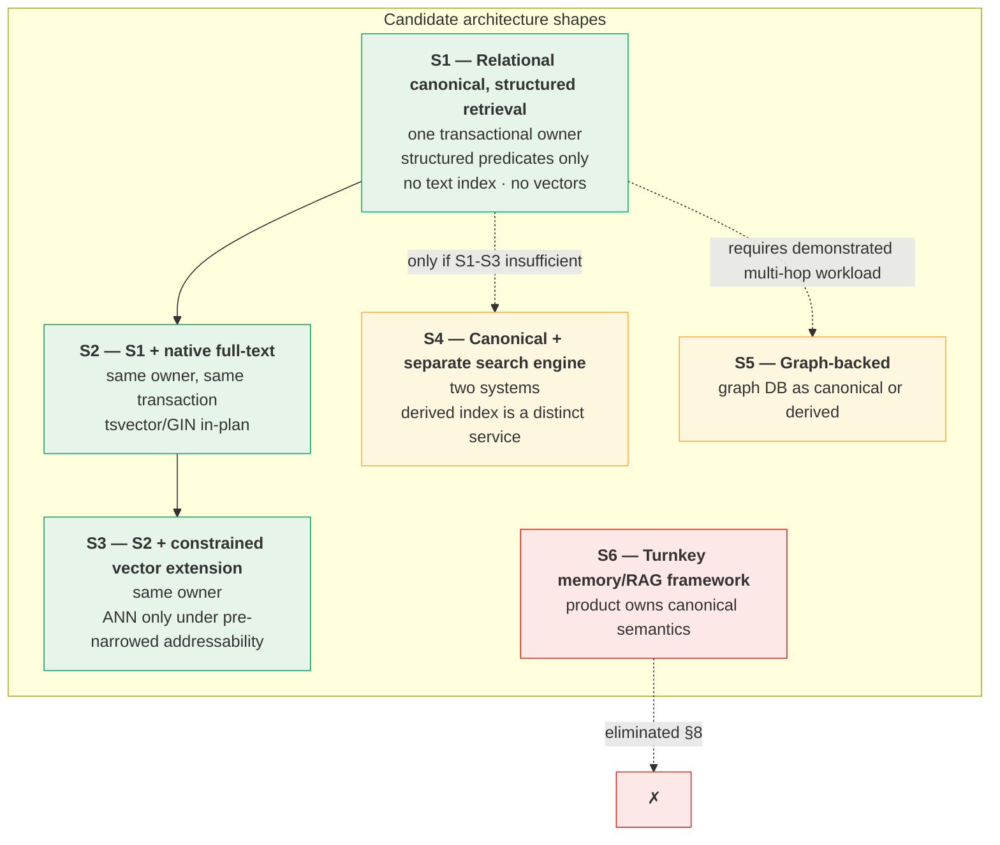
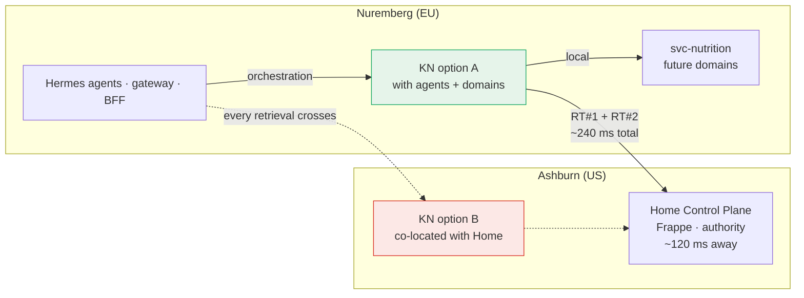
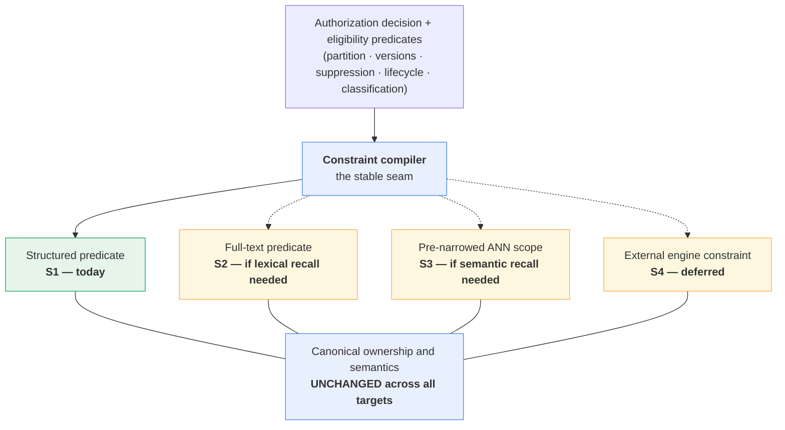

# Knowledge Technology Gate — Phase 1: candidate investigation and benchmark design

Status: **PROPOSED — IN INVESTIGATION / PHASE 1**

Technology selection: **NOT MADE**

Runtime implementation: **NOT AUTHORIZED**

Benchmark: **DESIGNED, NOT IMPLEMENTED**

Date: 2026-09-22

Repository: `EKvargas/episteck_home`

Main baseline: `26152713a404379a4ba6e0ac22a50edbd70eeed1`, verified current `origin/main` after [PR #29](https://github.com/EKvargas/episteck_home/pull/29) merged and made accepted B6 authoritative on `main`. This equals the commit named in the investigation request; `main` has not moved.

Branch: `docs/knowledge-technology-gate-phase1`

Gate: [Knowledge Technology Gate](KNOWLEDGE_TECHNOLOGY_GATE.md)

Author disposition: **PROPOSAL — awaiting Product Architect decisions TG-PA-1 … TG-PA-7 (§18)**

This document is a Phase-1 investigation, not an accepted decision. It proposes candidate eliminations, a shortlist, an R13 mechanism-family recommendation, a topology recommendation and a benchmark design. **It selects no technology**, changes no contract, schema, service, runtime, index, deployment or production system, and authorizes no implementation. B1–B6 remain **RESOLVED and unamended**; no finding in this investigation demonstrated a contradiction requiring any of them to reopen. All named people and household statements are synthetic.

---

## 1. Executive summary

B6's acceptance authorized this Gate to begin. The Gate's question is not "which memory product is best" but a narrower one:

> **What is the smallest technology architecture that can satisfy accepted B1–B6 for Olin's actual first Knowledge vertical, while leaving a sensible evolution path?**

The investigation reaches four conclusions, three of which can be made from architecture alone and one of which cannot.

**First, most of the candidate field is eliminated architecturally, before any benchmark.** Mem0, Graphiti and RAGFlow each fail at least one hard B1–B6 requirement in a way that configuration cannot repair — not because they are immature, but because they are built around a different ownership model. The decisive failures are documented in §8 with primary-source evidence: Mem0's history store retains superseded memory text and its `user_id` is an application-supplied partition key rather than a trusted binding (B4 §10, B1 §4.2); Graphiti mandates a graph database plus an LLM in the ingestion path and offers no trusted partition or authorization model (B1 §4, B3 §6); RAGFlow requires ≥16 GB RAM across five services and is an integrated platform whose canonical store would become the Knowledge owner (B5 §6.2 fixed point 3).

**Second, vectors are not needed for the first vertical, and adopting them early would actively cost correctness.** The accepted first use case is a PERSON-scoped reusable food preference over a small personal corpus. pgvector's own documentation states that with approximate indexes "filtering is applied *after* the index is scanned" — which is structurally the retrieve-then-filter pattern B1 §10 forbids, unless the addressable scope is narrowed *before* the ANN scan by partial indexes or partitioning. That is a real and available answer, but it is a constraint on *how* pgvector may be used, not a free capability, and it is unnecessary for the first vertical. **Exact search over an authorization-constrained candidate set has no such problem**, because the constraint is an ordinary predicate in the same plan.

**Third, the canonical store and the retrieval materialization should be separated conceptually and unified physically — for now.** B2 §10.2 and B6 §15.2 make every materialized representation a protected derivative that must prove its own currency. The cheapest way to satisfy that is to have no separate materialization at all initially: one transactional owner, with retrieval expressed as constrained queries over canonical state. This is Option B (authoritative store + *optional* derived materialization) with the optional part deliberately empty at first.

**Fourth, the one thing that genuinely cannot be decided from architecture is R13**, and it gates the performance budget rather than security. §11 compares three mechanism families for downstream pre-authorized execution and recommends benchmarking the **channel-bound / holder-of-key family** — the one whose non-bearer property is structural rather than promised. If no compliant mechanism survives measurement, B6 §18A.3a already prescribes the answer: the budget becomes 2 + N crossings and the target is revised upward, **not** the requirement dropped.

The proposed shortlist is therefore three *architecture shapes*, not three products:

| | Shape | Canonical store | Retrieval |
|---|---|---|---|
| **S1** | Relational canonical owner, structured retrieval only | PostgreSQL | Structured predicates; no text or vector index |
| **S2** | S1 plus native full-text | PostgreSQL | Adds `tsvector`/GIN in the same transactional boundary |
| **S3** | S1/S2 plus a constrained vector extension | PostgreSQL + pgvector | Adds ANN **only** under pre-narrowed addressability |

These are deliberately nested: S2 is S1 plus one in-database capability, S3 is S2 plus one extension. **The shortlist is a staging plan disguised as a comparison** — which is the honest shape of the answer, because the corpus that would justify S2 or S3 does not exist yet and cannot be simulated into existence by preference.

The recommended next empirical task is an **isolated, synthetic, disposable spike** (§16) that measures what architecture cannot settle: raw domain access latency (R14), whether a compliant R13 mechanism preserves two crossings, whether crossings stay flat as domains are added, and — critically — whether the B6 security properties actually hold under a real backend rather than on paper. **The spike is designed here and explicitly not implemented.**

### 1.1 What this phase does not do

It does not select a technology, rank products for their own sake, design schema, authorize a migration, change deployment, implement a benchmark, or reopen B1–B6. It does not design the Enterprise profile (B6 §21 is an observation, not a mandate). It does not resolve the Process register (gate §"Process register"), which remains OPEN independently.

---

## 2. Repository state recovered

### 2.1 Verification performed

`git fetch origin --prune` was run; `origin/main` was verified at `26152713a404379a4ba6e0ac22a50edbd70eeed1`, **equal to the commit named in the investigation request**. `main` has not moved beyond the expected SHA, so no reconciliation was required. The pre-existing checkout carried untracked `apps/home-hub/` and `docs/ref/`; both were preserved and are not part of this change. The working branch was created directly from `origin/main` with clean tracked status.

Read in full: accepted [B1](KNOWLEDGE_B1_SECURITY_SCOPE.md), [B2](KNOWLEDGE_B2_SENSITIVITY_INHERITANCE.md), [B3](KNOWLEDGE_B3_LIFECYCLE.md), [B4](KNOWLEDGE_B4_FORGET_DELETE.md), [B5](KNOWLEDGE_B5_OWNERSHIP_BOUNDARIES.md), [B6](KNOWLEDGE_B6_TRUSTED_RETRIEVAL.md); the [gate register](KNOWLEDGE_TECHNOLOGY_GATE.md); [ARCHITECTURE](../ARCHITECTURE.md), [KNOWLEDGE](../KNOWLEDGE.md), [DATA_OWNERSHIP](../DATA_OWNERSHIP.md), [SECURITY_AND_CONSENT](../SECURITY_AND_CONSENT.md), [DEPLOYMENT](../DEPLOYMENT.md), [STATUS](../STATUS.md), [ROADMAP](../ROADMAP.md), [G1_5_VALIDATION](../G1_5_VALIDATION.md), [G1_6_VALIDATION](../G1_6_VALIDATION.md); the [independent review](../reviews/2026-09-19-knowledge-independent-architecture-review.md); and ADRs 0001–0009. Implementation was inspected directly.

### 2.2 Accepted state verified, not assumed

| Blocker | Verified status | Evidence |
|---|---|---|
| B1 — security partition / scope / subjects | **RESOLVED** 2026-09-19 | `KNOWLEDGE_B1_SECURITY_SCOPE.md` §13 disposition |
| B2 — sensitivity inheritance | **RESOLVED** 2026-09-20 | `KNOWLEDGE_B2_SENSITIVITY_INHERITANCE.md` §14 |
| B3 — confirmation and lifecycle | **RESOLVED** 2026-09-21 | `KNOWLEDGE_B3_LIFECYCLE.md` §14 |
| B4 — dependency / forget / delete | **RESOLVED** 2026-09-21 | `KNOWLEDGE_B4_FORGET_DELETE.md` §16 |
| B5 — ownership boundaries | **RESOLVED** 2026-09-21 | `KNOWLEDGE_B5_OWNERSHIP_BOUNDARIES.md` §18 |
| B6 — trusted retrieval / ContextBundle | **RESOLVED** 2026-09-22 | `KNOWLEDGE_B6_TRUSTED_RETRIEVAL.md` §23 |
| Knowledge Technology Gate | **OPEN — authorized to begin** | Gate register §"Gate completion and change boundary" |
| Knowledge runtime | **NOT IMPLEMENTED** | §2.3 E5 below |
| Retrieval technology | **NOT SELECTED** | Gate register §"Technology candidates — not approved" |

### 2.3 Implementation evidence independently re-derived

These were inspected in code at the baseline rather than inherited from B6's findings table. Each was confirmed.

| # | Verified fact | Evidence | Consequence for the Gate |
|---|---|---|---|
| **E1** | `check_access_many` enforces `MAX_REQUIREMENTS = 8` for exactly **one** `subject_person_id`, resolves the actor server-side, caches nothing, and refuses the whole call on any malformed entry. | [`api.py` L102, L110–192](../../../apps/episteck_home/episteck_home/api.py) | The multi-resource protocol (B6 §8) is genuinely absent. Every shortlist shape inherits the obligation to *replace* this interface shape, and the spike must stub it rather than pretend it exists. |
| **E2** | Delegations are **single-use**, claimed atomically via one Redis `SET NX EX`, **audience-bound**, `MAX_LIFETIME_SECONDS = 300`, 30 s skew tolerance; store unavailability **raises** rather than returning, so an outage denies. | [`replay.py` L79–105](../../../apps/episteck_home/episteck_home/identity/replay.py), [`delegation.py` L46–181](../../../apps/episteck_home/episteck_home/identity/delegation.py) | Directly relevant to R13. The existing delegation already demonstrates audience binding, bounded lifetime, single-use claiming and fail-closed verification — **but its verification is possession-based**, which is precisely what B6 §18A.3a forbids for downstream execution. §11 builds on this. |
| **E3** | The gateway mints **exactly one** delegation per HTTP POST via nginx `auth_request` to a UDS-only mint app, strips inbound forged `X-Episteck-Delegation`, `X-Actor-ID` and `X-Runtime-ID`, hides the header from responses, and sets `proxy_next_upstream off`. | [`nginx-mcp-gateway.conf` L27–85](../../../deploy/gateway/nginx-mcp-gateway.conf) | The one-delegation-per-POST budget is structural. A candidate whose retrieval needs N authorization decisions per tool call is unimplementable, not merely slow. |
| **E4** | `ContextBundle` carries **no partition, no version, no lifecycle check, no retrieval timestamp, no decision binding, no revalidation member**; it never authorizes the Circle despite holding `circle_ids`; `MANAGE` satisfies `VIEW` via `allows()`; `KnowledgeClaim.domain` is a **single string**. | [`context.py` L92–139](../../../packages/home-contracts/src/episteck_home_contracts/context.py), [`knowledge.py` L98–145](../../../packages/home-contracts/src/episteck_home_contracts/knowledge.py) | Re-confirmed by direct reading. **The protected security-metadata planning phase B6 §9.2 requires cannot be expressed by today's contracts at all** — this is the sharpest technology constraint (R2) and is measured by spike scenario P6/P9. |
| **E5** | **No Knowledge runtime, retrieval, index, chunk, embedding or search symbol exists** for Knowledge anywhere in `apps/`, `packages/` or `services/`. `ContextBundle` is never constructed outside tests. The `search_food` hits are an external USDA/Open Food Facts provider interface. | Repository-wide search; [`food_provider.py`](../../../services/nutrition/app/providers/food_provider.py) | Greenfield. **No existing behaviour constrains the choice, and none should be promoted to a requirement merely because it exists.** |
| **E6** | Nutrition's canonical store is **SQLite**, one JSON `doc` blob per `person_id`, upserted wholesale, with **no delete path** in the repository interface. Its read is a single indexed local `SELECT`. | [`sqlite_repo.py` L21–45](../../../services/nutrition/app/store/sqlite_repo.py), [`repository.py`](../../../services/nutrition/app/store/repository.py) | Two consequences: B4 Scenario A's suppression propagation remains unsatisfiable without an executor, **and** the one available "domain read" latency figure is over a local SQLite query — so it must not be generalized to future domains (R14). |
| **E7** | Measured latencies are exactly as B6 §18A.1 records: Home `check_access` **111.57 ms median / 119.88 ms p95** (persistent client); new-TLS-per-request ping **307.48 / 311.56 ms**; post-G1.6 gateway→Home `whoami` **130.79 / 133.94 ms**; gateway→Nutrition profile **131.23 / 139.06 ms**. G1.6 §7 records delegation verification as "well under a millisecond against a ~120 ms network-bound baseline". | [G1_5_VALIDATION §6](../G1_5_VALIDATION.md), [G1_6_VALIDATION §7 and closeout](../G1_6_VALIDATION.md) | Confirms F15/F16/F17. **The dominant cost is geography, not security logic.** Connection reuse is worth ~195 ms per call and any new component inherits that obligation. |
| **E8** | Topology: Home Control Plane is **Ashburn (US)**; domain services, both Hermes agents, the BFF and the gateway are **Nuremberg (EU)**; Tailscale between; **"No cross-region DB."** G1.7 is **withdrawn** and must not be re-created. | [DEPLOYMENT](../DEPLOYMENT.md) L3–25, [ROADMAP L41–50](../ROADMAP.md) | Placement analysis (§10) must work within this, and may not propose moving Home. |

### 2.4 Prior characterizations corrected

Two corrections from evidence, in the convention B4 §2.2 and B5 §2.2 established.

**First, the ROADMAP still pre-empts this Gate.** [ROADMAP L52–57](../ROADMAP.md) describes the Knowledge Technology Gate as "Decide + install the Knowledge stack (candidates: **Mem0 + Docling + Postgres/pgvector; Graphiti deferred; RAGFlow rejected**)". That sentence names a stack and a disposition before the Gate has run, and it predates B1–B6 entirely. It is also in tension with the gate register's own candidate table, which marks every entry `UNSELECTED`. This investigation reaches conclusions that partly agree with that line and partly do not — Mem0 is eliminated rather than adopted, and Docling is out of scope for the first vertical rather than part of the initial stack. **Recorded as a documentation follow-up (§19 D-8), not corrected in this PR**, because the Gate has not closed and correcting it now would substitute one pre-emption for another.

**Second, the independent review's technology ranking is historical input, not a baseline.** The review's assessment that "plain relational persistence with bounded authorized retrieval is the leading baseline" is well-founded and this investigation independently reaches a compatible conclusion — but by a different route. The review predates B1–B6 and could not test candidates against, for example, B6 §15.2's materialization-binding requirement or B6 §9.2's protected-metadata-before-content ordering, neither of which existed when it was written. **Its conclusions are re-derived here rather than inherited**, and where this document agrees with it, that agreement is evidence of convergence rather than of citation.

---

## 3. B1–B6 hard requirements the technology must satisfy

These are the requirements against which candidates are tested in §8. Each is traceable to an accepted decision; none is invented here. **A candidate that fails any of these is eliminated regardless of convenience** (gate register §"Gate completion and change boundary").

| # | Hard requirement | Source | What it actually demands of a backend |
|---|---|---|---|
| **H1** | **Trusted partition on every object and derivative; no global fallback.** Partition must constrain every lookup and materialization. | B1 §4.1–4.3, §5.2; B5 §7.1 | The partition must be a persisted, immutable, *server-set* column participating in every index and every query predicate — not an application-supplied namespace string. Effective identity is conceptually `(partition, resource_type, local_id)`. |
| **H2** | **Complete protected security metadata resolvable before content.** Exact version, scope, complete subjects, required domains, source-derived restrictions, classification revision, lifecycle/control revision, suppression/derivation bindings — **without reading sensitive content**, and cheaply. | B6 §9.2; B1 §10 | Security metadata must be separable from payload in storage and queryable on its own. A store that requires loading the document to learn its requirements fails. This is R2, and E4 shows today's contracts cannot express it. |
| **H3** | **Authorization-constrained retrieval; unauthorized records structurally not addressable.** Applies equally to structured lookup, text search, semantic search, chunks, graph traversal, reranking, **counting** and caches. | B1 §10; B6 §9.1, invariant 1 | The decision must compile into the *addressable scope* of the operation. Post-filtering is non-compliant **in any form**, including score and count leakage (B2 §10.2). |
| **H4** | **Exact-version lifecycle.** Immutable assertion versions, assertion lines, lifecycle/control revisions, applicability windows, attestations, disputes, supersession, revocation, expiry, holds — **without pretending lifecycle means truth ranking**. | B3 §4, §5; B6 §10.3 | Needs real transactional versioning with CAS-equivalent preconditions on *multiple* revisions committed atomically (B3 §11.1–11.3). |
| **H5** | **Suppression before candidacy.** A suppressed record is immediately unservable even if payload, index, vector or cache still exists. **Correctness must not depend on cleanup completing.** | B4 §1, §8; B6 §10.1 | The register must be consultable inside the retrieval plan, not as a post-pass. A backend whose only suppression mechanism is deletion or reindex fails. |
| **H6** | **Materialization bindings.** Every derivative that may participate in retrieval must carry partition, exact source version, derivation family, classification revision, lifecycle/control revision and a suppression obligation — **checkable without a rebuild**. | B6 §15.2; B2 §10.3; B4 §7 | Each index/cache entry must be attributable and testable. This is R5 and it is the requirement most likely to disqualify a search product. |
| **H7** | **Restore freshness.** Restored Knowledge stays unusable until suppression/control currency is *positively proven* at least as current as the payload. **Unknown freshness fails closed.** | B4 C1, §12.1; B5 §11.3; B6 §16 | Needs control state whose currency can be established independently of the payload's own backup lineage. Constrains backup/restore design more than query design. |
| **H8** | **Final revalidation.** Home freshly re-evaluates current authority before disclosure — **a re-evaluation, not a TTL check** — plus suppression, lifecycle, classification and applicability. | B3 §11.8; B6 §11.1 | Requires the backend to re-prove per-version state cheaply at the barrier, once over the selected set. |
| **H9** | **No authorization per candidate.** | B6 §18A.5; B1 §10 | Structural: E2/E3 make it unimplementable anyway, but it is a security requirement first. |
| **H10** | **ContextBundle never persisted.** | B6 §12.4 | A backend that caches assembled context as a reusable artifact is non-compliant. |
| **H11** | **Performance shape.** Ordinary read ≤ 2 Home authorization **network** crossings; independent domain reads concurrent; source expansion lazy; security predicates composed within owner boundaries; revalidation once per disclosure boundary. Targets p50 ≤ 300 ms (aspiration), p95 ≤ 500 ms, p99 ≤ 800 ms, TTFT separate. | B6 §18A.4, §18A.6, §18A.7, §18A.2, §11.4, §18A.8 | Measured, not assumed. The ten disqualification criteria of B6 §18A.11 apply. |
| **H12** | **R13 — downstream execution authority.** A domain must verify an exact pre-approved operation without an avoidable extra crossing, and **possession of an execution artifact alone must never be sufficient**. | B6 §18A.3a | §11. Gates H11's budget, not H3's security. |
| **H13** | **R14 — raw domain latency measured.** | B6 §18A.3b | Spike-only. §12.3. |

### 3.1 The three requirements that actually discriminate

Most candidates pass or fail on H1, H3 and H6 — and those three are worth stating as one sentence each, because they are what eliminate products that look suitable.

- **H1 asks: can the isolation boundary be *trusted*?** An application-supplied `user_id`, `namespace` or `tenant_id` is a filter, not a partition. B1 §4.2 requires it to come from trusted runtime context and B1 scenario H requires a forged value to be inert. A product whose isolation is a parameter its caller supplies has not met H1 — it has relocated the problem to the caller.
- **H3 asks: is the unauthorized record *unaddressable*, or merely *removed from the output*?** This is the difference between a constraint and a filter, and it is invisible in a feature matrix. "Supports metadata filtering" is insufficient evidence; the question is *when in the plan* the filter applies relative to candidate generation.
- **H6 asks: can a stale derivative be *detected* without rebuilding it?** Many retrieval systems make invalidation an operational process (reindex, refresh, TTL). B4 §4's inversion forbids that: correctness may not depend on the cleanup path succeeding.

A candidate can have excellent documentation on all three topics and still fail all three, because the questions are about *ordering and provenance of trust*, not about capability.

---

## 4. Actual workload assumptions

The Gate must not optimize for scale that does not exist. These assumptions are derived from the accepted first vertical and the deployment evidence, and each is marked as derived or estimated. **Where an assumption is an estimate, the spike is designed to be insensitive to it** (§16.4).

### 4.1 Corpus and access shape

| Property | Assumption | Basis |
|---|---|---|
| Deployment | One household, one trusted partition | Gate register §"Proposed minimal first Knowledge use case"; B1 §5.1 single-deployment binding |
| Persons | ~2–6 | Personal/family deployment ([ROADMAP L41–50](../ROADMAP.md)) |
| Circles | ~1–3, overlapping | B1 §3 |
| First vertical | **PERSON-scoped reusable food preferences** — explicit, user-asserted, single-domain (NUTRITION + KNOWLEDGE governance) | Gate register; B1 scenario A |
| Explicitly excluded | allergy, diagnosis, pregnancy restriction, medical contraindication, Finance, autonomous extraction from all conversations | Gate register, verbatim |
| Assertion versions at launch | **tens** | Derived: one preference per explicit save; excluded classes remove the bulk sources |
| Assertion versions at maturity | **hundreds to low thousands** | Estimated: a family accumulating preferences, routines, goals and decisions over years |
| Sources / Episodes | Conversational captures initially; documents deferred | Gate register excludes document ingestion from the first vertical |
| Read:write ratio | **Heavily read-dominated** | Ask Olin is conversational; writes are explicit save events |
| Concurrency | **Very low.** Effectively one interactive user at a time, plus background jobs | Personal deployment; no multi-user load evidence exists |
| Query shape | "What does this Person prefer / dislike / usually do?" — **subject-scoped, domain-scoped, small result sets** | B6 §18A.3 hot-path modelling |

### 4.2 What these assumptions rule in and out

The decisive number is the corpus size, and it deserves to be stated bluntly: **a few hundred short text assertions, scoped to one Person, is a workload that an unindexed sequential scan answers in under a millisecond.** At that scale:

- **Semantic retrieval solves a problem the workload does not have.** Vector search earns its cost when the corpus is too large for exhaustive comparison or when the query vocabulary diverges from the stored vocabulary. Neither holds for "does Erick dislike canned tuna" over sixty preference assertions that Erick himself wrote.
- **Ranking is nearly irrelevant.** B6 §10.3 is explicit that "lifecycle is not truth ranking" and that two eligible assertions may disagree without a contest. With small authorized result sets, the correct behaviour is usually to return them all with attribution, not to score them.
- **The bottleneck is fixed cost, not marginal cost.** Two Home crossings are ~240 ms (E7). Local retrieval over this corpus is a low-single-digit number of milliseconds. **The corpus would have to grow by three to four orders of magnitude before local retrieval time rivalled one network crossing.** This is the single most important workload fact in the document, and it is what makes early vector adoption a poor trade.

### 4.3 The honest counter-argument

The case *for* provisioning retrieval capability early is that a governance model retrofitted onto an existing index is harder than one designed in. That argument is real, and it is why §7 separates the canonical store from the retrieval layer *conceptually* even while recommending they be the same thing *physically* at first. The mitigation is design discipline, not premature installation: **B6's protocol is explicitly backend-neutral (PA-9), so the constraint-compilation seam can exist from day one with only a structured-predicate compiler behind it.** Adding a second compiler target later is an extension, not a rewrite. §13 states the migration path.

What would genuinely change this assessment is a *different vertical* — document ingestion, or open-ended "what did I say about X last year" recall over conversational history. Those are excluded from the first vertical, and if they are re-introduced the workload assumptions must be re-derived rather than stretched.

---

## 5. Canonical store versus retrieval materialization

B5 fixed that one transactional owner holds assertion versions, lines, lifecycle/control revision, attestations, replacement relations, lineage, Episodes, source custody metadata, the suppression register and the restore-freshness authority (B5 §6.1). It did **not** decide whether retrieval runs over that same store.

### 5.1 The two options, stated precisely

**Option A — one technology serves both canonical persistence and retrieval.** Queries execute against canonical state. There is no second copy of anything.

**Option B — authoritative transactional store plus an optional derived retrieval materialization.** Canonical state lives in one owner; a separate structure (index, vector store, search engine) is maintained for retrieval and is explicitly never authority.

### 5.2 Assessment

| Dimension | A: unified | B: canonical + derived materialization |
|---|---|---|
| **H6 materialization bindings** | **Trivially satisfied** — there is no derivative to bind. The requirement is vacuous rather than met, which is the strongest possible form of satisfying it | Each entry must carry six bindings and prove them without a rebuild (B6 §15.2). Achievable, but it is real, ongoing, easy-to-regress work |
| **H5 suppression before candidacy** | One register, consulted in the same plan as the query. No propagation window exists | The register must reach the materialization *before* it can serve. B4 §4 forbids correctness depending on that propagation succeeding, so the materialization needs its own fail-closed binding check |
| **H3 unaddressability** | The authorization constraint and the content predicate are in one query plan — the constraint cannot be bypassed by a bug in a separate component | The materialization is a second place where addressability must be enforced, and it is the place most likely to be optimized later by someone who does not know why the constraint is there |
| **B2/B4 derivative invalidation** | No stale derivative can exist | Every reclassification (B2 §10.3) must make entries **immediately** ineligible, before any reindex. This is the hardest ongoing obligation |
| **Retrieval capability** | Bounded by what the canonical store can express | Can add semantic, hybrid or specialized retrieval |
| **Operational burden** | One store, one backup, one restore path, one freshness authority | A second service or structure to run, back up, monitor, restore and reconcile — and H7's restore-freshness proof now has two things to reason about |
| **Failure modes** | Store down → Knowledge unavailable (fails closed, correctly) | Materialization stale, partially rebuilt, or ahead/behind canonical → **the failure mode B4 exists to prevent**, unless bindings are perfect |
| **Fit to §4 workload** | **Sufficient by a wide margin** | Solves a problem the first vertical does not have |

### 5.3 Recommendation

**Recommend Option B's *framing* with Option A's *initial realization*: one transactional owner, no separate retrieval materialization at first, and a compile-to-constraints seam that permits one to be added later without changing canonical ownership or semantics.**

This is not a fence-sit. It is the observation that A and B differ only in whether a derived structure exists *today*, and that B's discipline — the derived index is never authority, and suppression/lifecycle/classification must make stale entries unservable immediately, before asynchronous physical cleanup — is the part worth committing to now. Committing to the discipline costs nothing while the derived structure is empty, and it is what makes adding one later safe.

**Starting without any separate retrieval materialization is preferable** for the first vertical, on three grounds: H6 becomes vacuous rather than merely satisfied; B2 §10.3's immediate-reclassification requirement has nothing to race against; and §4.2 shows the retrieval capability being foregone is one the workload does not need.

The condition that must be preserved, and which §13 makes concrete: **if a derived materialization is ever added, it inherits H6 in full and is never authority.** B5 §13.2's seven projection conditions already state the testable form of this for domain projections, and the same list applies.

---

## 6. Candidate architecture shapes

Candidates are evaluated as *architecture shapes*, not products, because the question is what the system must be able to do, not whose logo is on it. Products appear as realizations of shapes.



| Shape | Canonical owner | Retrieval mechanism | Separate materialization | Realization considered |
|---|---|---|---|---|
| **S1** | Relational DB | Structured predicates over canonical state | **None** | PostgreSQL; SQLite considered and assessed in §8.3 |
| **S2** | Relational DB | S1 + native full-text in the same plan | **None** (index is in-transaction, not a separate system) | PostgreSQL `tsvector` + GIN |
| **S3** | Relational DB | S2 + ANN under pre-narrowed addressability | **None** (extension in the same transaction) | PostgreSQL + pgvector |
| **S4** | Relational DB | Dedicated external search/vector service | **Yes** | Elasticsearch/OpenSearch, Qdrant, Weaviate, Typesense as a class |
| **S5** | Graph DB, canonical or derived | Graph traversal + temporal edges | Depends | Neo4j / FalkorDB directly; Graphiti as a framework over one |
| **S6** | The product's own store | The product's own pipeline | Inherent | Mem0, RAGFlow |

**On S2's classification.** A GIN index on a `tsvector` column is a derived structure in the literal sense, but it is not a *separate retrieval materialization* in B5/B6's sense: it lives inside the same transaction, is updated synchronously with the row, cannot be ahead of or behind canonical state, and cannot be served without the row. H6's "checkable without a rebuild" is satisfied because there is nothing to check — index and row commit together. This distinction matters, and §8.2 tests it rather than assuming it.

---

## 7. Candidate research — primary sources

All external research was performed during this investigation against upstream documentation and source. **Internet research was available.** Findings are dated 2026-09-22 and are upstream capabilities and defaults, **not verified properties of any pinned Episteck deployment** — no candidate is installed, and none may be installed by this proposal. Where a finding is decisive, it is quoted.

### 7.1 PostgreSQL

| Property | Finding | Source |
|---|---|---|
| License | PostgreSQL License (BSD-style), permissive | [pgvector LICENSE mirrors the PostgreSQL license](https://raw.githubusercontent.com/pgvector/pgvector/master/LICENSE) |
| Full-text search | **Built into core**, no extension. `tsvector`/`tsquery`/`@@`, GIN and GiST index support, per-language configurations | [PostgreSQL textsearch intro](https://www.postgresql.org/docs/17/textsearch-intro.html) |
| Transactional model | MVCC; readers and writers do not block each other; genuine concurrent writers; row-level locking | [PostgreSQL docs](https://www.postgresql.org/docs/17/) |
| CAS-equivalent | Available via `WHERE version = ?` guarded `UPDATE`, `SELECT … FOR UPDATE`, or advisory locks | Standard SQL semantics |
| Row-Level Security | Available, **but**: "Superusers and roles with the `BYPASSRLS` attribute always bypass the row security system… Table owners normally bypass row security as well" unless `FORCE ROW LEVEL SECURITY` is set | [PostgreSQL RLS](https://www.postgresql.org/docs/17/ddl-rowsecurity.html) |
| RLS caveats | "The only exceptions to row-security checking are `leakproof` functions… the optimizer may choose to apply such functions ahead of the row-security check." Also: "Referential integrity checks… always bypass row security… Care must be taken… to avoid 'covert channel' leaks" | [PostgreSQL RLS](https://www.postgresql.org/docs/17/ddl-rowsecurity.html) |
| Deletion | `DELETE` does not immediately reclaim storage; old row versions persist until vacuumed | [Routine vacuuming](https://www.postgresql.org/docs/current/routine-vacuuming.html) |

**Assessment against the hard requirements.** PostgreSQL satisfies H1 (partition as an ordinary indexed column, set server-side), H3 (the constraint is a predicate in the same plan — structurally, not by policy), H4 (real transactional versioning with atomic multi-row CAS), H5 (register consulted in-plan; a suppressed row is unaddressable by predicate regardless of whether its payload was deleted) and H8.

**Two caveats deserve to be stated rather than glossed.**

*RLS is defence in depth, not the enforcement mechanism.* The bypass rules mean RLS protects against a compromised application role, not against the owner role that ordinary migrations use. B1 §11 requires Home to be the authority and the repository to enforce its constraints; RLS may usefully add a second layer, but **the Gate must not treat "we have RLS" as satisfying H3.** The primary enforcement is the compiled constraint. This is exactly the point the independent review raised about runtime privilege design, and it survives re-derivation.

*The "covert channel" and `leakproof` caveats are directly relevant to B2 §10.2's anti-oracle requirement.* Unique constraints and foreign keys bypass row security by design, so a uniqueness violation can reveal the existence of a row the caller cannot see. For Knowledge this matters at admission (B3 §11.6 capture-duplicate binding) and for idempotency keys. **It is a schema-design obligation, not a disqualifier**, and the spike's P6 scenario should observe whether denial paths leak through error shape as well as timing.

*Deletion does not immediately erase.* This is not a problem for B4 — B4 §1's whole inversion is that suppression, not deletion, is what makes information stop being used, and B4 §14 already distinguishes `ERASURE PENDING` from `ERASED`. It **is** a requirement on how erasure completion is evidenced, and it means "we ran DELETE" is not a cleanup receipt.

### 7.2 pgvector

| Property | Finding | Source |
|---|---|---|
| License | BSD-style (PostgreSQL License), copyright PostgreSQL Global Development Group / Regents of the University of California | [LICENSE](https://raw.githubusercontent.com/pgvector/pgvector/master/LICENSE) |
| Current version | 0.8.6 | [pgvector README](https://github.com/pgvector/pgvector) |
| **Filtering order** | **"With approximate indexes, filtering is applied *after* the index is scanned."** With HNSW default `hnsw.ef_search` of 40 and a condition matching 10% of rows, "only 4 rows will match on average" | [pgvector README — Filtering](https://github.com/pgvector/pgvector/blob/master/README.md) |
| Iterative scans | Added in **0.8.0**; `hnsw.iterative_scan` / `ivfflat.iterative_scan` with `strict_order` and `relaxed_order` modes; scan limited by `hnsw.max_scan_tuples` (default 20,000) | [pgvector README](https://github.com/pgvector/pgvector/blob/master/README.md), [0.8.0 release](https://www.postgresql.org/about/news/pgvector-080-released-2952) |
| **Pre-narrowing options** | "If filtering by only a few distinct values, consider **partial indexing**" — `CREATE INDEX … WHERE (category_id = 123)`. "If filtering by many different values, consider **partitioning**" — `PARTITION BY LIST(category_id)` | [pgvector README — Filtering](https://github.com/pgvector/pgvector/blob/master/README.md) |
| Vacuum | "Vacuuming can take a while for HNSW indexes. Speed it up by reindexing first" | [pgvector README](https://github.com/pgvector/pgvector/blob/master/README.md) |

**This is the single most consequential external finding in the investigation, and it cuts both ways.**

*Against naive use:* an ANN index scan that generates candidates and *then* applies the authorization predicate is **structurally the pattern B1 §10 forbids** — "global search → retrieve unauthorized candidates/text → application-filter". The fact that the filter happens inside PostgreSQL rather than in application code does not change the ordering. Worse, it leaks in exactly the way B2 §10.2 names: with post-scan filtering, *which* authorized rows survive depends on how many unauthorized rows were in the top-`ef_search` — so an unauthorized record influences the authorized result set even though its text is never returned. Iterative scans make this *less visible* by scanning further, not less true.

*In favour of disciplined use:* **partial indexing and `PARTITION BY LIST` are pre-narrowing mechanisms.** A separate HNSW index per partition — or per `(partition, subject)` where the cardinality allows — means the ANN scan only ever addresses rows the constraint already permits. The unauthorized record is not filtered out after scanning; it is in a different index that the plan does not touch. **That satisfies H3 properly**, and it is a documented, supported pattern rather than a workaround.

The conclusion is not "pgvector fails H3". It is: **pgvector satisfies H3 only under a specific index topology, and the burden is on the implementation to prove that topology holds for every query shape.** That is a benchmarkable claim, and spike scenario P6 is designed to test it directly rather than accept it. A candidate that requires a particular index layout to be secure is acceptable; one whose security depends on nobody later adding a convenient global index is a standing risk, recorded as **RK-3** (§20).

### 7.3 Mem0

| Property | Finding | Source |
|---|---|---|
| License | Apache 2.0 | [Mem0 repository](https://github.com/mem0ai/mem0) |
| Deployment | Library mode, self-hosted server, and a managed Cloud Platform | [Mem0 repository](https://github.com/mem0ai/mem0) |
| **OSS/managed split** | The April 2026 algorithm is available in the managed platform with "proprietary optimizations not available in the open-source SDK" | [Mem0 repository](https://github.com/mem0ai/mem0) |
| **Deletion semantics** | Deletion removes the vector-store point but writes a DELETE **event** to an append-only history database; prior `old_memory`/`new_memory` text from earlier ADD/UPDATE events **remains readable** via `history(memory_id=…)` | [Mem0 delete operation docs](https://docs.mem0.ai/core-concepts/memory-operations/delete); corroborated by [issue #7316](https://github.com/mem0ai/mem0/issues/7316) |
| Store reconciliation | The history table and payload hash "are never reconciled with the vector store, so out of band edits to memories are invisible" | [Issue #7316](https://github.com/mem0ai/mem0/issues/7316) |
| Isolation | `user_id` / `agent_id` / `run_id` filters; `delete_all` now requires at least one filter | [Mem0 repository](https://github.com/mem0ai/mem0) |
| Newer algorithm | Redesigned to "preserve memory history rather than overwrite it", single-pass ADD-only extraction, so memories accumulate | Search-surfaced upstream description; **secondary evidence, flagged as such** |

**Assessment.** Mem0 fails multiple hard requirements, and the failures are architectural rather than configurational:

- **H1 fails.** `user_id` is an application-supplied identifier. B1 §4.2 requires the partition to come from trusted runtime context and B1 scenario H requires a forged value to be inert. A library whose isolation key is a function argument has moved the trust boundary into the caller, which is precisely the confused-deputy shape G1.6 was built to eliminate.
- **H5/H4 fail.** There is no suppression register, no exact-version lifecycle, no assertion line, no attestation and no dispute model. B3's entire lifecycle facet model is unrepresentable.
- **B4 §10 is violated directly.** B4 lists among things that **must not be retained**: "claim statement text" and "free-text reasons that restate the content". Mem0's history retaining `old_memory` text after deletion is the exact failure B4 §10.1 forbids, and the newer accumulate-rather-than-overwrite behaviour makes it worse, not better.
- **H6 fails.** No binding exists between a stored memory and a classification or lifecycle revision.

**Disposition: ELIMINATED as a canonical owner.** The gate register's existing hypothesis — "may later be evaluated as a proposal/extraction helper, never the canonical authority" — survives this investigation intact and is *not* disturbed. A proposal-producing extraction helper is a different role with different requirements (its output is PROPOSED under B3 §5.1, never admitted), and evaluating it in that role later requires no Gate decision now. **This elimination is about canonical ownership only.**

### 7.4 Graphiti

| Property | Finding | Source |
|---|---|---|
| License | Apache 2.0 | [Graphiti repository](https://github.com/getzep/graphiti) |
| **Required backend** | **A graph database is mandatory.** Neo4j 5.26+, FalkorDB 1.1.2+, Amazon Neptune, or Kuzu 0.11.2 (deprecated, upstream unmaintained) | [Graphiti repository](https://github.com/getzep/graphiti) |
| **LLM requirement** | **Mandatory in the ingestion pipeline.** "Graphiti works best with LLM services that support Structured Output" | [Graphiti repository](https://github.com/getzep/graphiti) |
| Temporal model | Bi-temporal. "Facts have validity windows. When information changes, old facts are invalidated — not deleted" | [Graphiti repository](https://github.com/getzep/graphiti) |
| Multi-tenancy | **No explicit multi-tenancy, `group_id` isolation or authorization model** stated in upstream documentation | [Graphiti repository](https://github.com/getzep/graphiti) |
| Operational | Python 3.10+, LLM credentials, external graph DB instance, `SEMAPHORE_LIMIT` concurrency control, optional full-text backend | [Graphiti repository](https://github.com/getzep/graphiti) |

**Assessment.** Graphiti's bi-temporal model is genuinely close to B3's applicability windows and supersession — the closest of any candidate. That similarity is why it deserves a careful rejection rather than a dismissive one.

It fails on three independent grounds:

- **H1 fails.** No trusted partition model. Isolation would have to be rebuilt above it.
- **B3 §6 / D2 fails structurally.** A mandatory LLM in the ingestion path means the model participates in what becomes durable state. B3's D2 clarification is explicit: "An LLM cannot decide that material is 'low risk' and thereby approve a new class", and B2 §10.1 states AI "cannot… rewrite requirements… [or] declare independent human evidence". Graphiti's automatic temporal invalidation is a model deciding that one fact supersedes another — which is exactly the authority B3 §8 reserves for an explicit, authorized replacement command. **Its strongest feature is the one Olin must not use.**
- **H6/H5 fail.** No suppression register; no classification-revision binding on derived edges.

The independent review's position — "require a concrete multi-hop query workload before considering its operational cost" — is re-derived and confirmed. §4 shows no such workload exists.

**Disposition: ELIMINATED for the first vertical.** Recorded as revisitable only against a demonstrated multi-hop workload *and* a separate resolution of the LLM-in-ingestion conflict, which is an architecture question rather than a technology one.

### 7.5 RAGFlow

| Property | Finding | Source |
|---|---|---|
| License | Apache 2.0 | [RAGFlow repository](https://github.com/infiniflow/ragflow) |
| **Minimum hardware** | **CPU ≥ 4 cores, RAM ≥ 16 GB, Disk ≥ 50 GB** | [RAGFlow repository](https://github.com/infiniflow/ragflow) |
| Services deployed | Elasticsearch (or Infinity) + **MySQL** + Redis + MinIO, plus optional gVisor sandbox | [RAGFlow repository](https://github.com/infiniflow/ragflow) |
| LLM requirement | External LLM service required | [RAGFlow repository](https://github.com/infiniflow/ragflow) |
| Multi-tenancy / permissions | **Not explicitly documented** | [RAGFlow repository](https://github.com/infiniflow/ragflow) |

**Assessment.** RAGFlow is an integrated document-RAG platform. Adopting it would place canonical Knowledge semantics inside a product whose own MySQL store would become the authority — directly contradicting **B5 §6.2 fixed point 1** (Knowledge is a distinct logical bounded context) and **fixed point 3** (an external product's schema cannot implicitly become the Knowledge security, lifecycle or transactional model). Its five-service footprint and ≥16 GB requirement are disproportionate to §4's workload, and H1/H5/H6 are unaddressed.

**Disposition: ELIMINATED.** ADR-0007 already rejected adopting a turnkey RAG stack, and nothing in current upstream documentation disturbs that. The elimination is on ownership grounds first and resource grounds second — **the resource argument alone would not be sufficient**, since hardware can be bought, whereas the ownership conflict cannot be configured away.

### 7.6 Dedicated search / vector services as a class (S4)

Rather than evaluate each product, the class is assessed against the hard requirements, because they share the decisive properties. Individual product evaluation is deferred unless TG-PA-2 keeps S4 on the shortlist.

| Requirement | Class assessment |
|---|---|
| **H1** | Usually a namespace/collection/tenant field supplied by the client — **H1's trusted-binding problem again**, though it can be mitigated if the only writer is the trusted Knowledge owner |
| **H3** | Depends entirely on whether filters are applied pre- or post-candidate-generation. **This must be verified per product against primary documentation, not accepted from a feature list** (§3.1) |
| **H4** | External to the engine. The engine stores documents, not assertion lifecycles. Not a failure — it is simply not the engine's job |
| **H5** | **The hard one.** The engine is a separate system, so suppression must propagate to it, and B4 §4 forbids correctness depending on that propagation. Requires a binding check at serve time |
| **H6** | Requires six bindings per entry and a rebuild-free currency check (B6 §15.2). **Achievable but is exactly the requirement B6 R5 predicted would disqualify candidates** |
| **H7** | A second store in the restore path, each with its own currency question |
| Operational | A second service to run, back up, restore, monitor and upgrade on a constrained node |

**Disposition: RETAINED as a deferred shape, NOT shortlisted.** S4 is not eliminated on correctness — a correctly-bound external index can satisfy H3/H5/H6 — but it is **not justified by §4's workload**, and it makes the two hardest ongoing obligations (H5, H6) materially harder for a capability the first vertical does not need. It should be reconsidered only if measured retrieval requirements demonstrate S1–S3 insufficient.

### 7.7 Graph databases directly (S5)

Evaluated separately from Graphiti, since the framework's LLM-in-ingestion problem is not inherent to the database.

A graph database used directly (Neo4j, FalkorDB) avoids Graphiti's D2 conflict, and B4 §7's derivation families and B3 §4's replacement relations are genuinely graph-shaped. But B4 §7 answers this directly and deserves quoting: *"A full graph database is not required. Neither is a graph traversal engine. What is required is that every derivative know its parents and its family root at creation time — which is a discipline, not a technology."*

Relational foreign keys express bounded parent/family-root relations without a traversal engine. **The workload has no demonstrated multi-hop query** (§4), and B5 §6.1 requires assertion versions, lifecycle, lineage and suppression to share one *transactional* owner — a property mature relational systems provide more straightforwardly than graph stores.

**Disposition: ELIMINATED for the first vertical**, on the absence of a workload that needs it, not on incapability.

### 7.8 Co-locating with existing Olin persistence

Two existing stores were assessed as hosts, because reusing one would avoid a new component entirely.

**Frappe/MariaDB on Ashburn (the Home Control Plane).** **Prohibited by B5 §6.2 fixed point 3**, which forbids ordinary Home DocTypes and role-based CRUD from implicitly becoming the Knowledge security, lifecycle or transactional model — and cites the dormant `Nutrition Profile` DocType with blanket System Manager CRUD as the concrete anti-pattern. Co-location is permitted only if the logical boundary survives intact (fixed point 4), which DocType-based persistence does not provide. Separately, §10 shows the placement is wrong on latency grounds. **Not viable as proposed; a separately-bounded schema on that host is a different question, assessed in §10.**

**svc-nutrition's SQLite on Nuremberg.** Not viable as a host — E6 shows a single opaque JSON blob per person with no delete path, and B5 §9.3 forbids converting that legacy text into admitted assertions. But SQLite *as a technology* for a new, properly-designed Knowledge schema is a genuine S1 realization and is assessed in §8.3 rather than dismissed, because §4's concurrency assumptions are exactly the conditions under which SQLite is adequate.

### 7.9 Docling

Listed in the ROADMAP's pre-emptive stack and in the gate register. **Out of scope for this phase**: the first vertical excludes document ingestion, so a document parser has nothing to parse. The gate register's existing hypothesis — "relevant later for document ingestion; unnecessary for the initial conversational preference vertical" — is confirmed and left undisturbed. No disposition is proposed.

### 7.10 Research limitations

Stated explicitly so the Product Architect can weigh the evidence.

- Findings are upstream documentation and source as of **2026-09-22**, not properties of any pinned, deployed, version-verified installation. **Any later selection requires version-specific verification**, as the gate register already requires.
- The Mem0 "newer algorithm accumulates rather than overwrites" finding rests on search-surfaced upstream description rather than a direct source reading, and is flagged as secondary. **It is not load-bearing**: the deletion-history finding alone is decisive and is corroborated by an upstream issue.
- S4 products were assessed as a class. Per-product H3 verification was not performed and would be required before S4 could be shortlisted.
- No candidate was installed, benchmarked or configured. **No measurement in this document is a new measurement**; every latency figure is repository evidence (E7).

---

## 8. Hard disqualification matrix

Security correctness is **not** collapsed into a score. Each cell is `PASS`, `FAIL`, `UNKNOWN — BENCHMARK REQUIRED`, `N/A`, or `CONDITIONAL` where a requirement is satisfiable only under a stated constraint.

**A `FAIL` on any hard requirement eliminates the candidate regardless of convenience.**

### 8.1 Shapes against hard requirements

| Req | S1 Postgres structured | S2 + full-text | S3 + pgvector | S4 separate engine | S5 graph | S6 Mem0 | S6 RAGFlow | S5 Graphiti |
|---|---|---|---|---|---|---|---|---|
| **H1** partition | **PASS** | **PASS** | **PASS** | CONDITIONAL — client-supplied namespace unless sole trusted writer | PASS | **FAIL** — `user_id` is an application argument | **FAIL** — undocumented | **FAIL** — no model |
| **H2** metadata before content | **PASS** — separable columns | **PASS** | **PASS** | UNKNOWN — per product | PASS | **FAIL** — payload-coupled | **FAIL** | **FAIL** |
| **H3** unaddressability | **PASS** — predicate in-plan | **PASS** — same plan | **CONDITIONAL** — ANN filters *after* scan unless partial-indexed/partitioned | UNKNOWN — must verify pre/post ordering per product | PASS | **FAIL** — post-filter | **FAIL** | **FAIL** |
| **H4** exact-version lifecycle | **PASS** | **PASS** | **PASS** | N/A — external to engine | PASS | **FAIL** — no version model | **FAIL** | **FAIL** — LLM-driven invalidation (B3 D2) |
| **H5** suppression before candidacy | **PASS** — in-plan register | **PASS** | **PASS** — if register predicate precedes ANN | CONDITIONAL — needs serve-time binding check | PASS | **FAIL** — no register | **FAIL** | **FAIL** |
| **H6** materialization bindings | **PASS (vacuous)** — no derivative | **PASS** — index commits with row | **PASS** — same transaction | CONDITIONAL — six bindings + rebuild-free check | CONDITIONAL | **FAIL** — no bindings | **FAIL** | **FAIL** |
| **H7** restore freshness | UNKNOWN — mechanism unselected (B4 C1) | UNKNOWN | UNKNOWN | UNKNOWN — worse: two stores | UNKNOWN | **FAIL** — history resurrects text | UNKNOWN | UNKNOWN |
| **H8** final revalidation | **PASS** | **PASS** | **PASS** | UNKNOWN | PASS | **FAIL** | **FAIL** | **FAIL** |
| **H9** no auth per candidate | **PASS** — orchestration property | **PASS** | **PASS** | PASS | PASS | N/A — eliminated | N/A | N/A |
| **H10** bundle never persisted | **PASS** — orchestration property | **PASS** | **PASS** | PASS | PASS | **FAIL** — memory *is* persisted context | N/A | N/A |
| **H11** performance shape | UNKNOWN — **BENCHMARK** | UNKNOWN | UNKNOWN | UNKNOWN | UNKNOWN | N/A | **FAIL** — B6 §18A.11 resource/service count | N/A |
| **H12** R13 | UNKNOWN — **BENCHMARK** (§11) | UNKNOWN | UNKNOWN | UNKNOWN | UNKNOWN | N/A | N/A | N/A |
| **H13** R14 | UNKNOWN — **BENCHMARK** | UNKNOWN | UNKNOWN | UNKNOWN | UNKNOWN | N/A | N/A | N/A |
| **B5 ownership** | **PASS** | **PASS** | **PASS** | PASS | PASS | **FAIL** — product owns semantics | **FAIL** — §6.2 fixed point 1/3 | **FAIL** |
| **Outcome** | **SHORTLIST** | **SHORTLIST** | **SHORTLIST (conditional)** | **DEFERRED** | **ELIMINATED — no workload** | **ELIMINATED** | **ELIMINATED** | **ELIMINATED** |

### 8.2 The three cells that carry the most weight

**S3/H3 — `CONDITIONAL`, not `PASS` and not `FAIL`.** pgvector's documented post-scan filtering would fail H3 under naive use, and its documented partial-indexing and list-partitioning patterns satisfy H3 properly. **The distinction is an implementation property that must be measured, not asserted** — which is why P6 exists in the spike and why S3 is shortlisted conditionally rather than either adopted or rejected. Recording this as a plain `PASS` would hide a real architectural disqualifier inside a convenient summary, which the Gate's own instructions forbid.

**S2/H6 — `PASS` on the "index commits with row" argument.** This is the claim that a GIN index is not a separate materialization because it cannot diverge from canonical state. The argument is sound in principle and is the reason S2 is a small step rather than a large one, but it is an argument rather than a measurement. **Spike scenario P11 tests it directly** by attempting to serve from a stale binding.

**H7 — `UNKNOWN` for every shape, and that is correct rather than evasive.** B4 C1 deliberately selected no persistence or replication mechanism for the restore-freshness authority, and B5 PA-3 assigned the owner without the mechanism. **No backend choice determines H7** — it is determined by how control state is replicated and how its currency is proven, which is a design decision layered on top of any of S1–S3. Marking it `PASS` for Postgres would be false precision. P10 measures it.

### 8.3 SQLite versus PostgreSQL as the S1 realization

Both are genuine S1 realizations and the choice is not obvious, so it is assessed rather than assumed. §4's workload — one household, very low concurrency, read-dominated — is squarely inside SQLite's comfortable range, and svc-nutrition already demonstrates the operational pattern on this node.

| Dimension | SQLite | PostgreSQL |
|---|---|---|
| **H4 CAS** | Single-writer serialization gives ordering essentially for free, **but the contract is enforced at the application layer** | Genuine concurrent writers; CAS needs an explicit `WHERE revision = ?` guard or `SELECT … FOR UPDATE` |
| **H2/H3** | Adequate — predicates are predicates | Adequate |
| **Full-text (S2 path)** | FTS5 available | `tsvector`/GIN in core |
| **Vector (S3 path)** | No first-class in-core option comparable to pgvector | pgvector, same transaction |
| **Concurrency** | One writer at a time; WAL lets readers proceed. Background cleanup jobs + interactive writes contend | MVCC; cleanup and interactive work do not block each other |
| **Operational** | **No service to run.** One file. Backup already proven for svc-nutrition | A service to run, back up, restore, upgrade, monitor |
| **Restore (H7)** | File-level, simple | More moving parts, better tooling |
| **Evolution** | S2 reachable; **S3 effectively not** | S1 → S2 → S3 is additive |

**Assessment.** SQLite is *sufficient* for the first vertical and has the lower operational burden — a genuine advantage on a constrained node, and the honest answer to "what is the smallest thing that works". PostgreSQL's advantages are concentrated in exactly the two places this Gate cares about beyond the first vertical: **B4's asynchronous cleanup obligations run concurrently with interactive reads**, which is where SQLite's single writer becomes a real constraint rather than a theoretical one, and **the S3 evolution path exists at all**.

**Proposed for benchmarking: PostgreSQL**, with SQLite recorded as a live fallback if the spike shows the operational cost unjustified. This is a recommendation for what to *measure*, not a selection — and it is the one place in this document where the smallest-thing-that-works principle is deliberately not followed, so the reasoning is stated rather than buried: the evolution path and the concurrent-cleanup property are worth one service, and the spike should test whether that judgment survives contact with measurement. **If the Product Architect prefers SQLite, the spike design is unchanged except for the backend** — every scenario in §16 is backend-neutral by construction.

### 8.4 Non-hard factors

Qualitative comparison only, per the Gate's instruction not to hide disqualifiers inside aggregate scores. Limited to surviving shapes.

| Factor | S1 | S2 | S3 | S4 (deferred) |
|---|---|---|---|---|
| Operational complexity | Lowest | Lowest + one index type | Low + one extension | **Highest** — second service, second backup, second restore |
| Services to operate | 1 | 1 | 1 | 2+ |
| Memory/CPU | Minimal | Minimal | HNSW build/vacuum cost is real | Significant |
| Backup/restore | One path | One path | One path | Two paths, two currency questions |
| Observability | Standard SQL | Standard | Index-specific tuning | Two systems to correlate |
| Developer ergonomics | Familiar | Familiar | Requires embedding pipeline + tuning | Requires sync machinery |
| Failure modes | Store down → fail closed | Same | Same + index-specific | **Stale/divergent index** — the B4 failure mode |
| Cost | Node resources only | Same | Same | Additional node resources |
| Portability | **High** — SQL, plain export | High | High for canonical; vectors are regenerable | **Lower** — sync logic is bespoke |
| Lock-in risk | **Minimal** — canonical stays in SQL | Minimal | Minimal — canonical never enters the vector index exclusively | Real if canonical semantics drift into the engine |

**On portability specifically**, since the Gate asks whether canonical Knowledge becomes trapped in a search product: under S1–S3 it cannot, because canonical state is relational rows and any derived structure is regenerable from them. Under S4 or S6 that guarantee depends on discipline. This is the same property §5.3 recommends preserving, viewed from the exit rather than the entrance.

---

## 9. Operational and cost comparison

No prices are invented. Costs are expressed in resources and operational obligations, which is what the repository evidence supports.

| | S1/S2 (PostgreSQL) | S3 (+pgvector) | S4 (separate engine) | RAGFlow (eliminated) |
|---|---|---|---|---|
| New services | 1 | 1 | 2 | **5** (ES/Infinity, MySQL, Redis, MinIO, app) |
| Documented minimum RAM | Modest; tunable | Modest + index build/vacuum headroom | Product-dependent, typically substantial | **≥16 GB** ([RAGFlow](https://github.com/infiniflow/ragflow)) |
| Documented minimum disk | Modest | + index size | + index size | **≥50 GB** |
| Licence cost | **Zero** — PostgreSQL License | **Zero** — BSD-style | Varies | Zero (Apache 2.0) |
| Backup paths | 1 | 1 | 2 | 5 |
| Restore freshness proof | 1 store to reason about | 1 | **2** | 5 |
| Upgrade surface | DB major versions | + extension compatibility | Two release cadences | Five |
| Embedding pipeline | None | **Required** — model choice, cost, and a B2 §10.2 protected derivative | Required if semantic | Required |

**Node capacity is not established by this investigation and must not be asserted.** The only measured host figure in the repository is 3.7 GiB total / ~1.14 GiB available, recorded 2026-09-14 in the [Mealie capacity gate](../../episteck-home/mealie-capacity-gate.md). That reading predates the current Nuremberg service topology — Mealie, svc-nutrition, Home MCP, the BFF and the gateway are now all deployed there per [DEPLOYMENT](../DEPLOYMENT.md) — so it cannot be relied upon as the current Nuremberg baseline. **A current capacity reading is a spike prerequisite** (§16.2), and the ROADMAP already names "capacity check on Nuremberg" as a Gate prerequisite. If the current node has headroom comparable to that reading, RAGFlow's ≥16 GB would be infeasible regardless of its architectural elimination — but the elimination does not depend on that.

**One cost is easy to overlook and worth naming:** S3 requires an embedding model in the ingestion path. That model call has latency, may have per-token cost, and — under B2 §5.2 — its output is a protected derivative inheriting the full conjunctive requirements of its input. If the embedding is computed by an external provider, B4 C4's external-disclosure rule applies and the content has left the boundary. **That is an architectural consequence of S3, not merely an operational one**, and it is a further reason not to adopt S3 before a workload requires it.

---

## 10. Placement and topology

B5 §6.2 left physical placement to this Gate, with four non-reopenable fixed points. E8 records the actual topology, and [ROADMAP L41–50](../ROADMAP.md) forbids proposing a Home migration.

### 10.1 Options



| Option | Description | Assessment |
|---|---|---|
| **A — Nuremberg, with agents and domain services** | KN runs on the EU node beside the orchestrator, svc-nutrition and future domains | **Recommended.** Knowledge retrieval, protected-metadata planning, suppression checks and domain fan-out are all **local**. The two Home crossings remain, unavoidable and already budgeted. Bulk contextual content never crosses the Atlantic |
| **B — Ashburn, with Home** | KN co-located with the Home Control Plane | **Not recommended.** Inverts locality: today Nuremberg crosses for a small boolean; under B it would cross for **bulk contextual content on every retrieval**. B5 §4 already assessed and rejected this reasoning for Alternative B, and B5 §6.2 fixed point 3 forbids the DocType realization that co-location would invite |
| **C — a third location** | — | **Not assessed further.** No repository evidence suggests a third deployment boundary, and it would add a crossing without a benefit |

### 10.2 Why Nuremberg, stated as the latency argument

The protected security-metadata planning phase (B6 §9.2, hot-path stage 2) and the constrained execution phase (stage 5) are both KN-local. B6 §18A.2 establishes that partition, suppression, lifecycle, classification, applicability and lineage predicates are **all** evaluated inside the KN boundary — only authorization crosses to Home.

Placing KN in Ashburn would not reduce the two Home crossings — they are already the minimum (B6 §18A.4: "Why two, and not one"). It would instead move stages 2, 5 and the domain fan-out to the far side of a ~120 ms link from the orchestrator that drives them. **The crossings stay the same and everything else gets worse**, which is the whole argument.

Placement also interacts with H7. Backups run from Nuremberg ([DEPLOYMENT §Off-box backup](../DEPLOYMENT.md): restic → Hetzner Storage Box, EU). Co-locating KN with its backup path keeps the restore-freshness question inside one operational domain — a secondary consideration, but it points the same way.

**Data residency is deliberately not invoked.** B5 F10 and ROADMAP L41–50 are explicit that EU residency is not a blocker and must not be used as an argument here. **The recommendation rests on latency, locality and operational simplicity alone** — and it would be the same recommendation if Home were in Frankfurt.

### 10.3 What placement does not decide

Per B5 §6.2, choosing Nuremberg does **not** make KN a Home component, does not permit DocType-based persistence, and does not collapse ownership. It is an operational choice about which machine runs a process. **The four fixed points survive it unchanged**, and TG-PA-4 is framed accordingly.

---

## 11. R13 — downstream execution authority

This is the one requirement where architecture alone cannot produce an answer, and where getting it wrong recreates a rejected alternative under a new name.

### 11.1 The problem restated

B6 §18A.3a requires:

> A domain owner must be able to verify that the exact operation was freshly authorized by Home, without requiring an avoidable additional cross-region authorization round trip on the ordinary path.

subject to the **non-bearer boundary**:

> Possession of a downstream execution artifact alone must never be sufficient authority.

Today (E6, B6 §18A.3b), svc-nutrition calls Home itself before every repository access. That is correct and must not be weakened — but it means each domain read *is* a Home crossing, so a 3-domain query costs 5 crossings (~600 ms) rather than 2 (~240 ms).

**What makes this hard is that the obvious solution is the rejected one.** B6 §5 rejected Alternative D because "a capability that travels is a bearer permission". A short-lived scoped token handed to the domain is Alternative D wearing a different hat, no matter how narrow its scope or short its life. The requirement is therefore not "issue a better token" but "make the artifact insufficient on its own".

### 11.2 Three mechanism families

Each is analysed against the eight constraints of B6 §18A.3a plus the non-bearer boundary.

#### Family 1 — Channel-bound / holder-of-key execution basis

Home's plan evaluation produces, per approved operation, an execution basis **cryptographically bound to the calling service's transport identity**. The domain verifies the basis *and* that the presenting party is the party the basis names, proven by the transport itself — mutual TLS client certificate, or an equivalent key-confirmation mechanism.

The prior art is mature and standardized. [RFC 8705](https://www.rfc-editor.org/info/rfc8705/) defines certificate-bound access tokens where "only the party in possession of the private key corresponding to the certificate can utilize the token" — explicitly contrasted with bearer tokens "where any party in possession of the access token can use it". The binding is carried as a certificate thumbprint in a `cnf` (confirmation) claim, and the resource server need not validate the client's trust chain — the binding itself is the proof. [DPoP (RFC 9449)](https://www.rfc-editor.org/rfc/rfc9449.html) achieves comparable key-confirmation at the application layer, binding a proof to HTTP method (`htm`), target URI (`htu`), a `jti` for replay detection, and the access token hash (`ath`).

| Property | Assessment |
|---|---|
| What Home produces/retains | A per-operation basis bound to partition, actor, operation, resource, domain, action, audience, expiry **and the caller's confirmation key**. Home retains the request authorization context (B6 §8.4) |
| What the domain receives | The basis, over a channel that independently proves the caller's key possession |
| Trusted server-side context verified | **The transport-proven caller identity.** A copied artifact presented over a different channel fails, because the presenter cannot produce the CertificateVerify signature |
| Why possession alone is insufficient | **Structural, not promised.** The artifact names a key; using it requires proving the key. This is the definition of key confirmation |
| Replay | Bounded lifetime + `jti` claiming, reusing the existing atomic `SET NX EX` pattern (E2) |
| Audience binding | Native — already demonstrated by the existing delegation (E2) |
| Actor/request binding | Bound in the basis; actor never resupplied by the caller (B6 §8.4 item 7) |
| Expiry | Bounded; existing `MAX_LIFETIME_SECONDS = 300` is precedent |
| Revocation | RT#2 remains authoritative — the basis governs *execution of a pre-approved operation*, never disclosure |
| RT#2 still authoritative? | **Yes, unchanged** (B6 §11.1) |
| Gateway/delegation impact | **Additive.** The existing seam already strips forged headers, mints once per POST and hides the header (E3). A per-operation basis rides the same seam |
| Operational cost | Certificate/key lifecycle management — real, and the main cost |
| Expected crossings | **2** |

**This family already has a partial precedent in the codebase.** B1 §2's dual-principal model states that a machine credential proves "this service may call this interface", never "this service is Person X" — a second factor the artifact's holder cannot supply. Family 1 generalizes that existing property rather than inventing one.

#### Family 2 — Home-brokered execution reference (no artifact travels)

Home retains the approved plan server-side. The caller passes only a **correlation reference**. The domain resolves it against Home — or against a replicated view — before executing.

| Property | Assessment |
|---|---|
| What Home produces/retains | The full approved plan, server-side; returns an opaque reference |
| What the domain receives | A reference that **carries no authority whatsoever** |
| Trusted server-side context verified | Whatever the resolution path proves |
| Why possession alone is insufficient | **Trivially satisfied** — the reference is not authority by construction. B6 §8.4 item 4 already says `decision_id` is correlation only |
| Replay | Resolution is the control point |
| **Crossings** | **The fatal problem.** If the domain resolves against Home, that *is* the extra crossing R13 exists to avoid — 2 + N again. If it resolves against a replicated view, that view is a **cached authorization decision**, which B6 invariant 5 and B1 §10 forbid |
| RT#2 | Unaffected |

**Assessment: architecturally safest, and it does not solve the stated problem.** It is retained as the honest fallback: if Family 1 fails, Family 2 is what the architecture degrades to, and B6 §18A.3a already prescribes the consequence — budget becomes 2 + N, security unchanged. **It is valuable precisely because it is the do-nothing option with a name.**

#### Family 3 — Co-located trust domain (eliminate the boundary)

Place KN and the domain services inside one trust boundary such that pre-approved execution is an in-process call rather than a cross-service one.

| Property | Assessment |
|---|---|
| What Home produces/retains | Unchanged — RT#1 and RT#2 |
| What the domain receives | An in-process call carrying the trusted context directly |
| Why possession alone is insufficient | No artifact travels over an untrusted channel |
| Crossings | **2** |
| **Conflict** | **Contradicts ADR-0002 (independent domain services) and B5's ownership separation.** It buys the crossing budget by dissolving a boundary the architecture deliberately created |
| Scope | Would not generalize to future Health, Finance or Device services without repeating the compromise |

**Assessment: ELIMINATED on architectural grounds.** It is recorded because it is the option a team under latency pressure reaches for, and naming it makes the trade explicit: it trades an accepted ownership boundary for ~120 ms per domain. That trade is not this Gate's to make.

### 11.3 Comparison and recommendation

| | F1 channel-bound | F2 Home-brokered | F3 co-located |
|---|---|---|---|
| Non-bearer boundary | **PASS — structural** | **PASS — vacuous** | **PASS — no artifact** |
| Preserves ≤2 crossings | **Yes** | **No — 2+N** | Yes |
| RT#2 authoritative | Yes | Yes | Yes |
| Compatible with B1–B6 | **Yes** | Yes | **No — ADR-0002, B5** |
| Gateway impact | Additive | None | Structural |
| Operational cost | Key/cert lifecycle | None | Lower, wrong reasons |
| Generalizes to future domains | Yes | Yes | No |
| **Disposition** | **RECOMMEND BENCHMARKING** | **Retain as fallback** | **ELIMINATED** |

**Recommendation: benchmark Family 1 (channel-bound / holder-of-key), with Family 2 as the declared fallback.**

Three reasons. Its non-bearer property is *structural* rather than a promise about scope — the distinction B6 §18A.3a insists on. It has mature standardized prior art in two forms (transport-layer RFC 8705, application-layer RFC 9449), so the design question is selection rather than invention. And it extends the existing trust seam rather than competing with it: audience binding, bounded lifetime, single-use `jti` claiming and fail-closed verification are all already implemented (E2, E3).

**No concrete mechanism is selected.** Whether the binding is mTLS, a DPoP-style proof, or another key-confirmation scheme is a decision for the spike and for implementation. The spike's P12 measures whether *any* Family-1 realization preserves two crossings without becoming a bearer capability, and the counters of §16.6 are what detect a non-compliant implementation.

**Honest limitation.** Both RFC 8705 and RFC 9449 solve *client-to-resource* proof-of-possession. Olin's shape is slightly different: the basis is produced by Home, consumed by a domain, and presented by an orchestrator. That composition is not itself standardized, and the spike must verify that the binding survives it — in particular that the orchestrator cannot present a basis minted for one domain to a different domain. **Recorded as RK-5** (§20).

---

## 12. Performance implications

### 12.1 What is already known and must not be re-litigated

From E7 and B6 §18A.1: the ~120 ms Home crossing is **network, not Home's work**; connection reuse is worth ~195 ms per call and is already in place; the cross-Atlantic hop is permanent. B6 §18A.16 concluded the security architecture is viable for interactive chat, and nothing in this investigation disturbs that.

### 12.2 What the shortlist changes

Almost nothing — which is the point, and is a favourable finding rather than a disappointing one.

| Stage | S1/S2/S3 expectation | Basis |
|---|---|---|
| Envelope + nomination resolution | Local, sub-ms | No network |
| **Protected metadata planning** | Local to KN; one indexed query over §4's corpus | §4.2: hundreds of rows |
| **Home RT #1** | **~120 ms** | **Measured** (E7) |
| Constrained Knowledge execution | Local; low single-digit ms for S1/S2 | §4.2 |
| Domain reads, concurrent | **UNKNOWN** (R14) | E6: current figure contains a Home crossing |
| Ranking/selection | Local, small sets | §4.2 |
| **Home RT #2** | **~120 ms** | **Measured** (E7) |
| Bundle construction | Local | — |

**Two Home crossings remain ~240 ms and dominate every shortlist shape equally.** The backend choice moves numbers that are an order of magnitude smaller. This is the strongest argument for choosing the *simplest* shape that satisfies the requirements: within S1–S3 the performance differences are mostly invisible behind the network, so the tiebreaker is correctness surface and operational burden, not speed.

### 12.3 What remains unknown

| Unknown | Why architecture cannot settle it | Spike scenario |
|---|---|---|
| **R14 — raw domain access excluding authorization** | E6/B6 §18A.3b: the one measured figure contains a Home crossing. Nutrition's own read is a local indexed SQLite `SELECT` and so is probably small, **but that is one service with one storage shape** | P2, P3, P4 |
| **R13 — whether crossings stay flat** | §11: mechanism unselected | **P12 — decisive** |
| Metadata planning cost | Depends on schema shape, which does not exist | P1, P9 |
| S3 ANN-under-constraint cost | Depends on index topology (§7.2) | P6 with S3 |
| Cold-path behaviour | F16: re-established connection costs ~195 ms more | All, warm and cold |
| Denial timing distribution | PA-10d: a stable separation is an existence oracle | **P6 — distributions, not averages** |

### 12.4 Likely hot-path bottlenecks, ranked

1. **The two Home crossings** — ~240 ms, irreducible, measured.
2. **A third crossing if R13 fails** — +~120 ms per domain. **The single largest controllable factor.**
3. **Connection re-establishment** — ~195 ms when cold (F16). Any new component inherits the reuse obligation.
4. **Serialized domain reads** — sum instead of max (B6 §18A.6).
5. **Metadata planning** if it degenerates into per-candidate queries — an N+1 pattern would be a design error, and P1 is designed to expose it.

Local retrieval over §4's corpus does not appear on this list, at any shortlist shape.

---

## 13. Candidate eliminations and the evolution path

### 13.1 Eliminated without benchmark

| Candidate | Eliminated on | Exact reason |
|---|---|---|
| **Mem0** (as canonical owner) | H1, H4, H5, H6, H8, H10, B4 §10, B5 | `user_id` is an application-supplied argument, not a trusted partition binding (B1 §4.2, scenario H). No suppression register, no exact-version lifecycle, no attestation/dispute model. **Deletion retains prior memory text in append-only history** — the exact retention B4 §10 forbids. Product owns canonical semantics, contradicting B5 §6.2 fixed point 1. **Not eliminated as a future proposal-producing extraction helper**, which is a different role |
| **Graphiti** | H1, H4 (via B3 D2), H5, H6 | No trusted partition model. **Mandatory LLM in the ingestion path performs temporal invalidation** — a model deciding supersession, which B3 §8 reserves for an explicit authorized replacement command and B3 D2 forbids an LLM from authorizing. Mandatory graph DB for a workload with no demonstrated multi-hop query (§4) |
| **RAGFlow** | B5 §6.2 fixed points 1 and 3; H1, H5, H6; H11 | Integrated platform whose own MySQL store would become the canonical Knowledge authority. Five services and ≥16 GB documented minimum, disproportionate to §4. ADR-0007 already rejected a turnkey RAG stack. **Ownership conflict is the primary ground; resources are secondary** |
| **Graph DB directly (S5)** | No qualifying workload | B4 §7 states explicitly that bounded derivation families are "a discipline, not a technology". Relational foreign keys express them. No multi-hop query workload exists (§4). B5 §6.1's single transactional owner is more straightforward relationally. **Not eliminated on incapability** |
| **R13 Family 3 (co-location)** | ADR-0002, B5 | Buys the crossing budget by dissolving the domain-service boundary the architecture deliberately created |

### 13.2 Deferred rather than eliminated

| Candidate | Status | Re-entry condition |
|---|---|---|
| **S4 — dedicated search/vector engine** | **DEFERRED** | Measured evidence that S1–S3 cannot meet a real retrieval requirement. Requires per-product H3 verification (pre- vs post-candidate filtering) and an H6 binding design before it could be shortlisted |
| **Docling** | **OUT OF SCOPE** | A document-ingestion vertical, which the first vertical excludes |
| **Mem0 as extraction helper** | **NOT ASSESSED** | A future proposal-generation role, evaluated against B3 §5.1 PROPOSED semantics. No Gate decision needed now |
| **Crypto-shredding** | **DEFERRED by B4 D2** | Not reopened here |

### 13.3 The evolution path

The Gate asks whether we can start with structured retrieval and later add full-text, vector, hybrid or graph **without changing canonical Knowledge ownership or semantics**. Under the shortlist, yes — and the reason is B6's own design rather than anything this proposal adds.

B6 PA-9 accepted backend neutrality, and B6 §5's Alternative C compiles the authorization decision into *the constraints of the retrieval operation*. The seam that makes evolution safe is the **constraint compiler**: it takes an authorization decision plus eligibility predicates and produces an addressable scope.



Adding a target is adding a compiler backend. Canonical ownership, lifecycle semantics, the suppression register and the partition binding are untouched, because they are inputs to the compiler rather than properties of any target.

**What would justify adding a derived retrieval layer later**, stated as testable triggers rather than intuitions:

1. **Measured** retrieval latency over canonical state becoming significant relative to the ~240 ms crossing floor — which §4.2 estimates requires three to four orders of magnitude of corpus growth.
2. A **demonstrated** recall failure: authorized, eligible assertions that structured and lexical predicates fail to surface for realistic queries.
3. A **new vertical** with genuinely different shape — document ingestion, or open-ended conversational recall — which would require re-deriving §4 rather than stretching it.

Absent a trigger, adding a layer adds H6's ongoing obligation and B2 §10.3's immediate-invalidation race for no measured benefit.

---

## 14. Shortlist

**Three nested architecture shapes, one canonical owner, no separate retrieval materialization initially.**

| | **S1 — structured only** | **S2 — + native full-text** | **S3 — + constrained vectors** |
|---|---|---|---|
| Canonical owner | One relational transactional owner | Same | Same |
| Retrieval | Structured predicates compiled from the authorization decision | + `tsvector`/GIN **in the same plan and transaction** | + ANN **only under pre-narrowed addressability** |
| Separate materialization | **None** | **None** | **None** — extension in the same transaction |
| Proposed benchmark realization | PostgreSQL (SQLite as live fallback, §8.3) | PostgreSQL `tsvector` + GIN | PostgreSQL + pgvector 0.8.x |
| Hard-requirement status | All PASS or benchmark-UNKNOWN | Same | Same **except H3 CONDITIONAL** (§7.2, §8.2) |
| Justified by §4 today | **Yes** | Not yet — no demonstrated lexical recall failure | **No** — §4.2 |
| Primary risk | Retrieval proves insufficient as the corpus grows | Minimal — additive | **H3 depends on index topology** (RK-3) |

**S1 is the proposed starting point. S2 and S3 are on the shortlist as measured extensions, not as alternatives to be chosen between.** Benchmarking all three in one spike is cheap because they share a schema and a compiler seam, and it produces the evidence needed to decide *when* — not *whether* — to extend.

### 14.1 What remains unknown for each

| Unknown | S1 | S2 | S3 | Scenario |
|---|---|---|---|---|
| Protected metadata resolvable without content, cheaply (R2/H2) | **UNKNOWN** | UNKNOWN | UNKNOWN | P1, P9 |
| Suppression-before-candidacy holds under a real backend | **UNKNOWN** | UNKNOWN | UNKNOWN | **P7** |
| Stale materialization unservable without rebuild (H6) | UNKNOWN (vacuous, must confirm) | **UNKNOWN** | **UNKNOWN** | **P9, P11** |
| Restore freshness provable (H7) | **UNKNOWN** | UNKNOWN | UNKNOWN | **P10** |
| Raw domain access (R14) | **UNKNOWN** | UNKNOWN | UNKNOWN | P2–P4 |
| R13 preserves 2 crossings (H12) | **UNKNOWN** | UNKNOWN | UNKNOWN | **P12** |
| Crossings flat as domains grow | **UNKNOWN** | UNKNOWN | UNKNOWN | **P3, P4** |
| Denial timing not an oracle (PA-10d) | **UNKNOWN** | UNKNOWN | UNKNOWN | **P6** |
| ANN addressable scope pre-narrowed (H3) | N/A | N/A | **UNKNOWN — decisive for S3** | **P6 (S3 variant)** |
| Corpus scaling behaviour | **UNKNOWN** | UNKNOWN | UNKNOWN | All, three sizes |

---

## 15. Decisions from architecture versus decisions needing measurement

The Gate asks this explicitly, and separating the two is what keeps Phase 2 honest.

**Decidable from architecture alone — and decided in this proposal:**

1. Mem0, Graphiti and RAGFlow are eliminated as canonical owners (§13.1) — each fails a hard requirement in a way configuration cannot repair.
2. A graph database is not needed for the first vertical (§7.7) — B4 §7 settles it.
3. A dedicated search engine is not needed for the first vertical (§7.6) — deferred, not eliminated.
4. Vectors are not needed for the first vertical (§4.2) — and S3's H3 is conditional.
5. One relational transactional owner can satisfy the first implementation safely (§8.1).
6. Canonical and retrieval should share a store initially (§5.3).
7. KN should run on Nuremberg (§10).
8. R13 Family 3 is eliminated; Family 1 is the family to test; Family 2 is the fallback (§11.3).
9. The clean migration path is a constraint-compiler seam (§13.3).

**Requiring measurement — and therefore Phase 2:**

1. R14 raw domain latency.
2. Whether a Family-1 R13 mechanism preserves two crossings without becoming bearer authority.
3. Whether `home_auth_round_trip_count` stays flat as `domain_call_count` grows.
4. Whether protected metadata is resolvable without content at acceptable cost.
5. Whether suppression, stale-binding and restore-freshness properties hold under a real backend rather than on paper.
6. Whether denial timing distributions leak.
7. Whether S3's ANN scope is genuinely pre-narrowed.
8. Whether p50/p95/p99 targets are met, and at which corpus size they stop being met.

**The asymmetry is informative.** Every architecture-decidable question resolves toward *less* technology, and every measurement-requiring question is about whether the accepted security properties survive contact with an implementation. That is the correct shape for a gate whose first vertical is small and whose correctness requirements are severe.

---

## 16. Benchmark / spike design

**Designed here. Not implemented. Implementation requires TG-PA-7.**

### 16.1 Purpose

The spike must test **B6 requirements, not raw database speed**. A benchmark showing PostgreSQL answers a query in 2 ms would be true and useless. The questions are whether unauthorized content can become a candidate, whether suppressed content can influence results while physically present, whether stale materializations can be served, whether crossings stay flat, and what the latency actually is at each stage.

### 16.2 Isolation requirements — binding

| Requirement | How it is met |
|---|---|
| **Isolated from production** | Runs in a disposable environment. **No connection to `home.episteck.com`, svc-nutrition, Mealie, the BFF or the gateway.** Home and domain owners are **stubbed**, with a configurable injected latency calibrated to E7's measured figures |
| **Synthetic data only** | Generated fixtures. **No real Person, Circle, grant, preference or health content.** No production backup is restored |
| **Cannot read real data** | No production credentials provisioned. No Tailscale route to production services. Failure to reach production is a **pass condition**, not an error |
| **Cannot mutate production** | Read-only by construction — it has nothing to write to |
| **Reproducible** | Fixed seed, pinned versions, recorded commit SHA, scripted setup |
| **Disposable** | Teardown removes every artifact. No persistent service |
| **Capacity-safe** | **A current Nuremberg capacity reading is a prerequisite** (§9). If headroom is insufficient, the spike runs elsewhere or the topology is simulated with calibrated latency |

**On stubbing Home.** This is a deliberate design choice with a tradeoff worth stating. Stubbing means the spike measures the *architecture's* crossing behaviour rather than Home's real response time — but E7 already establishes Home's real response time with 30 live samples, and F15 establishes that Home's own work is sub-millisecond. **Injecting a calibrated ~120 ms is more faithful to what is being tested than a real call would be**, because it isolates the variable under test (how many crossings) from one already measured (how long each takes). It also keeps the spike from touching production, which is a hard requirement. The counters (§16.6) are what actually answer the crossing question, and they are exact rather than statistical.

### 16.3 Synthetic corpus sizes

Chosen to bracket §4 and expose scaling, not to simulate imaginary growth. Exact values are proposed from the workload analysis rather than copied from a template.

| Size | Assertion versions | Persons | Circles | Derivatives | Rationale |
|---|---|---|---|---|---|
| **C-small** | **100** | 3 | 2 | ~300 | Approximates the realistic first-year corpus (§4.1) |
| **C-medium** | **5,000** | 6 | 4 | ~15,000 | Approximates a mature multi-year family corpus, ~50× the realistic case |
| **C-large** | **100,000** | 10 | 6 | ~300,000 | **Deliberately beyond any realistic Olin corpus.** Its purpose is to find where structured retrieval *stops* being sufficient, which is the trigger condition §13.3 needs. If S1 holds here, the vector question is settled for years |

Each corpus includes, by construction: multi-subject assertions (B1 scenario C), mixed-domain assertions (scenario D), superseded chains, disputed assertions, expired assertions, suppressed-but-present records, stale-binding derivatives, and records authorized for some synthetic actors and not others.

### 16.4 Insensitivity to assumptions

§4's corpus estimates are estimates. The design is insensitive to them because C-large is ~1,000× the realistic case — **if S1 meets targets at C-large, the estimate being wrong by an order of magnitude does not change the conclusion.** This is why three sizes are used rather than one tuned to the estimate.

### 16.5 Scenarios

P1–P8 map to B6 §18A.9's performance scenarios; P9–P12 add the correctness and R13 cases the Gate requires.

| # | Scenario | What it proves | Expected |
|---|---|---|---|
| **P1** | Knowledge only, single Person | Baseline; metadata planning is not N+1 | 2 crossings; planning is one bounded query, not per-candidate |
| **P2** | Knowledge + one domain | **R14** — raw domain access isolated from authorization | 2 crossings; domain access reported **separately** from authorization |
| **P3** | Knowledge + **three** independent domains | **Crossings flat; concurrency real** | **2 crossings**; total ≈ slowest domain, not the sum |
| **P4** | Knowledge + **five** independent domains | Scaling shape confirmed, not extrapolated | **2 crossings**; total still ≈ slowest domain |
| **P5** | Source expansion | Lazy expansion; separate operation | 3 crossings; `source_expansion_count == 1`; 0 on P1–P4 |
| **P6** | **Authorization denial before content candidacy** | **H3.** Unauthorized content never becomes a candidate | **Zero** candidates, scores, counts, titles. 1 crossing. **Allow/deny/no-content timing distributions reported** (PA-10d). S3 variant: ANN scope pre-narrowed |
| **P7** | **Suppressed record physically still present** | **H5.** Suppression precedes candidacy | Record **not addressable** though payload, index entry and cache entry all exist. No score, count or "something was removed" signal |
| **P8** | Grant/lifecycle change between selection and disclosure | **H8.** RT#2 is a fresh re-evaluation | Disclosure **denied**. Change detected at the barrier, not by TTL |
| **P9** | **Classification revision invalidates stale materialization** | **H6/B2 §10.3.** Immediate ineligibility, no reindex grace | Stale derivative **unservable immediately**, detected via bindings **without a rebuild** |
| **P10** | **Restored old payload, newer suppression state** | **H7.** B4 C1's T1/T2/T4 case | X **not retrievable**. With currency unprovable, **no** restored Knowledge retrievable; explicit abstention |
| **P11** | **Stale cache/index binding** | **H6.** Unknown binding fails closed | Entry **unservable**; unknown binding state denies |
| **P12** | **R13 pre-authorized domain execution** | **H12.** Family 1 preserves 2 crossings without bearer authority | 2 crossings. **Adversarial:** artifact lifted to a different channel/actor/domain **fails**; basis alone insufficient |

**Additional required negative checks**, run across scenarios: a ContextBundle is never persisted (H10); a denied operation abstains as a whole with no salvaged subset (B6 §8.3, scenario 18); an authority outage denies (ADR-0008); a suppression-store outage denies (B6 §17); a forged partition or actor field is **inert**, not merely refused (B1 scenario H).

### 16.6 Required measurements

**p50, p95 and p99** for each stage, **warm and cold**, at each corpus size:

- protected security-metadata planning
- initial Home authorization (RT#1)
- canonical Knowledge lookup
- retrieval materialization lookup *(if present — absent in S1/S2/S3 as proposed)*
- **domain access excluding authorization** — R14
- domain fan-out (wall-clock, to prove concurrency)
- ranking/selection
- final Home revalidation (RT#2)
- ContextBundle construction
- **total pre-LLM orchestration**
- model TTFT — **separately**, only if model testing is later included (B6 §18A.12)

**Required counters**, per scenario, exactly as B6 §18A.10 prescribes:

```text
home_auth_round_trip_count       ← network crossings to Home
authorization_operation_count    ← complete operations evaluated
domain_call_count                ← calls to domain owners
source_expansion_count           ← expansions performed
```

**Assertions the spike must make, not merely report:**

| Assertion | Meaning |
|---|---|
| `home_auth_round_trip_count == 2` for P1, P2, P3, P4, P7, P8 | The plan abstraction works |
| `authorization_operation_count >= domain_call_count + 1` for P2, P3, P4 | Every domain call was covered by an approved operation |
| **`home_auth_round_trip_count` does not grow with `domain_call_count`** | **The decisive test** (B6 §18A.10) |
| `source_expansion_count == 0` on P1–P4 | Expansion stayed lazy |
| `home_auth_round_trip_count == 1` for P6 | Denial short-circuits internally |
| allow/deny/no-content **timing distributions** for P1, P2, P6 | PA-10d: a stable separation is an existence oracle |
| Zero candidates in P6; zero addressability in P7 | H3, H5 |
| No ContextBundle persisted, any scenario | H10 |

### 16.7 What the spike must prove

Restated as pass conditions, because a benchmark without pass conditions is a data-collection exercise:

1. **Unauthorized content never becomes a candidate** — not filtered, not counted, not scored (P6).
2. **Suppressed content cannot influence results while physically present** (P7).
3. **Stale materializations cannot be served**, detected without a rebuild (P9, P11).
4. **Home crossings do not grow with known independent domain calls** under the R13 candidate (P3, P4, P12).
5. **No ContextBundle persistence** (all).
6. **Failure paths fail closed** — authority outage, suppression-store outage, unknown binding, unprovable restore freshness (P10, P11, negatives).
7. **R14 measured** and reported separately from authorization (P2–P4).

**A spike that produces good latency numbers while failing any of 1–6 is a failed spike.** That ordering is deliberate.

### 16.8 Deliverables

A written report recording: measured p50/p95/p99 per stage, per corpus, warm and cold; all four counters per scenario; pass/fail against §16.7; the timing distributions for PA-10d; the R13 adversarial results; and an explicit statement of which shortlist shapes met the B6 §18A.8 targets at which corpus size. Plus teardown evidence. **The report feeds Technology Gate Phase 2, which is where selection happens.**

---

## 17. Technology Gate acceptance criteria

Proposed as the conditions under which the Gate may close. Recorded here so Phase 2 has a target rather than a vibe.

The Gate may close when the Product Architect has:

1. Recorded dispositions on TG-PA-1 … TG-PA-7 (§18).
2. Received the §16.8 spike report.
3. Confirmed every §16.7 pass condition was **met**, not merely attempted.
4. Confirmed `home_auth_round_trip_count` does not grow with `domain_call_count`, **or** accepted a revised 2 + N budget per B6 §18A.3a, **with authorization unweakened**.
5. Confirmed R14 is measured.
6. Confirmed the B6 §18A.8 targets are met at the corpus sizes that matter, or revised them on measured evidence.
7. Confirmed no B6 §18A.11 disqualification criterion applies to the selected shape.
8. Confirmed protected metadata is resolvable without content (R2) and materialization bindings are testable without a rebuild.
9. Selected a shape **and** a version-specific realization, with version-specific verification performed (as the gate register already requires).
10. Confirmed B1–B6 remain unamended by the selection.

**Selection remains a separate decision from implementation approval.** Closing the Technology Gate authorizes neither a migration nor a runtime; those need their own approvals, and the Process register (gate §"Process register") remains OPEN independently of this Gate.

---

## 18. Product Architect decisions required

No final winner is manufactured. These are the decisions this phase asks for.

| # | Decision | Proposed | Consequence if rejected |
|---|---|---|---|
| **TG-PA-1** | **Approve the candidate eliminations** (§13.1): Mem0, Graphiti and RAGFlow as canonical owners; graph DB for the first vertical; R13 Family 3 | **APPROVE** | A rejected elimination returns to the shortlist and must be benchmarked, enlarging the spike |
| **TG-PA-2** | **Approve the shortlist** (§14): S1, S2, S3 as nested shapes, with S4 deferred and re-enterable on measured evidence | **APPROVE** | If S4 is restored, per-product H3 verification and an H6 binding design are prerequisites |
| **TG-PA-3** | **Approve the canonical-store / retrieval-layer direction** (§5.3): one transactional owner, **no separate retrieval materialization initially**, with the compile-to-constraints seam preserved | **APPROVE** | Option B with a materialization from day one adds H6 and B2 §10.3 obligations before a workload requires them |
| **TG-PA-4** | **Approve the topology to benchmark** (§10): **Nuremberg**, with Home unchanged in Ashburn and B5 §6.2's four fixed points intact | **APPROVE** | Ashburn placement inverts locality and invites the DocType realization B5 forbids |
| **TG-PA-5** | **Approve the R13 mechanism families to benchmark** (§11): **Family 1 (channel-bound/holder-of-key)** primary, **Family 2** declared fallback, Family 3 eliminated | **APPROVE** | Without a Family-1 test the budget defaults to 2 + N and the p95 target is unreachable for multi-domain queries |
| **TG-PA-6** | **Approve the benchmark scenarios and metrics** (§16.5–16.7): P1–P12, three corpus sizes, four counters, p50/p95/p99 warm and cold, timing distributions | **APPROVE** | Scenario removal leaves a hard requirement unverified before selection |
| **TG-PA-7** | **Authorize the isolated synthetic benchmark spike** (§16.2), subject to a current Nuremberg capacity reading | **APPROVE** | The Gate cannot close: seven of eight unknowns in §15 require measurement |

**Each is independent.** Rejecting TG-PA-5 does not block TG-PA-1–4; it changes what the spike tests and what the budget becomes.

---

## 19. Documentation follow-ups

Consistent with how B1–B5 handled consolidation: recorded, not performed.

| # | Document | Issue | Status |
|---|---|---|---|
| **D-8** | [ROADMAP.md](../ROADMAP.md) §Knowledge Technology Gate | Still names a pre-emptive stack — "candidates: Mem0 + Docling + Postgres/pgvector; Graphiti deferred; RAGFlow rejected" — predating B1–B6 and in tension with the gate register's `UNSELECTED` table. **This investigation partly contradicts it** | **OPEN — correct when the Gate closes**, not before (§2.4) |
| **D-9** | [STATUS.md](../STATUS.md) "Deliberately NOT done" | Lists "Knowledge tech install (Mem0/Graphiti/RAGFlow/pgvector/Docling)" as a single bundle | **OPEN — cosmetic**, resolve with D-8 |
| D-2 … D-7 | Various | Inherited from B5 §17.2 | **OPEN — unchanged**, not reopened here |

None gates this phase.

---

## 20. Risks

| # | Risk | Assessment |
|---|---|---|
| **RK-1** | **R13 has no compliant mechanism** | The largest open item, inherited as B6 R13. If Family 1 fails, the budget becomes 2 + N and p95 is unreachable for multi-domain queries. **B6 §18A.3a already prescribes revising the budget, not the requirement** — so this is a performance risk, never a security one |
| **RK-2** | **Protected metadata cannot be resolved cheaply without content** (B6 R2) | E4 confirms today's contracts cannot express it at all. If a schema making it cheap proves elusive, every retrieval pays a heavy pre-pass. **A genuine constraint on schema design**, measured by P1/P9 |
| **RK-3** | **S3's H3 depends on index topology** | pgvector satisfies H3 only under partial indexing or list partitioning (§7.2). A later "convenient" global ANN index would silently reintroduce post-scan filtering. **If S3 is ever adopted, this needs an enforced invariant and a test, not a convention** |
| **RK-4** | **H7 restore freshness has no selected mechanism** | B4 C1 deliberately selected none; B5 PA-3 assigned the owner only. Unknown freshness failing closed means a restore could leave Knowledge unusable — operationally painful and correct. **Constrains design more than backend choice** |
| **RK-5** | **R13 prior art does not exactly match Olin's composition** | RFC 8705 and RFC 9449 solve client-to-resource proof-of-possession; Olin's basis is Home-produced, orchestrator-presented, domain-consumed. **The spike must verify a basis minted for one domain cannot be presented to another** (§11.3) |
| **RK-6** | **Spike stubs Home** | Measures architecture rather than live Home. Mitigated: E7 already measures Home with 30 live samples, F15 shows its own work is sub-millisecond, and the counters are exact rather than statistical (§16.2) |
| **RK-7** | **Node capacity unverified** | The only repository figure predates the current Nuremberg topology (§9). **A current reading is a spike prerequisite.** Does not affect the architectural eliminations |
| **RK-8** | **The multi-resource authorization protocol does not exist** (B6 R1) | E1 confirms `check_access_many` cannot express a plan. Every shape inherits this; the spike must stub it. **It is the largest implementation prerequisite B6 implies, and it sits at the Home boundary — not at the Knowledge backend** |
| **RK-9** | **Corpus estimates could be wrong** | §4.1 estimates are estimates. Mitigated by C-large at ~1,000× the realistic case (§16.4) |
| **RK-10** | **Premature extension to S2/S3** | The nested shortlist could be read as a plan to adopt all three. **It is not**: §13.3 states testable triggers, and absent one, extending adds obligations for no measured benefit |

---

## 21. Recommended next empirical task

**Run the §16 spike**, subject to TG-PA-7 and a current Nuremberg capacity reading.

Proposed sequence, ordered so that a failure stops work early rather than late:

1. **Capacity reading** on the intended host. Gate: sufficient headroom, or relocate/simulate.
2. **Schema sketch** for S1 sufficient to express B1 partition binding, B3 exact versions and control revisions, B4 suppression register and derivation families, B2 conjunctive requirements and classification revisions, and B6 §15.2 bindings. **Synthetic and disposable** — not a production schema (the Gate forbids creating one).
3. **Constraint compiler stub** — structured-predicate target only.
4. **Stubbed Home and domain owners** with injected latency calibrated to E7.
5. **Generate C-small, C-medium, C-large** with the adversarial fixtures of §16.3.
6. **Run P1–P12** warm and cold, collecting §16.6 measurements and counters.
7. **Run the R13 Family 1 adversarial cases** (P12), including cross-domain and cross-channel presentation.
8. **Extend to S2, then S3**, only if the S1 results warrant it — and record if they do not.
9. **Report** per §16.8. **Tear down.**

**Do I recommend authorizing it? Yes** — with the caveat that step 8 should be genuinely conditional. Seven of the eight measurement-requiring questions in §15 cannot be resolved any other way, and the two most consequential (R13, R14) are explicit B6 obligations on this Gate. The spike is cheap: synthetic data, stubbed peers, no production contact, disposable.

The most valuable outcome is not a latency table. It is **evidence about whether the accepted B6 security properties survive contact with a real backend** — because those properties are currently proven only on paper, and every one of them is a property the architecture depends on absolutely.

---

## 22. Verification and change boundary

This change adds **one new file** and updates the Technology Gate register's status to record Phase 1 in investigation. **No accepted decision is amended. No canonical architecture document, ADR, contract, service, app, schema, deployment or production system is touched.** No technology is selected, no benchmark is implemented, no runtime is authorized.

```json
{
  "task": "knowledge_technology_gate_phase1_investigation",
  "baseline_main_sha": "26152713a404379a4ba6e0ac22a50edbd70eeed1",
  "main_moved_since_requested_commit": false,
  "pr_29": "MERGED",
  "baseline_tracked_worktree_clean": true,
  "b1": "RESOLVED",
  "b2": "RESOLVED",
  "b3": "RESOLVED",
  "b4": "RESOLVED",
  "b5": "RESOLVED",
  "b6": "RESOLVED",
  "knowledge_technology_gate": "OPEN — IN INVESTIGATION / PHASE 1",
  "phase": 1,
  "internet_research_available": true,
  "external_sources_consulted": 12,
  "candidates_investigated": 9,
  "eliminated_without_benchmark": ["Mem0 (as canonical owner)", "Graphiti", "RAGFlow", "graph database for first vertical", "R13 Family 3 co-location"],
  "deferred_not_eliminated": ["dedicated search/vector engine (S4)", "Docling", "Mem0 as extraction helper"],
  "shortlist": ["S1 relational structured", "S2 + native full-text", "S3 + constrained pgvector"],
  "canonical_vs_retrieval_recommendation": "one transactional owner; no separate retrieval materialization initially; compile-to-constraints seam preserved",
  "topology_recommendation": "Nuremberg (EU), Home unchanged in Ashburn",
  "r13_recommended_family": "Family 1 — channel-bound / holder-of-key; Family 2 declared fallback",
  "vectors_needed_first_vertical": false,
  "graph_needed_first_vertical": false,
  "dedicated_search_engine_needed_first_vertical": false,
  "benchmark_scenarios_designed": 12,
  "corpus_sizes_designed": 3,
  "benchmark_implemented": false,
  "technology_selected": false,
  "retrieval_technology_selected": false,
  "placement_selected": false,
  "r13_mechanism_selected": false,
  "pa_decisions_requested": ["TG-PA-1", "TG-PA-2", "TG-PA-3", "TG-PA-4", "TG-PA-5", "TG-PA-6", "TG-PA-7"],
  "accepted_decisions_amended": false,
  "new_contradiction_found": false,
  "contracts_or_schemas_changed": false,
  "knowledge_runtime_implemented": false,
  "migration_performed": false,
  "deployment_changed": false,
  "production_changed": false
}
```

Verify the docs-only change:

```powershell
git diff --check origin/main...HEAD
git diff --name-only origin/main...HEAD
git status --short --branch
```

Expected changed paths: `docs/architecture/proposals/KNOWLEDGE_TECHNOLOGY_GATE_PHASE1.md` (new) and `docs/architecture/proposals/KNOWLEDGE_TECHNOLOGY_GATE.md` (status only).

Reproduce the baseline test check without writing cache files:

```powershell
$env:PYTHONDONTWRITEBYTECODE = '1'
$env:PYTHONPATH = (Join-Path (Get-Location) 'packages/home-contracts/src')
python -m pytest packages/home-contracts/tests -q -p no:cacheprovider
$env:PYTHONPATH = (Join-Path (Get-Location) 'packages/nutrition-domain/src')
python -m pytest packages/nutrition-domain/tests -q -p no:cacheprovider
```

Passing verifies the inspected baseline only, not any claim in this proposal.

### 22.1 External sources consulted

All accessed 2026-09-22. Upstream documentation and source, **not** verified properties of any pinned Episteck deployment.

- [PostgreSQL — Row Security Policies](https://www.postgresql.org/docs/17/ddl-rowsecurity.html)
- [PostgreSQL — Full Text Search introduction](https://www.postgresql.org/docs/17/textsearch-intro.html)
- [PostgreSQL — Routine Vacuuming](https://www.postgresql.org/docs/current/routine-vacuuming.html)
- [pgvector — repository and README](https://github.com/pgvector/pgvector)
- [pgvector — README filtering section](https://github.com/pgvector/pgvector/blob/master/README.md)
- [pgvector — LICENSE](https://raw.githubusercontent.com/pgvector/pgvector/master/LICENSE)
- [pgvector 0.8.0 release announcement](https://www.postgresql.org/about/news/pgvector-080-released-2952)
- [Mem0 — repository](https://github.com/mem0ai/mem0)
- [Mem0 — delete memory operation](https://docs.mem0.ai/core-concepts/memory-operations/delete)
- [Mem0 — issue #7316, history/vector-store reconciliation](https://github.com/mem0ai/mem0/issues/7316)
- [Graphiti — repository](https://github.com/getzep/graphiti)
- [RAGFlow — repository](https://github.com/infiniflow/ragflow)
- [RFC 8705 — OAuth 2.0 Mutual-TLS Client Authentication and Certificate-Bound Access Tokens](https://www.rfc-editor.org/info/rfc8705/)
- [RFC 9449 — OAuth 2.0 Demonstrating Proof of Possession (DPoP)](https://www.rfc-editor.org/rfc/rfc9449.html)

---

**B1–B6 REMAIN RESOLVED AND UNAMENDED**

**KNOWLEDGE TECHNOLOGY GATE — OPEN / IN INVESTIGATION / PHASE 1**

**NO TECHNOLOGY SELECTED**

**NO RETRIEVAL TECHNOLOGY SELECTED**

**NO R13 MECHANISM SELECTED**

**NO PLACEMENT SELECTED**

**NO BENCHMARK IMPLEMENTED**

**NO KNOWLEDGE RUNTIME IMPLEMENTED**

**NO SCHEMA, MIGRATION OR DEPLOYMENT APPROVED**

**NO PRODUCTION CHANGE**
