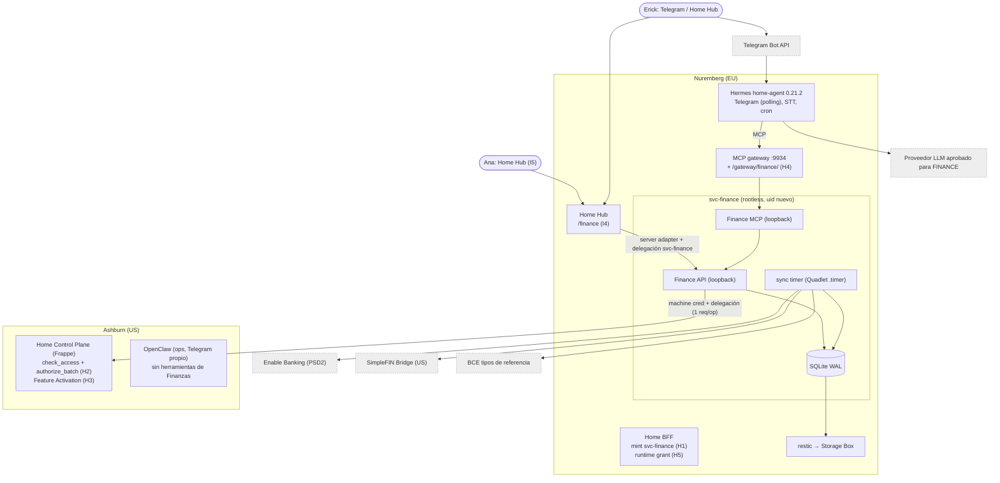
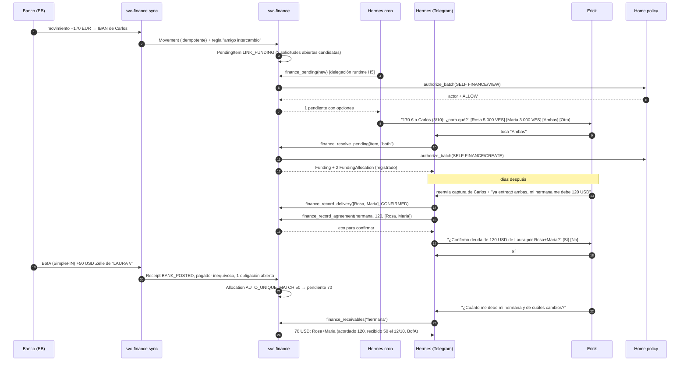

# Olin Finance v1: arquitectura y plan

**Estado:** propuesta para revisión. El dueño decidió P1–P4 el 2026-10-10 (§0.1). La propuesta en conjunto todavía no está aceptada y no autoriza implementación, despliegue, conexiones bancarias ni emparejamiento de chats.
**Fecha:** 2026-10-10 · **Base:** `origin/main` en `4e8c45d16215685368f62579f06b61035919a050` (PR #72). El `main` local estaba en `140147e` (109 commits atrás); toda verificación de código se hizo contra `origin/main`.
**Ámbito:** finanzas del hogar, intercambios familiares (EUR → VES → deuda USD) y consulta. Proceso → dominio → servicios/APIs → herramientas del agente → UI.
**Criterio rector:** que Finanzas quite trabajo. Las intervenciones mensuales del usuario son un criterio de arquitectura y de aceptación, no una métrica secundaria.

---

## 0. Resumen

**Qué propongo.** Olin Finance sería un servicio de dominio nuevo, `svc-finance`, que sigue el mismo patrón que Nutrition: FastAPI + MCP + SQLite, Quadlet rootless en Nuremberg. Sería el dueño de los registros financieros, con autorización de Home y activable por Person o Circle. La automatización sale principalmente de los **feeds bancarios**. Las conversaciones solo explican el *porqué* de un movimiento. Olin hace una pregunta corta cuando aparece un movimiento que no sabe explicar.

**Decisiones que cambian lo discutido** (detalle en §3):

| # | Antes | Propuesta | Por qué |
| --- | --- | --- | --- |
| R1 | Cada mensaje se analiza con un parser determinista en Finance (piloto) | Hermes extrae y llama a herramientas tipadas. Finance valida invariantes y autoridad. El dinero solo queda "verificado" por banco o por confirmación del dueño | El parser regex del piloto solo entiende frases fijas en inglés. Las conversaciones reales en español no caben ahí |
| R2 | El chat como fuente principal | Banco primero, chat después. El movimiento EUR al amigo y el Zelle entrante llegan solos | Reduce intervenciones: el chat ya no tiene que probar dinero |
| R3 | WhatsApp como primer canal | **Telegram privado del dueño en v1.** La familia sigue en WhatsApp y la evidencia se reenvía. Leer el grupo de WhatsApp (bridge Baileys) queda como incremento opcional que se decide con datos | Hermes 0.21.2 ya trae Telegram con *polling* (sin puerto público), allowlist, botones y notas de voz. WhatsApp Cloud en Hermes solo admite DMs, sin plantillas y con webhook público. Baileys no es oficial |
| R4 | Mantener Sparkasse con middleware o pasar a bunq por su API | Conector único Enable Banking (gratis, uso personal). **Cambiar Sparkasse por N26 Standard cuando convenga**, sin bloquear v1. bunq no se recomienda | Mismo nivel de automatización que Sparkasse a 0 €/mes. La API de bunq exige el plan Pro (9,99 €/mes) y no aporta nada a una v1 de solo lectura |
| R5 | wealthAPI / Parqet para Trade Republic | Efectivo de TR vía PSD2 y valores vía **exportación CSV oficial de TR**, una vez al mes | wealthAPI es B2B (desde 1.000 €/mes). El Autosync de Parqet es interactivo (PIN + push en cada sincronización) |
| R6 | Identidad del remitente desde metadatos del canal | En v1 solo el dueño conversa con Olin (allowlist de Telegram + delegación del dueño). La familia no se autentica: lo que dice es evidencia que aporta el dueño | Hermes no pasa metadatos de remitente confiables a las herramientas MCP. Esto requiere un plugin, previsto para más adelante |
| R7 | — | **Bloqueante nuevo:** la vinculación Hermes→BFF caduca a las 12 h, lo que obliga a un login diario. Hace falta una concesión de *runtime* revocable de 30–90 días (H5) | Sin esto, Olin por chat no cumple el criterio de intervenciones |

**Coste estimado:** v1 completa (I1–I5) en **46–71 días-ingeniero**. Coste recurrente de unos **15–35 €/mes**, sobre todo LLM, menos unos 10 €/mes de ahorro si se deja Sparkasse. Mantenimiento técnico de **0,5–2 días/mes**. Objetivo de uso: **≤ 20 intervenciones/mes**, ninguna de ellas teclear balances ni transacciones.

### 0.1 Decisiones del dueño (2026-10-10)

| # | Decisión | Consecuencia en el plan |
| --- | --- | --- |
| **P1** | **Sí** a usar los datos financieros reales del operador en Olin | Se abre la puerta "Finance real-data" para Erick, separada de G2 Salud. Ana sigue necesitando su propio consentimiento (I5) |
| **P2** | Modelo: **suscripción de Codex** (ChatGPT) | Verificado en el nodo: Hermes 0.21.2 trae el proveedor `openai-codex` (OAuth externo, `chatgpt.com/backend-api/codex`, sin clave de API). Coste marginal de LLM ≈ 0. **Riesgos aceptados por el dueño:** los datos financieros van a OpenAI; el plan está pensado para programar (zona gris de uso y cuota compartida). La prueba de extracción (§14.6) decide si basta. Kimi queda como respaldo. El login OAuth de Codex como `home-agent` lo hace el operador en I1 |
| **P3** | **Telegram** en v1; el dueño **quiere** que Olin esté en el grupo de WhatsApp existente si es posible | Unirse al grupo existente solo es posible con el bridge no oficial (Baileys) y un **número dedicado**. WhatsApp Cloud API no puede unirse a grupos existentes. **I6 pasa de opcional a deseado**, después de I2, con riesgo aceptado y número dedicado. Olin solo observa en el grupo y nunca publica saldos |
| **P4** | Concesión de runtime de **90 días** | Diseño H5 en [`HOME_AGENT_RUNTIME_GRANT.md`](HOME_AGENT_RUNTIME_GRANT.md), pendiente de revisión del Board |

---

## 1. Estado actual verificado

Evidencia recogida el 2026-10-10 con `git`, `gh`, lectura de código en `origin/main`, ejecución local aislada y SSH de solo lectura a ambos nodos. No se cambió nada en producción.

### 1.1 Repositorio y trabajo previo de Finanzas

| Hecho | Evidencia |
| --- | --- |
| No existe ninguna rama, commit, stash ni PR de Finanzas | `git branch -a`, `git log --all -- services/finance` vacío; `gh pr list --state all` (PR #1–#72): ninguno de Finanzas |
| El piloto existe **solo sin commit** en el checkout principal (`episteck_home/services/finance/`, ficheros del 2026-10-06), junto con artefactos `build/` y `*.egg-info` | `git status`: `?? services/finance/` |
| El draft PR y las pruebas adicionales que se pidieron **no se completaron** | No hay PR, rama ni commits |
| El informe `2026-10-05-olin-finance-architecture-research.md` está **sin commit** en el checkout principal | `git status` |
| `FINANCE` existe como dominio de política, pero ningún componente lo usa | `apps/episteck_home/episteck_home/policy/access.py` (`DOMAINS`) |
| Audiencias de delegación: `home-control-plane` y `svc-nutrition`. No hay audiencia para Finanzas | `services/home-bff/home_bff/sessions.py:22-24`, `identity/auth_hook.py:78` |
| Gateway MCP: rutas `/gateway/home/` y `/gateway/nutrition/`. No hay ruta para Finanzas | `deploy/gateway/nginx-mcp-gateway.conf:45,66` |
| El mint interno emite siempre la audiencia `home-control-plane` | `services/home-bff/home_bff/internal_app.py` (`mint_delegation`) |
| F3b.1 (guarda de existencia del sujeto y audiencia ligada al llamante) está mergeado | PR #70 (2026-10-10). No verifiqué si ya está desplegado |
| F3b.2 existe solo como rama local sin PR. F3b.3 (adaptador Hub→dominio y transporte) no está empezado | Rama `feature/home-f3b2-nutrition-outcomes` (`3bf359f`) |

### 1.2 Piloto sintético: lo reportado frente a lo verificado

| Afirmación | Resultado |
| --- | --- |
| 21 tests aislados pasan con Python 3.13 y FastMCP 4.0.3 | **Confirmado** hoy: `21 passed in 25.94s` (con `uv run --no-project --python 3.13 …`) |
| Inbox SQLite y eventos append-only | Confirmado (`core.py`: tablas `inbox` y `events`; el estado se reconstruye por *replay*) |
| Dos herramientas MCP que reciben un source message ID | Confirmado (`mcp.py`). La delegación se lee de la cabecera HTTP |
| Autorización FINANCE/CREATE y FINANCE/VIEW | **Solo sintética.** `HomeFinanceAuthorizer` nunca se probó contra Home. El ejemplo usa `SyntheticOnlyAuthorizer` |
| Captura y aclaración | **Parser de regex con frases fijas en inglés** (`core.py:261-391`). No entiende conversaciones reales |
| Duplicados, correcciones, pagos reportados frente a recibos verificados, *allocations* parciales | Confirmado sobre ese vocabulario. El "recibo bancario" es una etiqueta `bank_statement` sobre un SVG |
| Saldo final de USD 70 | **Confirmado** al ejecutar el demo: Rosa 80 + Maria 40 − recibo de 50 (30/20) = 70. El demo sí incluye la deuda de Maria. La respuesta devuelve solo el total, **sin desglose por cambio** |
| Llamada real Hermes → Finance | No existe |
| SSH a Nuremberg con timeout | Ya no ocurre: SSH funciona hoy |

Limitaciones estructurales que el informe no mencionaba: una base de datos por dueño (`owner_person_id` fijo) y un *roster* de identidades pasado en código.

### 1.3 Runtime (SSH de solo lectura)

| Componente | Estado verificado |
| --- | --- |
| Nuremberg `ubuntu-4gb-nbg1-1` | 2 vCPU, 3,8 GB RAM (≈2,1 GB disponibles), 51 GB libres. Servicios de sistema: `hermes-gateway` (infra-agent), `episteck-mcp-gateway` y `nginx`; los servicios de dominio son unidades rootless de usuario. Usuarios `svc-*` 1004–1008 |
| Hermes `home-agent` | **v0.21.2** (`a89c1e1`). MCP `home` y `nutrition` vía `127.0.0.1:9934`. **Ninguna plataforma de mensajería conectada** (`gateway_state.platforms = {}`). Ningún token de WhatsApp ni de Telegram en `.env`. STT local `base` con `language: en`. Modelo `kimi-k2.6` (proveedor `kimi-coding`). Memoria activada |
| Hermes `infra-agent` | v0.21.2, sin plataformas |
| Ashburn `ubuntu-4gb-ash-1` | 3 vCPU, 3,8 GB RAM (≈1 GB disponible). Bench con `episteck_home`. No tiene capacidad para un servicio nuevo |
| OpenClaw | **v2026.6.35** en Ashburn, ejecutándose como `frappe` (`gateway --port 18789`). Canal **Telegram** activo (DM por *pairing*, grupos en allowlist). Plugins `telegram`, `openai`, `codex`, `moonshot`. **No usa WhatsApp** |
| Vinculación del *runtime* Hermes | El gateway emite delegaciones solo mientras exista una sesión del BFF vinculada a `home-agent-primary`. Esa sesión dura **12 h sin renovación** (`store.py:43` `SESSION_TTL_SECONDS`, `store.py:459-476` `resolve_runtime`) |

### 1.4 UI

Home Hub (Next 16 / React 19) tiene contexto de Person en vivo (F3a) y `DataEnvelope` con estados de entrega, autorización y frescura. **Ask Olin es un mock**: `useLocalRuntime` con respuestas fijas (`apps/home-hub/src/app/ask/AskOlin.tsx`). No hay navegación ni página de Finanzas (`Sidebar.tsx`). Todavía no existe ningún adaptador servidor Hub→dominio (eso es F3b.3).

### 1.5 Clasificación de capacidades

| Capacidad | Estado |
| --- | --- |
| Identidad de confianza, ConsentGrant, `can_access` (incluye FINANCE), delegación de un solo uso | **Implementado** (live, G1.6) |
| Guarda de existencia del sujeto y audiencia ligada al llamante | **Implementado** (merge #70); despliegue **no verificado** |
| Gateway MCP con delegación por petición | **Implementado** (live); sin ruta para Finanzas |
| Runtime Hermes home-agent con MCP | **Implementado** (live) |
| Canal de mensajería para Olin (cualquiera) | **Pendiente**: capacidad presente en Hermes 0.21.2, sin configurar |
| Notas de voz (STT) | **Sintético/no probado**: STT activado en inglés, nunca usado con un canal |
| Herramientas MCP de Finanzas | **Sintético/stub** (piloto local) |
| Registro financiero persistente | **Sintético/stub** (SQLite del piloto, sin commit) |
| Autorización Finance → Home | **Sintético/stub** (cliente sin probar en vivo) |
| OCR o extracción de capturas | **Sintético/stub** (texto SVG) |
| Conexiones bancarias o de brokers | **Pendiente** |
| Overview y Ask Olin de Finanzas en la UI | **Pendiente** (Ask Olin es mock) |
| Ruta de evidencia y procedencia confiable desde Hermes | **No verificado**: los hooks documentados (`post_gateway_admission`, middleware `tool_request`) no se han comprobado en 0.21.2 |
| Envío proactivo de cron de Hermes a Telegram | **No verificado** |

### 1.6 Hallazgos bloqueantes

1. **Sesión de runtime de 12 h.** Sin cambio, Olin por chat (y su cron) deja de autorizar 12 h después de cada login del operador en `bff.home.episteck.com/login`. Eso son unas 30 intervenciones al mes solo para mantenerlo vivo. → H5 (§7.3).
2. **Una sola identidad humana por runtime.** Toda llamada de Hermes actúa como el dueño de la sesión vinculada, sin importar quién escriba en el chat. Hasta que exista identidad por usuario en el agente, el chat de Finanzas debe ser **exclusivo del dueño**.
3. **Proveedor LLM.** El home-agent usa Kimi (Moonshot). La compuerta de LLM clasifica FINANCE como clase restringida (`LLM_ROUTING_AND_COST_GATE.md`). Antes de usar datos reales hace falta decidir qué proveedor está aprobado para FINANCE (§8.5).
4. **Gobernanza de datos reales.** El Roadmap pone Finanzas en "Later" y bloquea el alta de datos familiares reales bajo G2 (Salud). Finanzas necesita una decisión propia: datos del operador primero, después Ana con su consentimiento (§16 P1).

---

## 2. Requisitos convertidos en criterios

| Criterio | Cómo se mide | Objetivo v1 |
| --- | --- | --- |
| Intervenciones del usuario | Finance registra un `intervention` cada vez que el dueño resuelve un pendiente, confirma algo o reautoriza un banco | **≤ 20/mes**, mediana ≤ 30 s, **0** balances o transacciones tecleados |
| Captura automática | % de movimientos clasificados sin preguntar | ≥ 80 % a las 4 semanas de uso real |
| Preguntas solo ante faltantes o ambigüedad | Preguntas por intercambio | ≤ 3 por intercambio completo |
| Frescura visible | Cada saldo muestra fuente, moneda y "a fecha de" | 100 % |
| Nada de cifras inventadas | Respuestas de Ask Olin con cifras que no vienen de una herramienta | 0 (tests y revisión de trazas) |
| Mismos registros en chat y web | Overview web y respuesta del chat sobre el mismo `as_of` | Idénticos |

**Una demo sintética no cumple ningún criterio.** La aceptación exige un periodo de uso real (§13, §14): 2 semanas en *shadow mode* y después 2 meses medidos.

---

## 3. Recomendación arquitectónica y decisiones

**D1. Servicio de dominio propio, `svc-finance`.** Encaja con ADR-0002 (cada dominio es dueño de su verdad, sin base de datos universal) y con el patrón ya probado de Nutrition. No se usan Firefly III, Savvy ni ERPNext: duplicarían el modelo y la identidad. Ese análisis ya está en el informe del 2026-10-05 y su conclusión sigue en pie. Lo que se descarta de ese informe es el enfoque *manual-first*.

**D2. Banco primero, conversación después** (revisa R2). Las fuentes de dinero son los feeds (Enable Banking, SimpleFIN, CSV oficiales). La conversación aporta solicitudes, entregas, acuerdos y clasificaciones. Un movimiento sin explicar genera **una** pregunta corta.

**D3. Extracción por el agente con validación por el dominio** (revisa R1). Hermes interpreta texto, capturas y voz, y llama a herramientas con argumentos tipados. Finance no interpreta lenguaje natural. Valida importes, monedas, referencias, límites, unicidad y autoridad, y decide de forma determinista los emparejamientos (`allocation`, transferencias internas). Lo que viene del chat es **reportado**. **Verificado** solo lo es un ingreso contabilizado en el feed o una confirmación explícita del dueño. No se añade un segundo runtime de LLM dentro de Finance.

**D4. Canal: Telegram privado en v1** (revisa R3, §8.1). WhatsApp sigue siendo el canal familiar. Olin no lee grupos en v1.

**D5. Conectividad bancaria con Enable Banking en modo restringido, más SimpleFIN para Estados Unidos** (revisa R4/R5, §7.5–7.6).

**D6. Feature activable por Person o Circle** (§10). El interruptor vive en Home (`Feature Activation`, genérico para futuros dominios). Los datos viven en Finance, particionados por *workspace* desde el día 1.

**D7. Cambios mínimos y reutilizables en Home/BFF/gateway** (H1–H5, §7.3). Los aprovecharán otros dominios (Calendar, Documents).

**D8. No hay pagos.** v1 registra y observa. Ninguna herramienta mueve dinero ni almacena credenciales de pago.

**Qué se reutiliza del piloto:** el vocabulario de estados (reportado/verificado), las reglas de *allocation* (no superar el recibo ni el saldo pendiente), la idempotencia por clave de origen, las correcciones como hechos nuevos y los escenarios de sus tests como casos de aceptación. **Qué no se reutiliza:** el parser regex, el diseño de un dueño por base de datos, el *roster* en código y el `TrustedMessage` como requisito de v1 (lo sustituye R6). Recomiendo archivar el piloto en una rama `spike/finance-synthetic-pilot` como referencia y no mergearlo a `main` (§17).

---

## 4. Alcance de v1 y exclusiones

**Incluye**

- Cuentas de Erick: cuenta diaria (Sparkasse hoy, N26 si se cambia), Trade Republic (efectivo y valores por separado), EquatePlus (disponible y restringido), BofA (USD), efectivo USD.
- N26 de Ana, con su consentimiento y su propio conector (I5).
- Overview por moneda y por clase de liquidez, con fuente y fecha. Valoración consolidada en EUR solo explícita y fechada (tipo BCE).
- Transferencias internas, clasificación de gasto por cuenta y categoría, recurrentes y suscripciones.
- Intercambios: solicitudes, financiación agrupada, entregas y confirmaciones, acuerdo USD, deudas heredadas, devoluciones parciales y en efectivo, un pago repartido entre varias deudas, anticipo o regalo.
- Cola de pendientes, recordatorios y reautorizaciones.
- Ask Olin por Telegram (texto, voz, capturas) y overview con acciones en Home Hub.

**Excluye, con justificación**

| Exclusión | Por qué |
| --- | --- |
| Ejecutar pagos o transferencias | Requisito explícito; elimina el riesgo de mover dinero |
| Leer grupos de WhatsApp | Riesgo de ToS y mantenimiento; se evalúa con datos en I6 |
| Que familiares hablen directamente con Olin | Falta identidad por usuario en el agente (§1.6-2) |
| Ask Olin web conectado a Hermes | Requiere diseñar sesión web↔Hermes. La web muestra los mismos registros y resuelve pendientes sin LLM |
| Coste fiscal, lotes y rentabilidad | No es una necesidad actual; se puede añadir después (Beancount u otro) |
| Precios de mercado en vivo | La valoración viene del *snapshot* de la fuente; un feed de precios queda para más adelante |
| Presupuestos, previsión y objetivos | Fuera de las preguntas pedidas |
| Uso comercial para otros clientes | Necesita un contrato con el agregador (Enable Banking) y la identidad por usuario |

---

## 5. Proceso

### 5.1 Hogar (sin intervención salvo excepciones)

1. **Sync** 2–3 veces al día por conexión (PSD2 permite como máximo 4 accesos desatendidos al día por cuenta). Entran saldos y movimientos.
2. **Clasificación determinista:** reglas por contraparte, IBAN o comercio, reglas que el dueño enseña y emparejamiento de transferencias internas.
3. Lo que no se pueda clasificar va a la **cola**. Se agrupa en un resumen (máximo 1 por día) y nunca bloquea.
4. **Recurrentes:** se detectan series (misma contraparte, cadencia y rango de importe) y se marcan como suscripción. El dueño puede negar una.
5. **Frescura:** si una cuenta supera su umbral, aparece como "desactualizada" y genera un pendiente (por ejemplo, reautorizar).

### 5.2 Intercambio familiar (EUR → VES → USD)

| Paso real | Fuente principal | Intervención típica |
| --- | --- | --- |
| 1. Un familiar pide VES para un beneficiario | El dueño reenvía el mensaje o dicta una nota de voz. Si no, Olin la crea en el paso 2 | 0–1 |
| 2. El dueño transfiere EUR al amigo | **El feed bancario** detecta la salida hacia el IBAN del amigo y Olin pregunta: "170 € a Carlos el 3/10: ¿para qué solicitudes?" con botones | 1 (un toque o una frase) |
| 3. Un pago financia varias solicitudes | `FundingAllocation` de muchas a uno. El reparto en EUR por solicitud es opcional | incluido en 2 |
| 4. El amigo entrega VES y el receptor confirma | Reenvío de la captura del amigo, o un toque cuando Olin pregunta a los 2 días | 0–1 |
| 5. Se acuerda la deuda en USD | El dueño la dice o reenvía el mensaje del deudor. **Nunca se infiere de tipos EUR/VES** | 1 (con confirmación) |
| 6. Devolución en BofA o en efectivo | **Feed de BofA:** si el emparejamiento es inequívoco, la asignación es automática. Efectivo: "recibí 50 USD de mi hermana" | 0 (banco) / 1 (efectivo) |

Estados de una solicitud: `REQUESTED → FUNDED → DELIVERY_REPORTED → DELIVERED_CONFIRMED → OWED_PENDING_AGREEMENT → OWED → PARTIALLY_REPAID → SETTLED`, más `GIFT` y `CANCELLED`. Una entrega completada sin acuerdo queda **visible como pendiente de acuerdo**.

### 5.3 Reconciliación

- **Bancaria:** si el saldo observado del proveedor no cuadra con el saldo anterior más los movimientos (con tolerancia por pendientes), se marca `RECONCILIATION_GAP`. No se corrige solo.
- **Efectivo USD:** el libro se deriva (apertura + recibos − gastos reportados) y se hace un recuento trimestral ("¿sigues teniendo 300 USD?"). La diferencia queda como ajuste explícito.
- **Deudas:** `pendiente = acordado − Σ allocations`. Un recibo verificado sin asignar es un pendiente. Un pago reportado sin recibo es un pendiente que caduca en 14 días.

---

## 6. Modelo de dominio y fuentes de verdad

### 6.1 Workspace y activación

- **`Workspace`**: `id`, `kind` (`PERSONAL` | `HOUSEHOLD`), `home_circle_id` opcional, `status` (`ACTIVE` | `PAUSED` | `ARCHIVED`), `display_currency` (solo para valoraciones explícitas) y módulos activos (`accounts`, `receivables`, `investments`). Todas las tablas llevan `workspace_id`; no hay singletons globales.
- **`WorkspaceMember`**: `person_id` y `role` (`OWNER` | `MEMBER`). **Ser miembro no da acceso a datos**: cada lectura de una cuenta exige `FINANCE/VIEW` sobre su dueño (§7.4).
- La activación es un registro de Home (H3). Si se apaga, la UI oculta el módulo, las herramientas devuelven `FEATURE_OFF`, la sincronización se detiene y los datos se conservan hasta un borrado explícito. La exportación JSON/CSV está siempre disponible.

### 6.2 Cuentas, conexiones y observaciones

- **`Account`**: `owner_person_ids` (admite cuentas conjuntas), `institution`, `type` (`CURRENT`, `SAVINGS`, `BROKER_CASH`, `SECURITIES`, `EMPLOYEE_PLAN`, `CASH`), `currency`, `liquidity` (`AVAILABLE`, `INVESTED`, `RESTRICTED`), **`balance_authority`** (`PROVIDER` | `LEDGER` | `EVIDENCE_SNAPSHOT`), **`movement_authority`** (el conector que manda en los movimientos) y `freshness_sla`.
- **`Connection`**: `provider` (`ENABLE_BANKING`, `SIMPLEFIN`, `FILE_IMPORT`), `owner_person_id`, `consent_expires_at`, `last_success_at`, `status` (`OK`, `REAUTH_DUE`, `REAUTH_REQUIRED`, `FAILING`, `PAUSED`). Las credenciales se guardan en un fichero secreto 600 del servicio (como Nutrition), nunca en la base de datos ni en el agente.
- **`BalanceObservation`**: `account`, `amount_minor`, `currency`, `kind` (`BOOKED` | `AVAILABLE` | `VALUATION`), `as_of` (del proveedor), `observed_at`, `source_ref`. Es inmutable.

### 6.3 Movimientos y clasificación

- **`Movement`**: inmutable. `account`, `provider_tx_id` o *fingerprint* (`booking_date`, importe, contraparte, concepto y ordinal), `booking_date`, `value_date`, `amount_minor` con signo, `currency`, `counterparty_name`, `counterparty_iban_hash`, `remittance`, `status` (`PENDING` | `BOOKED`). Unicidad `(account, provider_tx_id)`. Un `PENDING` que pasa a `BOOKED` se enlaza con el original; no se duplica.
- **`Classification`**: versionada y append-only. `class` (`SPENDING`, `INCOME`, `INTERNAL_TRANSFER`, `INVESTMENT_TRANSFER`, `EXCHANGE_FUNDING`, `RECEIVABLE_REPAYMENT`, `GIFT_GIVEN`, `CASH_WITHDRAWAL`, `REFUND`, `UNKNOWN`), `category`, `decided_by` (`RULE` | `OWNER` | `AGENT_CONFIRMED`) y `rule_id`. Manda la última versión no revocada.
- **`TransferLink`**: salida y entrada emparejadas entre cuentas del workspace (mismo importe y moneda, ±3 días hábiles, o IBAN propio como contraparte).
- **`RecurringSeries`**: derivada. Contraparte, cadencia, importe típico, `next_expected` y estado (`SUBSCRIPTION`, `BILL`, `NOT_RECURRING`).

### 6.4 Inversiones

- **`HoldingSnapshot`**: `account`, `as_of`, `instrument` (ISIN o nombre), `units`, `available_units`, `restricted_units`, `restriction_until` y `valuation_minor` + `currency` + `price_as_of` + `source_ref` (CSV, PDF o captura).
- Trade Republic tiene dos cuentas: `BROKER_CASH` (PSD2, autoridad `PROVIDER`) y `SECURITIES` (autoridad `EVIDENCE_SNAPSHOT`).
- EquatePlus es una cuenta `EMPLOYEE_PLAN` con lotes disponibles y restringidos. Un lote restringido **nunca** cuenta como disponible.

### 6.5 Intercambios y cuentas por cobrar

El nombre en el modelo es genérico (*errands* y préstamos) para que sea reutilizable. El intercambio EUR→VES es una plantilla.

- **`Counterparty`**: local al workspace (la agenda privada del dueño): `display_name`, `aliases` ("mi hermana", "Lau"), identificadores de pago con hash (IBAN, nombre Zelle) y `home_person_id` opcional. **No son Persons de Home ni principales.** Figurar como deudor o beneficiario no concede nada.
- **`ErrandRequest`**: `requester_cp`, `beneficiary_cp`, `target_amount` + `target_currency` (VES), `requested_at`, `kind` (`RECOVERABLE` | `GIFT` | `UNDECIDED`) y `evidence_refs`.
- **`Funding`** (`movement_id` o evidencia, `friend_cp`, `eur_amount`) y **`FundingAllocation`** (`funding`, `request`, `eur_share` opcional).
- **`Delivery`** (`request`, `reported_by_cp`, `amount`, `evidence`) y **`RecipientConfirmation`** (`request`, `confirmed_by_cp`, atestación del dueño, `evidence`).
- **`Obligation`**: `debtor_cp`, `currency` (USD), `amount_minor`, `basis` (`AGREED` | `LEGACY_OPENING` | `ADJUSTMENT`), `origin_request_ids` (vacío en las heredadas), `provenance_note` (obligatoria si es `LEGACY_OPENING`: "historia incompleta, según el dueño a fecha X"), `agreed_at`, `agreed_evidence` y `status` (`OPEN`, `SETTLED`, `FORGIVEN`, `CONVERTED_TO_GIFT`).
- **`Receipt`**: `kind` (`BANK` | `CASH`), `movement_id` si es bancario, importe, `received_at`, `payer_cp` y `verification` (`BANK_POSTED` | `OWNER_CONFIRMED`).
- **`PaymentReport`**: pago reportado sin verificar, con enlace opcional a un `Receipt` posterior.
- **`Allocation`**: `receipt`, `obligation`, `amount_minor` y `method` (`AUTO_UNIQUE_MATCH` | `OWNER`). Invariantes: Σ por recibo ≤ importe del recibo, Σ por obligación ≤ acordado y la misma moneda en ambos lados. El remanente queda como "sin asignar".

**Asignación automática** solo cuando se cumple todo esto: el recibo está verificado, el pagador está identificado de forma inequívoca (identificador de pago conocido de **una** contraparte), solo hay una obligación abierta de ese deudor o el importe coincide exactamente con una sola, y el importe no supera lo pendiente. En cualquier otro caso se genera un pendiente con una propuesta.

### 6.6 Cola de pendientes

`PendingItem`: derivado y deduplicado. Tipos: `EXPLAIN_MOVEMENT`, `LINK_FUNDING`, `CONFIRM_DELIVERY`, `AGREE_AMOUNT`, `ALLOCATE_RECEIPT`, `CONFIRM_CASH`, `REVIEW_LEGACY`, `REAUTH_CONNECTION`, `REFRESH_SNAPSHOT`, `RECONCILIATION_GAP` y `UNVERIFIED_REPORT`. Cada uno tiene `nudge_policy` (cuándo recordar), `snooze_until` y opciones sugeridas (para botones).

### 6.7 Integridad

- **Dinero**: enteros en unidades menores más moneda ISO, con tabla de exponentes. Nunca `float`. `Decimal` solo en la frontera de E/S.
- **Idempotencia**: cada comando lleva `idempotency_key` (id del proveedor, referencia de origen o UUID de la herramienta). Repetir la clave con el mismo contenido no hace nada; repetirla con contenido distinto se rechaza. Esto cubre el *replay*, los reinicios a mitad de sync y los reintentos del agente.
- **Correcciones**: un hecho nunca se edita. `Correction` o `Reversal` referencian el objetivo, con motivo, actor y fecha. Las vistas muestran la versión vigente y el historial.
- **Auditoría**: cada escritura guarda `human_actor` (resuelto por Home), `machine_caller` y `channel` (`telegram`, `web`, `sync`).
- **SQLite** en WAL con transacciones `BEGIN IMMEDIATE`, como el perfil de durabilidad ya validado para Knowledge. Backup diario con restic (`.backup`).

### 6.8 Doble conteo y monedas

1. **Una autoridad de saldo por cuenta.** El patrimonio es la suma del **último saldo observado** de cada cuenta, nunca la suma de movimientos.
2. **Una autoridad de movimientos por cuenta.** Si dos fuentes traen la misma cuenta (por ejemplo, el efectivo de TR por PSD2 y por CSV), la secundaria solo sirve para reconciliar.
3. Las transferencias internas emparejadas no son gasto ni ingreso. Comprar valores desde el efectivo de TR es `INVESTMENT_TRANSFER`.
4. `EXCHANGE_FUNDING` no es gasto: crea un derecho de cobro. Si el anticipo se convierte en regalo, pasa a `GIFT_GIVEN`. `RECEIVABLE_REPAYMENT` no es ingreso.
5. "Te deben" se muestra **aparte** y nunca suma al dinero disponible.
6. **Nunca se suman monedas distintas.** Siempre hay subtotales por moneda. El consolidado en EUR es una línea separada: "Valoración: 12.340 € al tipo BCE del 09/10/2026". El VES no se valora nunca.

### 6.9 Fuente de verdad por dato

| Dato | Dueño | Notas |
| --- | --- | --- |
| Person, Circle, ConsentGrant, activación de features | Home Control Plane | Se añade `Feature Activation` (H3) |
| Saldos y movimientos | Banco o broker vía conector → `svc-finance` | Inmutables. Finance guarda la copia canónica para Olin |
| Clasificación, casos, obligaciones, recibos, asignaciones, pendientes | `svc-finance` | — |
| Valores de TR y EquatePlus | Evidencia oficial (CSV, PDF, captura) → `svc-finance` | Con fecha de la fuente |
| Tipos de cambio | BCE (tipos de referencia) | Solo para valorar explícitamente |
| Conversación | Hermes (sesión) y el chat (Telegram/WhatsApp) | **No es un ledger.** Nunca es fuente de cifras |

---

## 7. Servicios, APIs y límites

### 7.1 Mapa de componentes objetivo

### 7.2 `svc-finance`

- **Despliegue:** Nuremberg, usuario `svc-finance` (uid nuevo), Quadlet rootless, API y MCP solo en loopback (puertos por asignar, por ejemplo 9935/9936). El sync es un `.timer` que ejecuta el mismo contenedor, así que no hay demonio adicional. Ocupa unos 150 MB de RAM, que caben en el nodo actual. Ashburn no tiene margen.
- **API (REST, sin parámetro de actor):** `GET /overview`, `GET /accounts/{id}/movements`, `GET /spending`, `GET /recurring`, `GET /receivables`, `GET /pending`, `POST /commands/{type}` (todas las escrituras, con `idempotency_key`), `POST /connections/{id}/authorize` (devuelve la URL de SCA) y `GET /connect/callback` (callback PSD2), y `GET /export`.
- **MCP:** adaptador fino sobre la misma lógica de servicio, igual que Nutrition. **El chat y la web usan las mismas funciones de lectura**, así que no pueden divergir.
- **Autorización por operación:** una llamada a Home por operación (las delegaciones son de un solo uso) mediante H2. Si Home no responde → DENY, sin caché.
- **Callback PSD2 público:** una única ruta estrecha en el vhost existente `bff.home.episteck.com` (`/finance/connect/callback`) que apunta a Finance. Valida un `state` de un solo uso que caduca en 15 min y que está ligado a la conexión y al dueño. En una reautorización, Finance comprueba que las cuentas devueltas son las esperadas; una cuenta nueva requiere confirmación del dueño. Necesita revisión de seguridad.

### 7.3 Cambios en Home, BFF y gateway (reutilizables)

| Id | Cambio | Razón | Patrón existente |
| --- | --- | --- | --- |
| **H1** | Audiencia `svc-finance`, aceptada solo desde el usuario máquina de Finance (`home_finance_machine_user`) y solo en las entradas de política | Una delegación solo vale para Finance | Igual que D1 de F3b (`auth_hook._accepted_audiences`) |
| **H2** | Entrada de política `authorize_batch(requirements)` en **una** petición: cada requisito es `{subject: "SELF" \| PSN, domain, action}`; devuelve `actor_person_id` (resuelto por Home) y una decisión por requisito; máximo 8 requisitos | Finance necesita saber quién es "yo" sin aceptarlo como entrada, y el overview del hogar abarca varios sujetos (Erick y Ana). `check_access_many` es de un solo sujeto | Extiende `check_access_many` con la guarda de existencia del sujeto |
| **H3** | DocType `Feature Activation` (`feature`, `scope_type` Person \| Circle, `scope`, `state`, `activated_by`, fechas) + `features` en el bootstrap + lectura de estado para máquinas (no expone datos de personas) | Interruptor por usuario o círculo, reutilizable por otros dominios | Requiere `bench migrate` manual (home no tiene *post-deploy hook*) |
| **H4** | Ruta `/gateway/finance/` + mint con audiencia por ruta (`/internal/mint?audience=…` limitado a una lista fija) + regla nft para el puerto MCP de Finance | Hermes llega a Finance con una delegación ligada a Finance | `nginx-mcp-gateway.conf`, `episteck-gateway.nft` |
| **H5** | **Concesión de runtime del agente:** el dueño concede de forma explícita (pantalla en el BFF) una sesión delegada de tipo `AGENT_RUNTIME` para `home-agent-primary`, con caducidad de 30–90 días, revocable desde el Hub y por "cerrar todas las sesiones", y limitada a las audiencias permitidas. Aviso 7 días antes de caducar | Elimina el login diario. El mint ya solo necesita `home_session_id`, no los tokens OAuth | Cambia el modelo de identidad: **necesita un diseño propio y revisión del Board** antes de implementarse |

### 7.4 Permisos y divulgación

| Regla | Mecanismo |
| --- | --- |
| La identidad nunca la aporta el modelo | Ninguna herramienta ni ruta tiene parámetro de actor. El actor lo resuelve Home (H2) a partir de la delegación |
| Ser miembro, beneficiario o deudor no concede nada | Las contrapartes no son principales. Ser miembro del workspace no autoriza leer cuentas |
| Lectura de cuentas | `FINANCE/VIEW` sobre el dueño de cada cuenta (uno mismo, o el ConsentGrant de Ana→Erick). Si una cuenta está denegada, se omite y se indica "1 cuenta no visible" |
| Escritura | `FINANCE/CREATE` o `UPDATE` sobre el dueño del workspace. Las acciones que verifican dinero (efectivo, asignación manual) exigen además que actor = dueño |
| Divulgación al destino | v1: el bot de Telegram solo admite al dueño (`TELEGRAM_ALLOWED_USERS`) y se desactiva su entrada en grupos (`/setjoingroups` en BotFather), así que **todo chat es privado por construcción**. Web: sesión del BFF del propio usuario. Antes de conectar cualquier grupo (I6) habrá que probar que las sesiones de grupo no pueden invocar herramientas de lectura de Finanzas |
| Capturas familiares | Son evidencia **reportada**. Nunca verifican un recibo |
| Verificación de devolución | Un `Receipt` `BANK_POSTED` del feed, o `OWNER_CONFIRMED` en el chat privado autenticado. Efectivo ≥ 500 USD o la corrección de un hecho bancario requieren confirmación en la web (sesión del BFF, sin pasar por el modelo) |
| Fallo de Home, delegación caducada o *replay* | DENY sin lectura del repositorio, con salidas tipadas 401/403/503 (patrón F3b.2) |
| Secretos | Credenciales de Enable Banking y SimpleFIN en ficheros 600 de `svc-finance`. Nunca en el agente, en las salidas MCP, en logs ni en Git |

### 7.5 Tabla de conectores

Las condiciones se verificaron el 2026-10-10 en la documentación oficial o en fuentes indicadas en §18. "Acceso personal real" significa que un particular puede usarlo hoy, sin contrato, para sus propias cuentas.

| Fuente | Vía | Cobertura | Coste | Refresh | Reautenticación | Acceso personal real |
| --- | --- | --- | --- | --- | --- | --- |
| Sparkasse | Enable Banking (PSD2 AIS, redirect + S-pushTAN) | Saldos y movimientos de la cuenta corriente. **Sin tarjetas de crédito** | 0 € (modo restringido) | ≤ 4/día (PSD2); propuesto 2–3/día | SCA cada ≤ 180 días (máximo exacto por banco: **no verificado**) | **Sí**, para cuentas del propio usuario del Control Panel; uso personal no comercial |
| N26 (Erick si cambia; Ana) | Enable Banking | Saldos y movimientos. Historial inicial limitado (≈90 días, **no verificado**) | 0 € | ≤ 4/día | ≤ 180 días (**no verificado**) | Sí, **cada titular con su propio Control Panel** (las condiciones prohíben leer cuentas de otra persona). Ana tendría el suyo |
| Trade Republic, efectivo | Enable Banking | **Solo importe, moneda y fecha contable**, sin descripción (documentado por Enable Banking) | 0 € | ≤ 4/día | ≤ 180 días | Sí |
| Trade Republic, valores | **Exportación CSV oficial** (app: Perfil → Kontoauszüge → Transaktionsexport) compartida con Olin + captura del valor total | Operaciones, dividendos; valor por snapshot | 0 € | Mensual (lo pide Olin) | No aplica | Sí (función oficial) |
| Trade Republic | Autosync de Parqet | Cartera dentro de Parqet | 0 € | **Manual**: teléfono + PIN + push en cada sync | En cada uso | Útil solo dentro de Parqet; **no sirve como conector de Olin** |
| Trade Republic | wealthAPI | Brokerage | **Desde 1.000 €/mes** + 0,35 €/usuario | — | — | **No**: B2B |
| Trade Republic | Wrappers no oficiales (pytr…) | Completa | 0 € | Desatendido | Frecuente; TR admite **un solo dispositivo** (desconecta el móvil) | Técnicamente sí; **rechazado** por ToS y fragilidad |
| EquatePlus | Captura o PDF del estado del plan, trimestral y en cada *vest* | Disponible y restringido, valor | 0 € | Trimestral o por evento | No aplica | Sí (no hay API) |
| Bank of America | SimpleFIN Bridge (vía MX) | Saldos y movimientos, 90 días | **15 $/año** (o 1,50 $/mes) | ~1/día | Según MX/banco | Sí. **Soporte de BofA no verificado**: comprobar en su buscador antes de pagar (1 mes a 1,50 $) |
| Bank of America | CSV oficial de BofA online | Movimientos | 0 € | Mensual (alternativa) | No aplica | Sí; cuesta 1 intervención/mes |
| Efectivo USD | Libro derivado + recuento trimestral | — | 0 € | Por evento | No aplica | Sí |
| Tipos de cambio | BCE (tipos de referencia, API pública) | EUR/USD diario | 0 € | Diario | No aplica | Sí |
| GoCardless Bank Account Data | — | — | — | — | — | **No**: altas cerradas desde julio de 2025 |

**Que haya API no significa que se pueda usar como particular.** La API personal de bunq exige Pro o Elite. wealthAPI no tiene tier personal. El Autosync de Parqet no funciona desatendido. **Las condiciones de Enable Banking no cubren el uso comercial**: reutilizar esto para otros clientes exige un contrato.

### 7.6 Setup bancario y cambio de Sparkasse

Coste total anual de la cuenta diaria (el conector para inversiones, BofA y Ana es el mismo en todos los casos):

| Opción | Cuenta | Conector | Desarrollo | Mantenimiento | Intervenciones | Total año 1 |
| --- | --- | --- | --- | --- | --- | --- |
| **A. Sparkasse + Enable Banking** | ≈120 € (dato del usuario) | 0 € | Adaptador EB (compartido) | Bajo | SCA ≤ 2/año | ≈120 € |
| **B. N26 Standard + Enable Banking** | **0 €** (tarjeta física 10 € una vez; 2 retiradas gratis/mes, después 2 €) | 0 € | El mismo adaptador; **un único tipo de banco para Erick y Ana** | Bajo | SCA ≤ 2/año + cambio de cuenta (≈2 h, una vez) | ≈0–10 € |
| C. bunq Free + EB | 0 €; solo tarjeta digital; retiradas 2,99 € → ≈36 €/año | 0 € | Adaptador EB (cobertura de bunq **no verificada**) | Bajo | SCA ≤ 2/año | ≈36 € |
| D. bunq Pro + API propia | 119,88 € | 0 € | Adaptador bunq propio (firma, *device-server*, sesiones): +3–5 días | Medio | Ninguna SCA periódica; webhooks en tiempo real | ≈120 € + desarrollo |
| E. Sparkasse vía FinTS (python-fints) | ≈120 € | 0 € | Registro de producto FinTS + adaptador: +3–4 días | Medio | TAN cada ≤ 90 días | ≈120 € + desarrollo |

**Recomendación: B (N26 Standard).** Encaja con el uso descrito: nunca ingresa efectivo, retira una vez al mes, hace muchas transferencias y paga con tarjeta o Apple Pay. Ahorra unos 120 €/año con la **misma** automatización y deja un solo tipo de conector para el hogar. **No bloquea v1:** I1 arranca con Sparkasse por Enable Banking y el cambio es solo configuración. D (bunq) solo merecería la pena si más adelante se quisieran automatizar pagos. Antes de cerrar Sparkasse hay que comprobar que no haya dependencias (§16 P5). No hace falta cambiar inversiones, EquatePlus ni BofA.

---

## 8. Agente y canales

### 8.1 Canal

| Vía | Encaje con la conversación familiar | Coste | Limitaciones | Decisión |
| --- | --- | --- | --- | --- |
| **Telegram privado con Hermes** (bot nuevo de Olin) | La familia sigue en WhatsApp. El dueño reenvía o comparte capturas y CSV, y dicta notas de voz | 0 € | Compartir de WhatsApp a Telegram cuesta 2–4 toques | **v1.** Polling sin puerto público, allowlist por id numérico, botones inline (`clarify`), STT. OpenClaw sigue con su propio bot |
| WhatsApp con Hermes vía Baileys (número dedicado) | El mejor: Olin puede **observar** el grupo de intercambios | SIM o eSIM ≈5–10 €/mes | No oficial ("small risk of account restrictions"). Se rompe con cambios de protocolo, el teléfono debe seguir en línea y hay que volver a emparejar | **I6 opcional**, solo si los reenvíos superan el objetivo de intervenciones y se acepta el riesgo. Solo observa; nunca publica en grupos |
| WhatsApp Cloud API (oficial) con Hermes | **No lee grupos existentes.** En Hermes es solo DM en v1 | Por mensaje fuera de la ventana de 24 h | Webhook público, Meta Business, plantillas no implementadas en Hermes (los recordatorios fallan pasadas 24 h). La Groups API exige cuenta oficial, admite como máximo 8 participantes y solo se entra por invitación | **Rechazado** para v1 |
| Exportación de chat de WhatsApp (oficial) | Lote con remitentes y horas | 0 € | Manual; los nombres salen de la agenda del dueño | Vía de **importación inicial**: deudas heredadas e historial |

Configuración de Hermes que hará falta (no aplicada): `TELEGRAM_BOT_TOKEN`, `TELEGRAM_ALLOWED_USERS=<id de Erick>`, grupos desactivados, `stt.language: es` (y valorar el modelo `small` frente a `base`, probando con importes) y un *skill* "Olin Finance" con las reglas de §8.3–8.4.

### 8.2 Herramientas MCP

Sin actor, SQL, credenciales ni instrucciones de pago. Todas son idempotentes mediante `idempotency_key`, que genera la herramienta.

| Lectura | Escritura (propuesta → validación) |
| --- | --- |
| `finance_overview()`: subtotales por moneda y liquidez, cuentas con fuente, `as_of` y frescura, y valoración explícita opcional | `finance_record_request(requester, beneficiary, amount, currency, kind?, evidence_note)` |
| `finance_receivables(counterparty?)`: pendiente por deudor, **desglosado por cambio y por deuda heredada**, con recibos y procedencia | `finance_link_funding(movement_ref, request_refs[])` |
| `finance_spending(period, group_by)` | `finance_record_delivery(request_refs[], stage, evidence_note)` |
| `finance_recurring()` | `finance_record_agreement(debtor, usd_amount, request_refs[] \| legacy_note)` → confirmación |
| `finance_pending()` | `finance_record_cash_receipt(payer, amount, currency, date)` → confirmación |
| `finance_find_movements(query, period)` (acotado) | `finance_allocate(receipt_ref, allocations[])`, `finance_resolve_pending(item, choice, details?)` |
| `finance_explain(record_ref)`: historial y correcciones | `finance_classify(movement_ref, class, category?, remember_rule?)`, `finance_correct(target, field, value, reason)`, `finance_reverse(target, reason)`, `finance_connection_link(connection)` (URL de SCA) |

Las referencias por nombre ("Rosa", "mi hermana", "el pago del jueves") las resuelve **Finance**. Si son ambiguas, devuelve `clarification_needed` con candidatos y Hermes los muestra con botones.

### 8.3 Niveles de confirmación

| Nivel | Qué | Cómo |
| --- | --- | --- |
| 0, automático sin LLM | Saldos y movimientos del feed, transferencias internas, reglas, asignación por coincidencia única | `svc-finance` lo decide de forma determinista |
| 1, auto-registro reversible | Solicitud, entrega reportada o confirmada, enlace de financiación con un único candidato, clasificación propuesta | Se registra como reportado y se puede deshacer desde la web y el chat |
| 2, confirmación en chat | Acuerdo USD, recibo en efectivo < 500 USD, deuda heredada, conversión a regalo, asignación manual | Finance devuelve un eco (importe, persona, origen) y Hermes pide "Sí/No" con botones |
| 3, confirmación web | Efectivo ≥ 500 USD, corrección o reversión de un hecho bancario o verificado | Pantalla en Home Hub con la sesión del BFF, fuera del alcance del modelo |

Riesgo residual que se acepta: una inyección en contenido reenviado podría hacer que el modelo afirme una confirmación de nivel 2. Se mitiga con un resumen semanal de cambios verificados y un "deshacer" web, y porque el impacto queda acotado al libro privado del dueño, sin dinero en movimiento.

### 8.4 Memoria del agente frente al ledger

- El *skill* de Finanzas obliga a responder cualquier cifra **solo** desde una herramienta llamada en ese turno, citando `as_of` y la fuente. Prohíbe guardar importes, saldos o deudas en la memoria de Hermes.
- Revisión periódica (en el runbook): buscar patrones monetarios en `~/.hermes/memories`.
- Las transcripciones de sesión de Hermes contienen texto financiero. Estado de `home-agent` en `700`; la retención y su exclusión del backup están por decidir (§16).
- OpenClaw no recibe herramientas ni datos de Finanzas.

### 8.5 Proveedor LLM

Hace falta la extracción con visión (capturas en español) y el razonamiento de herramientas. Estimación con Claude Sonnet 5.5 (2 $/M de entrada, 10 $/M de salida, lectura de caché 0,20 $/M; precios del 2026-10-06). Supuestos: 200 turnos/mes, unas 3 llamadas por turno y unos 20.000 tokens de contexto por llamada. Con una caché de 5 min, la primera llamada de cada turno no está en caché.

- Primeras llamadas: 200 × 20k = 4M × 2 $ = 8 $
- Resto de llamadas en caché: 8M × 0,20 $ + 0,8M × 2 $ ≈ 3,2 $
- Salida: 600 × 600 = 0,36M × 10 $ = 3,6 $
- Total ≈ **15–20 $/mes** (rango 10–30 $). Haiku 5.5 bajaría a ≈1–3 $/mes, pero hay que medir antes su precisión con importes y capturas reales.

**Decidido (P2, 2026-10-10): suscripción de Codex** vía el proveedor `openai-codex` de Hermes; ver §0.1. Para el uso actual del `home-agent` (sin canal hasta ahora), lo más simple es cambiar su modelo por defecto a `openai-codex` con Kimi como respaldo. Hermes 0.21.2 admite perfiles con su propio `config.yaml`, memoria y sesiones (verificado en la documentación instalada). Un perfil separado solo hace falta si se quiere aislar la memoria de Finanzas, y supone un proceso de gateway más. La API de Anthropic queda como alternativa si la prueba de extracción no alcanza el umbral.

---

## 9. Experiencia

### 9.1 Recorrido completo: mensaje o captura → registro → reconciliación → consulta

Intervenciones en este intercambio: **3** (un toque, un reenvío con una frase y una confirmación).

### 9.2 Overview en Home Hub (I4)

Una nueva entrada **Finanzas** en la navegación, visible solo si `features` incluye FINANCE. La página es servidor (patrón F3b: adaptador `server-only`, delegación `svc-finance`, `no-store`, `DataEnvelope`) y tiene estas secciones:

1. **Dinero por moneda:** Disponible / Invertido / Restringido, con subtotales por moneda. Debajo, la línea de valoración en EUR fechada (BCE).
2. **Cuentas:** institución, dueño, saldo, `as_of`, fuente y chip de frescura (`al día`, `desactualizado`, `reautorizar`).
3. **Te deben:** por deudor, con desglose por cambio y por deuda heredada, recibos y procedencia.
4. **Pendientes:** la misma cola que el chat, con acciones de un toque (que no pasan por el LLM). Las acciones de nivel 3 están aquí.
5. **Gasto del mes:** por categoría y por cuenta; transferencias internas e intercambios excluidos y visibles aparte.
6. **Recurrentes y suscripciones:** con la próxima fecha esperada.
7. **Cambios recientes** con "deshacer" y el contador **"Intervenciones este mes: n / 20"**.

Los estados `LOADING/READY/DENIED/UNAVAILABLE/STALE` son los de `DataEnvelope`. No hay datos de ejemplo en modo LIVE.

### 9.3 Acciones mínimas del usuario

| Acción | Frecuencia esperada | Tiempo |
| --- | --- | --- |
| Responder una pregunta de Olin (botón o frase) | 8–12/mes | ~10 s |
| Reenviar una captura o dictar una nota | 2–4/mes | ~20 s |
| Confirmar un acuerdo o un efectivo | 2–4/mes | ~5 s |
| Compartir el CSV de TR y la captura del valor | 1/mes | ~60 s |
| EquatePlus, recuento de efectivo | ~0,7/mes | ~60 s |
| Reautorizar un banco (SCA) | ~0,3/mes por conexión | ~60 s |
| Renovar la concesión de runtime (H5) | 0,3–1/mes | ~30 s |

Total esperado: **≈15–20 al mes.**

### 9.4 Qué se automatiza y dónde seguirá haciendo falta intervenir

| Automático | Requiere intervención (y por qué) |
| --- | --- |
| Saldos y movimientos de Sparkasse o N26, efectivo de TR, BofA (si SimpleFIN lo cubre) | SCA periódica (PSD2: el banco exige al titular) |
| Transferencias internas, reglas de categoría, recurrentes | Primer caso de un comercio o contraparte nuevos (una vez, luego regla) |
| Detección de financiación hacia el amigo | A qué solicitudes corresponde (no está en el banco) |
| Asignación de un Zelle con pagador y deuda inequívocos | Pagos ambiguos, efectivo |
| Recordatorios de entregas y acuerdos pendientes | El importe USD acordado (es un acuerdo humano) |
| Frescura, alertas de reautorización | Valores de TR y EquatePlus (no hay API personal) |

---

## 10. Reutilización y activación

| Capa | Componentes | Estado |
| --- | --- | --- |
| **Infraestructura reutilizable (existe)** | Identidad, ConsentGrant (con FINANCE), delegación, gateway MCP, BFF, Hermes, Quadlet rootless, restic, `DataEnvelope` y límites del Hub | Live |
| **Infraestructura reutilizable (nueva, sirve a todo dominio)** | H1 (audiencia por servicio), H2 (`authorize_batch` multi-sujeto con SELF), H3 (`Feature Activation`), H4 (mint por ruta), H5 (concesión de runtime), canal Telegram del home-agent, cron de pendientes | A construir |
| **Servicios externos** | Enable Banking, SimpleFIN, BCE, Telegram Bot API, proveedor LLM | Contratar o configurar |
| **Específico de Olin Finance** | `svc-finance` (dominio, conectores, clasificación, casos, cola), herramientas MCP, *skill* de Hermes, página del Hub | A construir |

**Para otros círculos o usuarios:**

- Activar = registro H3 (Person o Circle) + `Workspace` en Finance + conectores del propio usuario. Desactivar = estado `OFF/PAUSED` (oculta, pausa el sync y conserva los datos). Ningún código asume que existe un solo hogar.
- El intercambio VES es una **plantilla** del modelo genérico de recados y préstamos. El módulo `receivables` se puede activar o desactivar por workspace.
- **Límites reales hoy:** Enable Banking en modo restringido solo permite uso personal del titular del Control Panel, así que ofrecerlo a terceros requiere contrato. SimpleFIN funciona con suscripción del propio usuario. El chat multiusuario requiere identidad por usuario en el agente (H6, fuera de v1). La web multiusuario ya funciona con el BFF.

---

## 11. Plan por incrementos

Cada incremento deja algo **usable con datos reales**. Supuesto: un ingeniero experimentado en Python/TS con asistencia de IA, con tests y documentación incluidos, y sin contar la espera por revisiones ni las ventanas de despliegue del operador.

| Inc. | Resultado útil | Contenido | Depende de | Días-ingeniero |
| --- | --- | --- | --- | --- |
| **I0** Decisiones | Plan desbloqueado | P1–P4 decididas (2026-10-10); diseño de H5 (escrito, pendiente de revisión); disposición del piloto | — | 2–3 |
| **I1** "¿Cuánto tenemos y dónde?" | Erick pregunta por Telegram y ve saldos reales con fuente y fecha | `svc-finance` (store, Quadlet, backup), H1–H5, adaptadores EB (Sparkasse, efectivo de TR) y SimpleFIN (BofA), autoridad de saldo, frescura, BCE, `finance_overview`, Telegram en Hermes + skill, verificación live | I0 | 20–30 |
| **I2** Intercambios | Flujo completo de §9.1 con el banco como disparador | Casos, financiación, entregas, acuerdos, recibos, asignación, deudas heredadas (importación guiada inicial, posible export de chat), cola + cron con botones, correcciones, `finance_receivables` desglosado | I1 | 10–15 |
| **I3** Gasto, suscripciones, inversiones | Responde a "¿en qué gastamos y desde qué cuenta?" y separa disponible, invertido y restringido | Reglas, transferencias internas, recurrentes, importación CSV de TR, snapshots de EquatePlus, efectivo USD, reconciliación | I1 | 8–12 |
| **I4** Overview en Home Hub | Página Finanzas + pendientes resolubles desde la web + nivel 3 | Adaptador servidor, transporte, UI y contador de intervenciones | I2, I3, F3b.3 (patrón de transporte) | 6–10 |
| **I5** Ana | Vista del hogar con el N26 de Ana | Person real de Ana, su ConsentGrant, su app de EB, multi-sujeto H2 | I1, aprobación de datos de Ana | 2–4 |
| **I6** (deseado, P3) WhatsApp | Observación del grupo de intercambios existente | Baileys con número dedicado, restricción de herramientas en sesiones de grupo, plugin de procedencia | I2 + datos de intervenciones + aceptación del riesgo | 5–8 |
| Usuario | Cambio a N26 | Kontowechsel, actualizar la conexión | I1 | — |

**Total v1 (I1–I5): 46–71 días-ingeniero**, más I0. Orden recomendado: I0 → I1 → I2 → I3 → I4 → I5. I3 puede ir en paralelo con I2 tras I1.

**Puerta de salida de cada incremento:** tests (unitarios, de contrato y de la matriz de autorización), evidencia live de solo lectura y, desde I2, la medición de intervenciones. Los despliegues los ejecuta el operador (patrón vigente).

---

## 12. Costes recurrentes y mantenimiento

| Partida | Coste | Supuesto |
| --- | --- | --- |
| Enable Banking | 0 € | Modo restringido, uso personal |
| SimpleFIN Bridge | ≈14 €/año (15 $) | Si cubre BofA |
| LLM | **≈0 € marginal** con la suscripción de Codex (decisión P2). Referencia con la API de Sonnet 5.5: ≈10–28 €/mes | §8.5 |
| Telegram, BCE | 0 € | — |
| Infraestructura | 0 € adicional | Cabe en Nuremberg (≈150 MB de RAM); backup marginal |
| Cuenta diaria | −120 €/año si se pasa a N26 | Opción B |
| Opcionales | SIM WhatsApp 5–10 €/mes (I6); bunq Pro 120 €/año (no recomendado) | — |

**Neto con Codex:** ≈1–2 €/mes (SimpleFIN) antes del ahorro bancario; ahorro neto de ≈8–9 €/mes si se pasa a N26. Con la API de Anthropic sería ≈15–35 €/mes antes del ahorro.

**Mantenimiento técnico:** 1–2 días/mes durante los 3 primeros meses (rarezas de conectores y consentimientos, ajustes del skill), después 0,5–1 día/mes (actualizaciones de Hermes y dependencias, cambios de los proveedores, comprobación de restic). **Usuario:** ≤ 20 intervenciones/mes (≈10 min/mes en total).

---

## 13. Escenarios de aceptación

Se ejecutan primero con fixtures y después, cuando procede, sobre datos reales del dueño en *shadow mode*.

| # | Escenario | Acción | Resultado esperado | Intervenciones |
| --- | --- | --- | --- | --- |
| A1 | **Intercambio completo** | Solicitud → transferencia EUR (feed) → entrega y confirmación → acuerdo 80 USD → Zelle 80 (feed) | Solicitud `SETTLED`; la financiación no cuenta como gasto y el Zelle no cuenta como ingreso; la respuesta cita origen y fechas | ≤ 3 |
| A2 | **Dos solicitudes con financiación común** | Un solo −170 EUR para Rosa (5.000 VES) y Maria (3.000 VES) | Un `Funding` y dos `FundingAllocation`; sin reparto EUR inventado; las dos solicitudes siguen sus estados por separado | 1 |
| A3 | **Pago parcial y repartido** | Deudas 80 + 40; Zelle de 50 | Con varias deudas abiertas: pendiente de asignación con propuesta; el dueño asigna 30/20; pendiente total 70 y por deuda 50/20; nunca supera el recibo ni lo pendiente | 1 |
| A4 | **Duplicados** | El mismo movimiento en dos syncs; PENDING→BOOKED; la misma captura reenviada dos veces; `idempotency_key` repetido; sync interrumpido y relanzado | Un único `Movement`; enlace PENDING→BOOKED; captura reenviada → `possible_duplicate` y pregunta; clave repetida → sin efecto; clave igual con contenido distinto → rechazo | 0–1 |
| A5 | **Corrección** | La financiación fue 170, no 160; la deuda era 90, no 80, tras un pago de 50 | Hechos nuevos `Correction` con motivo y actor; historial visible; pendiente recalculado a 40; no se permite corregir por debajo de lo ya recibido | 1 |
| A6 | **Acceso no autorizado** | (a) Un usuario de Telegram que no está en la allowlist escribe al bot; (b) solo la credencial máquina; (c) Erick lee el N26 de Ana sin grant o con el grant revocado; (d) delegación caducada o repetida; (e) feature OFF; (f) el modelo intenta pasar un actor | (a) Hermes lo descarta; (b)–(d) DENY antes de leer, sin oráculo; (c) la cuenta se omite con "1 cuenta no visible"; (e) `FEATURE_OFF`; (f) no es representable (no hay parámetro) | 0 |
| A7 | **Prevención de doble conteo** | Sparkasse → TR 500 €; compra de un ETF con efectivo de TR; snapshot y movimientos en la misma cuenta; efectivo de TR por PSD2 y por CSV | Transferencia emparejada fuera de gasto e ingreso; compra = `INVESTMENT_TRANSFER`; patrimonio = Σ último saldo por cuenta; el CSV no duplica el efectivo; "Te deben" fuera de disponible | 0 |
| A8 | Deuda heredada | "Mi primo me debe 300 USD desde 2025, no recuerdo de qué" | `LEGACY_OPENING` con nota de procedencia; aparece marcada como "historia incompleta" | 1 |
| A9 | Anticipo → regalo | "Lo de Rosa déjalo como regalo" | Obligación `CONVERTED_TO_GIFT`; la financiación pasa a `GIFT_GIVEN` (gasto); queda trazado | 1 |
| A10 | Efectivo USD | "Recibí 50 USD en efectivo de mi hermana" | Eco + confirmación → `Receipt CASH OWNER_CONFIRMED`; con ≥ 500 se exige la web | 1 |
| A11 | Datos viejos y reautorización | Consentimiento de Sparkasse a 7 días de caducar; sync fallido 2 días | Pendiente `REAUTH_DUE` con enlace SCA; cuenta marcada "desactualizada" con su última fecha; nunca muestra 0 | 1 |
| A12 | Monedas | Overview con EUR, USD y VES pendiente | Subtotales por moneda; consolidado solo como valoración BCE fechada; VES nunca valorado | 0 |
| A13 | *Replay* y reinicio | Matar `svc-finance` a mitad de sync y de comando; restaurar el backup | Sin efectos duplicados; restore íntegro (`PRAGMA integrity_check`) | 0 |
| A14 | Divulgación | Petición de saldo desde un contexto de grupo (I6) | Herramientas de lectura no disponibles en sesiones de grupo; v1: el bot no puede estar en grupos | 0 |
| A15 | Consulta del enunciado | "¿Cuánto me debe mi hermana y de cuáles cambios?" | Total y líneas por cambio o deuda heredada, recibos aplicados, fuentes y fechas, todo desde la herramienta | 0 |

---

## 14. Pruebas de integración: de piloto sintético a uso real

1. **Home (fake-frappe):** H1 (audiencia ligada al llamante), H2 (SELF, multi-sujeto, existencia, sin oráculo, máximo 8), H3 (estados, bootstrap) y H5 (caducidad, revocación inmediata, audiencias). Después, la matriz live al estilo G1.6 (permitir, denegar, revocado, *replay*).
2. **Gateway:** la ruta de finanzas emite la audiencia `svc-finance`; nft permite solo a `svc-home-gateway` llegar al MCP de Finanzas; las cabeceras falsificadas se sobrescriben.
3. **Primera llamada real Hermes → Finanzas** (el piloto nunca la hizo): Telegram → Hermes → gateway → Finance MCP → Home, con traza y una sola decisión de Home por operación.
4. **Enable Banking:** contrato contra el sandbox; después, una lectura real en modo restringido de la cuenta de Erick. Verificar los campos (contraparte, concepto), el `maximum_consent_validity` real de cada banco, los campos del efectivo de TR, el límite de 4 accesos al día y el flujo del callback.
5. **SimpleFIN:** confirmar BofA, el formato del Zelle (nombre del pagador), la ventana de 90 días y la hora de refresco.
6. **Extracción con material real:** un corpus anonimizado de 20–30 capturas reales (Sparkasse/N26, Pago Móvil, Zelle, BofA, mensajes) y 20 notas de voz en español con importes. Objetivo: ≥ 95 % de importes correctos o pregunta; 0 importes incorrectos registrados sin eco.
7. **CSV de TR y estado de EquatePlus:** parsers probados con archivos reales del dueño, en local y sin commitear los datos.
8. **Replay, reinicio y backup:** A4 y A13 en el host real con datos del dueño, y un restore restic en un directorio desechable.
9. **Hub:** la matriz de estados de F3 aplicada a `/finance`, `no-store` y logs sin IDs ni importes.
10. **Shadow mode de 2 semanas:** Olin captura y propone sobre las conversaciones y bancos reales; el dueño revisa un resumen diario. Métricas: errores, intervenciones y preguntas evitables. **Solo después se pasa a uso real**, con 2 meses de medición frente a §2.

---

## 15. Riesgos

| Riesgo | Impacto | Mitigación |
| --- | --- | --- |
| No se aprueba H5 | Login diario: incumple el criterio | Diseño dedicado en I0. Si se rechaza, la v1 queda en web con pendientes, sin cron de chat |
| Cambio de condiciones de Enable Banking (gratuidad o restricciones) | Coste o pérdida del conector | Interfaz de conector; alternativa FinTS para Sparkasse y CSV oficiales |
| SimpleFIN no cubre BofA | Devoluciones sin verificación automática | CSV mensual de BofA o confirmación del dueño |
| PSD2 de TR sin descripciones | Clasificación pobre del efectivo de TR | La mayoría son transferencias internas o inversión; reglas por importe y fecha |
| Errores de extracción del LLM | Hechos reportados incorrectos | Niveles 1–3, eco, deshacer, el dinero solo se verifica por banco o confirmación |
| Proveedor LLM no aprobado | Datos financieros a un tercero no evaluado | Decisión P2 antes de I1 |
| Actualizaciones de Hermes (cambia rápido) | Rotura de plugins o canales | Fijar versión, probar antes de actualizar; la lógica crítica vive en `svc-finance` |
| Cambio de WhatsApp o baneo (I6) | Pérdida del número dedicado | Número aislado, solo observación, opcional |

---

## 16. Preguntas que no se pueden resolver inspeccionando el proyecto

P1–P4 quedaron decididas el 2026-10-10 (§0.1). Las demás siguen abiertas.

1. **P1. Gobernanza (decidida: sí):** ¿se autoriza una puerta "Finance real-data" para los datos del operador, separada de G2 Salud, y después la de Ana con su consentimiento explícito?
2. **P2. Proveedor LLM para FINANCE:** ¿API de Anthropic (≈15–20 $/mes estimados) o se acepta Kimi? ¿Vale un perfil de Hermes separado o se cambia el modelo de todo el `home-agent`?
3. **P3. Canal:** ¿aceptas Telegram como canal privado de Olin en v1, con la familia en WhatsApp y reenvíos? ¿Aceptarías en algún momento un número dedicado de WhatsApp vía Baileys (I6) con su riesgo?
4. **P4. Concesión de runtime (H5):** ¿duración máxima aceptable (30, 60 o 90 días) y la revocación desde el Hub es suficiente?
5. **P5. Sparkasse:** ¿hay algo atado a ella (nómina, crédito, Bausparvertrag, tarjeta de crédito, Schufa, domiciliaciones difíciles)? ¿Cambiar a N26 Standard ahora o después de I1?
6. **P6. BofA:** ¿qué cuentas (checking o savings)? ¿Las devoluciones familiares llegan siempre por Zelle? ¿Pruebo SimpleFIN 1 mes (1,50 $)?
7. **P7. Intercambios:** ¿el amigo en España es siempre el mismo y con el mismo IBAN? ¿Quién propone el importe en USD y cuándo? ¿Cuántos intercambios hay al mes?
8. **P8. Deudas heredadas:** ¿cuántos deudores, importes aproximados, y existe algún registro (notas, hoja de cálculo, chats)?
9. **P9. Regalo o anticipo:** ¿cuál es el valor por defecto de una solicitud nueva y quién lo decide?
10. **P10. Ana:** ¿quiere su N26 en Olin? ¿Qué verá Erick (saldos, movimientos) y qué verá Ana de Erick (consentimiento recíproco)?
11. **P11. EquatePlus:** ¿qué planes (Move/Own SAP), calendario de *vest* y restricciones de venta? ¿Hace falta valorarlo en EUR?
12. **P12. Trade Republic:** ¿usas la tarjeta de TR para gastar? (PSD2 no da descripciones.)
13. **P13. Evidencias:** ¿hay que conservar las capturas (en Nuremberg, con retención definida) o basta con el resumen extraído y la referencia al chat?

---

## 17. Disposición del piloto y del informe previo

- **Piloto (`services/finance/`, sin commit):** propongo archivarlo tal cual en una rama `spike/finance-synthetic-pilot` (sin `build/` ni `*.egg-info`) como referencia de escenarios, y **no mergearlo**. Los 14 escenarios de `test_pilot.py` (de sus 21 tests) se convierten en casos de A1–A5 y A13. Esto requiere tu confirmación porque son ficheros tuyos sin commitear.
- **Informe 2026-10-05:** es evidencia histórica. Su comparación de productos y su recomendación de un dominio nativo siguen vigentes. Su enfoque *manual-first* y sus estimaciones (que excluían conectores y chat) quedan reemplazados por este documento. Recomiendo commitearlo junto a esta propuesta para que sus enlaces resuelvan.

**Si se acepta:** crear el ADR "Olin Finance como servicio de dominio con conectores bancarios y extracción por agente", el ADR para H5 y el ADR para `Feature Activation`; actualizar `ARCHITECTURE.md` (mapa), `DATA_OWNERSHIP.md` (fila de Finanzas), `ROADMAP.md` (Finance deja de estar en "Later") y `STATUS.md`.

---

## 18. Fuentes externas (consultadas el 2026-10-10)

- Enable Banking: [Terms](https://enablebanking.com/terms/) (uso gratuito; producción limitada a cuentas vinculadas del usuario del Control Panel; sin uso profesional), [Linked accounts](https://enablebanking.com/docs/api/linked-accounts/), [Alemania: Sparkasse y Trade Republic (TR solo importe, moneda y fecha)](https://enablebanking.com/docs/markets/de/)
- GoCardless Bank Account Data: [altas desactivadas](https://bankaccountdata.gocardless.com/new-signups-disabled)
- bunq: [Developers: API con Pro o Elite](https://www.bunq.com/developers), [planes](https://www.bunq.com/personal/plans), [beneficios de Free](https://help.bunq.com/en/articles/what-are-the-benefits-of-the-bunq-free-plan), [retiradas](https://www.bunq.com/en-us/personal/features/atm-withdrawals-and-deposits)
- N26 Standard (precios 2026): [neuebanken.de](https://www.neuebanken.de/n26-kosten/), [finanzwissen.de](https://finanzwissen.de/anbieter/n26/test/); consentimiento de N26 vía Enable Banking (hasta 180 días): [Sure docs](https://docs.sure.am/providers/enable-banking)
- SimpleFIN: [Bridge](https://beta-bridge.simplefin.org/), [configuración en Actual (precio, 90 días, refresco diario vía MX)](https://actualbudget.org/docs/advanced/bank-sync/simplefin/)
- Parqet: [FAQ del Autosync de Trade Republic](https://faq.parqet.com/de/articles/633071-trade-republic-autosync-parqet), [changelog](https://parqet.com/en/changelog)
- wealthAPI: [web y configurador de precios](https://wealthapi.eu/en/)
- Exportación CSV de Trade Republic: [DivvyDiary](https://divvydiary.com/en/blog/115), [Aktiengram](https://aktiengram.de/trade-republic-csv-export-neuer-kundenservice/)
- Hermes Agent: [WhatsApp (Baileys)](https://hermes-agent.nousresearch.com/docs/user-guide/messaging/whatsapp), [WhatsApp Cloud](https://hermes-agent.nousresearch.com/docs/user-guide/messaging/whatsapp-cloud), [Telegram](https://hermes-agent.nousresearch.com/docs/user-guide/messaging/telegram), [Hooks](https://hermes-agent.nousresearch.com/docs/user-guide/features/hooks), [Plugins](https://hermes-agent.nousresearch.com/docs/developer-guide/plugins) (documentación actual, no la de 0.21.2)
- WhatsApp Groups API (límites, máximo 8 participantes, cuenta oficial): [Unipile](https://www.unipile.com/whatsapp-group-api/), [Periskope](https://periskope.app/blog/whatsapp-groups-api-requirements-eligibility-limits)
- Precios de Claude: referencia del SDK de Anthropic (caché del 2026-10-06)
