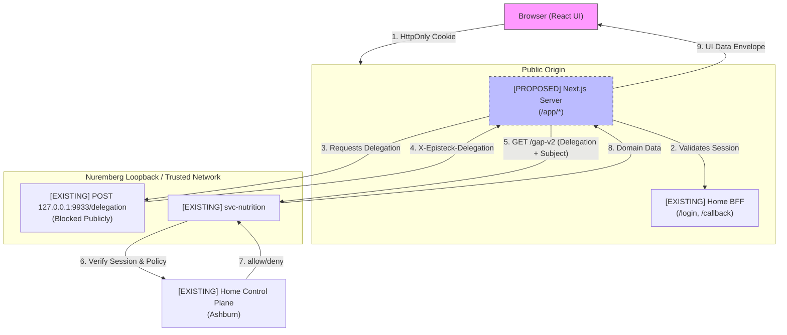

# Home Hub Integration Foundation

**Status:** `ARCHITECTURE DESIGN`  
**Phase:** P0-A  
**Date:** 2026-09-22

## 1. Current-State Architecture
The Olin ecosystem currently operates with a robust, trusted backend foundation:
- **Home Control Plane (Frappe)** owns identity, consent, and relationships.
- **Home BFF** (on the EU node) handles OAuth login, holds session tokens server-side, and mints short-lived delegations via loopback.
- **svc-nutrition** is the protected domain boundary for Nutrition. It enforces authorization independently by resolving delegations against the Control Plane. **Mealie** is a provider/integration operating underneath the `svc-nutrition` boundary, not an independent authorization enforcer.

Currently, the Next.js **Home Hub** presentation layer is disconnected from this backend. It uses client-side mock data and a visual-only `activeContext` state that mimics authorization.

## 2. UI Integration Topology (F0: DECIDED Option A)
The target topology utilizes Next.js Server capabilities (Server Components and Server Actions) as the presentation BFF. 

**Option A Selected:** Home Hub is co-located on the existing Nuremberg node and shares the same public origin as Home BFF.
- The existing host-only `episteck_home_session` cookie is retained. It will NOT be widened to `.episteck.com`.
- **Initial Conceptual Routing (Nginx):**
  - `/app/*` -> Next.js Home Hub
  - `/login` -> Home BFF
  - `/callback` -> Home BFF
  - `/session` -> Home BFF
  - `/whoami` -> Home BFF
  - `/logout` -> Home BFF
  - `/delegation` -> Blocked / 404

## 3. Trust-Boundary & Architecture Diagram
Next.js acting as a presentation BFF implies it becomes a **trusted server runtime**.

**F0 Decision - Delegation Mint:** For P0, Next.js will reuse the existing loopback Home BFF `POST 127.0.0.1:9933/delegation`. This is authorized because Next.js Home Hub is deliberately co-located and treated as a trusted server runtime.



### Home Hub Trusted Runtime Properties:
- Dedicated unprivileged service identity (conceptually `svc-home-hub`).
- Application listener loopback-only (public nginx exposes `/app`).
- No Home machine API credentials in Next.js.
- No OAuth client secret in Next.js.
- No delegation signing secret in Next.js.
- Internal network access limited to required BFF/domain endpoints.
- Next.js remains a presentation runtime, NOT an authorization authority.

### Mandatory Delegation Mint Invariants:
- Delegation **never** reaches the browser.
- Delegation lives request-locally only.
- Delegation is never logged, cached, or persisted.
- No browser-controlled audience.
- No generic client-facing mint API.
- Public `/delegation` remains 404.
- A **fresh delegation** must be minted for **EVERY** protected downstream domain operation.
- **NEVER** reuse one delegation for two protected calls.
- **NEVER** automatically retry with the same delegation; a new explicit retry/operation must mint a fresh delegation.
- Single-use semantics are load-bearing.

## 4. Session / Viewer Lifecycle & Callback Handoff
- **Login Initiation:** Browser hits Next.js, finds no session, redirects to `home-bff` `/login`.
- **Callback Handoff (F0 DECIDED):** `home-bff` `/callback` will perform a fixed post-login redirect: `303 -> /app`. Arbitrary browser-supplied `return_to` URLs will not be introduced in P0.
- **Session Expiry:** A 401 triggers a redirect to `/login`.
- **Frontend State:**
  ```typescript
  interface Viewer {
    personId: string; // The trusted actor
    name: string;
  }
  ```

## 5. Context-Selection Model
`activeContext` is a **Discriminated Resource Scope**. Context is NOT always a Person (e.g., `CIR-fam`).

```typescript
type ResourceScope = 
  | { type: 'PERSON'; personId: string }
  | { type: 'CIRCLE'; circleId: string };
```
- **Rule:** `Person != Circle`. Circle membership != authorization.
- The UI context selection nominates a RESOURCE SCOPE only. Each domain adapter decides which canonical identifier its API accepts.
- If a resource scope is visible but a specific domain is denied, the UI renders `ACCESS_DENIED` for that domain tab without hiding the context entirely.

## 6. Viewer / Context Bootstrap Gap (F2 Direction)
`home-bff` `/whoami` returns trusted actor information, but does not provide display Person, Circles, Care Relationships, or available resource contexts.

**Proposed BFF Bootstrap:**
Next.js will NOT receive direct Frappe machine credentials. Instead, we propose a narrow new Home BFF bootstrap operation. This `[PROPOSED]` operation will use the human OAuth access token already held server-side by Home BFF to compose safe Home Control Plane business APIs, returning:
- viewer
- PERSON resource contexts
- CIRCLE resource contexts
- care relationships / care contexts

**Important:** Context discoverability != domain authorization. Each domain service continues to authorize its own operations.

## 7. Frontend Layer Architecture
- `src/integration/session/`: Reads cookies, interfaces with backend for validation.
- `src/integration/home/`: Adapters for viewer and context relationships (consuming the proposed BFF bootstrap).
- `src/integration/nutrition/`: Adapters mapping `svc-nutrition` to UI envelopes.
- `src/integration/state/`: Standard envelope models and error taxonomy.
- `src/components/providers/`: React Contexts exposing `Viewer` and `activeContext`.

## 8. Standard Data-State Envelope
The generic envelope focuses strictly on delivery, authorization, freshness, environment, provenance, and safe error codes. Domain-specific attributes (like data quality) belong inside the domain payload.

```typescript
interface DataEnvelope<T> {
  delivery: 'LOADING' | 'READY' | 'ERROR';
  authorization: 'GRANTED' | 'DENIED' | 'INDETERMINATE';
  freshness: 'FRESH' | 'STALE' | 'UNKNOWN';
  environment: 'MOCK' | 'LIVE';
  
  updatedAt?: string;
  sourceSummary?: string; 
  errorCode?: SafeUIErrorCode;
  data?: T; // e.g., NutritionData may contain { quality: 'ESTIMATED' }
}
```
**Mandatory Rule:** `UNKNOWN != ZERO`.

## 9. Error / Authorization UX Taxonomy
Normalized UI errors must use safe INTERNAL CODES. Never leak upstream error messages or assume HTTP 404 means the same thing across APIs.

```typescript
type SafeUIErrorCode = 
  | 'SESSION_REQUIRED'
  | 'SESSION_INVALID'
  | 'ACCESS_DENIED'
  | 'RESOURCE_NOT_AVAILABLE'
  | 'NOT_CONFIGURED'
  | 'SERVICE_UNAVAILABLE'
  | 'OFFLINE'
  | 'INVALID_RESPONSE';
```
- **401 (BFF):** Maps to `SESSION_REQUIRED` / `SESSION_INVALID` -> Seamless redirect to `/login`.
- **403 (Nutrition):** Maps to `ACCESS_DENIED` -> Render distinct "Access Restricted" boundary.
- **404 (Nutrition Profile):** Maps to `NOT_CONFIGURED` -> Prompt to create profile.

## 10. Mock → Live Config Safety
- Provide `MockAdapter` and `LiveAdapter` implementations.
- Configuration must **fail closed**: Require an explicit environment data mode. Production deployments must strictly reject `MOCK` mode at startup.
- There must be NO per-request or browser-controlled mock/live switches.

## 11. Caching Rules (Fail Safe)
Premature caching undermines revocation semantics.
- **PERSON-SENSITIVE SERVER DATA:** `no-store` / no cross-request application cache.
- **AUTHORIZATION DECISIONS:** NEVER CACHED.
- **DENIALS:** NEVER CACHED as an authorization decision.
- **SESSION ENDPOINTS:** `no-store`.
- **Mock / Static Visual Data:** May be cached normally.
- Request-local memoization is acceptable ONLY when it cannot survive the request or act as authority.

## 12. Nutrition Gap Analysis & Proving Example
**EXISTING API CAN SUPPORT:**
- `GET /gap-v2/{person_id}/{date}`: Already produces per-nutrient target, consumed, remaining, percentage, and status (`KNOWN`/`UNKNOWN`). This supports the first live-service micronutrient read model.
- `GET /mealplan/{start}/{end}`: Supports planned meals.

**UI MAPPER NEEDED:**
- Mapping `gap-v2` payload into specific React Component props.

**BACKEND ENDPOINT / DOMAIN CAPABILITY MISSING:**
- Nutrient-data completeness semantics.
- Food contributors / Supplement vs. Food contribution semantics.
- Explicit supplement logging workflows.
- 7-day / 30-day rolling averages and historical trend aggregation.
- Richer provenance per contribution.

**Conclusion:** The Pregnancy Nutrition screen will become progressively live at the component level. We must NOT mark the whole screen as `LIVE` while specific cards/fields remain mock-backed.

## 13. Privacy / Logging Rules
- **URLs:** Sensitive Person IDs must not appear in URLs unnecessarily.
- **Telemetry:** Must strip all Person IDs, clinical data, and credentials.
- **Next.js Logs:** Log exception classes only (e.g., `TokenExchangeError`), never exception messages that might echo payloads. No tokens in logs.

## 14. Recommended Implementation Sequence
* **F0 — DECIDED:** Option A (Co-located, `/app` + `/login` shared origin) and loopback `/delegation` reuse under strict invariants.
* **F1 — Frontend Contracts:** Safe state/error model and `DataEnvelope` definitions.
* **F2 — Session / Viewer Bootstrap:** Resolve the UI bootstrap gap by implementing the proposed Home BFF compose operation.
* **F3 — Context Migration:** Migrate `activeContext` to the `Person/Circle` resource-context model.
* **F4 — Nutrition Read-Only Synthetic Adapter:** Implement live-service integration using synthetic records.
* **F5 — Incremental UI Migration:** Migrate Today/Nutrition screens progressively (No production real-person data).
