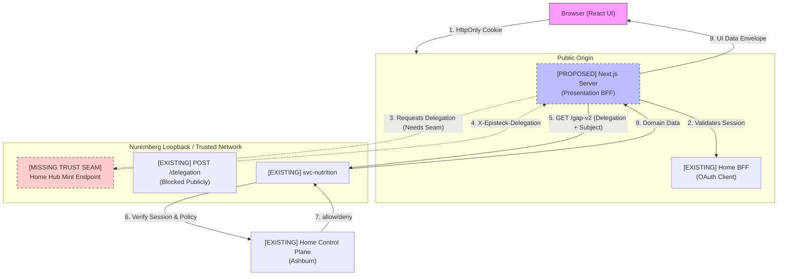

# Home Hub Integration Foundation

**Status:** `ARCHITECTURE DESIGN`  
**Phase:** P0-A  
**Date:** 2026-09-22

## 1. Current-State Architecture
The Olin ecosystem currently operates with a robust, trusted backend foundation:
- **Home Control Plane (Frappe)** owns identity, consent, and relationships.
- **Home BFF** (on the EU node) handles OAuth login, holds session tokens server-side, and mints short-lived delegations via loopback.
- **svc-nutrition** is the protected domain boundary for Nutrition. It enforces authorization independently by resolving delegations against the Control Plane. **Mealie** is a provider/integration operating underneath the `svc-nutrition` boundary, not an independent authorization enforcer.

Currently, the Next.js **Home Hub** presentation layer is disconnected from this backend. It uses client-side mock data and a visual-only `activeContext` state that mimics authorization.

## 2. Proposed UI Integration Topology & Deployment Gap
The target topology utilizes Next.js Server capabilities (Server Components and Server Actions) as the presentation BFF. The browser must never directly hold API delegations or contact domain services.

**CRITICAL GAP - Cookie & Origin Topology:**
The current Home BFF session cookie (`episteck_home_session`) is strictly host-only (no Domain attribute). A cookie created by `bff.home.episteck.com` will NOT be automatically available to a Next.js application hosted on a different subdomain. Furthermore, widening the cookie domain to `.episteck.com` is rejected as a security risk.

**Topology Options:**
* **Option A (Recommended):** Home Hub is co-located and served under the **SAME public origin** as the BFF using reverse-proxy path separation (e.g., `/api/bff/...` vs `/...` for UI). This is the smallest topology that preserves current security properties.
* **Option B:** A dedicated Home Hub origin with an explicitly designed same-origin auth proxy/callback architecture.

## 3. Trust-Boundary & Architecture Diagram
Next.js acting as a presentation BFF implies it becomes a **new trusted runtime**.
The current `/delegation` endpoint on `home-bff` is strictly internal, loopback-only, and returns 404 publicly. Next.js cannot call this endpoint unless it is placed inside the trusted local runtime boundary (or another approved private transport is created).
Furthermore, the current internal mint path via Unix socket is bound to a fixed `RUNTIME_ID` (`home-agent-primary`) and cannot simply be reused for independent browser sessions.



### Properties of the Future Home Hub Trusted-Runtime Boundary:
- Server-only execution.
- Never exposes the delegation to the browser.
- Strictly bound to the correct authenticated browser session.
- Uses private transport.
- Operates with least privilege.
- Contains no model-controlled credential path.
- Contains no public mint endpoint.
- Has an auditable service identity.
- Credentials/tokens are never logged.

*Decision pending Product Architect disposition: Whether existing loopback `/delegation` can be safely reused after explicit co-location/hardening, or if a dedicated Home-Hub mint seam is required.*

## 4. Session / Viewer Lifecycle
- **Login Initiation:** Browser hits Next.js, finds no session, redirects to `home-bff` `/login`.
- **Callback & Redirect Gap:** `home-bff` `/callback` currently completes PKCE and returns JSON. **GAP:** A post-login UI handoff/redirect is required to return the user to the Home Hub. Any return target must be strictly allow-listed.
- **Session Expiry:** A 401 triggers a redirect to `/login`.
- **Frontend State:**
  ```typescript
  interface Viewer {
    personId: string; // The trusted actor
    name: string;
  }
  ```

## 5. Context-Selection Model
`activeContext` is a **Discriminated Resource Scope**. Context is NOT always a Person (e.g., `CIR-fam`).

```typescript
type ResourceScope = 
  | { type: 'PERSON'; personId: string }
  | { type: 'CIRCLE'; circleId: string };
```
- **Rule:** `Person != Circle`. Circle membership != authorization.
- The UI context selection nominates a RESOURCE SCOPE only. Each domain adapter decides which canonical identifier its API accepts.
- If a resource scope is visible but a specific domain is denied, the UI renders `ACCESS_DENIED` for that domain tab without hiding the context entirely.

## 6. Viewer / Context Bootstrap Gap
`home-bff` `/whoami` returns trusted actor/principal information, but **it does not provide the complete UI bootstrap** (display Person, Circles, Care Relationships, available contexts).
While the Control Plane has APIs for this (`get_person`, `list_my_circles`, `get_care_dashboard`), **the Home Hub does not yet have an approved trusted path to consume them**. This is a real integration gap that must be addressed before the UI can render dynamic navigation.

## 7. Frontend Layer Architecture
- `src/integration/session/`: Reads cookies, interfaces with backend for validation.
- `src/integration/home/`: Adapters for viewer and context relationships (once the bootstrap gap is closed).
- `src/integration/nutrition/`: Adapters mapping `svc-nutrition` to UI envelopes.
- `src/integration/state/`: Standard envelope models and error taxonomy.
- `src/components/providers/`: React Contexts exposing `Viewer` and `activeContext`.

## 8. Standard Data-State Envelope
The generic envelope focuses strictly on delivery, authorization, freshness, environment, provenance, and safe error codes. Domain-specific attributes (like data quality) belong inside the domain payload.

```typescript
interface DataEnvelope<T> {
  delivery: 'LOADING' | 'READY' | 'ERROR';
  authorization: 'GRANTED' | 'DENIED' | 'INDETERMINATE';
  freshness: 'FRESH' | 'STALE' | 'UNKNOWN';
  environment: 'MOCK' | 'LIVE';
  
  updatedAt?: string;
  sourceSummary?: string; 
  errorCode?: SafeUIErrorCode;
  data?: T; // e.g., NutritionData may contain { quality: 'ESTIMATED' }
}
```
**Mandatory Rule:** `UNKNOWN != ZERO`.

## 9. Error / Authorization UX Taxonomy
Normalized UI errors must use safe INTERNAL CODES. Never leak upstream error messages or assume HTTP 404 means the same thing across APIs.

```typescript
type SafeUIErrorCode = 
  | 'SESSION_REQUIRED'
  | 'SESSION_INVALID'
  | 'ACCESS_DENIED'
  | 'RESOURCE_NOT_AVAILABLE'
  | 'NOT_CONFIGURED'
  | 'SERVICE_UNAVAILABLE'
  | 'OFFLINE'
  | 'INVALID_RESPONSE';
```
- **401 (BFF):** Maps to `SESSION_REQUIRED` / `SESSION_INVALID` -> Seamless redirect to `/login`.
- **403 (Nutrition):** Maps to `ACCESS_DENIED` -> Render distinct "Access Restricted" boundary.
- **404 (Nutrition Profile):** Maps to `NOT_CONFIGURED` -> Prompt to create profile.

## 10. Mock → Live Config Safety
- Provide `MockAdapter` and `LiveAdapter` implementations.
- Configuration must **fail closed**: Require an explicit environment data mode. Production deployments must strictly reject `MOCK` mode at startup.
- There must be NO per-request or browser-controlled mock/live switches.

## 11. Caching Rules (Fail Safe)
Premature caching undermines revocation semantics.
- **PERSON-SENSITIVE SERVER DATA:** `no-store` / no cross-request application cache.
- **AUTHORIZATION DECISIONS:** NEVER CACHED.
- **DENIALS:** NEVER CACHED as an authorization decision.
- **SESSION ENDPOINTS:** `no-store`.
- **Mock / Static Visual Data:** May be cached normally.
- Request-local memoization is acceptable ONLY when it cannot survive the request or act as authority.

## 12. Nutrition Gap Analysis & Proving Example
**EXISTING API CAN SUPPORT:**
- `GET /gap-v2/{person_id}/{date}`: Already produces per-nutrient target, consumed, remaining, percentage, and status (`KNOWN`/`UNKNOWN`). This fully supports basic micronutrient coverage (Pregnancy UI).
- `GET /mealplan/{start}/{end}`: Supports planned meals.

**UI MAPPER NEEDED:**
- Mapping `gap-v2` payload into the specific React Component props for the Pregnancy Nutrition cards.

**BACKEND ENDPOINT / DOMAIN CAPABILITY MISSING:**
- Nutrient-data completeness semantics.
- Food contributors / Supplement vs. Food contribution semantics.
- Explicit supplement logging workflows.
- 7-day / 30-day rolling averages and historical trend aggregation.
- Richer provenance per contribution.

## 13. Privacy / Logging Rules
- **URLs:** Sensitive Person IDs must not appear in URLs unnecessarily.
- **Telemetry:** Must strip all Person IDs, clinical data, and credentials.
- **Next.js Logs:** Log exception classes only (e.g., `TokenExchangeError`), never exception messages that might echo payloads. No tokens in logs.

## 14. Recommended Implementation Sequence
* **F0 — Home Hub Runtime / Origin / Trust Seam Decision:** (Requires Product Architect disposition on deployment origin and delegation minting seam).
* **F1 — Frontend Contracts:** Safe state/error model and `DataEnvelope` definitions.
* **F2 — Session / Viewer Bootstrap:** Resolve the UI bootstrap gap and implement Next.js server-side validation.
* **F3 — Context Migration:** Migrate `activeContext` to the `Person/Circle` resource-context model.
* **F4 — Nutrition Read-Only Synthetic Adapter:** Implement live-service integration using synthetic records.
* **F5 — Incremental UI Migration:** Migrate Today/Nutrition screens to the new foundation (No production real-person data).
