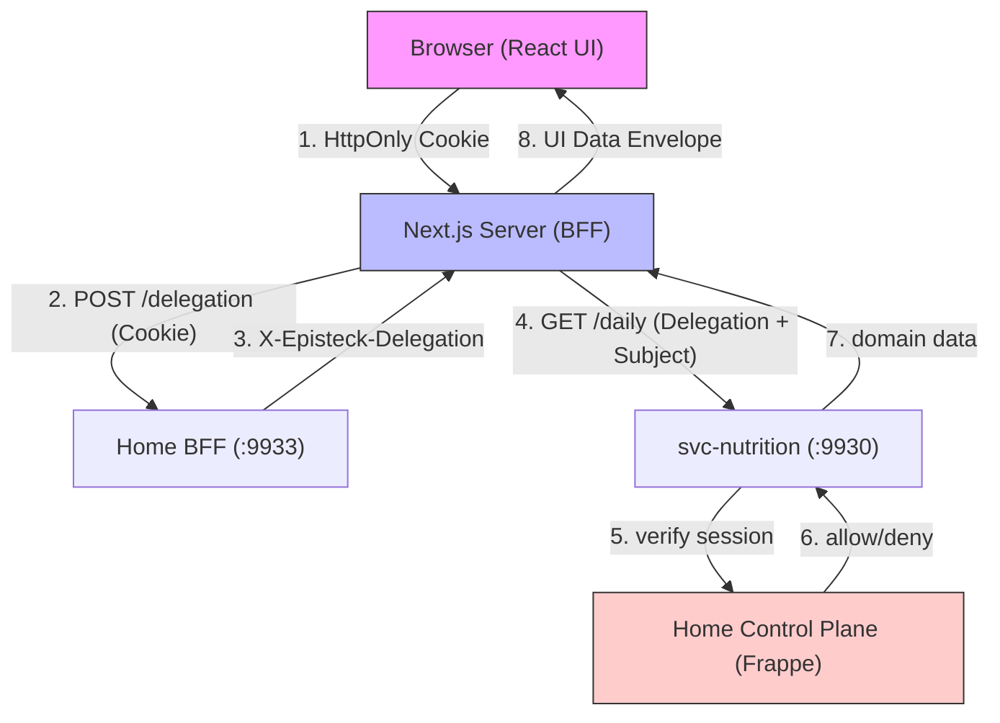

# Home Hub Integration Foundation

**Status:** `ARCHITECTURE DESIGN`  
**Phase:** P0-A  
**Date:** 2026-09-22

## 1. Current-State Architecture
The Olin ecosystem currently operates with a robust, trusted backend foundation:
- **Home Control Plane (Frappe)** owns identity, consent, and relationships.
- **Home BFF** (on the EU node) handles OAuth login, holds session tokens server-side, and mints short-lived delegations via loopback.
- **Domain Services (Nutrition, Mealie)** enforce authorization independently by resolving delegations against the Control Plane.

Currently, the Next.js **Home Hub** presentation layer is disconnected from this backend. It uses client-side mock data and a visual-only `activeContext` state that mimics authorization.

## 2. Proposed UI Integration Topology
The final Home Hub path utilizes Next.js Server capabilities (Server Components and Server Actions) as the presentation BFF. The browser must never directly hold API delegations or contact domain services.

```text
Browser
  │ (HttpOnly Session Cookie)
  ▼
Next.js Server (Home Hub)
  │ (Reads Cookie, requests delegation)
  ▼
Home BFF (internal POST /delegation)
  │ (Returns X-Episteck-Delegation token)
  ▼
Next.js Server (Home Hub)
  │ (Calls domain API with Delegation + Subject ID)
  ▼
svc-nutrition (Domain Service)
  │ (Independently verifies Delegation with Home Control Plane)
  ▼
(Returns Domain Data) -> Next.js Server -> Browser (React UI)
```

## 3. Trust-Boundary Diagram


## 4. Session / Viewer Lifecycle
The browser session model is strictly presentation metadata.
- **Login Initiation:** Browser hits Next.js, finds no session, redirects to `home-bff` `/login`.
- **Callback:** `home-bff` handles PKCE, creates server-side session, sets HttpOnly `episteck_session` cookie, and redirects to Next.js.
- **Viewer Resolution:** Next.js Server calls `home-bff` `/whoami` to populate initial context (Identity, Roles).
- **Session Expiry:** If Next.js receives a 401/403 from `home-bff`, it triggers a redirect to `/login`.
- **Frontend State:**
  ```typescript
  interface Viewer {
    personId: string; // The trusted actor
    name: string;
  }
  ```
**Crucial Rule:** The frontend NEVER stores bearer tokens, machine credentials, or PKCE verifiers.

## 5. Context-Selection Model
The current `PERSONAL | FAMILY | CARE` selector evolves into a **Resource Scope Selector**.
- The browser selects a context (e.g., Ana views Erick's dashboard).
- This selection merely sets the `subject_person_id` in API requests.
- **The browser never asserts identity or authorization.** The `X-Episteck-Delegation` token provides the trusted `actor_person_id`.
- **Partial Denial:** If Ana's context is visible but her Health domain is denied, the UI must NOT globally hide Ana. Instead, the Health tab renders an `AUTHORIZATION_DENIED` state while Nutrition renders normally.

## 6. Frontend Layer Architecture
A reusable frontend structure to prevent domain-logic leaks:
- `src/integration/session/`: Reads cookies, interfaces with `home-bff` for validation and delegations.
- `src/integration/home/`: Adapters for fetching `whoami` and context relationships.
- `src/integration/nutrition/`: Adapters strictly mapping `svc-nutrition` responses to UI envelopes.
- `src/integration/state/`: Standard envelope models and error normalization.
- `src/components/providers/`: React Contexts exposing `Viewer` and `activeContext`.

## 7. Standard Data-State Model
To prevent ambiguous empty states, the UI envelope separates distinct dimensions:

```typescript
interface DataEnvelope<T> {
  // Transport & Delivery
  status: 'LOADING' | 'READY' | 'ERROR' | 'UNAVAILABLE';
  
  // Security
  authorization: 'GRANTED' | 'DENIED' | 'INDETERMINATE';
  
  // Domain Quality & Freshness
  quality: 'MEASURED' | 'ESTIMATED' | 'UNKNOWN';
  freshness: 'FRESH' | 'STALE' | 'UNKNOWN';
  
  // Environment 
  environment: 'MOCK' | 'LIVE';
  
  updatedAt?: string;
  source?: string; // e.g. "USDA", "Mealie"
  error?: string;
  data?: T;
}
```

## 8. Error / Auth UX Model
Normalized frontend behavior:
- **401 / Session Expired:** Silent seamless redirect to `/login`.
- **403 / Denied:** Render a distinct "Access Restricted" boundary. **Never** infer `DENIED == EMPTY`.
- **404 / Indeterminate:** Render "Data Unavailable".
- **Network Offline:** Render "Offline - Showing stale data" if cached, else Offline boundary.
- **UNKNOWN:** Explicitly render as "?", never as "0". `UNKNOWN != ZERO` is mandatory.

## 9. Mock → Live Migration Strategy
- Introduce an adapter pattern: `NutritionMockAdapter` and `NutritionLiveAdapter` adhering to the same TypeScript contract.
- A server-side environment variable (`USE_MOCK_DATA=true`) selects the adapter. Mock/live switching is a development concern only and never a runtime security branch.
- **Visual Distinction:** When `environment === 'MOCK'`, the root layout will inject a subtle "MOCK DATA" watermark/badge in the header, ensuring reviewers can differentiate without breaking the polished aesthetic.

## 10. Caching Rules
- **Viewer Metadata & Context List:** Cacheable briefly (e.g., 5 mins) keyed by session.
- **Domain Data:** Cacheable (e.g., 1 min), but MUST be strictly keyed by `(actor_id, subject_id, domain)`.
- **Authorization Decisions:** **NEVER CACHE.** Every request must be evaluated by the Control Plane per G1.6 strict rules.
- **Denied Responses:** May be cached briefly on the frontend to prevent server hammering.

## 11. Privacy / Logging Rules
- **URLs:** Sensitive Person IDs must not appear in URLs unnecessarily (e.g., prefer `/nutrition` leveraging internal session context over `/nutrition/PSN-123`).
- **Telemetry:** Must strip all Person IDs, clinical data, and credentials.
- **Next.js Server Logs:** Log exception classes only, never exception messages that might echo payloads (e.g., log `TokenExchangeError` rather than the raw HTTP response). No tokens in logs.

## 12. Nutrition Proving Example (TASK 2 Prep)
Testing the integration foundation with Nutrition (synthetic data only):
- **Trace:** Browser (Next.js client) -> Next.js Server Action -> `home-bff` (mint delegation) -> `svc-nutrition` -> Map to DataEnvelope -> UI.

### 13. Existing APIs Reusable As-Is
- `GET /daily/{person_id}/{date}`: Provides daily macros.
- `GET /mealplan/{start}/{end}?subject_person_id={person_id}`: Provides planned meals.
- `GET /profile/{person_id}`: Provides configuration and targets (including pregnancy targets).
- `POST /delegation` (Home BFF): Provides the required transport delegation.

### 14. Missing APIs / Gaps
- **Micronutrient Read Model:** `svc-nutrition` needs explicit rollups for micronutrient coverage (e.g., Iron, Folate % toward target).
- **Rolling Averages:** No endpoint currently supplies 7-day or 30-day historical trend aggregation.

## 15. Recommended Implementation Sequence
- **F1 — Integration Foundation:** Build `DataEnvelope`, error normalization, and standard UI boundaries.
- **F2 — Session / Viewer Adapter:** Implement the Next.js server-side connection to `home-bff` `/session` and `/whoami`.
- **F3 — Context Provider Migration:** Replace the mock `AppProvider` with the real Server-Side Viewer context.
- **F4 — Nutrition Synthetic Adapter:** Implement the `LiveNutritionAdapter` connecting to `svc-nutrition` using synthetic test records.
- **F5 — Incremental UI Migration:** Switch Today and Nutrition screens to the Live Adapter.

## 16. Explicit Non-Goals
- DO NOT implement production integration (Ana/Erick real health data).
- DO NOT modify backend security semantics (`home-bff` and `check_access` remain authoritative).
- DO NOT create new authentication mechanisms (reuse the existing Home BFF OAuth flow).
- DO NOT implement caching for authorization decisions.
